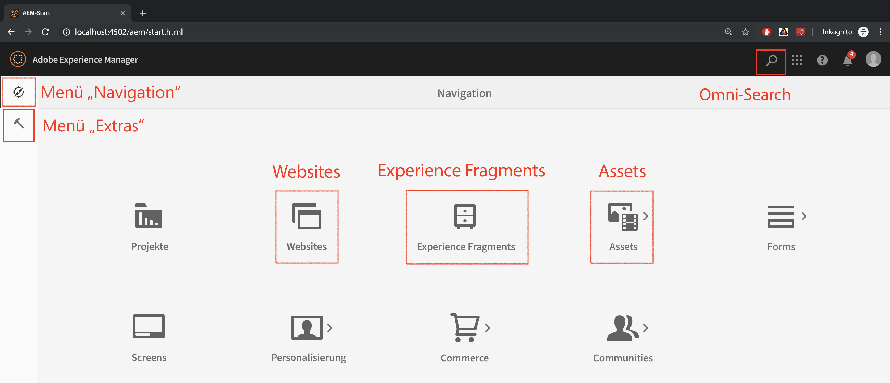

# Integration von Adobe Experience Manager mit Adobe Target

In diesem Abschnitt besprechen wir, wie Adobe Experience Manager mit Adobe Target für verschiedene Szenarien eingerichtet werden kann. Basierend auf Ihrem Szenario und Ihren organisatorischen Anforderungen.

* **hinzufügen Adobe Target JavaScript Library (erforderlich für alle Szenarien)** Für Sites, die auf AEM gehostet werden, können Sie Ihrer Site Zielgruppen-Bibliotheken mit [Launch](https://docs.adobe.com/content/help/de-DE/launch/using/overview.html)hinzufügen. &quot;Launch&quot;bietet eine einfache Möglichkeit, alle Tags bereitzustellen und zu verwalten, die zur Nutzung relevanter Kundenerlebnisse erforderlich sind.
* **hinzufügen den Adobe Target-Cloud Services (erforderlich für das Szenario &quot;Erlebnisfragmente&quot;)** Für AEM Kunden, die Erlebnisfragment-Angebot verwenden möchten, um eine Aktivität in Adobe Target zu erstellen, müssen Sie Adobe Target mit den älteren Cloud Services in AEM integrieren. Diese Integration ist erforderlich, um Erlebnisfragmente als HTML/JSON-Angebot von AEM zu Zielgruppe zu verschieben und die Angebot mit AEM synchronisieren zu lassen. 
*Diese Integration ist für die Implementierung von Szenario 1 erforderlich.*

## Voraussetzungen

* **Adobe Experience Manager (AEM){#aem}**
   * AEM 6.5 (das *neueste Service Pack wird empfohlen*)
   * Herunterladen AEM WKND-Referenz-Website-Pakete
      * [aem-guides-wknd.ui.apps-0.0.1-SNAPSHOT.zip](https://github.com/adobe/aem-guides-wknd/releases/download/archetype-18.1/aem-guides-wknd.ui.apps-0.0.1-SNAPSHOT.zip)
      * [aem-guides-wknd.ui.content-0.0.1-SNAPSHOT.zip](https://github.com/adobe/aem-guides-wknd/releases/download/archetype-18.1/aem-guides-wknd.ui.content-0.0.1-SNAPSHOT.zip)
      * [Kernkomponenten](https://github.com/adobe/aem-core-wcm-components/releases/download/core.wcm.components.reactor-2.5.0/core.wcm.components.all-2.5.0.zip)
      * [Digitale Datenschicht](assets/implementation/digital-data-layer.zip)

* **Experience Cloud**
   * Zugriff auf Ihre Organisationen Adobe Experience Cloud - <https://>`<yourcompany>`.experienceCloud.adobe.com
   * Experience Cloud mit den folgenden Lösungen
      * [Adobe Experience Platform Launch](https://experiencecloud.adobe.com)
      * [Adobe Target](https://experiencecloud.adobe.com)
      * [Adoben-E/A-Konsole](https://console.adobe.io)

* **Umgebung**
   * Java 1.8 oder Java 11 (nur AEM 6.5+)
   * Apache Maven (3.3.9 oder höher)
   * Chrome

>[!NOTE]
>
> Der Kunde muss über den Support [der](https://helpx.adobe.com/de/contact/enterprise-support.ec.html) Adobe oder über einen Kontakt mit dem Systemadministrator über eine Experience Platform Launch- und Adoben-E/A-Verbindung verfügen.

### Einrichten AEM{#set-up-aem}

AEM Instanz im Autoren- und Veröffentlichungsmodus ist erforderlich, um diese Übung abzuschließen. Die Autoreninstanz wird auf `http://localhost:4502` der Veröffentlichungsinstanz ausgeführt `http://localhost:4503`. Weitere Informationen finden Sie unter: [Richten Sie eine Umgebung](https://helpx.adobe.com/experience-manager/kt/platform-repository/using/local-aem-dev-environment-article-setup.html)zur lokalen AEM ein.

#### Einrichten von AEM Author- und Veröffentlichungsinstanzen

1. Besorgen Sie sich eine Kopie der [AEM Schnellstart Jar und eine Lizenz.](https://helpx.adobe.com/experience-manager/6-5/sites/deploying/using/deploy.html#GettingtheSoftware)
2. Erstellen Sie auf Ihrem Computer eine Ordnerstruktur wie die folgende:
   
3. Benennen Sie die QuickStart-JAR-Datei um `aem-author-p4502.jar` und legen Sie sie unter dem `/author` Ordner ab. hinzufügen die `license.properties` Datei unter dem `/author` Verzeichnis.
   
4. Erstellen Sie eine Kopie der Schnellstart-JAR-Datei, benennen Sie sie um `aem-publish-p4503.jar` und legen Sie sie unter dem `/publish` Ordner ab. hinzufügen eine Kopie der `license.properties` Datei unter dem `/publish` Verzeichnis.
   
5. Dublette klicken Sie auf die `aem-author-p4502.jar` Datei, um die Autoreninstanz zu installieren. Dies Beginn die Autoreninstanz, die auf Port 4502 auf dem lokalen Computer ausgeführt wird.
6. Melden Sie sich mit den unten stehenden Anmeldedaten an. Bei erfolgreicher Anmeldung werden Sie zum Bildschirm &quot;AEM Startseite&quot;geleitet.
Benutzername: **admin** password: **admin**
   
7. Dublette klicken Sie auf die `aem-publish-p4503.jar` Datei, um eine Instanz im Veröffentlichungsmodus zu installieren. Sie können eine neue Registerkarte sehen, die in Ihrem Browser für Ihre Veröffentlichungsinstanz geöffnet wird, die auf Port 4503 ausgeführt wird und die WeRetail-Startseite anzeigt. Wir werden die WKND Referenz-Website für dieses Tutorial verwenden und wir werden die Pakete auf Autoreninstanz installieren.
8. Navigieren Sie im Webbrowser unter `http://localhost:4502`. Navigieren Sie im Bildschirm &quot;AEM Beginn&quot;zu *[Extras > Bereitstellung > Pakete](http://localhost:4502/crx/packmgr/index.jsp)*.
9. Herunterladen und Hochladen der Pakete für AEM (siehe oben unter *[Voraussetzungen > AEM](#aem)*)
   * [aem-guides-wknd.ui.apps-0.0.1-SNAPSHOT.zip](https://github.com/adobe/aem-guides-wknd/releases/download/archetype-18.1/aem-guides-wknd.ui.apps-0.0.1-SNAPSHOT.zip)
   * [aem-guides-wknd.ui.content-0.0.1-SNAPSHOT.zip](https://github.com/adobe/aem-guides-wknd/releases/download/archetype-18.1/aem-guides-wknd.ui.content-0.0.1-SNAPSHOT.zip)
   * [core.wcm.components.all-2.5.0.zip](https://github.com/adobe/aem-core-wcm-components/releases/download/core.wcm.components.reactor-2.5.0/core.wcm.components.all-2.5.0.zip)
   * [digital-data-layer.zip](assets/implementation/digital-data-layer.zip)

   >[!VIDEO](https://video.tv.adobe.com/v/28377?quality=12&learn=on)
10. Wählen Sie nach der Installation der Pakete auf AEM Author jedes hochgeladene Paket in AEM Package Manager und wählen Sie **Mehr > Replizieren** , um sicherzustellen, dass die Pakete in AEM Publish bereitgestellt werden.
11. Zu diesem Zeitpunkt haben Sie Ihre WKND-Referenz-Website und alle für dieses Lernprogramm erforderlichen zusätzlichen Pakete erfolgreich installiert.

[NÄCHSTES KAPITEL](./using-launch-adobe-io.md): Im nächsten Kapitel werden Sie Launch mit AEM integrieren.
