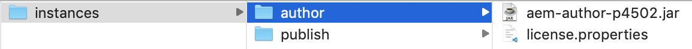

# Integrieren von AEM Sites in Adobe Target

In diesem Abschnitt geht es darum, wie Adobe Experience Manager Sites mit Adobe Target für verschiedene Szenarien eingerichtet wird. Grundlage sollen hier Ihr Szenario und die Anforderungen Ihrer Organisation sein.

* **Adobe Target-JavaScript-Bibliothek hinzufügen (für alle Szenarien erforderlich)**
Für auf AEM gehostete Sites können Sie Target-Bibliotheken zu Ihrer Site hinzufügen, indem Sie [Experience Platform Launch](https://experienceleague.adobe.com/docs/experience-platform/tags/home.html?lang=de) verwenden. Experience Platform Launch bietet eine einfache Möglichkeit, alle Tags bereitzustellen und zu verwalten, die für relevante Kundenerlebnisse erforderlich sind.
* **Adobe Target-Cloud-Services hinzufügen (erforderlich für das Experience Fragments-Szenario)**
Für AEM-Kundinnen und -Kunden, die Experience Fragment-Angebote zur Erstellung einer Aktivität in Adobe Target verwenden möchten, müssen Sie Adobe Target mithilfe der Legacy Cloud Services in AEM integrieren. Diese Integration ist erforderlich, um Experience Fragments als HTML-/JSON-Angebote von AEM an Target zu übertragen und die Angebote mit AEM synchron zu halten. *Diese Integration ist für die Implementierung von Szenario 1 erforderlich.*

## Voraussetzungen

* **Adobe Experience Manager (AEM){#aem}**
   * AEM 6.5 (*neuestes Service Pack wird empfohlen*)
   * Download des Pakets mit der AEM WKND-Referenz-Site
      * [aem-guides-wknd.ui.apps-0.0.1-SNAPSHOT.zip](https://github.com/adobe/aem-guides-wknd/releases/download/archetype-18.1/aem-guides-wknd.ui.apps-0.0.1-SNAPSHOT.zip)
      * [aem-guides-wknd.ui.content-0.0.1-SNAPSHOT.zip](https://github.com/adobe/aem-guides-wknd/releases/download/archetype-18.1/aem-guides-wknd.ui.content-0.0.1-SNAPSHOT.zip)
      * [Kernkomponenten](https://github.com/adobe/aem-core-wcm-components/releases/download/core.wcm.components.reactor-2.5.0/core.wcm.components.all-2.5.0.zip)
      * [Digitale Datenschicht](assets/implementation/digital-data-layer.zip)

* **Experience Cloud**
   * Es besteht Zugriff auf die Adobe Experience Cloud-Bereitstellung Ihres Unternehmens: `https://<yourcompany>.experiencecloud.adobe.com`
   * Experience Cloud ist mit folgender Lösung bereitgestellt:
      * [Adobe Experience Platform Launch](https://experiencecloud.adobe.com)
      * [Adobe Target](https://experiencecloud.adobe.com)
      * [Adobe I/O Console](https://console.adobe.io)

* **Umgebung**
   * Java 1.8 oder Java 11 (nur AEM 6.5+)
   * Apache Maven (3.3.9 oder höher)
   * Chrome

>[!NOTE]
>
> Der Kundin oder dem Kunden muss Experience Platform Launch und Adobe I/O vom [Adobe-Support](https://helpx.adobe.com/de/contact/enterprise-support.ec.html) bereitgestellt werden. Sie können sich aber auch an Ihre Systemadmins wenden.

### Einrichten von AEM{#set-up-aem}

Für die Durchführung dieses Tutorials ist eine AEM-Autoren- und eine AEM-Veröffentlichungsinstanz erforderlich. Die Autoreninstanz wird auf `http://localhost:4502` ausgeführt, die Veröffentlichungsinstanz auf `http://localhost:4503`. Weitere Informationen finden Sie unter [Einrichten einer lokalen AEM-Entwicklungsumgebung](https://helpx.adobe.com/de/experience-manager/kt/platform-repository/using/local-aem-dev-environment-article-setup.html).

#### Einrichten von AEM-Autoren- und -Veröffentlichungsinstanz

1. Besorgen Sie sich eine Kopie der [AEM-Schnellstart-JAR und eine Lizenz.](https://helpx.adobe.com/de/experience-manager/6-5/sites/deploying/using/deploy.html#GettingtheSoftware)
2. Erstellen Sie eine Ordnerstruktur auf Ihrem Computer wie folgt:
   
3. Benennen Sie die Schnellstart-JAR in `aem-author-p4502.jar` um und legen Sie sie unter dem Verzeichnis `/author` ab. Fügen Sie die Datei `license.properties` unter dem Verzeichnis `/author` hinzu.
   
4. Erstellen Sie eine Kopie der Schnellstart-JAR-Datei, benennen Sie sie in `aem-publish-p4503.jar` um und platzieren Sie sie unter dem Verzeichnis `/publish`. Fügen Sie eine Kopie der Datei `license.properties` unter dem Verzeichnis `/publish` hinzu.
   
5. Doppelklicken Sie auf die Datei `aem-author-p4502.jar`, um die Autoreninstanz zu installieren. Dadurch wird die Autoreninstanz gestartet, die auf Port 4502 auf dem lokalen Computer ausgeführt wird.
6. Melden Sie sich mit den unten stehenden Anmeldedaten an. Nach erfolgreicher Anmeldung gelangen Sie zum AEM-Startbildschirm.
Benutzername : **admin**
Passwort : **admin**
   
7. Doppelklicken Sie auf die Datei `aem-publish-p4503.jar`, um eine Veröffentlichungsinstanz zu installieren. Es wird eine neue Registerkarte in Ihrem Browser für Ihre Veröffentlichungsinstanz geöffnet, die auf Port 4503 ausgeführt wird und die WeRetail-Startseite anzeigt. Wir verwenden die WKND-Referenz-Site für dieses Tutorial und installieren die Pakete auf der Autoreninstanz.
8. Navigieren Sie in Ihrem Webbrowser zu AEM Author unter `http://localhost:4502`. Navigieren Sie im AEM-Startbildschirm zu *[Tools > Bereitstellung > Pakete](http://localhost:4502/crx/packmgr/index.jsp)*.
9. Laden Sie die Pakete für AEM herunter und hoch (oben unter *[Voraussetzungen > AEM](#aem)* aufgeführt)
   * [aem-guides-wknd.ui.apps-0.0.1-SNAPSHOT.zip](https://github.com/adobe/aem-guides-wknd/releases/download/archetype-18.1/aem-guides-wknd.ui.apps-0.0.1-SNAPSHOT.zip)
   * [aem-guides-wknd.ui.content-0.0.1-SNAPSHOT.zip](https://github.com/adobe/aem-guides-wknd/releases/download/archetype-18.1/aem-guides-wknd.ui.content-0.0.1-SNAPSHOT.zip)
   * [core.wcm.components.all-2.5.0.zip](https://github.com/adobe/aem-core-wcm-components/releases/download/core.wcm.components.reactor-2.5.0/core.wcm.components.all-2.5.0.zip)
   * [digital-data-layer.zip](assets/implementation/digital-data-layer.zip)

   >[!VIDEO](https://video.tv.adobe.com/v/28377?quality=12&learn=on)
10. Wählen Sie nach der Installation der Pakete auf der AEM-Autoreninstanz jedes hochgeladene Paket in AEM Package Manager aus und wählen Sie **Mehr > Replizieren**, um sicherzustellen, dass die Pakete in AEM Publish bereitgestellt werden.
11. An dieser Stelle haben Sie Ihre WKND-Referenz-Site und alle für dieses Tutorial erforderlichen zusätzlichen Pakete erfolgreich installiert.

[NÄCHSTES KAPITEL](./using-launch-adobe-io.md): Im nächsten Kapitel integrieren Sie Launch in AEM.
