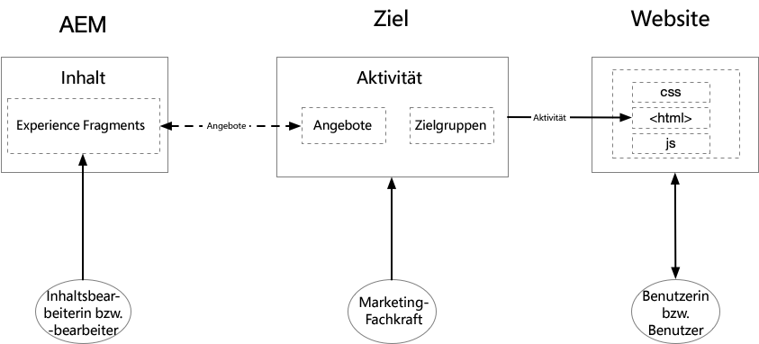
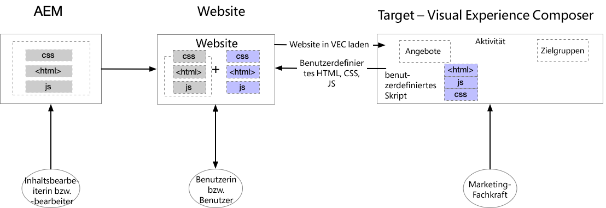
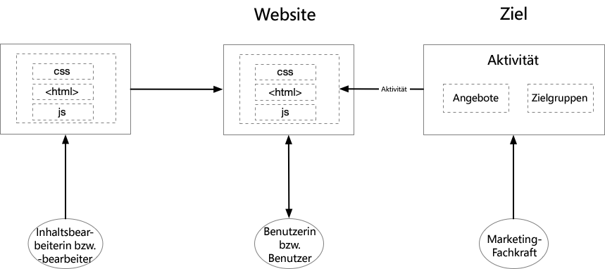

# Erste Schritte mit AEM und Adobe Target {#getting-started-with-aem-target}

Sowohl AEM als auch Zielgruppe sind leistungsstarke Lösungen mit scheinbar überlappenden Fähigkeiten. Kunden haben manchmal Schwierigkeiten damit, zu verstehen, wie und wann diese Produkte verwendet werden, um personalisierte Erlebnisse bereitzustellen. Um eine optimale Benutzererfahrung zu gewährleisten, sollten verschiedene Teams in Ihrem Unternehmen eng zusammenarbeiten und definieren, wer was tut.

In diesem Tutorial behandeln wir drei verschiedene Szenarien für AEM und Zielgruppe, die Ihnen helfen, zu verstehen, was für Ihr Unternehmen am besten funktioniert und wie verschiedene Teams zusammenarbeiten.

* Szenario 1: Personalisierung mit AEM Erlebnisfragmenten
* Szenario 2: Personalisierung mit Visual Experience Composer
* Szenario 3: Personalisierung vollständiger Webseiten-Erlebnisse

## Personalisierung mit AEM Erlebnisfragmenten {#personalization-using-aem-experience-fragment}

Für dieses Szenario werden wir AEM und Zielgruppe nutzen. Beide Produkte haben eindeutig ihre eigenen Stärken, und wenn es darum geht, personalisierte Erlebnisse für die Benutzer Ihrer Site bereitzustellen, benötigen Sie **personalisierte Inhalte (Inhalte von AEM)** und eine **intelligente Methode (Zielgruppe)**, um diese Inhalte basierend auf einem bestimmten Benutzer bereitzustellen.

AEM hilft Ihnen, personalisierte Inhalte zu erstellen, indem Sie all Ihre Inhalte und Assets an einem zentralen Ort zusammenführen, um Ihre Personalisierungsstrategie zu fördern. Mit AEM können Sie mühelos Inhalte für Desktop-PCs, Tablets und Mobilgeräte an einem Ort erstellen, ohne Code zu schreiben. Es ist nicht erforderlich, Seiten für jedes Gerät zu erstellen. AEM passt jedes Erlebnis automatisch mit Ihren Inhalten an. Sie können den Inhalt auch per Knopfdruck von AEM nach Adobe Target exportieren.

Wir haben jetzt personalisierte Inhalte in Form von Angeboten aus AEM in der Zielgruppe. Mit der Zielgruppe können Sie diese Angebot auf der Grundlage regelbasierter und AI-gesteuerter maschineller Lernansätze in einem Maßstab bereitstellen, die Verhaltensvariablen, Kontextvariablen und Offline-Variablen enthalten.  Mit der Zielgruppe können Sie ganz einfach A/B- und Multivarianz-Aktivitäten (MVT) einrichten und ausführen, um die besten Angebot, Inhalte und Erlebnisse zu ermitteln.

**Erlebnisfragmente** sind ein wichtiger Schritt nach vorn, um die Ersteller von Inhalten/Erlebnissen mit den Personalisierungsfachleuten zu verknüpfen, die mithilfe von Zielgruppen Geschäftsergebnisse vorantreiben.

* Autoren AEM Content-Editors personalisierte Inhalte als Erlebnisfragmente und deren Varianten
* AEM exportiert Erlebnisfragment-HTML in die Zielgruppe-&#x200B;
* Zielgruppe &#x200B; verwendet AEM Erlebnisfragment-Markup als Angebote in Aktivitäten
* Zielgruppe liefert Erlebnisfragment-HTML, AEM liefert referenzierte Bilder

   

**Um dieses Szenario zu implementieren, müssen Sie:**

* [AEM und Adobe Target mit Launch und Adobe I/O integrieren](./implementation.md#integrating-aem-target-options)
* [AEM und Adobe Target mit älteren Cloud Services](./implementation.md#integrating-aem-target-options)

***Nach der Implementierung der oben genannten Integrationen sollten Sie das  [Szenario im Detail](./personalization-use-case-1.md) untersuchen.***

## Personalisierung mit Visual Experience Composer

Marketingexperten können schnell Änderungen an ihrer Website vornehmen, ohne dass Code geändert wird, um einen Test mit dem Adobe Target Visual Experience Composer (VEC) auszuführen. VEC ist eine WYSIWYG-Benutzeroberfläche (was Sie sehen, ist das, was Sie erhalten), mit der Sie ganz einfach personalisierte Erlebnisse und Angebot im Site-Kontext erstellen und testen können. Sie können Erlebnisse und Angebot für Aktivitäten der Zielgruppe erstellen, indem Sie das Layout und den Inhalt einer Webseite (oder eines Angebots) oder mobilen Webseite per Drag &amp; Drop verschieben, austauschen und ändern.

VEC ist eines der Hauptmerkmale von Adobe Target. Mit VEC können Marketingexperten und Designer Inhalte über eine visuelle Oberfläche erstellen und ändern. Viele Designentscheidungen können getroffen werden, ohne dass eine direkte Bearbeitung des Codes erforderlich ist. Die Bearbeitung von HTML und JavaScript ist auch mit den Bearbeitungsoptionen möglich, die im Composer verfügbar sind.

* Inhalte befinden sich in AEM, und Content-Editoren erstellen und verwalten die Seiten der Site
* Zielgruppe verwendet AEM gehostete Siteseiten, um Tests und Personalisierung durchzuführen
* Zielgruppe liefert personalisierte Inhalte
* Neue Netto-Inhalte werden mit Adobe Target VEC erstellt
* Gilt sowohl für AEM gehostete Sites als auch für nicht AEM gehostete Sites

   

**Um dieses Szenario zu implementieren, müssen Sie:**

* [AEM und Adobe Target mit Launch und Adobe I/O integrieren](./implementation.md#integrating-aem-target-options)

***Nach der Implementierung der oben genannten Integration sollten Sie das  [Szenario genauer untersuchen.](./personalization-use-case-3.md)***

## Personalisierung vollständiger Webseiten-Erlebnisse

Die Integration von Adobe Experience Manager mit Adobe Target hilft Ihnen, Ihren Site-Benutzern ein personalisiertes Erlebnis zu bieten. Darüber hinaus können Sie damit besser verstehen, welche Versionen Ihres Website-Inhalts Ihre Konversionen während eines bestimmten Testzeitraums am besten verbessern. Ein A/B-Test vergleicht beispielsweise zwei oder mehr Versionen Ihres Website-Inhalts, um festzustellen, welche Version Ihre Konversionen, Verkäufe oder anderen von Ihnen identifizierten Metriken am meisten erhöht. Ein Marketingspezialist kann Aktivitäten innerhalb von Adobe Target erstellen, um zu verstehen, wie Benutzer mit dem Inhalt Ihrer Site interagieren und wie sich dies auf Ihre Site-Metriken auswirkt.

* Inhalte befinden sich in AEM, und Content-Editoren erstellen und verwalten die Seiten der Site
* Zielgruppe verwendet AEM gehostete Siteseiten, um Tests und Personalisierung durchzuführen
* Zielgruppe liefert personalisierte Inhalte
* Hier werden keine neuen Inhalte erstellt
* Gilt sowohl für AEM als auch für Nicht-AEM-Sites

   

**Um dieses Szenario zu implementieren, müssen Sie:**

* [AEM und Adobe Target mit Launch und Adobe I/O integrieren](./implementation.md#integrating-aem-target-options)

***Nach der Implementierung der oben genannten Integration sollten Sie das  [Szenario genauer untersuchen.](./personalization-use-case-2.md)***
