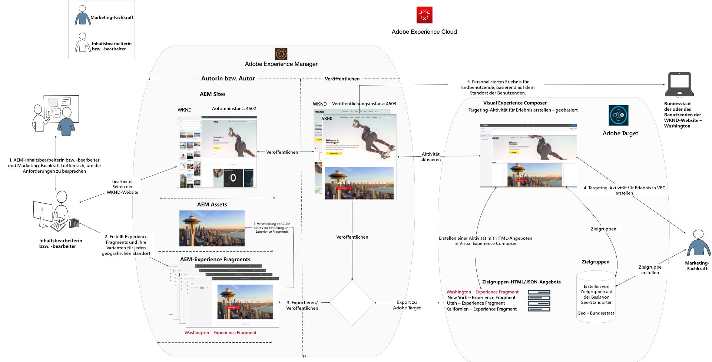
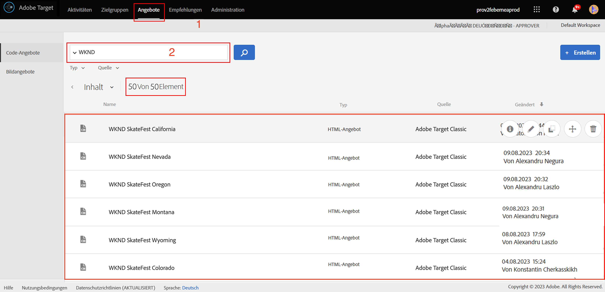
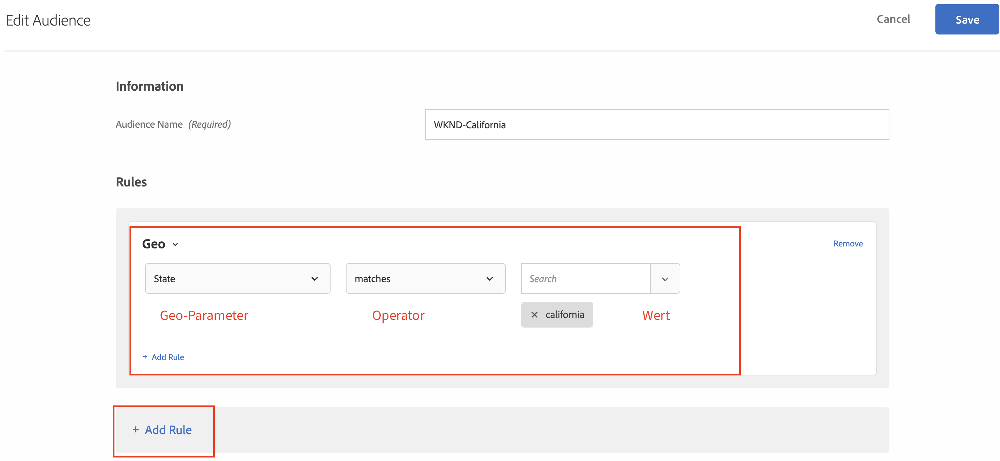
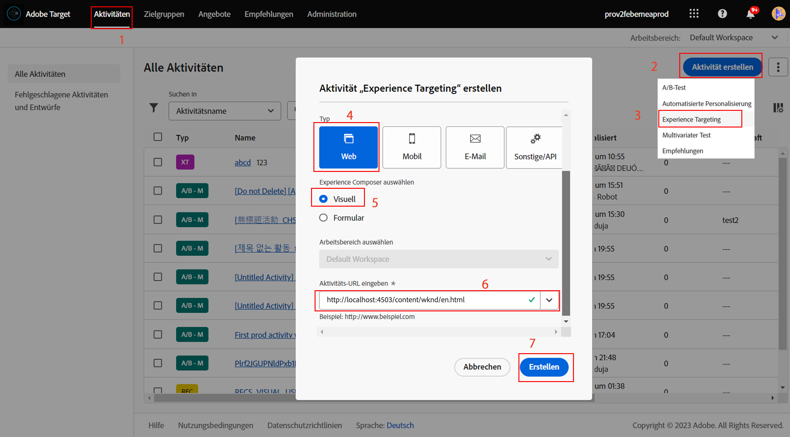
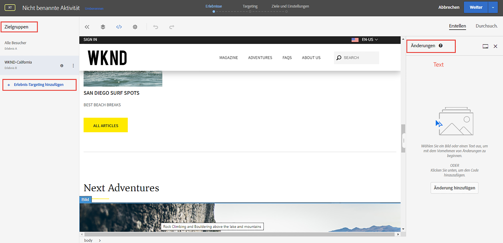
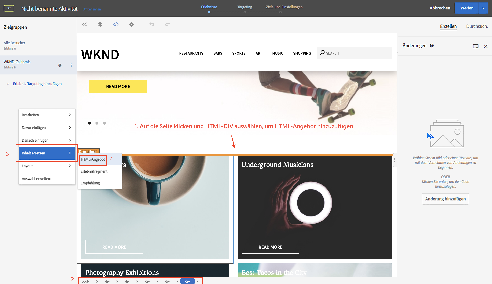
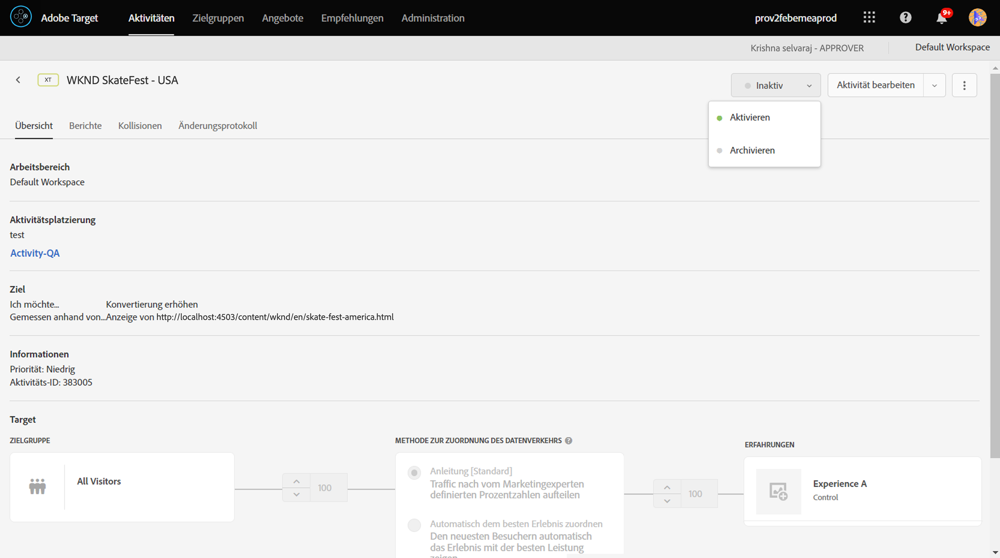
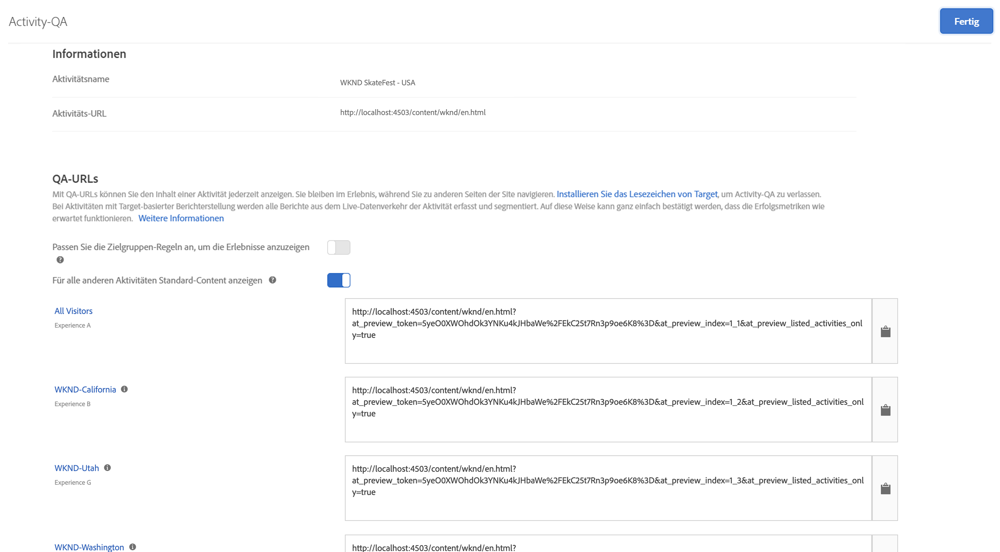

# Personalisierung mit AEM Erlebnisfragmenten und Adobe Target

Mit der Möglichkeit, AEM Erlebnisfragmente als HTML-Angebot in Adobe Target zu exportieren, können Sie die Benutzerfreundlichkeit und Leistungsfähigkeit von AEM mit leistungsstarken Funktionen für automatisierte Intelligenz (AI) und maschinelles Lernen (ML) in der Zielgruppe kombinieren, um Erlebnisse im Maßstab zu testen und zu personalisieren.

AEM bringt all Ihre Inhalte und Assets an einem zentralen Ort zusammen, um Ihre Personalisierungsstrategie zu fördern. Mit AEM können Sie mühelos Inhalte für Desktop-PCs, Tablets und Mobilgeräte an einem Ort erstellen, ohne Code zu schreiben. Es müssen keine Seiten für jedes Gerät erstellt werden. AEM passt jedes Erlebnis automatisch mit Ihren Inhalten an.

Mit der Zielgruppe können Sie personalisierte Erlebnisse auf der Grundlage einer Kombination aus regelbasierten und AI-basierten maschinellen Lernansätzen bereitstellen, die verhaltensbasierte, kontextuelle und Offline-Variablen enthalten.  Mit der Zielgruppe können Sie ganz einfach A/B- und Multivarianz-Aktivitäten (MVT) einrichten und ausführen, um die besten Angebot, Inhalte und Erlebnisse zu ermitteln.

Erlebnisfragmente sind ein wichtiger Schritt vorwärts, um Inhaltsersteller mit Marketingexperten zu verknüpfen, die mithilfe von Zielgruppe Geschäftsergebnisse fördern.

## Szenario-Übersicht

Die WKND-Site plant, eine **SkateFest Challenge** in ganz Amerika über ihre Website anzukündigen und möchte, dass sich ihre Site-Benutzer für die Vorführung in jedem Bundesstaat anmelden. Als Marketingspezialist wurde Ihnen die Aufgabe zugewiesen, eine Kampagne auf der WKND-Site-Startseite auszuführen, mit Bannermeldungen, die für den Standort des Ereignisses relevant sind, und einem Link zur Seite mit den Details. Lassen Sie uns die Startseite der WKND-Site untersuchen und lernen, wie ein personalisiertes Erlebnis für einen Benutzer basierend auf seinem aktuellen Standort erstellt und bereitgestellt wird.

### Betroffene Benutzer

Für diese Übung müssen die folgenden Benutzer beteiligt sein und einige Aufgaben ausführen, für die Sie möglicherweise administrativen Zugriff benötigen.

* **Content Producer/Content Editor** (Adobe Experience Manager)
* **Marketer** (Adobe Target/Optimierungsteam)

### Voraussetzungen

* **AEM-**
   * [AEM Autoren- und Veröffentlichungsinstancerunning ](./implementation.md#getting-aem) auf localhost 4502 bzw. 4503.
* **Experience Cloud**
   * Zugriff auf Ihre Organisationen Adobe Experience Cloud - <https://>`<yourcompany>`.experiencecloud.adobe.com
   * Experience Cloud mit den folgenden Lösungen
      * [Adobe Target](https://experiencecloud.adobe.com)

### WKND-Site-Startseite

1. Marketer startet mit AEM Content Editor die Diskussion über die WKND SkateFest Kampagne und stellt die Anforderungen vor.
   * ***Anforderung***: Fördern Sie die WKND SkateFest Kampagne auf der WKND-Site-Startseite mit personalisierten Inhalten für Besucher aus jedem Bundesstaat in den USA. hinzufügen einen neuen Inhaltsblock unter der Startseite Karussell mit einem Hintergrundbild, Text und einer Schaltfläche.
      * **Hintergrundbild**: Das Bild sollte für den Status relevant sein, von dem aus der Benutzer die Seite &quot;WKND-Site&quot;besucht.
      * **Text**: &quot;Für die Auditionen registrieren&quot;
      * **Schaltfläche**: &quot;Ereignis Details&quot;, die auf die WKND SkateFest-Seite verweisen
      * **WKND SkateFest-Seite**: eine neue Seite mit Details zum Ereignis, einschließlich Auditionort, Datum und Uhrzeit.
1. Basierend auf den Anforderungen erstellt AEM Content Editor ein Erlebnisfragment für den Inhaltsblock und exportiert es als Angebot nach Adobe Target. Um personalisierte Inhalte für alle Bundesstaaten in den USA bereitzustellen, kann der Autor eines Inhalts eine Erlebnisfragment-Übergeordnet-Variante erstellen und dann 50 weitere Varianten erstellen, eine für jeden Bundesstaat. Inhalte für jede Statusvariation mit relevanten Bildern und Text können dann manuell bearbeitet werden. Beim Erstellen eines Erlebnisfragments können Inhaltseditoren schnell auf alle in AEM Assets verfügbaren Assets zugreifen, indem sie die Option &quot;Asset-Suche&quot;verwenden. Wenn ein Erlebnisfragment nach Adobe Target exportiert wird, werden alle seine Varianten auch als Angebote an Adobe Target gesendet.

1. Nachdem Sie Erlebnisfragment von AEM nach Adobe Target als Angebote exportiert haben, können Marketingexperten mithilfe dieser Angebot eine Aktivität in der Zielgruppe erstellen. Auf der Grundlage der SkateFest-Kampagne auf der WKND-Site muss der Marketingspezialist ein personalisiertes Erlebnis erstellen und den WKND-Site-Besuchern aus jedem Bundesstaat ein personalisiertes Erlebnis bereitstellen. Um eine Erlebnis-Targeting-Aktivität zu erstellen, muss der Marketingspezialist die Audiencen identifizieren. Für unsere WKND SkateFest-Kampagne müssen wir 50 separate Audiencen erstellen, je nach ihrem Standort, von dem aus sie die WKND-Website besuchen.
   *  Zielgruppen definieren die Zielgruppe für Ihre Aktivität und werden überall dort verwendet, wo Targeting verfügbar ist. Zielgruppe-Audiencen sind definierte Besucher-Kriterien. Angebot können auf bestimmte Audiencen (oder Segmente) ausgerichtet werden. Nur Besucher, die zu dieser Audience gehören, sehen das Erlebnis, das auf sie zugeschnitten ist.  Sie können beispielsweise ein Angebot an eine Audience senden, die aus Besuchern besteht, die einen bestimmten Browser oder einen bestimmten geografischen Standort verwenden.
   * Ein [Angebot](https://docs.adobe.com/content/help/en/target/using/introduction/target-key-concepts.html#section_973D4CC4CEB44711BBB9A21BF74B89E9) ist der Inhalt, der während der Kampagnen oder Aktivitäten auf Ihren Webseiten angezeigt wird. Wenn Sie Ihre Webseiten testen, messen Sie den Erfolg jedes Erlebnisses mit verschiedenen Angeboten an Ihren Orten. Ein Angebot kann verschiedene Inhaltstypen enthalten, darunter:
      * Bild
      * Text
      * **HTML**
         * *HTML-Angebot werden für die Aktivität dieses Szenarios verwendet*
      * Verknüpfung
      * Schaltfläche

## Content Editor-Aktivitäten

>[!VIDEO](https://video.tv.adobe.com/v/28596?quality=12&learn=on)

>[!NOTE]
>
>Veröffentlichen Sie das Erlebnisfragment, bevor Sie es nach Adobe Target exportieren.

## Aktivitäten von Marketingexperten

### Erstellen einer Audience mit Geo-Targeting {#marketer-audience}

1. Navigieren Sie zu Ihren Organisationen [Adobe Experience Cloud](https://experiencecloud.adobe.com/) (<https://>`<yourcompany>`.experiencecloud.adobe.com)
1. Melden Sie sich mit Ihrem Adobe ID an und stellen Sie sicher, dass Sie sich in der richtigen Organisation befinden.
1. Klicken Sie im Lösungsschalter auf **Zielgruppe** und dann auf **Start** Adobe Target.

   

1. Navigieren Sie zum Register **Angebot** und suchen Sie nach &quot;WKND&quot;-Angeboten. Sie sollten die Liste der Varianten von Erlebnisfragmenten anzeigen können, die aus AEM als HTML-Angebot exportiert wurden. Jedes Angebot entspricht einem Status. Beispielsweise ist *WKND SkateFest California* das Angebot, das einem WKND-Site-Besucher aus Kalifornien bereitgestellt wird.

   

1. Klicken Sie im Hauptnavigationsmenü auf **Audiencen**.

   Ein Marketer muss 50 separate Audiencen für WKND-Site-Besucher aus jedem Bundesstaat in den Vereinigten Staaten von Amerika erstellen.

1. Um eine Audience zu erstellen, klicken Sie auf die Schaltfläche **Audience erstellen** und geben Sie einen Namen für Ihre Audience ein.

   **Format &quot;Audience Name&quot;: WKND-\&lt;>state *\>***

   

1. Klicken Sie auf **Hinzufügen Regel > Geo**.
1. Klicken Sie auf **Wählen Sie** und wählen Sie eine der folgenden Optionen aus:
   * Land
   * **Bundesland** *(Bundesland für WKND Site SkateFest-Kampagne auswählen)*
   * Stadt
   * Postleitzahl
   * Breite
   * Länge
   * DMA
   * Mobilnetzbetreiber

   **Geo** - Verwenden Sie Audiencen zur Zielgruppe von Benutzern auf Grundlage ihres geografischen Standorts, einschließlich ihres Landes, Bundeslandes, ihrer Stadt, Postleitzahl, DMA oder des Mobilnetzbetreibers. Geolocation-Parameter ermöglichen die Zielgruppe von Aktivitäten und Erlebnissen anhand der geografischen Daten Ihrer Besucher. Diese Daten werden mit jeder Anforderung der Zielgruppe gesendet und basieren auf der IP-Adresse des Besuchers. Wählen Sie diese Parameter genau wie Targeting-Werte aus.

   >[!NOTE]
   >Die IP-Adresse eines Besuchers wird einmal pro Besuch (Sitzung) mit einer mbox-Anfrage weitergeleitet, um Geotargeting-Parameter für diesen Besucher aufzulösen.

1. Wählen Sie den Operator als **stimmt mit** überein und geben Sie einen entsprechenden Wert ein (z. B.: Kalifornien) und **Speichern** Ihre Änderungen. Geben Sie in unserem Fall den Statusnamen ein.

   

   >[!NOTE]
   >Einer Audience können mehrere Regeln zugewiesen werden.

1. Wiederholen Sie die Schritte 6 bis 9, um Audiencen für die anderen Status zu erstellen.

   

Zu diesem Zeitpunkt haben wir erfolgreich Audiencen für alle WKND-Site-Besucher in verschiedenen Bundesstaaten der Vereinigten Staaten von Amerika erstellt und haben auch das entsprechende HTML-Angebot für jeden Bundesstaat. Erstellen wir nun eine Erlebnis-Targeting-Aktivität, um die Audience mit einem entsprechenden Angebot für die WKND-Site-Startseite zu Zielgruppe zu bringen.

### Aktivität mit Geo-Targeting erstellen

1. Navigieren Sie im Adobe Target-Fenster zur Registerkarte **Aktivitäten**.
1. Klicken Sie auf **Aktivität erstellen** und wählen Sie den Aktivitäten-Typ **Erlebnis-Targeting**.
1. Wählen Sie den Kanal **Web** und wählen Sie **Visual Experience Composer**.
1. Geben Sie die **Aktivitäten-URL** ein und klicken Sie auf **Weiter**, um den Visual Experience Composer zu öffnen.

   Veröffentlichungs-URL der WKND-Site-Startseite: http://localhost:4503/content/wknd/en.html

   

1. Damit **Visual Experience Composer** geladen werden kann, aktivieren Sie **Unsichere Skripte** in Ihrem Browser laden und laden Sie Ihre Seite neu.

   

1. Beachten Sie, dass die WKND-Site-Startseite im Visual Experience Composer-Editor geöffnet ist.

   

1. Um Ihrer VEC eine Audience hinzuzufügen, klicken Sie unter &quot;Audiencen&quot;auf **Hinzufügen Erlebnis-Targeting**, wählen Sie die WKND-California-Audience und klicken Sie auf **Weiter**.

   

1. Klicken Sie in VEC auf die Seite der WKND-Site, wählen Sie das HTML-Element aus, um das Angebot für die WKND-California-Audience hinzuzufügen, und wählen Sie **Ersetzen durch** und dann die Option **HTML-Angebot**.

   

1. Wählen Sie das HTML-Angebot **WKND SkateFest California** für die Audience **WKND-California** aus, wählen Sie die Benutzeroberfläche aus und klicken Sie auf **Fertig**.
1. Sie sollten nun das HTML-Angebot **WKND SkateFest California** sehen können, das zu Ihrer WKND-Site-Seite für die WKND-California-Audience hinzugefügt wurde.
1. Wiederholen Sie die Schritte 7 bis 10, um Erlebnis-Targeting für die anderen Status hinzuzufügen und das entsprechende HTML-Angebot auszuwählen.
1. Klicken Sie auf **Weiter**, um fortzufahren, und Sie können eine Zuordnung für Audiencen zu Erlebnissen sehen.
1. Klicken Sie auf **Weiter**, um zu Ziele und Einstellungen zu wechseln.
1. Wählen Sie die Quelle des Berichte und ein Hauptziel für Ihre Aktivität aus. Wählen Sie für unser Szenario die Berichte-Quelle als **Adobe Target** aus, messen Sie die Aktivität als **Konversion**, die Aktion als angezeigte Seite und die URL, die auf die Seite &quot;Details zum WKND-SkateFest&quot;zeigt.

   

   >[!NOTE]
   >Sie können auch Adobe Analytics als Berichte wählen.

1. Bewegen Sie den Mauszeiger über den Namen der aktuellen Aktivität, und Sie können ihn in **WKND SkateFest - USA** umbenennen und dann **Speichern und schließen** Ihre Änderungen.
1. Vergewissern Sie sich im Bildschirm &quot;Aktivität Details&quot;auf **Aktivieren** Ihrer Aktivität.

   

1. Ihre WKND SkateFest Kampagne ist jetzt live für alle WKND Site Besucher.
1. Navigieren Sie zur [WKND-Site-Startseite](http://localhost:4503/content/wknd/en.html), und Sie sollten das WKND SkateFest-Angebot auf Grundlage Ihres geografischen Standorts (*Bundesstaat: Kalifornien*).

   

### Qualitätssicherung bei Zielgruppe-Aktivitäten

1. Klicken Sie unter **Aktivität Details > Übersicht** auf die Schaltfläche **Aktivität QA** und Sie erhalten den Link zur direkten Qualitätssicherung zu allen Ihren Erlebnissen.

   

1. Navigieren Sie zur [WKND Site-Startseite](http://localhost:4503/content/wknd/en.html) und Sie sollten das WKND SkateFest-Angebot sehen können, das auf Ihrem Geo-Standort (Bundesstaat) basiert.
1. Sehen Sie sich das folgende Video an, um zu verstehen, wie ein Angebot an Ihre Seite gesendet wird, wie Sie Antworttokens anpassen und eine Qualitätsprüfung durchführen können.

>[!VIDEO](https://video.tv.adobe.com/v/28658?quality=12&learn=on)

## Zusammenfassung

In diesem Kapitel konnte ein Inhaltseditor alle Inhalte erstellen, um die WKND SkateFest-Kampagne innerhalb von Adobe Experience Manager zu unterstützen und sie als HTML-Angebot in Adobe Target zu exportieren, um Erlebnis-Targeting zu erstellen, basierend auf dem geografischen Standort des Benutzers.
