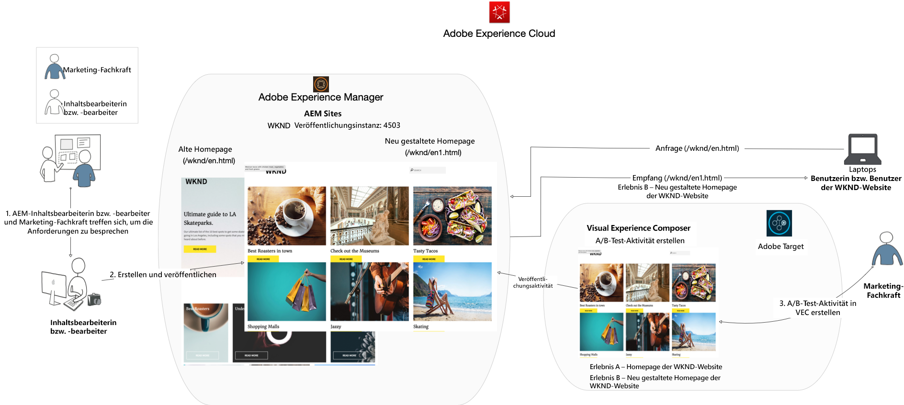
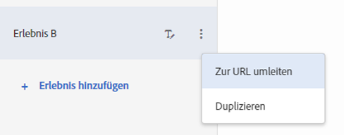
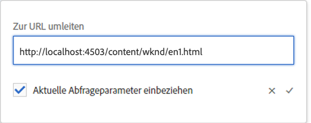
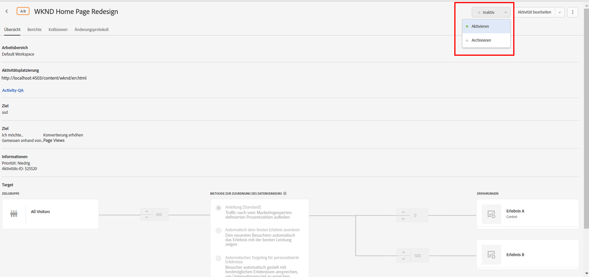
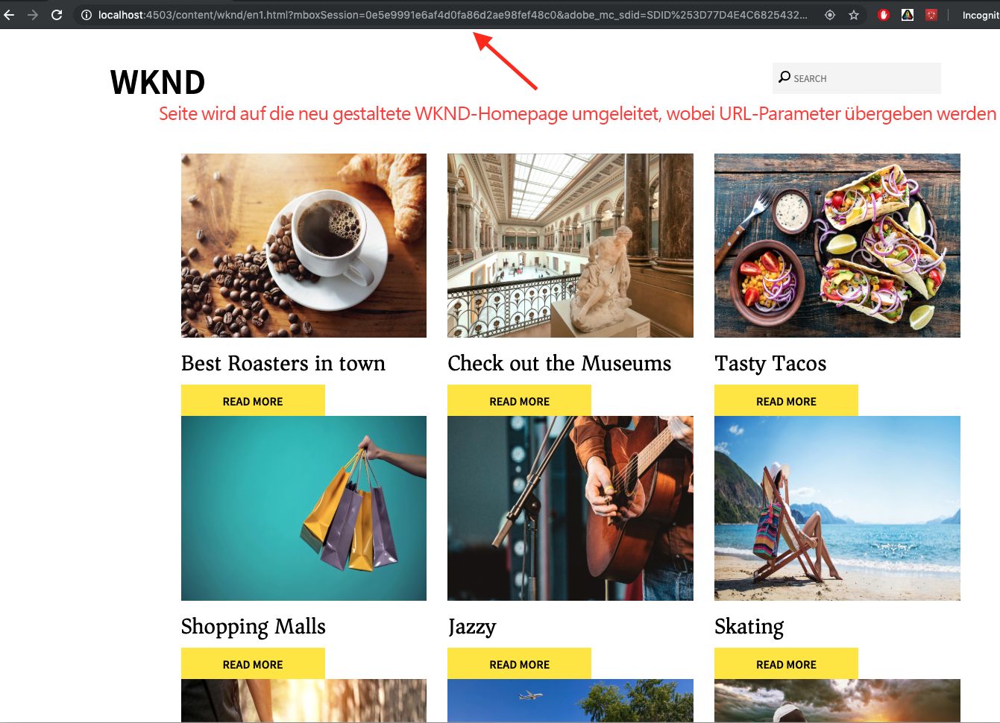

# Personalisierung vollständiger Webseiten-Erlebnisse mit Adobe Target

Im vorherigen Kapitel haben wir gelernt, wie eine auf Geolocation basierende Aktivität in Adobe Target mit Inhalten erstellt wird, die als Erlebnisfragmente erstellt und aus AEM als HTML-Angebot exportiert wurden.

In diesem Kapitel werden wir die Erstellung von Aktivitäten zur Umleitung Ihrer Site-Seiten, die auf AEM gehostet werden, auf eine neue Seite mit Adobe Target untersuchen.

## Szenario-Übersicht

Die WKND-Site hat ihre Startseite neu gestaltet und möchte ihre aktuellen Besucher der Startseite in die neue Startseite umleiten. Gleichzeitig sollten Sie auch verstehen, wie die neu gestaltete Startseite zur Verbesserung der Benutzerinteraktion und des Umsatzes beiträgt. Als Vermarkter wurde Ihnen die Aufgabe zugewiesen, eine Aktivität zu erstellen, mit der die Besucher zur neuen Startseite umgeleitet werden. Lassen Sie uns die Startseite der WKND-Site erkunden und lernen, wie eine Aktivität mit Adobe Target erstellt wird.

### Betroffene Benutzer

Für diese Übung müssen die folgenden Benutzer beteiligt sein und einige Aufgaben ausführen, für die Sie möglicherweise administrativen Zugriff benötigen.

* **Content Producer/Content Editor** (Adobe Experience Manager)
* **Marketer** (Adobe Target/Optimierungsteam)

### WKND-Site-Startseite

### Voraussetzungen

* **AEM**
   * [AEM Autoreninstanz](./implementation.md#getting-aem) und Veröffentlichungsinstanz, die auf localhost 4502 bzw. 4503 ausgeführt wird.
   * [AEM mit Adobe Experience Platform Launch integriert](./using-launch-adobe-io.md#aem-target-using-launch-by-adobe)
* **Experience Cloud**
   * Zugriff auf Ihre Organisationen Adobe Experience Cloud - <https://>`<yourcompany>`.experienceCloud.adobe.com
   * Experience Cloud mit den folgenden Lösungen
      * [Adobe Target](https://experiencecloud.adobe.com)

## Content Editor-Aktivitäten

1. Der Marketingexperte startet die WKND Startseite Redesign Diskussion mit AEM Content Editor und erklärt die Anforderungen.
   * ***Anforderung*** : Neugestaltung der WKND-Site-Startseite mit kartenbasiertem Design.
2. Je nach Bedarf erstellt AEM Content Editor dann eine neue WKND-Site-Startseite mit einem kartenbasierten Design und veröffentlicht die neue Startseite.

## Aktivitäten von Marketingexperten

1. Marketer erstellt eine A/B-Zielgruppe-Aktivität mit dem Umleitungs-Angebot als Erlebnis und 100 % Website-Traffic, der der neuen Startseite mit Erfolgsziel und hinzugefügten Metriken zugeordnet wird.
   1. Navigieren Sie im Adobe Target-Fenster zur Registerkarte &quot; **Aktivitäten** &quot;.
   2. Klicken Sie auf **Aktivität** erstellen und wählen Sie den Typ der Aktivität als **A/B-Test**

      
   3. Wählen Sie den **Web** Kanal und dann **Visual Experience Composer**.
   4. Geben Sie die **Aktivitäten-URL** ein und klicken Sie auf **Weiter** , um den Visual Experience Composer zu öffnen.
      
   5. Damit **Visual Experience Composer** geladen wird, aktivieren Sie **Zulassen von nicht sicheren Skripten** in Ihrem Browser und laden Sie Ihre Seite neu.
      
   6. Beachten Sie, dass die WKND-Site-Startseite im Visual Experience Composer-Editor geöffnet ist.
      
   7. Bewegen Sie den Mauszeiger über **Erlebnis B** und wählen Sie Ansicht andere Optionen.
      
   8. Wählen Sie die Option &quot; **Zu URL** umleiten&quot;und geben Sie die URL zur neuen WKND-Startseite ein. (http://localhost:4503/content/wknd/en1.html)
      
   9. **Speichern** Sie Ihre Änderungen und fahren Sie mit den nächsten Schritten zur Erstellung der Aktivität fort.
   10. Wählen Sie die **Traffic-Zuordnungsmethode** als manuell aus und weisen Sie **Erlebnis B**100 % Traffic zu.
      
   11. Klicken Sie auf **Weiter**.
   12. Geben Sie **Zielmetriken** für Ihre Aktivität an und speichern und schließen Sie Ihren A/B-Test.
      
   13. Geben Sie einen Namen (**WKND Startseite Redesign**) für Ihre Aktivität ein und speichern Sie Ihre Änderungen.
   14. Achten Sie im Bildschirm &quot;Aktivität&quot; darauf, Ihre Aktivität zu **aktivieren** .
      
   15. Navigieren Sie zur WKND-Startseite (http://localhost:4503/content/wknd/en.html) und Sie werden zur neu gestalteten WKND-Site-Startseite (http://localhost:4503/content/wknd/en1.html) weitergeleitet.
      

## Zusammenfassung

In diesem Kapitel konnte ein Marketingspezialist eine Aktivität erstellen, um Ihre auf AEM gehosteten Siteseiten mit Adobe Target auf eine neue Seite umzuleiten.
