# Personalisierung mit Visual Experience Composer

In diesem Kapitel werden wir das Erstellen von Erlebnissen mithilfe von **Visual Experience Composer** untersuchen, indem wir das Layout und den Inhalt einer Webseite innerhalb der Zielgruppe per Drag &amp; Drop verschieben, austauschen und ändern.

## Szenario-Übersicht

Die WKND-Site-Startseite zeigt lokale Aktivitäten oder das beste, was Sie in einer Stadt tun sollten, in Form von Kartenlayouts. Als Marketingspezialist wurde Ihnen die Aufgabe zugewiesen, die Startseite zu ändern, indem Sie die Kartenlayouts neu anordnen, um zu sehen, wie sich dies auf die Benutzerinteraktion auswirkt und die Konversion antreibt.

### Betroffene Benutzer

Für diese Übung müssen die folgenden Benutzer beteiligt sein und einige Aufgaben ausführen, für die Sie möglicherweise administrativen Zugriff benötigen.

* **Content Producer/Content Editor**  (Adobe Experience Manager)
* **Marketer** (Adobe Target/Optimierungsteam)

### WKND-Site-Startseite

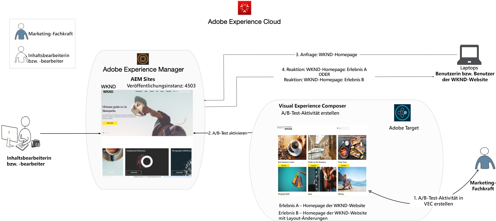

### Voraussetzungen

* **AEM-**
   * [AEM ](./implementation.md#getting-aem) Installation am 4503 veröffentlichen
   * [AEM mit Adobe Experience Platform Launch integriert](./using-launch-adobe-io.md#aem-target-using-launch-by-adobe)
* **Experience Cloud**
   * Zugriff auf Ihre Organisationen Adobe Experience Cloud - <https://>`<yourcompany>`.experiencecloud.adobe.com
   * Experience Cloud bereitgestellt mit [Adobe Target](https://experiencecloud.adobe.com)

## Aktivitäten von Marketingexperten

1. Der Marketingexperte erstellt innerhalb von Adobe Target eine Aktivität zur A/B-Zielgruppe.
   1. Navigieren Sie im Adobe Target-Fenster zur Registerkarte **Aktivitäten**.
   2. Klicken Sie auf die Schaltfläche **Aktivität erstellen** und wählen Sie den Typ der Aktivität als **A/B-Test**

      
   3. Wählen Sie den Kanal **Web** und wählen Sie **Visual Experience Composer**.
   4. Geben Sie die **Aktivitäten-URL** ein und klicken Sie auf **Weiter**, um den Visual Experience Composer zu öffnen.
      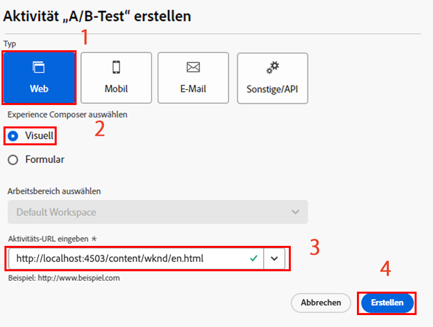
   5. Damit **Visual Experience Composer** geladen werden kann, aktivieren Sie **Unsichere Skripte** in Ihrem Browser laden und laden Sie Ihre Seite neu.
      
   6. Beachten Sie, dass die WKND-Site-Startseite im Visual Experience Composer-Editor geöffnet ist.
      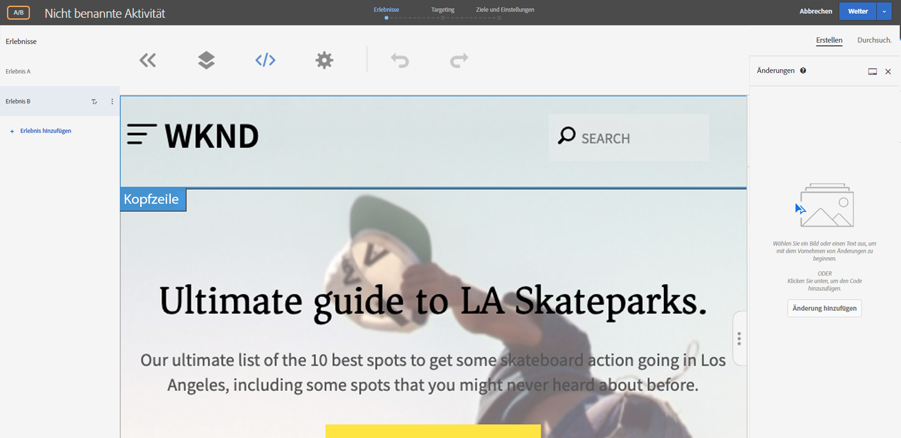
   7. **Erlebnis-** Hilfe bietet die standardmäßige WKND-Startseite und bearbeiten Sie das Inhaltslayout für  **Erlebnis B**.
      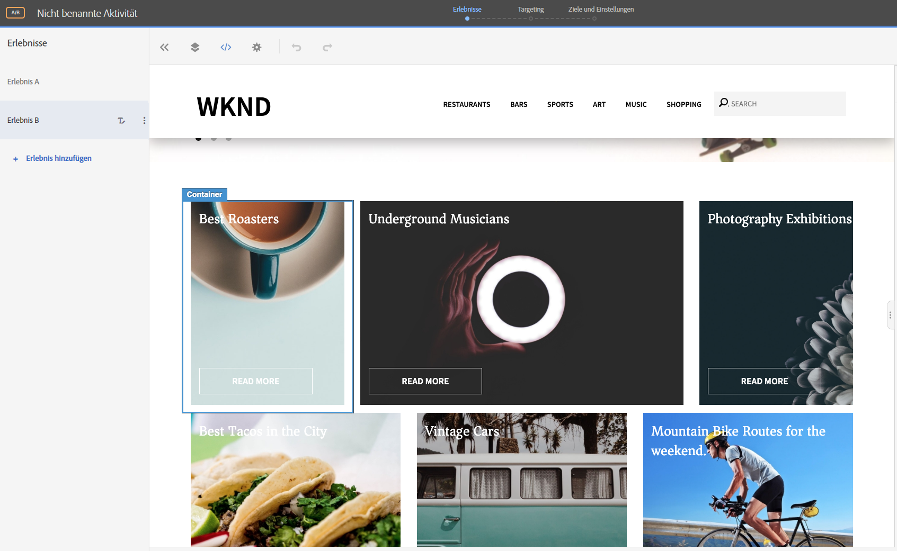
   8. Klicken Sie auf einen der Kartenlayout-Container (*Beste Röster*) und wählen Sie **Neuanordnen**.
      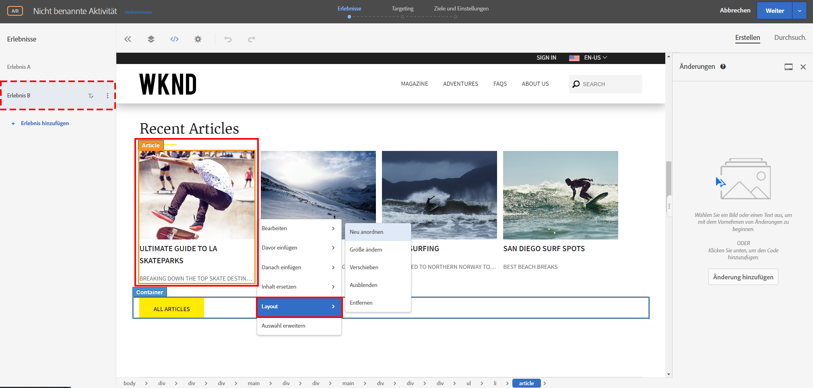
   9. Klicken Sie auf den Container, den Sie neu anordnen möchten, und ziehen Sie ihn an die gewünschte Position. Ordnen wir den Container *Beste Röster* von der ersten Zeile in die dritte Zeile um. Der Container *Beste Röster* befindet sich nun neben dem Container *Fotografieausstellungen*.
      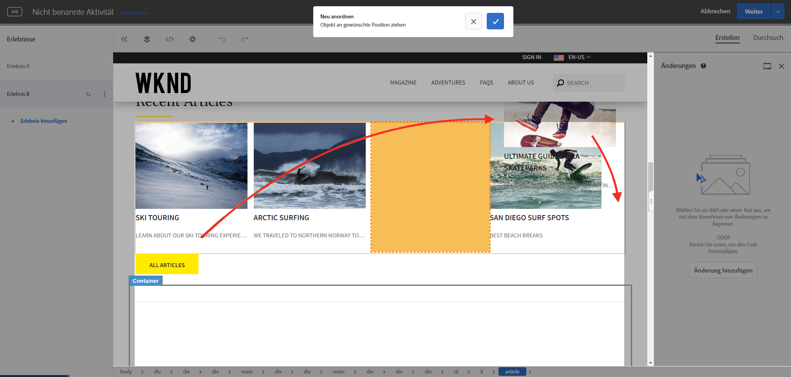

      **Nach dem Austauschen**
      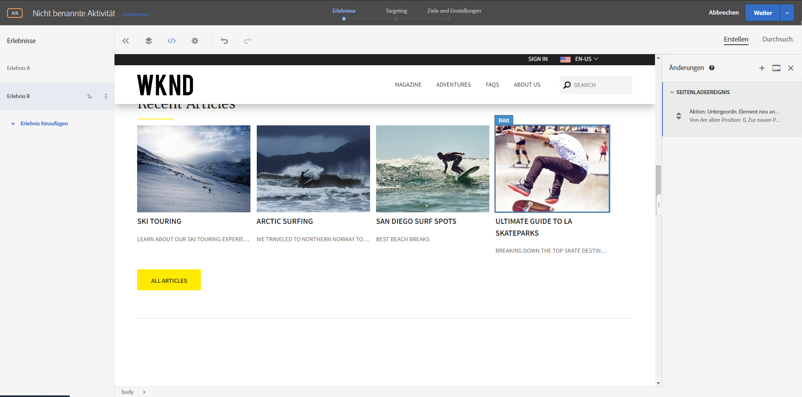
   10. Ordnen Sie die Positionen für die anderen Container der Karte entsprechend neu an.
      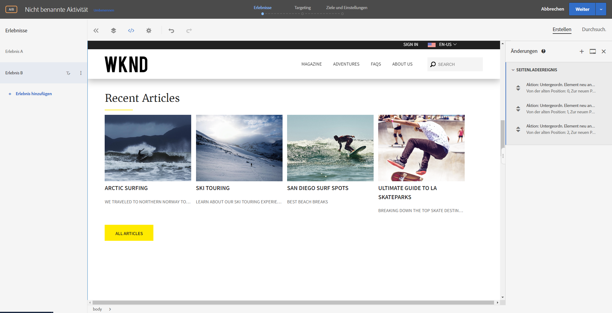
   11. Fügen wir auch einen Kopfzeilentext unter der Karussellkomponente und über dem Kartenlayout hinzu.
   12. Klicken Sie auf den Karussell-Container und wählen Sie die Option **Einsetzen nach > HTML**, um HTML hinzuzufügen.
      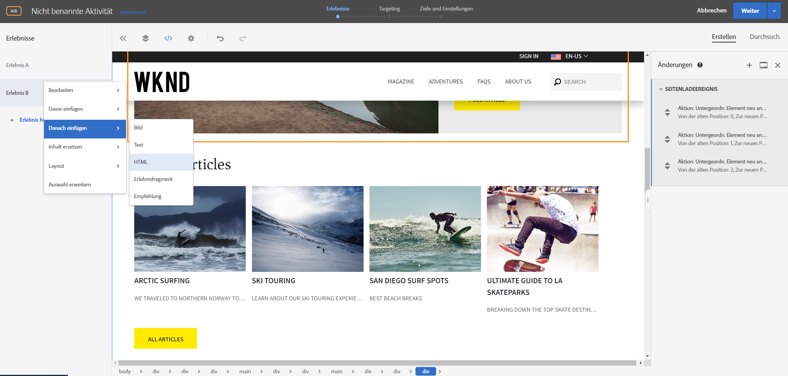

      ```html
      <h1 style="text-align:center">Check Out the Hot Spots in Town</h1>
      ```

      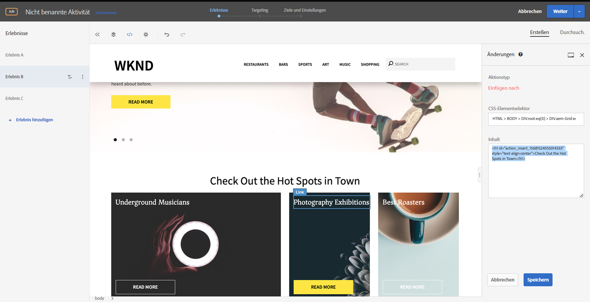
   13. Klicken Sie auf **Weiter**, um mit Ihrer Aktivität fortzufahren.
   14. Wählen Sie die **Traffic-Zuordnungsmethode** als manuell aus und weisen Sie **Erlebnis B** 100 % Traffic zu.
      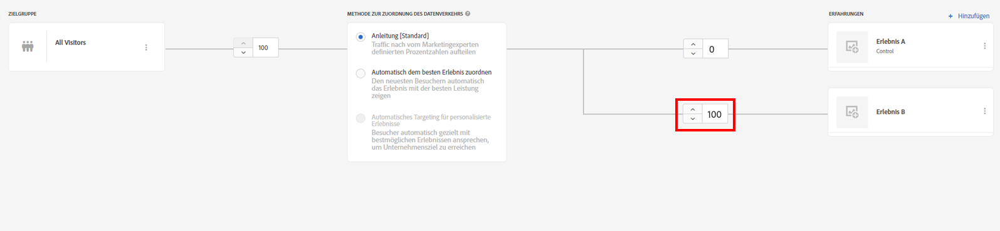
   15. Klicken Sie auf **Weiter**.
   16. Geben Sie **Zielmetriken** für Ihre Aktivität an und speichern und schließen Sie Ihren A/B-Test.
      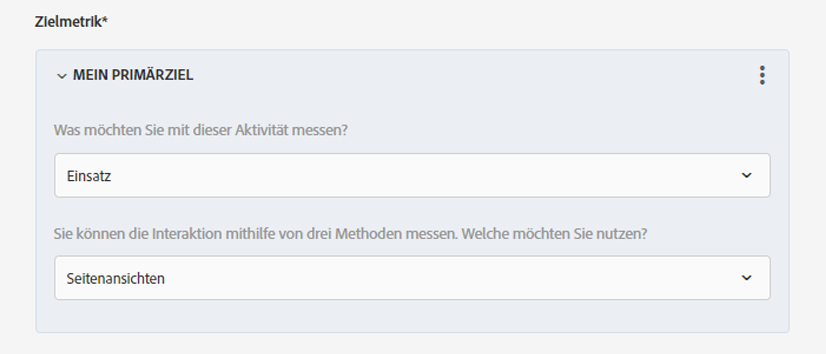
   17. Geben Sie einen Namen (**Aktualisierung der WKND-Startseite**) für Ihre Aktivität ein und speichern Sie Ihre Änderungen.
   18. Vergewissern Sie sich im Bildschirm &quot;Aktivität Details&quot;auf **Aktivieren** Ihrer Aktivität.
      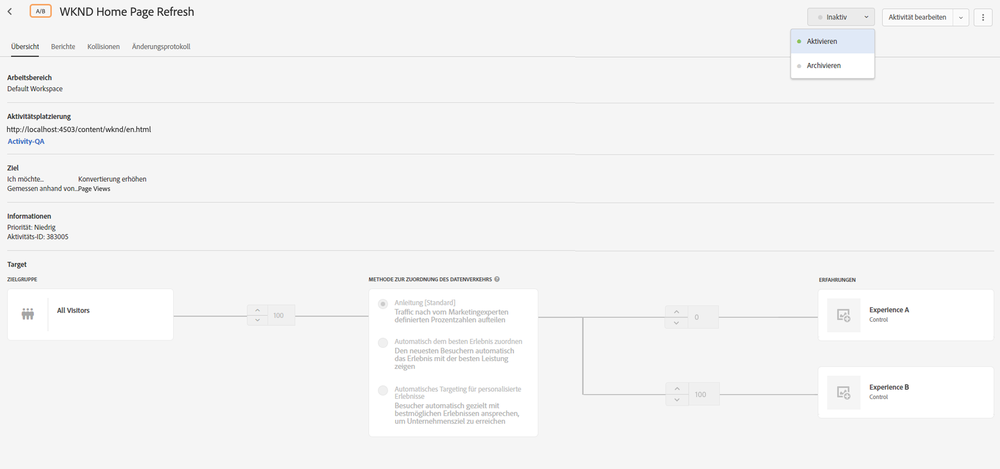
   19. Navigieren Sie zur WKND-Startseite (http://localhost:4503/content/wknd/en.html), und Sie sehen die Änderungen, die wir der Aktivität WKND Startseite Refresh A/B Test  hinzugefügt haben.
      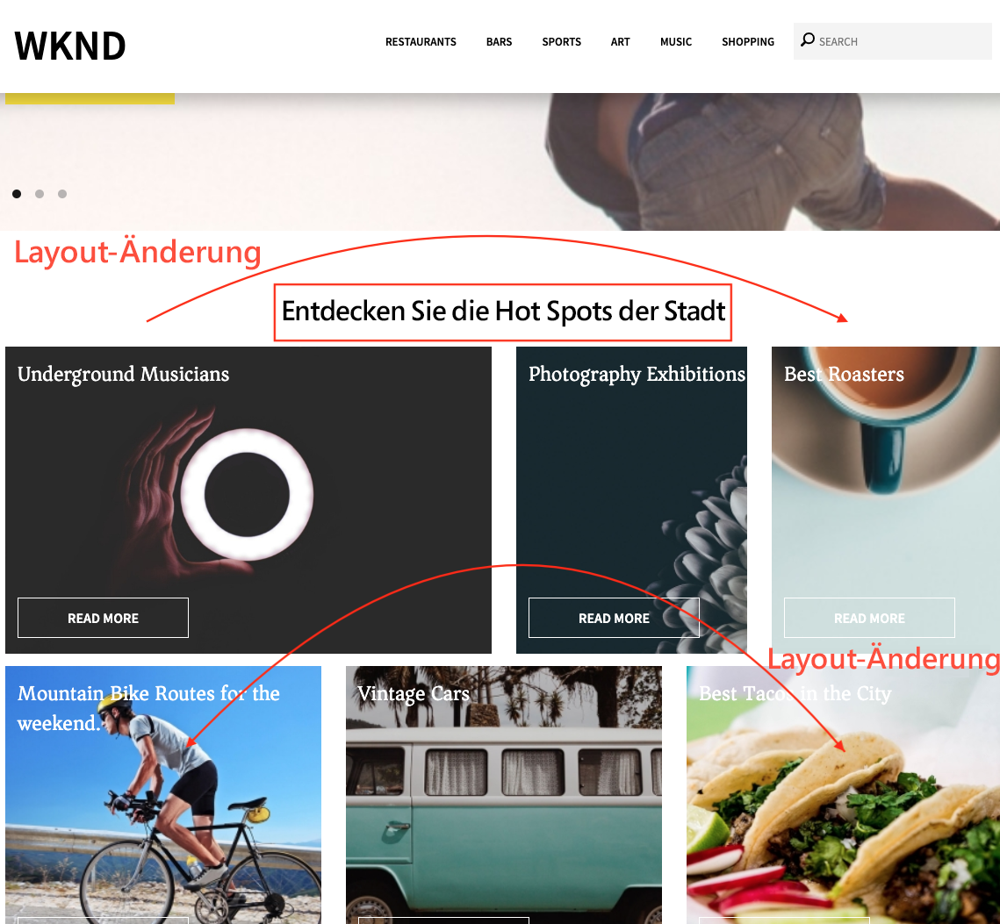
   20. Öffnen Sie Ihre Browser-Konsole und überprüfen Sie die Registerkarte &quot;Netzwerk&quot;, um nach Zielgruppen für die WKND Startseite Refresh A/B Test Aktivität zu suchen.
      

## Zusammenfassung

In diesem Kapitel konnte ein Marketingexperte mithilfe von Visual Experience Composer ein Erlebnis erstellen, indem er das Layout und den Inhalt einer Webseite per Drag &amp; Drop verschieben, austauschen und ändern konnte, ohne den Code zum Ausführen eines Tests zu ändern.
