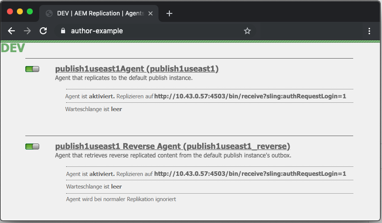

# Dispatcher-Vanity-URLs

[Inhaltsverzeichnis](./overview.md)

[&lt;- Vorheriges Kapitel: Verwenden und Verstehen von Variablen](./variables.md)

In diesem Dokument wird erläutert, wie die Leerung abläuft und welcher Mechanismus die Leerung und die Invalidierung des Cache durchführt.


## Funktionsweise

### Reihenfolge der Vorgänge

Der typische Workflow lässt sich am besten beschreiben, wenn Autorinnen bzw. Autoren eine Seite aktivieren. Wenn der Publisher den neuen Inhalt erhält, löst er eine Leerungsanfrage an den Dispatcher aus, wie im folgenden Diagramm dargestellt:

Diese Verkettung von Ereignissen macht deutlich, dass wir Elemente nur dann leeren, wenn sie neu sind oder sich geändert haben.  Dadurch wird sichergestellt, dass der Inhalt vor dem Leeren des Caches beim Publisher eingegangen ist, um Überschneidungen zu vermeiden, bei denen das Leeren auftreten könnte, bevor die Änderungen vom Publisher übernommen werden können.

## Replikations-Agenten

Auf Author gibt es einen Replikationsagenten, der so konfiguriert ist, dass er auf den Publisher verweist, und der, wenn etwas aktiviert wird, auslöst, dass die Datei und alle ihre Abhängigkeiten an den Publisher gesendet werden.

Wenn der Publisher die Datei empfängt, hat er einen Replikationsagenten, der so konfiguriert ist, dass er auf den Dispatcher zeigt, der beim Empfangsereignis ausgelöst wird.  Anschließend wird eine Leerungsanfrage serialisiert und an den Dispatcher gesendet.

### AUTORREPLIKATIONSAGENTEN

Im Folgenden finden Sie einige Screenshots eines konfigurierten standardmäßigen Replikationsagenten:


Es gibt in der Regel ein oder zwei Replikationsagenten, die auf Author für jeden Publisher konfiguriert sind, an den sie Inhalte replizieren.

Der erste ist der standardmäßige Replikationsagent, der Aktivierungen von Inhalten überträgt.

Der zweite ist der umgekehrte Agent.  Diese Option ist optional und dient dazu, den Postausgang jedes Publishers zu überprüfen, um festzustellen, ob neue Inhalte vorhanden sind, die als umgekehrte Replikationsaktivität in Author gezogen werden können.

### PUBLISHER-REPLIKATIONSAGENTEN

Im Folgenden finden Sie ein Beispiel-Screenshot eines konfigurierten standardmäßigen Replikationsagenten für das Leeren:


### DISPATCHER-REPLIKATION FÜR DAS LEEREN EMPFÄNGT VIRTUELLEN HOST

Das Dispatcher-Modul sucht nach bestimmten Headern, um zu erfahren, wann eine POST-Anfrage an AEM-Renderer übergeben werden soll oder ob es sich um eine serialisierte Leerungsanfrage handelt und vom Dispatcher-Handler selbst verarbeitet werden muss.

Im Folgenden finden Sie einen Screenshot der Konfigurationsseite mit den folgenden Werten:


Die Seite mit den Standardeinstellungen zeigt den `Serialization Type` als `Dispatcher Flush` an und legt die Fehlerstufe fest:


Auf der Registerkarte `Transport` finden Sie weitere Informationen zu `URI`, die auf die IP-Adresse des Dispatchers verweisen, der die Leerungsanfrage empfangen wird.  Der Pfad `/dispatcher/invalidate.cache` ist nicht die Art, wie das Modul bestimmt, ob es sich um eine Leerung handelt. Es ist nur ein offensichtlicher Endpunkt, den Sie im Zugriffsprotokoll sehen können, um zu erfahren, dass es sich um eine Leerungsanfrage handelt.  In der Registerkarte `Extended` werden wir die vorhandenen Elemente durchgehen, um zu identifizieren, dass es sich um eine Leerungsanfrage an das Dispatcher-Modul handelt.


Die `HTTP Method` für Leerungsanfragen ist einfach eine `GET`-Anfrage mit einigen speziellen Anfrage-Headern:
- CQ-Action
   - Hierbei wird eine AEM-Variable auf der Grundlage der Anfrage verwendet und der Wert ist normalerweise *aktivieren oder löschen*
- CQ-Handle
   - Hierbei wird eine AEM-Variable auf der Grundlage der Anfrage verwendet, und der Wert ist in der Regel der vollständige Pfad zu dem geleerten Element, zum Beispiel `/content/dam/logo.jpg`
- CQ-Path
   - Hierbei wird eine AEM-Variable auf der Grundlage der Anfrage verwendet, und der Wert ist in der Regel der vollständige Pfad zu dem geleerten Element, zum Beispiel `/content/dam`
- Host
   - Hier wird der Header `Host` gespooft, um ein bestimmtes `VirtualHost` zu erreichen, das auf dem Apache-Webserver des Dispatchers konfiguriert ist (`/etc/httpd/conf.d/enabled_vhosts/aem_flush.vhost`).  Es ist ein fest kodierter Wert, der mit einem Eintrag in der Datei `aem_flush.vhost`, `ServerName` oder `ServerAlias` übereinstimmt.


Auf der Registerkarte `Triggers` notieren wir uns die umgeschalteten Auslöser, die wir verwenden, und was sie sind:

- `Ignore default`
   - Dies ist aktiviert, sodass der Replikationsagent bei einer Seitenaktivierung nicht ausgelöst wird.  Wenn eine Autoreninstanz eine Änderung an einer Seite vornehmen sollte, würde dies zu einer Leerung führen.  Da es sich um einen Publisher handelt, wollen wir diese Art von Ereignis nicht auslösen.
- `On Receive`
   - Wenn eine neue Datei empfangen wird, soll eine Leerung getriggert werden. Wenn die Autoreninstanz also eine aktualisierte Datei sendet, wird eine Leerungsanfrage an den Dispatcher getriggert und gesendet.
- `No Versioning`
   - Wir überprüfen dies, um zu verhindern, dass die Veröffentlichungsinstanz neue Versionen generiert, da eine neue Datei empfangen wurde. Wir ersetzen einfach die Datei, die wir haben, und verlassen uns darauf, dass die Autoreninstanz statt der Veröffentlichungsinstanz die Versionen verfolgt.

Sehen wir uns nun an, wie eine typische Leerungsanfrage in Form eines `curl`-Befehls aussieht:

```
$ curl \ 
-H "CQ-Action: Activate" \ 
-H "CQ-Handle: /content/dam/logo.jpg" \ 
-H "CQ-Path: /content/dam/" \ 
-H "Content-Length: 0" \  
-H "Content-Type: application/octect-stream" \ 
-H "Host: flush" \ 
http://10.43.0.32:80/dispatcher/invalidate.cache
```

Dieses Leerungsbeispiel würde den Pfad `/content/dam` durch Aktualisieren der `.stat`-Datei in diesem Verzeichnis leeren.

## Die `.stat`-Datei:

Der Leerungsmechanismus ist einfach und wir möchten die Wichtigkeit der `.stat`-Dateien erklären, die im Dokumentenstamm generiert werden, in dem die Cache-Dateien erstellt werden.

Innerhalb der `.vhost`- und `_farm.any`-Dateien konfigurieren wir eine Dokumentstamm-Anweisung, um anzugeben, wo sich der Cache befindet und wo Dateien gespeichert/bereitgestellt werden sollen, wenn eine Anfrage von Endbenutzenden eingeht.

Wenn Sie den folgenden Befehl auf Ihrem Dispatcher-Server ausführen würden, würden Sie erst `.stat`-Dateien finden

```
$ find /mnt/var/www/html/ -type f -name ".stat"
```

Hier sehen Sie ein Diagramm dafür, wie diese Dateistruktur aussieht, wenn Sie Elemente im Cache haben und eine Leerungsanfrage vom Dispatcher-Modul gesendet und verarbeitet wurde.


### STAT-DATEIEBENE

Beachten Sie, dass in jedem Verzeichnis eine `.stat`-Datei vorhanden war. Dies ist ein Hinweis darauf, dass eine Leerung aufgetreten ist.Im obigen Beispiel war die Einstellung von `statfilelevel` auf `3` in der entsprechenden Farm-Konfigurationsdatei festgelegt.

Die Einstellung `statfilelevel` gibt an, wie viele Ordner tief das Modul durchläuft und eine `.stat`-Datei aktualisiert. Die STAT-Datei ist leer, es handelt sich lediglich um einen Dateinamen mit einem Datenstempel. Sie kann sogar manuell erstellt werden, indem Sie den Touch-Befehl in der Befehlszeile des Dispatcher-Servers ausführen.

Wenn die Einstellung für die Stat-Dateiebene zu hoch eingestellt ist, durchläuft jede Leerungsanfrage die Verzeichnisstruktur und ändert Stat-Dateien. Dies kann zu einem großen Leistungseinbruch bei großen Cache-Bäumen führen und sich auf die Gesamtleistung Ihres Dispatchers auswirken.

Wenn Sie diese Dateiebene zu niedrig festlegen, kann eine Leerungsanfrage dazu führen, dass mehr gelöscht wird, als beabsichtigt war. Dies würde wiederum dazu führen, dass der Cache mit weniger Anfragen, die aus dem Cache bedient werden, häufiger überlastet wird, und Leistungsprobleme verursachen.

<div style="color: #000;border-left: 6px solid #2196F3;background-color:#ddffff;"><b>Hinweis:</b>

Legen Sie den `statfilelevel` auf ein angemessenes Niveau fest. Schauen Sie sich Ihre Ordnerstruktur an und stellen Sie sicher, dass sie so eingerichtet ist, dass knappe Leerungen möglich sind, ohne zu viele Verzeichnisse durchlaufen zu müssen. Testen Sie es und stellen Sie sicher, dass es Ihren Anforderungen während eines Leistungstests des Systems entspricht.

Ein gutes Beispiel ist eine Site, die Sprachen unterstützt. Der typische Inhaltsstrukturbaum würde die folgenden Verzeichnisse aufweisen

`/content/brand1/en/us/`

Verwenden Sie in diesem Beispiel eine Stat-Dateiebeneneinstellung von 4. Dadurch wird sichergestellt, dass beim Leeren von Inhalten, die sich unter dem <b>`us`</b>-Ordner befinden, keine Sprachordner zusätzlich geleert werden.
</div>

### STAT-DATEI-ZEITSTEMPEL-HANDSHAKE

Wenn eine Inhaltsanfrage in derselben Routine erfolgt,

1. wird der Zeitstempel der `.stat`-Datei mit dem Zeitstempel der angeforderten Datei verglichen
2. Wenn die `.stat`-Datei neuer als die angeforderte Datei ist, wird der zwischengespeicherte Inhalt gelöscht und neuer aus AEM abgerufen und zwischengespeichert. Dann wird der Inhalt bereitgestellt
3. Wenn die `.stat`-Datei älter als die angeforderte Datei ist, steht fest, dass die Datei neu ist, und Sie kann den Inhalt bereitstellen.

### CACHE-HANDSHAKE – BEISPIEL 1

Im obigen Beispiel ist eine Anfrage für den Inhalt `/content/index.html`.

Die Uhrzeit der `index.html`-Datei ist 2019-11-01 @ 18:21

Die Uhrzeit der nächsten `.stat`-Datei ist 2019-11-01 @ 12:22

Wenn Sie verstehen, was wir oben gelesen haben, können Sie sehen, dass die Indexdatei neuer ist als die `.stat`-Datei und die Datei vom Cache an die Endbenutzenden geliefert wird, die sie angefordert haben.

### CACHE-HANDSHAKE – BEISPIEL 2

Im obigen Beispiel ist eine Anfrage für den Inhalt `/content/dam/logo.jpg`.

Die Uhrzeit der `logo.jpg`-Datei ist 2019-10-31 @ 13:13

Die Uhrzeit der nächsten `.stat`-Datei ist 2019-11-01 @ 12:22

Wie in diesem Beispiel gezeigt, ist die Datei älter als die `.stat`-Datei und wird entfernt und eine neue wird aus AEM abgerufen, um sie im Cache zu ersetzen, bevor sie den Endbenutzenden bereitgestellt wird, die sie angefordert haben.

## Farm-Dateieinstellungen

Hier befindet sich die Dokumentation für alle Konfigurationsoptionen: [https://docs.adobe.com/content/help/de/experience-manager-dispatcher/using/configuring/dispatcher-configuration.html#configuring-dispatcher_configuring-the-dispatcher-cache-cache](https://experienceleague.adobe.com/docs/experience-manager-dispatcher/using/configuring/dispatcher-configuration.html?lang=de)

Wir möchten einige davon hervorheben, die sich auf die Cache-Leerung beziehen

### Leerungs-Farmen

Es gibt zwei wichtige `document root`-Verzeichnisse, die Dateien aus dem Autoren- und Veröffentlichungs-Traffic zwischenspeichern. Um diese Verzeichnisse bei neuem Inhalt auf dem neuesten Stand zu halten, müssen wir den Cache leeren. Diese Leerungsanfragen sollten nicht Ihren normalen Farm-Konfigurationen für Kunden-Traffic in die Quere kommen, die die Anfrage ablehnen oder etwas Unerwünschtes bewirken könnten. Stattdessen stellen wir zwei Leerungsfarmen für diese Aufgabe bereit:

- `/etc/httpd.conf.d/available_farms/001_ams_author_flush_farm.any`
- `/etc/httpd.conf.d/available_farms/001_ams_publish_flush_farm.any`

Diese Farm-Dateien haben keine andere Funktion, als die Dokument-Stammverzeichnisse zu leeren.

```
/publishflushfarm {  
    /virtualhosts {
        "flush"
    }
    /cache {
        /docroot "${PUBLISH_DOCROOT}"
        /statfileslevel "${DEFAULT_STAT_LEVEL}"
        /rules {
            $include "/etc/httpd/conf.dispatcher.d/cache/ams_publish_cache.any"
        }
        /invalidate {
            /0000 {
                /glob "*"
                /type "allow"
            }
        }
        /allowedClients {
            /0000 {
                /glob "*.*.*.*"
                /type "deny"
            }
            $include "/etc/httpd/conf.dispatcher.d/cache/ams_publish_invalidate_allowed.any"
        }
    }
}
```

### Dokumentstamm

Dieser Konfigurationseintrag befindet sich im folgenden Abschnitt der Farm-Datei:

```
/myfarm { 
    /cache { 
        /docroot
```

Sie geben das Verzeichnis an, das der Dispatcher als Cache-Verzeichnis füllen und verwalten soll.

<div style="color: #000;border-left: 6px solid #2196F3;background-color:#ddffff;"><b>Hinweis:</b>
Dieses Verzeichnis sollte mit der Apache-Dokumentstamm-Einstellung für die Domain übereinstimmen, für die Ihr Webserver konfiguriert ist.

Verschachtelte Dokument-Stammordner pro Farm, die Unterordner des Apache-Dokumentstamms sind, sind aus vielen Gründen keine gute Idee.
</div>

### Ebene der statischen Dateien

Dieser Konfigurationseintrag befindet sich im folgenden Abschnitt der Farm-Datei:

```
/myfarm { 
    /cache { 
        /statfileslevel
```

Diese Einstellung gibt an, wie viele `.stat`-Dateien bei einer Leerungsanfrage erzeugt werden müssen.

Wenn `/statfileslevel` auf die folgende Zahl gesetzt wird und der Dokumentstamm `/var/www/html/` ist, würde dies beim Leeren von `/content/dam/brand1/en/us/logo.jpg` zu folgenden Ergebnissen führen:

- 0: Die folgenden stat-Dateien werden erstellt:
   - `/var/www/html/.stat`
- 1: Die folgenden stat-Dateien werden erstellt:
   - `/var/www/html/.stat`
   - `/var/www/html/content/.stat`
- 2:- Die folgenden stat-Dateien werden erstellt:
   - `/var/www/html/.stat`
   - `/var/www/html/content/.stat`
   - `/var/www/html/content/dam/.stat`
- 3: Die folgenden stat-Dateien werden erstellt:
   - `/var/www/html/.stat`
   - `/var/www/html/content/.stat`
   - `/var/www/html/content/dam/.stat`
   - `/var/www/html/content/dam/brand1/.stat`
- 4: Die folgenden stat-Dateien werden erstellt:
   - `/var/www/html/.stat`
   - `/var/www/html/content/.stat`
   - `/var/www/html/content/dam/.stat`
   - `/var/www/html/content/dam/brand1/.stat`
   - `/var/www/html/content/dam/brand1/en/.stat`
- 5: Die folgenden stat-Dateien werden erstellt:
   - `/var/www/html/.stat`
   - `/var/www/html/content/.stat`
   - `/var/www/html/content/dam/.stat`
   - `/var/www/html/content/dam/brand1/.stat`
   - `/var/www/html/content/damn/brand1/en/.stat`
   - `/var/www/html/content/damn/brand1/en/us/.stat`


<div style="color: #000;border-left: 6px solid #2196F3;background-color:#ddffff;"><b>Hinweis:</b>

Denken Sie daran, dass beim Zeitstempel-Handshake nach der nächstgelegenen `.stat`-Datei gesucht wird.

Eine `.stat`-Datei auf Ebene 0 und eine Statistikdatei nur auf `/var/www/html/.stat` bedeutet, dass Inhalte, die sich unter `/var/www/html/content/dam/brand1/en/us/` befinden, nach der nächstgelegenen `.stat`-Datei suchen und 5 Ordner nach oben wandern, um die einzige `.stat`-Datei auf Ebene 0 zu finden und die Daten mit dieser zu vergleichen.  Das bedeutet, dass eine Leerung auf dieser hohen Ebene im Wesentlichen alle zwischengespeicherten Elemente ungültig macht.
</div>

### Zulässige Invalidierung

Dieser Konfigurationseintrag befindet sich im folgenden Abschnitt der Farm-Datei:

```
/myfarm { 
    /cache { 
        /allowedClients {
```

Innerhalb dieser Konfiguration legen Sie eine Liste von IP-Adressen fest, die Leerungsanfragen senden dürfen. Wenn eine Leerungsanfrage beim Dispatcher eintrifft, muss sie von einer vertrauenswürdigen IP-Adresse stammen. Wenn Sie diese Konfiguration falsch konfiguriert haben oder eine Leerungsanfrage von einer nicht vertrauenswürdigen IP-Adresse senden, wird der folgende Fehler in der Protokolldatei angezeigt:

```
[Mon Nov 11 22:43:05 2019] [W] [pid 3079 (tid 139859875088128)] Flushing rejected from 10.43.0.57
```

### Invalidierungsregeln

Dieser Konfigurationseintrag befindet sich im folgenden Abschnitt der Farm-Datei:

```
/myfarm { 
    /cache { 
        /invalidate {
```

Diese Regeln geben normalerweise an, welche Dateien bei einer Leerungsanfrage invalidiert werden dürfen.

Um zu verhindern, dass wichtige Dateien bei einer Seitenaktivierung invalidiert werden, können Sie Regeln anwenden, die angeben, welche Dateien invalidiert werden dürfen und welche manuell invalidiert werden müssen.  Im Folgenden finden Sie einen Beispielsatz an Konfigurationen, die nur die Invalidierung von HTML-Dateien ermöglichen:

```
/invalidate { 
   /0000 { /glob "*" /type "deny" } 
   /0001 { /glob "*.html" /type "allow" } 
}
```

## Tests/Fehlerbehebung

Wenn Sie eine Seite aktivieren und grünes Licht dafür erhalten, dass die Seitenaktivierung erfolgreich war, sollten Sie erwarten, dass der aktivierte Inhalt auch aus dem Cache geleert wird.

Sie aktualisieren Ihre Seite und sehen die alten Dinge! Was!? Es gab ein grünes Licht?!

Gehen wir ein paar manuelle Schritte durch den Leerungsprozess durch, um uns einen Einblick zu verschaffen, was falsch sein könnte.  Führen Sie in der Publisher-Shell die folgende Leerungsanforderung mit cURL aus:

```
$ curl -H "CQ-Action: Activate" \ 
-H "CQ-Handle: /content/<PATH TO ITEM TO FLUSH>" \ 
-H "CQ-Path: /content/<PATH TO ITEM TO FLUSH>" \ 
-H "Content-Length: 0" -H "Content-Type: application/octet-stream" \ 
-H "Host: flush" \ 
http://<DISPATCHER IP ADDRESS>/dispatcher/invalidate.cache
```

Testbeispiel für eine Leerungsanfrage

```
$ curl -H "CQ-Action: Activate" \ 
-H "CQ-Handle: /content/customer/en-us" \ 
-H "CQ-Path: /content/customer/en-us" \ 
-H "Content-Length: 0" -H "Content-Type: application/octet-stream" \ 
-H "Host: flush" \ 
http://169.254.196.222/dispatcher/invalidate.cache
```

Nachdem Sie den Anfragebefehl an den Dispatcher gesendet haben, möchten Sie in den Protokollen sehen, was er getan hat und was er mit `.stat files` gemacht hat.  Verfolgen Sie die Protokolldatei und Sie sollten die folgenden Einträge sehen, um die Leerungsanfrage des Dispatcher-Moduls zu bestätigen.

```
[Wed Nov 13 16:54:12 2019] [I] [pid 19173:tid 140542721578752] Activation detected: action=Activate [/content/dam/logo.jpg] 
[Wed Nov 13 16:54:12 2019] [I] [pid 19173:tid 140542721578752] Touched /mnt/var/www/html/.stat 
[Wed Nov 13 16:54:12 2019] [I] [pid 19173:tid 140542721578752] Touched /mnt/var/www/html/content/.stat 
[Wed Nov 13 16:54:12 2019] [I] [pid 19173:tid 140542721578752] Touched /mnt/var/www/html/content/dam/.stat 
[Wed Nov 13 16:54:12 2019] [I] [pid 19173:tid 140542721578752] "GET /dispatcher/invalidate.cache" 200 purge [publishfarm/-] 0ms
```

Nachdem wir nun sehen, dass das Modul die Leerungsanfrage erfasst und bestätigt hat, müssen wir sehen, wie sie sich dies auf die `.stat`-Dateien auswirkt.  Führen Sie den folgenden Befehl aus und beobachten Sie, wie die Zeitstempel aktualisiert werden, wenn Sie eine weitere Leerung durchführen:

```
$ watch -n 3 "find /mnt/var/www/html/ -type f -name ".stat" | xargs ls -la $1"
```

Wie Sie aus der Befehlsausgabe entnehmen können, finden Sie die Zeitstempel der aktuellen `.stat`-Dateien:

```
-rw-r--r--. 1 apache apache 0 Nov 13 16:54 /mnt/var/www/html/content/dam/.stat 
-rw-r--r--. 1 apache apache 0 Nov 13 16:54 /mnt/var/www/html/content/.stat 
-rw-r--r--. 1 apache apache 0 Nov 13 16:54 /mnt/var/www/html/.stat
```

Wenn wir nun die Leerung noch einmal durchführen, werden die Zeitstempel aktualisiert:

```
-rw-r--r--. 1 apache apache 0 Nov 13 17:17 /mnt/var/www/html/content/dam/.stat 
-rw-r--r--. 1 apache apache 0 Nov 13 17:17 /mnt/var/www/html/content/.stat 
-rw-r--r--. 1 apache apache 0 Nov 13 17:17 /mnt/var/www/html/.stat
```

Vergleichen wir die Zeitstempel unserer Inhalte mit den Zeitstempeln unserer `.stat`-Dateien:

```
$ stat /mnt/var/www/html/content/customer/en-us/.stat 
  File: `.stat' 
  Size: 0           Blocks: 0          IO Block: 4096   regular empty file 
Device: ca90h/51856d    Inode: 17154125    Links: 1 
Access: (0644/-rw-r--r--)  Uid: (   48/  apache)   Gid: (   48/  apache) 
Access: 2019-11-13 16:22:31.000000000 -0400 
Modify: 2019-11-13 16:22:31.000000000 -0400 
Change: 2019-11-13 16:22:31.000000000 -0400 
 
$ stat /mnt/var/www/html/content/customer/en-us/logo.jpg 
File: `logo.jpg' 
  Size: 15856           Blocks: 32          IO Block: 4096   regular file 
Device: ca90h/51856d    Inode: 9175290    Links: 1 
Access: (0644/-rw-r--r--)  Uid: (   48/  apache)   Gid: (   48/  apache) 
Access: 2019-11-11 22:41:59.642450601 +0000 
Modify: 2019-11-11 22:41:59.642450601 +0000 
Change: 2019-11-11 22:41:59.642450601 +0000
```

Wenn Sie sich einen der Zeitstempel ansehen, werden Sie feststellen, dass der Inhalt eine neuere Zeit hat als die `.stat`-Datei, was das Modul anweist, die Datei aus dem Cache zu laden, da sie neuer ist als die `.stat`-Datei.

Im Klartext: Die Zeitstempel dieser Datei wurden aktualisiert, sodass sie nicht mehr „geleert“ oder ersetzt werden können.

[Weiter mit -> Vanity-URLs](./disp-vanity-url.md)
