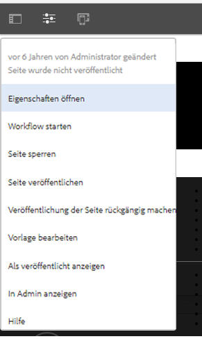
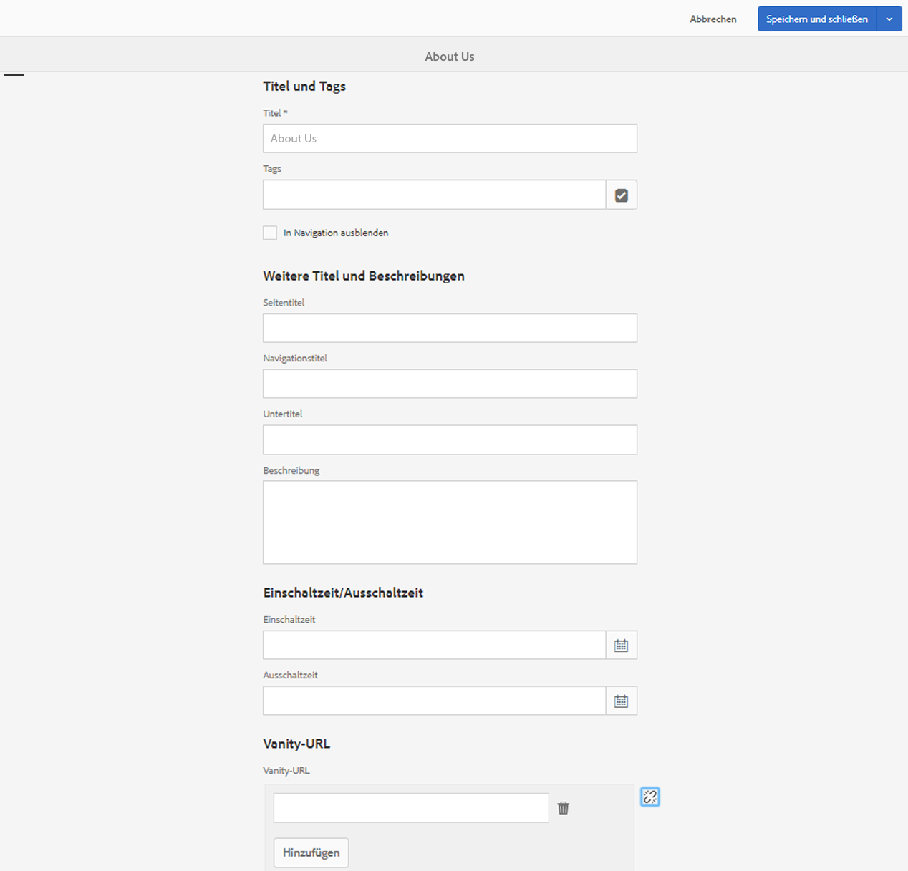
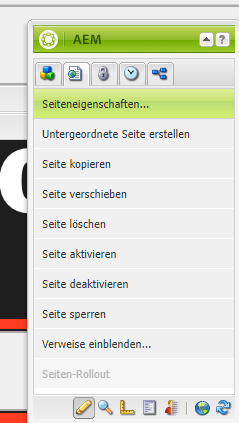
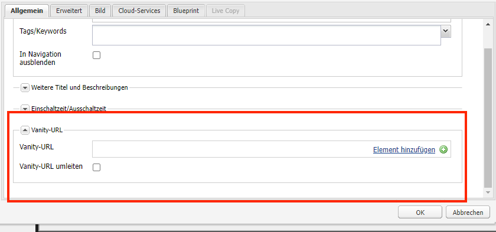

# Dispatcher-Vanity-URLs

[Inhaltsverzeichnis](./overview.md)

[&lt;- Vorheriges Kapitel: Leerung des Dispatchers](./disp-flushing.md)

## Übersicht

Dieses Dokument hilft Ihnen zu verstehen, wie AEM mit Vanity-URLs und einigen zusätzlichen Techniken umgeht, die Umschreibungsregeln verwenden, um Inhalte näher am Rand der Bereitstellung zuzuordnen.

## Was sind Vanity-URLs?

Wenn Sie Inhalte haben, die in einer sinnvollen Ordnerstruktur gespeichert sind, sind sie nicht immer unter einer URL zu finden, die leicht zu referenzieren ist.  Vanity-URLs sind wie Tastaturbefehle.  Kürzere oder eindeutige URLs, die auf den tatsächlichen Inhalt verweisen.

Ein Beispiel: `/aboutus` gerichtet auf `/content/we-retail/us/en/about-us.html`

AEM-Autorinnen und -Autoren haben die Möglichkeit, Eigenschaften von Vanity-URLs für Inhalte in AEM festzulegen und zu veröffentlichen.

Damit diese Funktion funktioniert, müssen Sie die Dispatcher-Filter anpassen, damit Vanity durchgelassen wird.  Es ist unzumutbar, die Dispatcher-Konfigurationsdateien in dem Tempo anzupassen, in dem die Autorinnen bzw. Autoren diese Vanity-Seiteneinträge einrichten müssten.

Aus diesem Grund verfügt das Dispatcher-Modul über eine Funktion, mit der automatisch alle Elemente zugelassen werden, die in der Inhaltsstruktur als Vanity aufgeführt sind.


## Funktionsweise

### Verfassen von Vanity-URLs

Die Autorin bzw. der Autor besucht eine Seite in AEM, besucht die Seiteneigenschaften und fügt die Einträge in den Vanity-URL-Abschnitt ein.

Nachdem sie ihre Änderungen gespeichert und die Seite aktiviert haben, wird dieser Seite nun die Vanity zugewiesen.

#### Touch-optimierte Benutzeroberfläche:





#### Klassische Inhaltssuche:





<div style="color: #000;border-left: 6px solid #2196F3;background-color:#ddffff;"><b>Hinweis:</b>
Bitte haben Sie Verständnis dafür, dass dies sehr anfällig für Namensraumprobleme ist.

Vanity-Einträge sind global für alle Seiten, dies ist nur einer der Mängel, die Sie für Umgehungslösungen planen müssen, von denen wir einige später erklären werden.
</div>

## Ressourcenauflösung / -zuordnung

Jeder Vanity-Eintrag ist ein Sling-Zuordnungs-Eintrag für eine interne Umleitung.

Diese Zuordnungen sind in der Felix-Konsole ( `/system/console/jcrresolver` ) der AEM-Instanzen sichtbar

Im Folgenden finden Sie einen Screenshot des Zuordnungs-Eintrags, der von einem Vanity-Eintrag erstellt wurde:


Wenn wir im obigen Beispiel die AEM-Instanz auffordern, `/aboutus` zu besuchen, wird sie nach `/content/we-retail/us/en/about-us.html` aufgelöst.

## Filter mit automatischer Dispatcher-Genehmigung

Der Dispatcher filtert in einem sicheren Zustand Anfragen am Pfad `/` durch den Dispatcher heraus, da dies der Stamm der JCR-Struktur ist.

Es ist wichtig, sicherzustellen, dass die Publisher nur Inhalte aus dem `/content` und anderen sicheren Pfaden usw. zulassen.  Nicht etwa Pfade wie `/system` usw.

Das Problem ist, dass die Vanity-Urls im Basisordner von `/` liegen. Wie können wir ihnen also erlauben, die Publisher zu erreichen und gleichzeitig sicher zu bleiben?

Der einfache Dispatcher verfügt über einen Mechanismus zur automatischen Filterung. Sie müssen ein AEM-Paket installieren und dann den Dispatcher so konfigurieren, dass er auf diese Paketseite verweist.

[https://experience.adobe.com/#/downloads/content/software-distribution/en/aem.html?package=/content/software-distribution/en/details.html/content/dam/aem/public/adobe/packages/granite/vanityurls-components](https://experience.adobe.com/#/downloads/content/software-distribution/en/aem.html?package=/content/software-distribution/en/details.html/content/dam/aem/public/adobe/packages/granite/vanityurls-components)

Der Dispatcher hat einen Konfigurationsabschnitt in seiner Farm-Datei:

```
/vanity_urls { 
    /url    "/libs/granite/dispatcher/content/vanityUrls.html" 
    /file   "/tmp/vanity_urls" 
    /delay  300 
}
```

Diese Konfiguration weist den Dispatcher an, diese URL alle 300 Sekunden von seiner AEM-Instanz abzurufen, um die Liste der Elemente abzurufen, die wir durchlassen möchten.

Es speichert den Cache der Antwort im Argument `/file`, in diesem Beispiel also `/tmp/vanity_urls`

Wenn Sie also die AEM-Instanz unter dem URI besuchen, dann sehen Sie, was sie abruft:


Es ist buchstäblich eine Liste, supereinfach.

## Neuschreiben der Regeln als Vanity-Regeln

Warum sollten wir die Verwendung von Neuschreibungsregeln anstelle des Standardmechanismus erwähnen, der wie oben beschrieben, in AEM integriert wurde?

Einfach erklärt, Namespace-Probleme, Leistung und Logik auf höherer Ebene, die besser gehandhabt werden kann.

Lassen Sie uns ein Beispiel für den Vanity-Eintrag `/aboutus` zu seinem Inhalt `/content/we-retail/us/en/about-us.html` unter Verwendung des Apache-Moduls `mod_rewrite` betrachten, um dies zu erreichen.

```
RewriteRule ^/aboutus /content/we-retail/us/en/about-us.html [PT,L,NC]
```

Diese Regel sucht nach der Vanity `/aboutus` und holt den vollständigen Pfad vom Renderer mit dem PT-Flag (Pass Through).

Außerdem werden alle anderen Regeln mit dem Kennzeichen L (Last) nicht mehr bearbeitet, d.h. es muss nicht eine riesige Liste von Regeln durchlaufen werden, wie es bei JCR Resolving der Fall ist.

Diese beiden Elemente dieser Methode erfordern nicht nur die Proxy-Anforderung, sondern auch die Wartezeit, bis der AEM-Publisher auf diese beiden Elemente reagiert.

Das Tüpfelchen auf dem i ist das NC-Flag (No Case-Sensitive), d. h. wenn eine Kundin bzw. ein Kunde die URI mit `/AboutUs` statt `/aboutus` eingibt, funktioniert sie trotzdem und ermöglicht den Abruf der richtigen Seite.

Um eine entsprechende Neuschreibungsregel zu erstellen, erstellen Sie eine Konfigurationsdatei auf dem Dispatcher (Beispiel: `/etc/httpd/conf.d/rewrites/examplevanity_rewrite.rules`) und fügen sie in die `.vhost`-Datei ein, die die Domain behandelt, für die diese Vanity-Urls gelten sollen.

Im Folgenden finden Sie ein Beispiel-Codesnippet für das Einschließen innerhalb von `/etc/httpd/conf.d/enabled_vhosts/we-retail.vhost`

```
<VirtualHost *:80> 
 ServerName weretail.com 
 ServerAlias www.weretail.com 
        ........ SNIP ........ 
 <IfModule mod_rewrite.c> 
  ReWriteEngine on 
  LogLevel warn rewrite:info 
  Include /etc/httpd/conf.d/rewrites/examplevanity_rewrite.rules 
 </IfModule> 
        ........ SNIP ........ 
</VirtualHost>
```

## Welche Methode und wo

Die Verwendung von AEM zur Steuerung von Vanity-Einträgen bietet folgende Vorteile:
- Autorinnen und Autoren können sie im Handumdrehen erstellen
- Sie sind direkt mit dem Inhalt verknüpft und können zusammen mit dem Inhalt verpackt werden

Die Verwendung von `mod_rewrite` zur Steuerung von Vanity-Einträgen bietet folgende Vorteile:
- Schnellere Auflösung von Inhalten
- Näher am Rande der Inhaltsanfragen der Endbenutzenden
- Größere Erweiterbarkeit und Optionen zur Steuerung, wie Inhalte unter anderen Bedingungen zugeordnet werden
- Kann Groß- und Kleinschreibung ignorieren

Verwenden Sie beide Methoden, aber hier sind die Ratschläge und Kriterien dafür, welche Methode Sie wann anwenden sollten:
- Wenn die Vanity nur vorübergehend ist und ein geringer Traffic geplant ist, verwenden Sie die in AEM integrierte Funktion
- Wenn es sich bei der Vanity um einen festen Endpunkt handelt, der sich nicht oft ändert und häufig verwendet wird, verwenden Sie eine `mod_rewrite`-Regel
- Wenn der Vanity-Namespace (z. B. `/aboutus`) für viele Marken auf derselben AEM-Instanz wiederverwendet werden muss, verwenden Sie Neuschreibungsregeln

<div style="color: #000;border-left: 6px solid #2196F3;background-color:#ddffff;"><b>Hinweis:</b>

Wenn Sie die Vanity-Funktion von AEM verwenden und Namespace vermeiden möchten, können Sie eine Namenskonvention vornehmen.  Mithilfe von Vanity-Urls, die wie `/brand1/aboutus`, `brand2/aboutus`, `brand3/aboutus` verschachtelt sind.
</div>

[Nächstes Kapitel -> Allgemeine Protokollierung](./common-logs.md)
