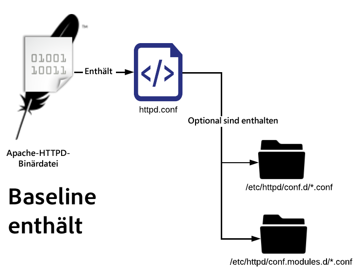
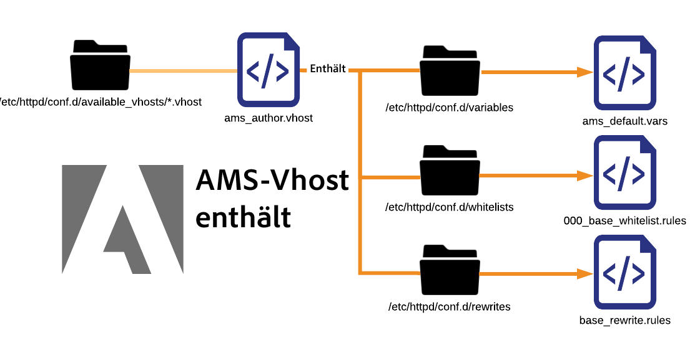
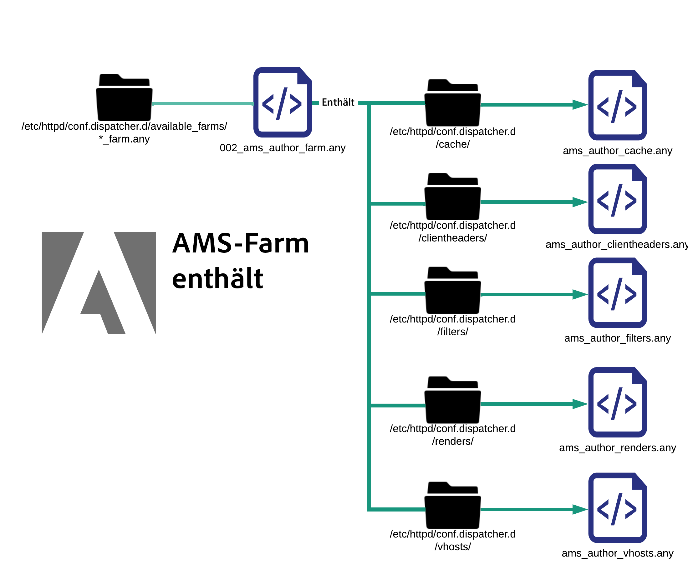

# Erläuterung der Konfigurationsdateien

[Inhaltsverzeichnis](./overview.md)

[&lt;- Zurück: Grundlegendes Datei-Layout](./basic-file-layout.md)

In diesem Dokument werden die einzelnen Konfigurationsdateien aufgeschlüsselt und erläutert, die auf einem standardmäßigen, in Adobe Managed Services konfigurierten Dispatcher-Server bereitgestellt werden. Sie erfahren mehr über die Verwendung, Namenskonvention usw.

## Namenskonvention

Für den Apache-Webserver ist die Dateierweiterung einer Datei nicht von Belang, wenn auf diese mit einer `Include`- oder `IncludeOptional`-Anweisung abgezielt wird. Eine ordnungsgemäße Benennung mit Namen, die Konflikte ausschließen und eindeutig sind, ist <b>sehr</b> hilfreich. Die verwendeten Namen beschreiben idealerweise den Umfang, in dem die Datei angewendet wird, was allen das Leben leichter macht. Wenn alles mit `.conf` benannt wird, entsteht große Verwirrung. Unzureichend benannte Dateien und Erweiterungen sollten vermieden werden. Im Folgenden finden Sie eine Liste der verschiedenen benutzerdefinierten Dateierweiterungen und Namenskonventionen, die in einem typischen AMS-konfigurierten Dispatcher verwendet werden.

## Dateien unter „conf.d/“

| Datei | Dateiziel | Beschreibung |
| ---- | ---------------- | ----------- |
| DATEINAME`.conf` | `/etc/httpd/conf.d/` | Eine standardmäßige Enterprise Linux-Installation verwendet diese Dateierweiterung und den include-Ordner, um in httpd.conf deklarierte Einstellungen außer Kraft zu setzen und Ihnen das Hinzufügen zusätzlicher Funktionen auf globaler Ebene in Apache zu ermöglichen. |
| DATEINAME`.vhost` | Bereitgestellt: `/etc/httpd/conf.d/available_vhosts/`<br>Aktiv: `/etc/httpd/conf.d/enabled_vhosts/`<br/><br/><div style="color: #000;border-left: 6px solid #2196F3;background-color:#ddffff;"><b>Hinweis:</b> .vhost-Dateien dürfen nicht in den Ordner „enabled_vhosts“ kopiert werden. Verwenden Sie stattdessen Symlinks zu einem relativen Pfad zur Datei „available_vhosts/\*.vhost“.</div></u><br><br> | \*.vhost-Dateien („vhost“ steht für virtueller Host) sind `<VirtualHosts>`-Einträge, um Host-Namen zu entsprechen und es Apache zu ermöglichen, den Traffic zu der jeweiligen Domain mit verschiedenen Regeln zu verarbeiten. Aus der `.vhost`-Datei werden andere Dateien wie `rewrites`, `whitelisting`, `etc` übernommen. |
| DATEINAME`_rewrite.rules` | `/etc/httpd/conf.d/rewrites/` | `*_rewrite.rules`-Dateien speichern `mod_rewrite`-Regeln, die explizit von einer `vhost`-Datei übernommen und genutzt werden sollen. |
| DATEINAME`_whitelist.rules` | `/etc/httpd/conf.d/whitelists/` | `*_ipwhitelist.rules`-Dateien werden aus den Dateien `*.vhost` einbezogen. Sie enthalten reguläre IP-Ausdrücke oder erlauben es Ablehnungsregeln, IP-Zulassungsauflistungen zuzulassen. Wenn Sie die Anzeige eines virtuellen Hosts auf der Basis von IP-Adressen einschränken möchten, generieren Sie eine dieser Dateien und schließen Sie sie über Ihre `*.vhost`-Datei ein. |

## Dateien unter „conf.dispatcher.d/“

| Datei | Dateiziel | Beschreibung |
| --- | --- | --- |
| DATEINAME`.any` | `/etc/httpd/conf.dispatcher.d/` | Das AEM Dispatcher-Apache-Modul bezieht seine Einstellungen aus `*.any`-Dateien. Die standardmäßige übergeordnete include-Datei ist `conf.dispatcher.d/dispatcher.any`. |
| DATEINAME`_farm.any` | Bereitgestellt: `/etc/httpd/conf.dispatcher.d/available_farms/`<br>Aktiv: `/etc/httpd/conf.dispatcher.d/enabled_farms/`<br><br><div style="color: #000;border-left: 6px solid #2196F3;background-color:#ddffff;"><b>Hinweis:</b> Diese Farm-Dateien dürfen nicht in den Ordner `enabled_farms` kopiert werden. Verwenden Sie stattdessen `symlinks` zu einem relativen Pfad zur Datei `available_farms/*_farm.any`. </div> <br/>`*_farm.any`-Dateien werden aus der Datei `conf.dispatcher.d/dispatcher.any` einbezogen. Diese übergeordneten Farm-Dateien dienen zur Steuerung des Modulverhaltens für jeden Render- oder Website-Typ. Dateien werden im Verzeichnis `available_farms` erstellt und mit einem `symlink` im Verzeichnis `enabled_farms` aktiviert. <br/>Sie werden automatisch anhand des Namens aus der Datei `dispatcher.any` einbezogen.<br/><b>Grundlegende</b> Farm-Dateien beginnen mit `000_`, um sicherzustellen, dass sie zuerst geladen werden.<br><b>Benutzerdefinierte</b> Farm-Dateien sollten danach geladen werden, indem ihr Zahlenschema bei `100_` anfängt, um das richtige Einschlussverhalten sicherzustellen. |
| DATEINAME`_filters.any` | `/etc/httpd/conf.dispatcher.d/filters/` | `*_filters.any`-Dateien werden aus den Dateien `conf.dispatcher.d/enabled_farms/*_farm.any` einbezogen. Jede Farm enthält eine Reihe von Regeln, die ändern, welcher Traffic herausgefiltert werden und nicht zu den Renderern gelangen soll. |
| DATEINAME`_vhosts.any` | `/etc/httpd/conf.dispatcher.d/vhosts/` | `*_vhosts.any`-Dateien werden aus den Dateien `conf.dispatcher.d/enabled_farms/*_farm.any` einbezogen. Bei diesen Dateien handelt es sich um eine Liste von Host-Namen oder URI-Pfaden, für die ein Blob-Abgleich durchgeführt wird, um zu bestimmen, welcher Renderer für diese Anfrage verwendet werden soll. |
| DATEINAME`_cache.any` | `/etc/httpd/conf.dispatcher.d/cache/` | `*_cache.any`-Dateien werden aus den Dateien `conf.dispatcher.d/enabled_farms/*_farm.any` einbezogen. Diese Dateien geben an, welche Elemente zwischengespeichert werden und welche nicht. |
| DATEINAME`_invalidate_allowed.any` | `/etc/httpd/conf.dispatcher.d/cache/` | `*_invalidate_allowed.any`-Dateien werden aus den Dateien `conf.dispatcher.d/enabled_farms/*_farm.any` einbezogen. Sie geben an, welche IP-Adressen Flush- und Invalidierungsanfragen senden dürfen. |
| DATEINAME`_clientheaders.any` | `/etc/httpd/conf.dispatcher.d/clientheaders/` | `*_clientheaders.any`-Dateien werden aus den Dateien `conf.dispatcher.d/enabled_farms/*_farm.any` einbezogen. Sie geben an, welche Client-Header an jeden Renderer weitergegeben werden sollen. |
| DATEINAME`_renders.any` | `/etc/httpd/conf.dispatcher.d/renders/` | `*_renders.any`-Dateien werden aus den Dateien `conf.dispatcher.d/enabled_farms/*_farm.any` einbezogen. Sie geben die IP-, Port- und Timeout-Einstellungen für jeden Renderer an. Ein ordnungsgemäßer Renderer kann ein LiveCycle-Server oder ein beliebiges AEM-System sein, von dem der Dispatcher die Anfragen abrufen/weiterleiten kann. |

## Vermeiden von Problemen

Wenn Sie sich an die Namenskonvention halten, können Sie einige ziemlich einfache Fehler vermeiden, die schwerwiegende Folgen haben können. Einige Beispiele werden wir hier anführen.

### Problembeispiel

Als Site-Beispiel für ExampleCo wurden zwei Konfigurationsdateien vom Entwickler-Team der Dispatcher-Konfigurationen erstellt.

<b>/etc/httpd/conf.d/exampleco.conf</b>

```
<VirtualHost *:80> 
    ServerName  "exampleco" 
    ServerAlias "www.exampleco.com" 
    .......... SNIP ............... 
    <IfModule mod_rewrite.c> 
        ReWriteEngine   on 
        LogLevel warn rewrite:trace1 
        Include /etc/httpd/conf.d/rewrites/exampleco.conf 
    </IfModule> 
</VirtualHost>
```

<b>/etc/httpd/conf.d/rewrites/exampleco.conf</b>

```
RewriteRule ^/$ /content/exampleco/en.html [PT,L] 
RewriteRule ^/robots.txt$ /content/dam/exampleco/robots.txt [PT,L]
```

#### `POTENTIAL DANGER - The file names are the same`

Wenn die `vhost`-Datei versehentlich im `rewrites`-Ordner und `rewrites file` im `vhosts`-Ordner abgelegt wird, erfolgt die Bereitstellung anhand des Dateinamens scheinbar ordnungsgemäß. Apache gibt jedoch einen *FEHLER* aus, ohne dass das Problem sofort ersichtlich ist.

<b>Wie dies typischerweise zu einem Problem wird</b>

Wenn die `two files` an den `same` Speicherort heruntergeladen werden, können sie sich entweder `overwrite themselves` oder ununterscheidbar werden, wodurch der Bereitstellungsprozess zu einem wahren Albtraum wird.

<b>Die Dateierweiterungen sind identisch und werden im Normalfall automatisch eingeschlossen</b>

Die Dateierweiterungen sind identisch und verwenden eine automatisch eingeschlossene Erweiterung, durch die Apache alle `.conf`-Dateien in vielen der Standardordner `auto include` wird.

<b>Wie dies typischerweise zu einem Problem wird</b>

Wenn die vhost-Datei mit der Erweiterung `.conf` im Ordner `/etc/httpd/conf.d/` abgelegt wird, wird versucht, sie in den Speicher in Apache zu laden. Normalerweise ist das in Ordnung, aber wenn die Datei mit den Neuschreibungsregeln und der Erweiterung `.conf` im Ordner `/etc/httpd/conf.d/` abgelegt wird, wird sie automatisch eingeschlossen und global angewendet, was zu verwirrenden und unerwünschten Ergebnissen führt.

## Auflösung

Benennen Sie die Dateien nach ihrem Zweck und schließen Sie sie sicher aus dem Namespace für automatische Einschlussregeln aus.

Wenn es sich um eine virtuelle Host-Datei handelt, benennen Sie sie mit `.vhost` als Erweiterung.

Wenn es sich um eine Datei mit Neuschreibungsregeln handelt, benennen Sie sie mit Site`_rewrite.rules` als Suffix und Erweiterung. Diese Namenskonvention macht deutlich, um welche Site es geht und dass es sich um einen Satz von Neuschreibungsregeln handelt.

Wenn es sich um eine Datei mit IP-Zulassungslistenregeln handelt, benennen Sie sie mit Beschreibung`_whitelist.rules` als Suffix und Erweiterung. Diese Namenskonvention beschreibt, wofür die Datei verwendet wird und dass es sich um einen Satz von IP-Übereinstimmungsregeln handelt.

Durch Verwendung dieser Namenskonventionen werden Probleme vermieden, wenn eine Datei in ein Verzeichnis zum automatischen Einschließen verschoben wird, zu dem sie nicht gehört.

Beispielsweise hat das Einfügen einer mit `.rules`, `.any` oder `.vhost` benannten Datei in den Ordner unter `/etc/httpd/conf.d/` zum automatischen Einschließen keinerlei Wirkung.

Wenn in einer Anfrage zur Bereitstellungsänderung angefordert wird, „exampleco_rewrite.rules“ für Produktions-Dispatcher bereitzustellen, kann die Person, die die Änderungen bereitstellt, bereits wissen, dass keine neue Site hinzufügt wird, sondern lediglich die Neuschreibungsregeln aktualisiert werden, wie durch den Dateinamen angegeben.

### Include-Reihenfolge

Beim Erweitern der Funktionalität und Konfigurationen auf dem unter Enterprise Linux installierten Apache-Webserver gibt es eine bestimmte Include-Reihenfolge, an die Sie sich halten sollten.

### Grundlegende Apache-Includes



Wie in der Abbildung oben gezeigt, betrachtet die HTTPD-Binärdatei nur die der Datei „httpd.conf“ als Konfigurationsdatei. Diese Datei enthält die folgenden Anweisungen:

```
Include conf.modules.d/*.conf 
IncludeOptional conf.d/*.conf
```

### AMS-Includes der obersten Ebene

Als wir unseren Standard angewendet haben, haben wir einige zusätzliche Dateitypen und eigene Includes hinzugefügt.

Im Folgenden finden Sie die AMS-Basisverzeichnisse und Includes der obersten Ebene.


Aufbauend auf der Apache-Basis zeigen wir, wie AMS einige zusätzliche Ordner und Includes der obersten Ebene für `conf.d`-Ordner sowie modulspezifische Verzeichnisse unter `/etc/httpd/conf.dispatcher.d/` erstellt hat.

Beim Laden von Apache wird `/etc/httpd/conf.modules.d/02-dispatcher.conf` eingebunden und diese Datei schließt die Binärdatei `/etc/httpd/modules/mod_dispatcher.so` in ihren Ausführungsstatus ein.

```
LoadModule dispatcher_module modules /mod_dispatcher .so
```

Um das Modul in unserem `<VirtualHost />` zu verwenden, legen wir eine Konfigurationsdatei namens `dispatcher_vhost.conf` unter `/etc/httpd/conf.d/` ab. In dieser Datei sehen Sie, wie Sie die grundlegenden Parameter einrichten, die für das Modul erforderlich sind:

```
<IfModule disp_apache2.c> 
    DispatcherConfig conf.dispatcher.d/dispatcher.any 
    ...SNIP... 
</IfModule>
```

Wie oben gezeigt, umfasst dies die `dispatcher.any`-Datei der obersten Ebene, damit unser Dispatcher-Modul die zugehörigen Konfigurationsdateien aus `/etc/httpd/conf.dispatcher.d/dispatcher.any` abrufen kann.

Achten Sie auf den Inhalt dieser Datei:

```
/farms { 
    $include "enabled_farms/*_farm.any" 
}
```

Die `dispatcher.any`-Datei der obersten Ebene enthält alle aktivierten Farm-Dateien unter `/etc/httpd/conf.dispatcher.d/enabled_farms/`. Der Dateiname `FILENAME_farm.any` folgt dabei unserer standardmäßigen Namenskonvention.

An späterer Stelle der zuvor erwähnten `dispatcher_vhost.conf`-Datei führen wir auch eine include-Anweisung aus, um jede aktivierte virtuelle Host-Datei unter `/etc/httpd/conf.d/enabled_vhosts/` zu aktivieren. Der Dateiname `FILENAME.vhost` folgt dabei unserer standardmäßigen Namenskonvention.

```
IncludeOptional /etc/httpd/conf.d/enabled_vhosts/*.vhost
```

In jeder unserer .vhost-Dateien werden Sie feststellen, dass das Dispatcher-Modul als Standard-Datei-Handler für ein Verzeichnis initialisiert wird.  Im Folgenden finden Sie eine .vhost-Beispieldatei, um die Syntax zu illustrieren:

```
<VirtualHost *:80> 
 ServerName "weretail" 
 ServerAlias www.weretail.com weretail.com 
 <Directory /> 
  <IfModule disp_apache2.c> 
   ....SNIP.... 
   SetHandler dispatcher-handler 
  </IfModule> 
  ....SNIP.... 
 </Directory> 
 ....SNIP.... 
</VirtualHost>
```

Nachdem Includes der obersten Ebene aufgelöst wurden, verfügen diese über weitere erwähnenswerte Sub-Includes.  Hier finden Sie eine allgemeine Darstellung dazu, wie Farmen und vhost-Dateien andere Unterelemente enthalten.

### AMS-vhost-Includes



Wenn `.vhost`-Dateien aus dem Verzeichnis `/etc/httpd/conf.d/availabled_vhosts/` per Symlink mit dem Verzeichnis `/etc/httpd/conf.d/enabled_vhosts/` verknüpft werden, werden sie in der aktiven Konfiguration verwendet.

Die `.vhost`-Dateien enthalten Sub-Includes basierend auf allgemeinen von uns gefundenen Elementen,  z. B. Variablen, Zulassungslisten und Neuschreibungsregeln.

Die `.vhost`-Datei enthält include-Anweisungen für jede Datei, und zwar darauf basierend, wo sie in der `.vhost`-Datei eingeschlossen werden müssen.  Im Folgenden finden Sie die Beispielsyntax für eine `.vhost`-Datei, die eine gute Referenz ist:

```
Include /etc/httpd/conf.d/variables/weretail.vars 
<VirtualHost *:80> 
 ServerName "${MAIN_DOMAIN}" 
 <Directory /> 
  Include /etc/httpd/conf.d/whitelists/weretail*_whitelist.rules 
  <IfModule disp_apache2.c> 
   ....SNIP.... 
   SetHandler dispatcher-handler 
  </IfModule> 
  ....SNIP.... 
 </Directory> 
 ....SNIP.... 
 <IfModule mod_rewrite.c> 
  ReWriteEngine   on 
  LogLevel warn rewrite:trace1 
  Include /etc/httpd/conf.d/rewrites/weretail_rewrite.rules 
 </IfModule> 
</VirtualHost>
```

Wie im obigen Beispiel zu sehen, gibt es einen Include für die Variablen, die in dieser Konfigurationsdatei benötigt und später verwendet werden.

Innerhalb der Datei `/etc/httpd/conf.d/variables/weretail.vars` können wir sehen, welche Variablen definiert sind:

```
Define MAIN_DOMAIN dev.weretail.com
```

Es gibt auch eine Zeile, die eine Liste von `_whitelist.rules`-Dateien umfasst, die einschränken, wer diesen Inhalt basierend auf verschiedenen Zulassungslisten-Kriterien anzeigen kann. Sehen wir uns den Inhalt einer der Zulassungslisten-Dateien unter `/etc/httpd/conf.d/whitelists/weretail_mainoffice_whitelist.rules` an:

```
<RequireAny> 
  Require ip 192.150.16.0/23 
</RequireAny>
```

Es gibt auch eine Zeile, die verschiedene Neuschreibungsregeln enthält.  Sehen wir uns den Inhalt der `weretail_rewrite.rules`-Datei an:

```
RewriteRule ^/robots.txt$ /content/dam/weretail/robots.txt [NC,PT] 
RewriteCond %{SERVER_NAME} brand1.weretail.net [NC] 
RewriteRule ^/favicon.ico$ /content/dam/weretail/favicon.ico [NC,PT] 
RewriteCond %{SERVER_NAME} brand2.weretail.com [NC] 
RewriteRule ^/sitemap.xml$ /content/weretail/general/sitemap.xml [NC,PT] 
RewriteRule ^/logo.jpg$ /content/dam/weretail/general/logo.jpg [NC,PT]
```

### AMS-Farm-Includes



Wenn beliebige DATEINAME_farm.any-Dateien aus dem Verzeichnis `/etc/httpd/conf.dispatcher.d/available_farms/` per Symlink mit dem Verzeichnis `/etc/httpd/conf.dispatcher.d/enabled_farms/` verknüpft werden, werden sie in der aktiven Konfiguration verwendet.

Die Farm-Dateien enthalten Sub-Includes, die auf [Farm-Abschnitten der obersten Ebene](https://experienceleague.adobe.com/docs/experience-manager-dispatcher/using/configuring/dispatcher-configuration.html?lang=de#defining-farms-farms) wie Cache, Client-Headern, Filtern, Renderern und Hosts basieren.

Die `FILENAME_farm.any`-Dateien enthalten include-Anweisungen für jede Datei, und zwar basierend darauf, wo sie in die Farm-Datei eingeschlossen werden müssen. Im Folgenden finden Sie die Beispielsyntax einer `FILENAME_farm.any`-Datei, die eine gute Referenz ist:

```
/weretailfarm {   
 /clientheaders { 
  $include "/etc/httpd/conf.dispatcher.d/clientheaders/ams_publish_clientheaders.any" 
  $include "/etc/httpd/conf.dispatcher.d/clientheaders/ams_common_clientheaders.any" 
 } 
 /virtualhosts { 
  $include "/etc/httpd/conf.dispatcher.d/vhosts/weretail_vhosts.any" 
 } 
 /renders { 
  $include "/etc/httpd/conf.dispatcher.d/renders/ams_publish_renders.any" 
 } 
 /filter { 
  $include "/etc/httpd/conf.dispatcher.d/filters/ams_publish_filters.any" 
  $include "/etc/httpd/conf.dispatcher.d/filters/weretail_search_filters.any" 
 } 
 ....SNIP.... 
 /cache { 
  ....SNIP.... 
  /rules { 
   $include "/etc/httpd/conf.dispatcher.d/cache/ams_publish_cache.any" 
  } 
  ....SNIP.... 
  /allowedClients { 
   /0000 { 
    /glob "*.*.*.*" 
    /type "deny" 
   } 
   $include "/etc/httpd/conf.dispatcher.d/cache/ams_publish_invalidate_allowed.any" 
  } 
 ....SNIP.... 
 } 
}
```

Wie zu sehen ist, verwendet jeder Abschnitt der weretail-Farm eine include-Anweisung und weist nicht die gesamte benötigte Syntax auf.

Sehen wir uns die Syntax einiger dieser Includes an, um zu erfahren, wie die einzelnen Sub-Includes aussehen würden.

`/etc/httpd/conf.dispatcher.d/vhosts/weretail_publish_vhosts.any`:

```
"brand1.weretail.com" 
"brand2.weretail.com" 
"www.weretail.comf"
```

Zu sehen ist hier eine durch neue Zeilen getrennte Liste von Domain-Namen, die von dieser Farm über die anderen gerendert werden sollen.

Als Nächstes sehen wir uns `/etc/httpd/conf.dispatcher.d/filters/weretail_search_filters.any` an:

```
/400 { /type "allow" /method "GET" /path "/bin/weretail/lists/*" /extension "json" } 
/401 { /type "allow" /method "POST" /path "/bin/weretail/search/' /extension "html" }
```

[Weiter -> Grundlegendes zum Cache](./understanding-cache.md)
