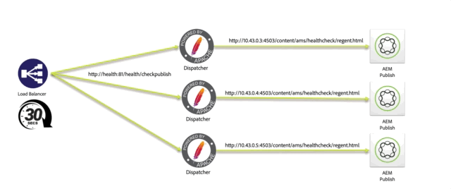
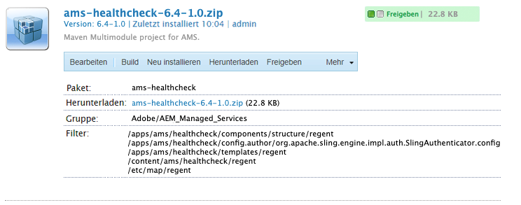

# AMS Dispatcher-Konsistenzprüfung

[Inhalt](./overview.md)

[&lt;- Zurück: Schreibgeschützte Dateien](./immutable-files.md)

Wenn Sie einen AMS-Grundlinien-Dispatcher installiert haben, wird dieser mit einigen Freebies geliefert.  Eine dieser Funktionen ist eine Reihe von Skripten zur Konsistenzprüfung.
Diese Skripte ermöglichen es dem Lastenausgleich, der den AEM Stack anzeigt, zu wissen, welche Beine gesund sind, und sie in Betrieb zu halten.



## Grundlegende Prüfung der Lastenausgleichsfähigkeit

Wenn Kunden-Traffic über das Internet zu Ihrer AEM-Instanz gelangt, durchlaufen sie einen Lastenausgleich


Jede Anfrage, die über den Lastenausgleich gesendet wird, rundet den Papierkorb auf jede Instanz.  Der Lastenausgleich verfügt über einen Gesundheitsüberprüfungsmechanismus, um sicherzustellen, dass er Traffic an einen gesunden Host sendet.

Die Standardprüfung ist normalerweise eine Port-Prüfung, um festzustellen, ob die im Lastenausgleich angesprochenen Server den Port-Traffic überwachen (d. h. TCP 80 und 443).

> `Note:` Während dies funktioniert, hat es keine wirkliche Anzeige, ob AEM gesund ist.  Es wird nur getestet, ob der Dispatcher (Apache-Webserver) aktiv ist.

## AMS-Konsistenzprüfung

Um zu vermeiden, dass Traffic an einen gesunden Dispatcher gesendet wird, der einer ungesunden AEM-Instanz gegenübersteht, hat AMS einige Extras erstellt, die die Gesundheit des Beins und nicht nur des Dispatchers bewerten.


Die Konsistenzprüfung umfasst die folgenden Bestandteile
- 1 `Load balancer`
- 1 `Apache web server`
- 3 `Apache *VirtualHost* config files`
- 5 `CGI-Bin scripts`
- 1 `AEM instance`
- 1 `AEM package`

Wir werden uns mit der Frage beschäftigen, was jedes Stück tun soll und wie wichtig es ist

### AEM Package

Um anzugeben, ob AEM funktioniert, benötigen Sie es, um eine einfache Seitenkompilierung durchzuführen und die Seite zu bedienen.  Adobe Managed Services hat ein Grundpaket erstellt, das die Testseite enthält.  Die Seite testet, dass das Repository eingerichtet ist und dass die Ressourcen und die Seitenvorlage gerendert werden können.



Hier ist die Seite.  Sie zeigt die Repository-ID der Installation an.


> `Note:` Wir stellen sicher, dass die Seite nicht zwischenspeicherbar ist.  Es würde den tatsächlichen Status nicht überprüfen, wenn jedes Mal eine zwischengespeicherte Seite zurückgegeben würde!

Dies ist der leichte Gewichtsendpunkt, den wir testen können, um festzustellen, ob AEM läuft.

### Load-Balancer-Konfiguration

Wir konfigurieren die Lastverteiler so, dass sie auf einen CGI-BIN-Endpunkt verweisen, anstatt eine Port-Prüfung zu verwenden.


### Apache Health Check Virtual Hosts

#### CGI-BIN Virtueller Host `(/etc/httpd/conf.d/available_vhosts/ams_health.vhost)`

Dies ist die `<VirtualHost>` Apache-Konfigurationsdatei, die die Ausführung der CGI-Bin-Dateien ermöglicht.

```
Listen 81
<VirtualHost *:81>
    ServerName	"health"
    ...SNIP...
    ScriptAlias /health/ "/var/www/cgi-bin/health/"
</VirtualHost>
```

> `Note:` cgi-bin-Dateien sind Skripte, die ausgeführt werden können.  Dies kann ein verletzlicher Angriffsvektor sein, und diese Skripte, die AMS verwendet, sind nicht öffentlich zugänglich, nur für den Lastenausgleich zum Testen verfügbar.


#### Nicht gesunde virtuelle Hosts zur Wartung

- `/etc/httpd/conf.d/available_vhosts/000_unhealthy_author.vhost`
- `/etc/httpd/conf.d/available_vhosts/000_unhealthy_publish.vhost`

Diese Dateien werden `000_` als Präfix.  Sie ist vorsätzlich so konfiguriert, dass sie denselben Domänennamen wie die Live-Site verwendet.  Diese Datei soll aktiviert werden, wenn die Konsistenzprüfung erkennt, dass ein Problem mit einem der AEM Backends vorliegt.  Geben Sie dann eine Fehlerseite an, anstatt nur einen 503-HTTP-Antwortcode ohne Seite anzubieten.  Sie stiehlt den Traffic von der normalen `.vhost` Datei, da sie zuvor geladen wurde `.vhost` Datei beim Freigeben derselben `ServerName` oder `ServerAlias`.  Dies führt dazu, dass Seiten, die für eine bestimmte Domäne bestimmt sind, zum ungesunden Host statt zum standardmäßigen gelangen, durch den der normale Traffic fließt.

Wenn die Konsistenzprüfungsskripte ausgeführt werden, melden sie ihren aktuellen Gesundheitsstatus ab.  Einmal pro Minute wird ein Cronjob auf dem Server ausgeführt, der nach nicht gesunden Einträgen im Protokoll sucht.  Wenn festgestellt wird, dass die Autoreninstanz nicht AEM ist, wird der Symlink aktiviert:

Protokolleintrag:

```
# grep "ERROR\|publish" /var/log/lb/health_check.log
E, [2022-11-23T20:13:54.984379 #26794] ERROR -- : AUTHOR -- Exception caught: Connection refused - connect(2)
I, [2022-11-23T20:13:54.984403 #26794]  INFO -- : [checkpublish]-author:0-publish:1-[checkpublish]
```

Sichern Sie den Fehler und reagieren Sie:

```
# grep symlink /var/log/lb/health_check_reload.log
I, [2022-11-23T20:34:19.213179 #2275]  INFO -- : ADDING VHOST symlink /etc/httpd/conf.d/available_vhosts/000_unhealthy_author.vhost => /etc/httpd/conf.d/enabled_vhosts/000_unhealthy_author.vhost
```

Sie können steuern, ob Autoren- oder veröffentlichte Sites diese Fehlerseite laden können, indem Sie die Neulademoduseinstellung in `/var/www/cgi-bin/health_check.conf`

```
# grep RELOAD_MODE /var/www/cgi-bin/health_check.conf
RELOAD_MODE='author'
```

Gültige Optionen:
- author
   - Dies ist die Standardoption.
   - Dadurch wird eine Wartungsseite für Autoren eingerichtet, wenn sie nicht gesund sind
- publish
   - Mit dieser Option wird eine Wartungsseite für Herausgeber eingerichtet, wenn sie nicht gesund ist
- alle
   - Mit dieser Option wird eine Wartungsseite für Autor, Herausgeber oder beides eingerichtet, wenn sie nicht gesund werden
- keine
   - Diese Option überspringt diese Funktion der Konsistenzprüfung

Wenn Sie sich die `VirtualHost` -Einstellung für diese werden Sie sehen, dass sie dasselbe Dokument als Fehlerseite für jede Anforderung laden, die bei Aktivierung kommt:

```
<VirtualHost *:80>
	ServerName	unhealthyauthor
	ServerAlias	${AUTHOR_DEFAULT_HOSTNAME}
	ErrorDocument	503 /error.html
	DocumentRoot	/mnt/var/www/default
	<Directory />
		Options FollowSymLinks
		AllowOverride None
	</Directory>
	<Directory "/mnt/var/www/default">
		AllowOverride None
		Require all granted
	</Directory>
	<IfModule mod_headers.c>
		Header always add X-Dispatcher ${DISP_ID}
		Header always add X-Vhost "unhealthy-author"
	</IfModule>
	<IfModule mod_rewrite.c>
		ReWriteEngine   on
		RewriteCond %{REQUEST_URI} !^/error.html$
		RewriteRule ^/* /error.html [R=503,L,NC]
	</IfModule>
</VirtualHost>
```

Der Antwort-Code ist weiterhin ein `HTTP 503`

```
# curl -I https://we-retail.com/
HTTP/1.1 503 Service Unavailable
X-Dispatcher: dispatcher1useast1
X-Vhost: unhealthy-author
```

Anstelle einer leeren Seite erhalten sie stattdessen diese Seite.


### CGI-Bin-Skripte

Es gibt fünf verschiedene Skripte, die von Ihrem CSE in den Lastenausgleichseinstellungen konfiguriert werden können und die das Verhalten oder die Kriterien ändern, wann ein Dispatcher aus dem Lastenausgleich gezogen werden soll.

#### /bin/checkauthor

Dieses Skript überprüft und protokolliert alle Instanzen, bei denen es frontiert ist, gibt jedoch nur einen Fehler zurück, wenn die `author` AEM Instanz ungesund

> `Note:` Beachten Sie, dass der Dispatcher im Dienst verbleibt, damit der Datenverkehr zur Autoreninstanz geleitet werden kann, wenn die AEM-Instanz ungesund ist.

#### /bin/checkpublish (Standard)

Dieses Skript überprüft und protokolliert alle Instanzen, bei denen es frontiert ist, gibt jedoch nur einen Fehler zurück, wenn die `publish` AEM Instanz ungesund

> `Note:` Beachten Sie, dass der Dispatcher im Dienst verbleibt, damit der Datenverkehr zur Veröffentlichungsinstanz geleitet werden kann, wenn die AEM nicht ordnungsgemäß ausgeführt wurde.

#### /bin/checkentweder

Dieses Skript überprüft und protokolliert alle Instanzen, bei denen es frontiert ist, gibt jedoch nur einen Fehler zurück, wenn die `author` oder `publisher` AEM Instanz ungesund

> `Note:` Beachten Sie, dass der Dispatcher den Dienst abruft, wenn entweder die Veröffentlichungsinstanz AEM oder AEM Autoreninstanz ungesund war.  Das heißt, wenn einer von ihnen gesund wäre, würde er auch keinen Traffic erhalten

#### /bin/checkboth

Dieses Skript überprüft und protokolliert alle Instanzen, bei denen es frontiert ist, gibt jedoch nur einen Fehler zurück, wenn die `author` und `publisher` AEM Instanz ungesund

> `Note:` Beachten Sie, dass der Dispatcher den Dienst nicht abruft, wenn die Veröffentlichungsinstanz AEM Autoreninstanz oder AEM nicht ordnungsgemäß war.  Wenn also einer von ihnen ungesund wäre, würde er weiterhin Traffic erhalten und den Personen Fehler machen, die Ressourcen anfordern.

#### /bin/Gesund

Dieses Skript überprüft und protokolliert alle Instanzen, bei denen es frontiert ist, gibt jedoch nur gesund zurück, unabhängig davon, ob AEM einen Fehler zurückgibt oder nicht.

> `Note:` Dieses Skript wird verwendet, wenn die Konsistenzprüfung nicht wie gewünscht funktioniert und eine Überschreibung ermöglicht, um AEM Instanzen im Lastenausgleich zu belassen.

[Weiter -> GIT-Symlinks](./git-symlinks.md)