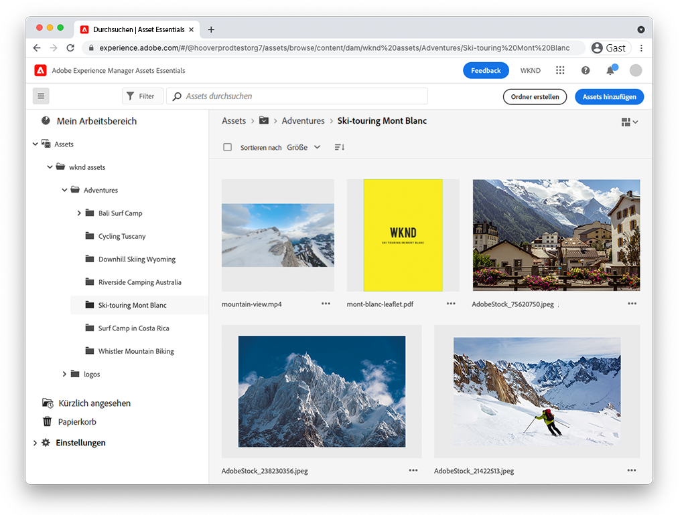

# Assets Essentials-Videos

Experience Manager Assets Essentials bietet eine optimierte Benutzeroberfläche für einfache Asset-Verwaltung und Zusammenarbeit.

Sehen Sie sich diese Videos an, wie Sie mit Assets Essentials Assets verwalten und wie Sie diese mit Adobe Journey einrichten können!

## Weitere Informationen zu Assets Essentials

<table>
<td>
   
   

      <a href="./basics/managing.md">
      <strong>Erste Schritte mit Assets Essentials</strong>
      </a>
   

   

      <em>Lernen Sie die Grundlagen von Assets Essentials kennen!</em>
   

</td>
<td>
   
   

      <a href="https://experienceleague.adobe.com/docs/experience-manager-assets-essentials/help/introduction.html">
      <strong>Assets Essentials-Dokumentation</strong>
      </a>
   

   

      <em>Sehen Sie sich die Assets Essentials-Produktdokumentation an!</em>
   

</td>
<td>
   
   

      <a href="https://experienceleague.adobe.com/docs/journey-optimizer-learn/tutorials/create-messages/create-email-content-with-the-message-editor.html">
      <strong>Adobe Journey Optimizer-Integration</strong>
      </a>
   

   

      <em>Erfahren Sie, wie Assets Essentials mit Adobe Journey Optimizer integriert wird.</em>
   

</td>
</table>
