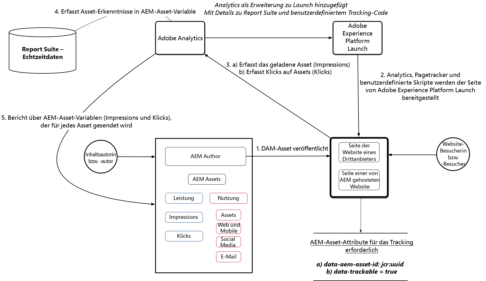

# Asset Insights mit AEM Assets und Adobe Experience Platform Launch einrichten

In dieser fünfteiligen Videoserie gehen wir durch die Einrichtung und Konfiguration von Asset Insights for Experience Manager, die über Adobe Launch bereitgestellt werden.

## Teil 1: Übersicht über Asset Insights {#overview}

Übersicht über Asset Insights Installieren Sie Kernkomponenten, Beispielbildkomponente und andere Inhaltspakete, um Ihre Umgebung fertig zu stellen.

>[!VIDEO](https://video.tv.adobe.com/v/25943/?quality=12&learn=on)

### Architekturdiagramm {#architecture-diagram}



>[!CAUTION]
>
>Laden Sie unbedingt die [aktuelle Version der Core-Komponenten](https://github.com/adobe/aem-core-wcm-components) für Ihre Implementierung herunter.

Das Video verwendet die Core-Komponenten v2.2.2, die nicht mehr die neueste Version sind. Achten Sie darauf, die neueste Version zu verwenden, bevor Sie mit dem nächsten Abschnitt fortfahren.

* [Asset Insights-Beispielbildinhalt](./assets/asset-insights-launch-tutorial/aem-assets-insights-sample.zip) herunterladen
* [die neuesten AEM WCM-Kernkomponenten](https://github.com/adobe/aem-core-wcm-components/releases) herunterladen

## Teil 2: Aktivieren der Verfolgung von Asset Insights für die Beispielbildkomponente {#sample-image-component-asset-insights}

Verbesserungen an Core-Komponenten und Verwendung der Proxykomponente (Beispielbildkomponente) für Asset Insights. Bearbeiten der Vorlagenrichtlinien für die Inhaltsseite, um die Beispielbildkomponente für die Referenz-Website zu aktivieren.

>[!VIDEO](https://video.tv.adobe.com/v/25944/?quality=12&learn=on)

>[!NOTE]
>
>Die Image-Core-Komponente bietet die Möglichkeit, die UUID-Verfolgung zu deaktivieren, indem die Verfolgung der UUID des Assets deaktiviert wird (eindeutiger Bezeichnerwert für einen in JCR erstellten Knoten).

Die Core-Image-Komponente verwendet das Attribut ***data-asset-id*** innerhalb des übergeordneten &lt;div> eines Image-Tags, um diese Funktion zu aktivieren/deaktivieren. Die Proxy-Komponente setzt die Kernkomponente mit den folgenden Änderungen außer Kraft.

* Entfernt die ***data-asset-id*** aus dem übergeordneten div eines &lt;img>-Elements in image.html
* Fügt ***data-aem-asset-id*** direkt zum &lt;img>-Element in image.html hinzu.
* Fügt dem &lt;img>-Element in image.html den Wert ***data-trackable=&#39;true&#39;*** hinzu.
* ***data-aem-asset-*** idand  ***data-trackable=&#39;true&#39;*** werden auf derselben Knotenebene gespeichert

>[!NOTE]
>
>*data-aem-asset-id=&#39;image.UUID&#39;* und  *data-trackable=&#39;true&#39;* sind die Schlüsselattribute, die für Asset-Impressionen vorhanden sein müssen. Bei Asset Click Insights muss das übergeordnete &lt;a>-Tag zusätzlich zu den oben genannten Datenattributen, die am &lt;img>-Tag vorhanden sind, einen gültigen href-Wert haben.

## Teil 3: Adobe Analytics — Erstellen von Report Suites, die die Echtzeit-Datenerfassung und den AEM Assets Berichte {#adobe-analytics-asset-insights} aktivieren

Für die Asset-Verfolgung wird eine Report Suite mit Echtzeit-Datenerfassung erstellt. Die AEM Assets Insights-Konfiguration wird mit Adobe Analytics-Anmeldeinformationen eingerichtet.

>[!VIDEO](https://video.tv.adobe.com/v/25945/?quality=12&learn=on)

>[!NOTE]
Die Echtzeit-Datenerfassung und AEM Asset Berichte müssen für Ihre Adobe Analytics Report Suite aktiviert werden. Durch Aktivierung AEM Asset Berichte werden Analysevariablen zur Verfolgung von Asset-Einblicken reserviert.

Für die AEM Assets Insights-Konfiguration benötigen Sie die folgenden Anmeldeinformationen:

* Rechenzentrum
* Name der Analytics-Firma
* Analytics-Benutzername
* Shared Secret (erhältlich unter *Adobe Analytics > Admin > Firma Settings > Web Service*).
* Report Suite (Achten Sie darauf, die richtige Report Suite auszuwählen, die für Asset Berichte verwendet wird)

## Teil 4: Verwenden von Adobe Experience Platform Launch zum Hinzufügen der Adobe Analytics-Erweiterung {#part-using-launch-by-adobe-for-adding-adobe-analytics-extension}

Hinzufügen von Adobe Analytics Extension, Erstellen von Seitenladeregeln und Integrieren von AEM mit dem technischen Konto der Adobe IMS.

>[!VIDEO](https://video.tv.adobe.com/v/25946/?quality=12&learn=on)

>[!NOTE]
Achten Sie darauf, alle Änderungen von der Autoreninstanz in die Veröffentlichungsinstanz zu replizieren.

### Artikel 1: Seitenverfolgung (pagetracker.js) {#rule-page-tracker-pagetracker-js}

```javascript
//For AEM 6.3
<script type="text/javascript" src="http://localhost:4503/etc/clientlibs/foundation/assetinsights/pagetracker.js"></script>
```

```javascript
//For AEM 6.4
<script type="text/javascript" src="http://localhost:4503/etc.clientlibs/dam/clientlibs/assetinsights/pagetracker.js"></script>
```

Seiten-Tracker implementiert zwei Rückrufe (registriert im Asset-Einbettungscode)

* **\&lt;code>assetAnalytics.core.assetLoaded\&lt;/code>** &lt;code>&lt;code>: aufgerufen, wenn das Ereignis &quot;load&quot;für das Element asset-DOM-Element ausgelöst wird.&lt;/code>&lt;/code>
* **\&lt;code>assetAnalytics.core.assetClicked\&lt;/code>** &lt;code>&lt;code>: aufgerufen, wenn das Ereignis &quot;click&quot;für das Element asset-DOM-Element ausgelöst wird, ist dies nur relevant, wenn das Element asset-DOM-element ein Anker-Tag als übergeordnetes Element mit einem gültigen, externen Attribut &quot;href&quot;hat&lt;/code>&lt;/code>

Schließlich implementiert Pagetracker eine Initialisierungsfunktion wie folgt:

* **\&lt;code>assetAnalytics.dispatcher.init()\&lt;/code>** &lt;code>&lt;code>: aufgerufen, um die Pagetracker-Komponente zu initialisieren.&lt;/code>&lt;/code> Diese MUSS aufgerufen werden, bevor eines der Asset-Insight-Ereignis (Impressionen und/oder Klicks) von der Webseite generiert wird.
* **\&lt;code>assetAnalytics.dispatcher.init()\&lt;/code>** &lt;code>&lt;code>: optional ein AppMeasurement-Objekt — sofern vorhanden, wird nicht versucht, eine neue Instanz des AppMeasurement-Objekts zu erstellen.&lt;/code>&lt;/code>

### Regel 2: Bildverfolgung — Aktion 1 (asset-insights.js) {#rule-image-tracker-action-asset-insights-js}

```javascript
/*
 * AEM Asset Insights
 */

var sObj = window.s;
_satellite.notify('in assetAnalytics customInit');
(function initializeAssetAnalytics() {
 if ((!!window.assetAnalytics) && (!!assetAnalytics.dispatcher)) {
 _satellite.notify('assetAnalytics ready');
 /** NOTE:
  Copy over the call to 'assetAnalytics.dispatcher.init()' from Assets Pagetracker
  Be mindful about changing the AppMeasurement object as retrieved above.
  */
 assetAnalytics.dispatcher.init(
                                "",  /** RSID to send tracking-call to */
                                "",  /** Tracking Server to send tracking-call to */
                                "",  /** Visitor Namespace to send tracking-call to */
                                "",  /** listVar to put comma-separated-list of Asset IDs for Asset Impression Events in tracking-call, e.g. 'listVar1' */
                                "",  /** eVar to put Asset ID for Asset Click Events in, e.g. 'eVar3' */
                                "",  /** event to include in tracking-calls for Asset Impression Events, e.g. 'event8' */
                                "",  /** event to include in tracking-calls for Asset Click Events, e.g. 'event7' */
                                sObj  /** [OPTIONAL] if the webpage already has an AppMeasurement object, please include the object here. If unspecified, Pagetracker Core shall create its own AppMeasurement object */
                                );
 sObj.usePlugins = true;
 sObj.doPlugins = assetAnalytics.core.updateContextData;
}
 else {
 _satellite.notify('assetAnalytics not available. Consider updating the Custom Page Code', 4);
 }
})();
```

### Regel 2: Bildverfolgung — Aktion 2 (image-tracker.js) {#rule-image-tracker-action-image-tracker-js}

```javascript
/*
 * AEM Asset Insights
 */

document.querySelectorAll('[data-aem-asset-id]').forEach(function(element) {
    assetAnalytics.core.assetLoaded(element);
    var parent = element.parentElement;
    if (parent.nodeName == "A") {
        parent.addEventListener("click", function() {
            assetAnalytics.core.assetClicked(this)
        });
    }
});
```

* assetAnalytics.core.assetLoaded() : wird beim Abschluss des Seitenladevorgangs aufgerufen und löst Asset-Impressionen für alle nachverfolgbaren Bilder aus.
* Analytics-Variable, die die geladene Asset-Liste enthält: **contextData[&#39;c.a.assets.idList&#39;]**
* assetAnalytics.core.assetClicked() : wird aufgerufen, wenn das Asset-DOM-Element über ein Verankerungs-Tag mit einem gültigen href-Wert verfügt. Wenn auf ein Asset geklickt wird, wird ein Cookie mit der angeklickten Asset-ID als Wert erstellt.**(Cookie-Name: a.assets.clickedid)**
* Analytics-Variable, die die geladene Asset-Liste enthält: **contextData[&#39;c.a.assets.clickedid&#39;]**
* Quelle der Herkunft: **contextData[&#39;c.a.assets.source&#39;]**

### Konsolen-Debug-Anweisungen {#console-debug-statements}

```javascript
//Launch Build Info
_satellite.buildInfo

//Enables debug messages
_satellite.setDebug(true);

//Asset Insight JS Object
assetAnalytics

//List of trackable images
document.querySelectorAll(".cmp-image__image");
```

Im Video werden zwei Google Chrome-Browsererweiterungen als Möglichkeiten zum Debugging von Analytics referenziert. Ähnliche Erweiterungen sind auch für andere Browser verfügbar.

* [Switch Chrome Extension starten](https://chrome.google.com/webstore/detail/launch-and-dtm-switch/nlgdemkdapolikbjimjajpmonpbpmipk?hl=en)
* [Adobe Experience Cloud Debugger](https://chrome.google.com/webstore/detail/adobe-experience-cloud-de/ocdmogmohccmeicdhlhhgepeaijenapj?hl=en)

Mit der folgenden Chrome-Erweiterung ist es auch möglich, DTM in den Debug-Modus umzuschalten: [Launch and DTM Switch](https://chrome.google.com/webstore/detail/launch-and-dtm-switch/nlgdemkdapolikbjimjajpmonpbpmipk?hl=en). Auf diese Weise können Sie leichter erkennen, ob Fehler bei der DTM-Bereitstellung vorliegen. Darüber hinaus können Sie DTM über alle Browser *Developer Tools -> JS Console* manuell in den Debug-Modus umschalten, indem Sie das folgende Codefragment hinzufügen:

## Teil 5: Testen der Analytischen Verfolgung und Synchronisierung von Insight-Daten{#analytics-tracking-asset-insights}

Konfigurieren AEM Asset Berichte-Synchronisierungsauftrags- und Asset Insights-Berichts

>[!VIDEO](https://video.tv.adobe.com/v/25947/?quality=12&learn=on)
