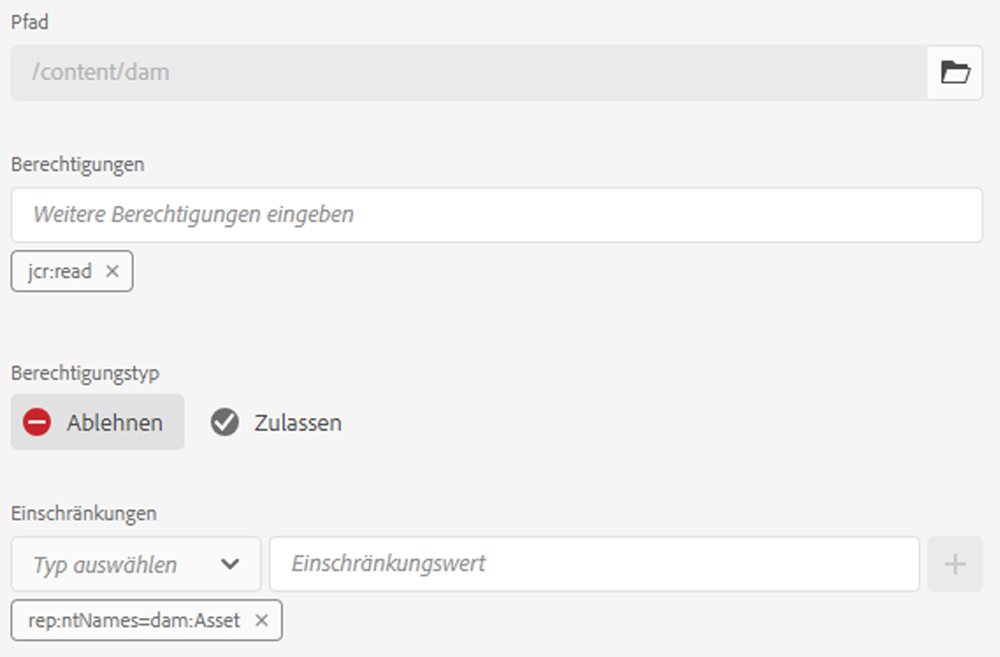
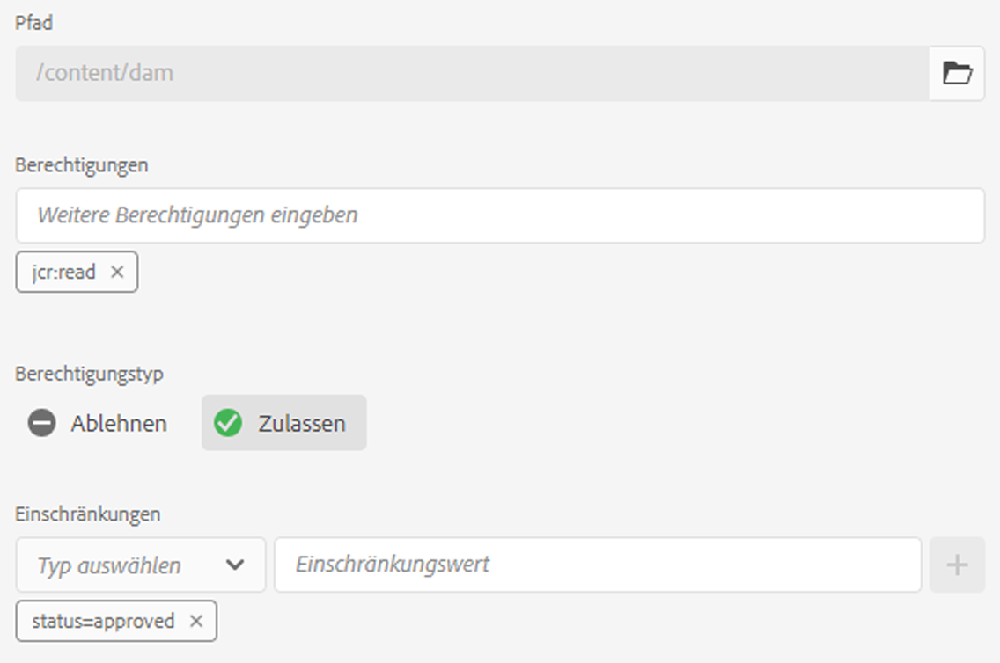
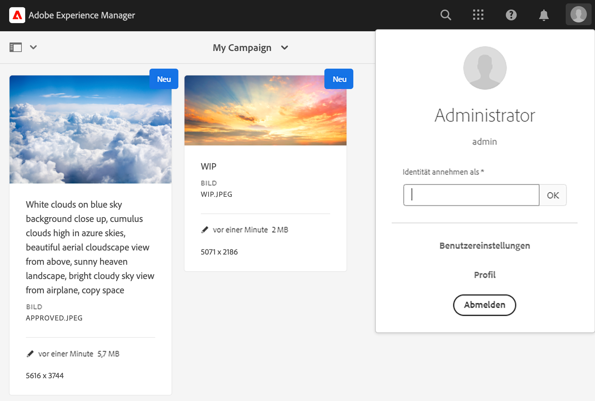
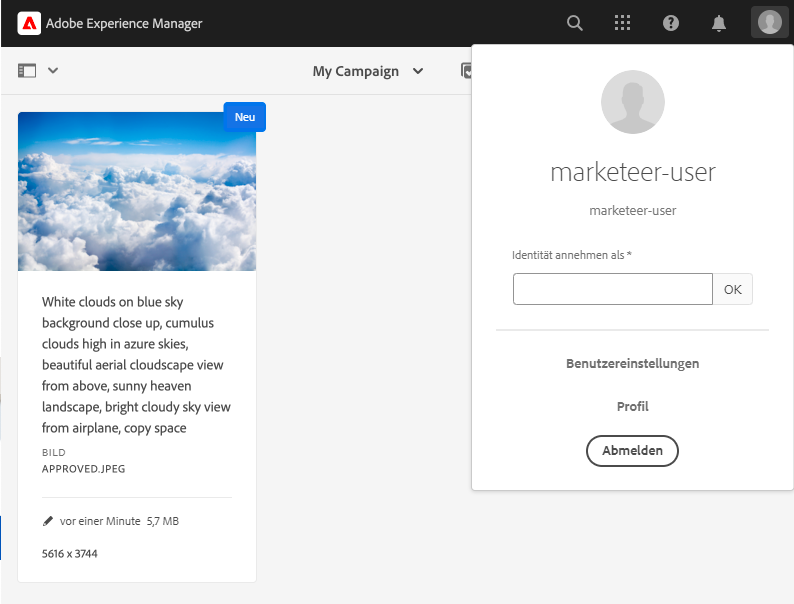
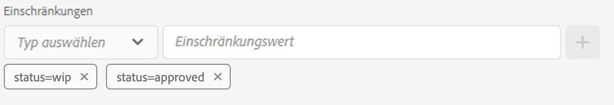
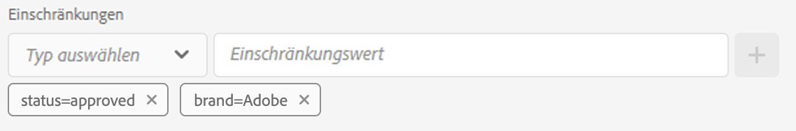
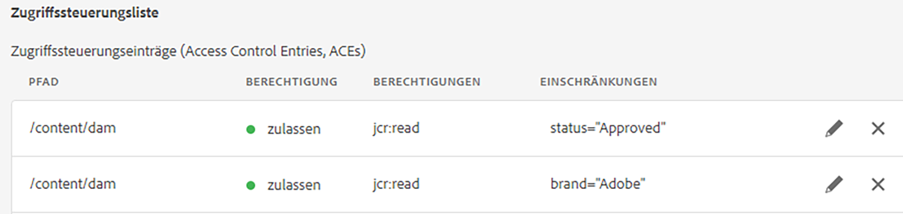

# Metadatengesteuerte Berechtigungen{#metadata-driven-permissions}

Metadatengesteuerte Berechtigungen sind eine Funktion, mit der Zugriffssteuerungsentscheidungen in der AEM Assets-Autoreninstanz auf Asset-Inhalten oder Metadateneigenschaften anstatt auf der Ordnerstruktur basieren können. Mit dieser Funktion können Sie Zugriffssteuerungsrichtlinien definieren, die Attribute wie den Asset-Status, den Typ oder jede von Ihnen definierte benutzerdefinierte Eigenschaft auswerten.

Sehen wir uns ein Beispiel an. Kreative laden ihre Arbeit in AEM Assets in den Ordner hoch, der mit der Kampagne in Verbindung steht. Möglicherweise handelt es sich um ein laufendes Asset, das noch nicht zur Verwendung freigegeben wurde. Wir möchten sicherstellen, dass Marketing-Fachkräfte nur genehmigte Assets für diese Kampagne sehen. Wir können eine Metadateneigenschaft verwenden, um anzugeben, dass ein Asset genehmigt wurde und von den Marketing-Fachleuten verwendet werden kann.

## Funktionsweise

Die Aktivierung metadatengesteuerter Berechtigungen umfasst die Definition, welche Asset-Inhalte oder Metadateneigenschaften Zugriffsbeschränkungen wie „Status“ oder „Marke“ fördern. Diese Eigenschaften können dann verwendet werden, um Zugriffssteuerungseinträge zu erstellen, die angeben, welche Benutzergruppen Zugriff auf Assets mit bestimmten Eigenschaftswerten haben.

## Voraussetzungen

Der Zugriff auf eine AEM as a Cloud Service-Umgebung, die auf die neueste Version aktualisiert wurde, ist erforderlich, um metadatengesteuerte Berechtigungen einzurichten.

## OSGi-Konfiguration {#configure-permissionable-properties}

Um metadatengesteuerte Berechtigungen zu implementieren, müssen Entwicklerinnen und Entwickler eine OSGi-Konfiguration für AEM as a Cloud Service bereitstellen, die bestimmte Asset-Inhalte oder Metadateneigenschaften für metadatengesteuerte Berechtigungen aktiviert.

1. Legen Sie fest, welche Asset-Inhalte oder Metadateneigenschaften für die Zugriffssteuerung verwendet werden. Die Eigenschaftsnamen sind die JCR-Eigenschaftsnamen in der `jcr:content` oder `jcr:content/metadata` Ressource des Assets. In unserem Fall handelt es sich um eine Eigenschaft namens `status`.
1. Erstellen Sie eine OSGi-Konfiguration `com.adobe.cq.dam.assetmetadatarestrictionprovider.impl.DefaultRestrictionProviderConfiguration.cfg.json` in Ihrem AEM Maven-Projekt.
1. Fügen Sie folgenden JSON-Inhalt in die erstellte Datei ein:

   ```json
   {
     "restrictionPropertyNames":[
       "status",
       "brand"
     ],
     "restrictionContentPropertyNames":[],
     "enabled":true
   }
   ```

1. Ersetzen Sie die Eigenschaftsnamen durch die erforderlichen Werte.  Die `restrictionContentPropertyNames` Konfigurationseigenschaft wird verwendet, um Berechtigungen für `jcr:content` Ressourceneigenschaften zu aktivieren, während die `restrictionPropertyNames` Konfigurationseigenschaft Berechtigungen für `jcr:content/metadata` Ressourceneigenschaften für Assets aktiviert.

## Zurücksetzen der grundlegenden Asset-Berechtigungen

Bevor Sie einschränkungsbasierte Zugriffssteuerungseinträge hinzufügen, sollte ein neuer Eintrag auf oberster Ebene hinzugefügt werden, um zunächst den Lesezugriff für alle Gruppen zu verweigern, die einer Auswertung der Berechtigungen für Assets unterliegen (z. B. „Mitwirkende“ oder ähnlich):

1. Navigieren Sie zum Bildschirm __Tools → Sicherheit → Berechtigungen__.
1. Wählen Sie die Gruppe __Mitwirkende__ aus (oder eine andere benutzerdefinierte Gruppe, zu der alle Benutzergruppen gehören).
1. Klicken Sie oben rechts im Bildschirm auf __ACE hinzufügen__.
1. Wählen Sie `/content/dam` als __Pfad__ aus.
1. Geben Sie `jcr:read` für __Berechtigungen__ ein.
1. Wählen Sie `Deny` als __Berechtigungstyp__ aus.
1. Wählen Sie unter „Einschränkungen“ `rep:ntNames` aus und geben Sie dann `dam:Asset`als __Einschränkungswert__ ein.
1. Klicken Sie auf __Speichern__.



## Gewähren von Zugriff auf Assets über Metadaten

Es können jetzt Zugriffssteuerungseinträge hinzugefügt werden, um Benutzergruppen Lesezugriff auf der Grundlage von [konfigurierten Asset-Metadateneigenschaftswerten](#configure-permissionable-properties) zu gewähren.

1. Navigieren Sie zum Bildschirm __Tools → Sicherheit → Berechtigungen__.
1. Wählen Sie die Benutzergruppen aus, denen Zugriff auf die Assets gewährt werden soll.
1. Klicken Sie oben rechts im Bildschirm auf __ACE hinzufügen__.
1. Wählen Sie `/content/dam` (oder einen Unterordner) als __Pfad__ aus.
1. Geben Sie `jcr:read` für __Berechtigungen__ ein.
1. Wählen Sie `Allow` als __Berechtigungstyp__ aus.
1. Wählen Sie unter __Einschränkungen__ einen der [konfigurierten Asset-Metadateneigenschaftsnamen in der OSGi-Konfiguration](#configure-permissionable-properties) aus.
1. Geben Sie den erforderlichen Metadateneigenschaftswert in das Feld __Einschränkungswert__ ein.
1. Klicken Sie auf das Symbol __+__. um die Einschränkung zum Zugriffssteuerungseintrag hinzuzufügen.
1. Klicken Sie auf __Speichern__.



## Wirksame metadatengesteuerte Berechtigungen

Beispielordner enthält einige Assets.



Sobald Sie die Berechtigungen konfiguriert und die Metadateneigenschaften des Assets entsprechend festgelegt haben, sehen Benutzer (in unserem Fall Marketer-Benutzer) nur genehmigte Assets.



## Vorteile und Überlegungen

Zu den Vorteilen von metadatengesteuerten Berechtigungen gehören:

- Präzise Kontrolle über den Asset-Zugriff basierend auf bestimmten Attributen.
- Entkopplung von Richtlinien zur Zugriffssteuerung von der Ordnerstruktur, wodurch eine flexiblere Asset-Organisation möglich ist.
- Möglichkeit, komplexe Zugriffssteuerungsregeln basierend auf mehreren Inhalts- oder Metadateneigenschaften zu definieren.

>[!NOTE]
>
> Beachten Sie Folgendes:
> 
> - Eigenschaften werden anhand der Einschränkungen mithilfe von __Zeichenfolgengleichheit__ (`=`) ausgewertet (andere Datentypen oder Operatoren werden noch nicht unterstützt, bei Eigenschaften für größer als (`>`) oder Datum)
> - Um mehrere Werte für eine Einschränkungseigenschaft zuzulassen, können dem Zugriffssteuerungseintrag zusätzliche Einschränkungen hinzugefügt werden, indem Sie dieselbe Eigenschaft aus der Dropdown-Liste „Typ auswählen“ auswählen und einen neuen Beschränkungswert eingeben (z B. `status=approved`, `status=wip`) und auf „+“ klicken, um die Einschränkung zum Eintrag hinzuzufügen
> 
> - __UND-Einschränken__ werden mittels mehrerer Einschränkungen in einem einzelnen Zugriffssteuerungseintrag mit verschiedenen Eigenschaftsnamen (z. B. `status=approved`, `brand=Adobe`) unterstützt und als UND-Bedingung ausgewertet, d. h. die ausgewählte Benutzergruppe erhält Lesezugriff auf Assets mit `status=approved AND brand=Adobe`
> 
> - __ODER-Einschränkungen__ werden durch Hinzufügen eines neuen Zugriffssteuerungseintrags mit einer Metadaten-Eigenschaftsbeschränkung beschränkt, die eine ODER-Bedingung für die Einträge festgelegt, z. B. wird ein einzelner Eintrag mit Einschränkungen `status=approved` und ein einzelner Eintrag mit `brand=Adobe` als `status=approved OR brand=Adobe` bewertet
> 
