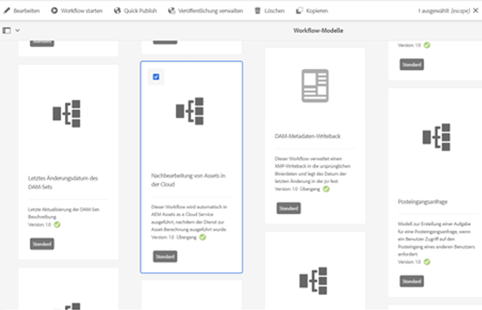
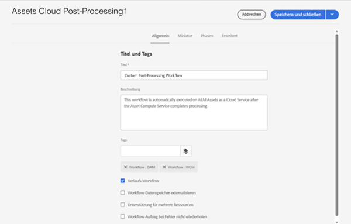
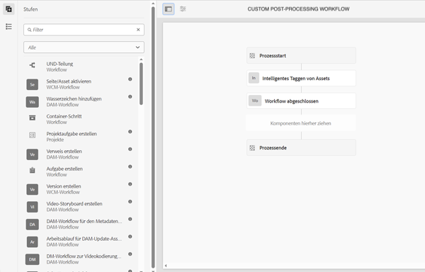
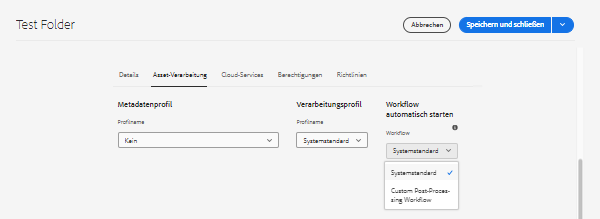

# Automatisch startende Workflows

Automatisch startende Workflows erweitern die Asset-Verarbeitung in AEM as a Cloud Service, indem beim Hochladen oder erneuten Verarbeiten automatisch ein benutzerdefinierter Workflow aufgerufen wird, sobald die Asset-Verarbeitung abgeschlossen ist.

>[!VIDEO](https://video.tv.adobe.com/v/37323?quality=12&learn=on)

>[!NOTE]
>
>Verwenden Sie automatisch startende Workflows, um die Nachbearbeitung von Assets anzupassen, anstatt Workflow-Starter zu verwenden. Automatisch startende Workflows werden _nur_ aufgerufen, wenn die Verarbeitung eines Assets abgeschlossen ist. Im Gegensatz dazu können Starter während der Asset-Verarbeitung mehrmals aufgerufen werden.

## Anpassen des Nachbearbeitungs-Workflows

Um den Nachbearbeitungs-Workflow anzupassen, kopieren Sie das standardmäßige [Workflow-Modell](../../foundation/workflow/use-the-workflow-editor.md) „Assets Cloud- Nachbearbeitung“.

1. Starten Sie im Bildschirm „Workflow-Modelle“, indem Sie zu _Tools_ > _Workflow_ > _Modelle_ navigieren.
2. Suchen Sie das Workflow-Modell  _Assets Cloud-Nachbearbeitung_ und wählen Sie es aus.
   
3. Wählen Sie die Schaltfläche _Kopieren_ aus, um Ihren eigenen benutzerdefinierten Workflow zu erstellen.
4. Wählen Sie jetzt Ihr Workflow-Modell (namens _Assets Cloud-Nachbearbeitung1_) aus und klicken Sie auf die Schaltfläche _Bearbeiten_, um den Workflow zu bearbeiten.
5. Geben Sie über die Workflow-Eigenschaften Ihrem benutzerdefinierten Nachbearbeitungs-Workflow einen aussagekräftigen Namen. 
   
6. Fügen Sie die Schritte hinzu, um Ihre Geschäftsanforderungen zu erfüllen. Fügen Sie in diesem Fall eine Aufgabe hinzu, wenn die Verarbeitung der Assets abgeschlossen ist. Stellen Sie sicher, dass der letzte Workflow-Schritt immer _Workflow abgeschlossen_ lautet. 
   

   >[!NOTE]
   >
   >Automatisch startende Workflows werden bei jedem Hochladen oder erneuten Verarbeiten von Assets ausgeführt. Denken Sie daher sorgfältig über die Skalierungsauswirkungen von Workflow-Schritten nach. Dies gilt insbesondere bei Massenvorgängen wie [Massenimporten](../../cloud-service/migration/bulk-import.md) oder Migrationen.

7. Wählen Sie die Schaltfläche _Synchronisieren_ aus, um Ihre Änderungen zu speichern und das Workflow-Modell zu synchronisieren.

## Verwenden eines benutzerdefinierten Nachbearbeitungs-Workflows

Die benutzerdefinierte Nachbearbeitung wird für Ordner konfiguriert. So konfigurieren Sie einen benutzerdefinierten Nachbearbeitungs-Workflow für einen Ordner:

1. Wählen Sie den Ordner aus, für den der Workflow konfiguriert werden soll, und bearbeiten Sie die Ordnereigenschaften.
2. Wechseln Sie zur Registerkarte _Asset-Verarbeitung_.
3. Wählen Sie Ihren benutzerdefinierten Nachbearbeitungs-Workflow im Auswahlfeld _Automatisch startender Workflow_ aus. 
   
4. Speichern Sie Ihre Änderungen.

Jetzt wird Ihr benutzerdefinierter Nachbearbeitungs-Workflow für alle Assets ausgeführt, die unter diesem Ordner hochgeladen oder erneut verarbeitet wurden.
