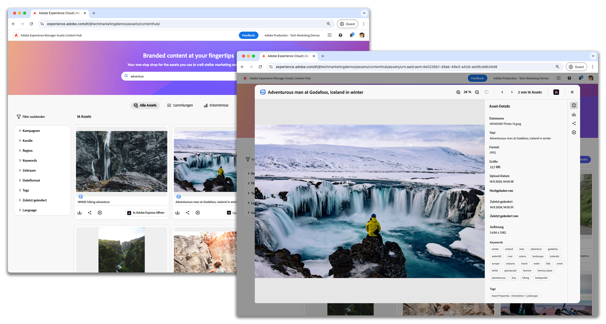

# Content-Hub von AEM Assets

{align=center}

Erfahren Sie, wie Sie Assets hochladen, Tags anwenden und wie der Genehmigungs-Workflow im Content-Hub von Adobe Experience Manager Assets as a Cloud Service abläuft.

## Content-Hub-Videos

Diese Videoreihe behandelt alles, was Sie für eine effektive Arbeit mit dem Content-Hub von AEM Assets benötigen. Jedes Video bietet klare Anleitungen und praktische Tipps, wie Sie Assets verwalten und mit Ihrem Team zusammenarbeiten können, um den Content-Hub von AEM Assets in Ihrer täglichen Arbeit optimal zu nutzen.

<!-- CARDS

* https://experienceleague.adobe.com/en/docs/experience-manager-learn/assets/content-hub/set-up {title = Set up}
* https://experienceleague.adobe.com/en/docs/experience-manager-learn/assets/content-hub/configure {title = Configure}
* https://experienceleague.adobe.com/en/docs/experience-manager-learn/assets/content-hub/add-assets {title = Add assets}
* https://experienceleague.adobe.com/en/docs/experience-manager-learn/assets/content-hub/download-assets {title = Download assets}
* https://experienceleague.adobe.com/en/docs/experience-manager-learn/assets/content-hub/image-variants {title = Create image variants}
* https://experienceleague.adobe.com/en/docs/experience-manager-learn/assets/content-hub/collections {title = Collections}
* https://experienceleague.adobe.com/en/docs/experience-manager-learn/assets/content-hub/share {title = Sharing}

-->
<!-- START CARDS HTML - DO NOT MODIFY BY HAND -->

    

        

            

                <figure class="image x-is-16by9">
                    
                </figure>
            

            

                

                    

                        <a href="https://experienceleague.adobe.com/de/docs/experience-manager-learn/assets/content-hub/set-up" target="_blank" rel="referrer" title="Setup">Setup</a>
                    

                    
Erfahren Sie, wie Sie den Content-Hub von Adobe Experience Manager Assets in AEM as a Cloud Service einrichten.

                

                <a href="https://experienceleague.adobe.com/de/docs/experience-manager-learn/assets/content-hub/set-up" target="_blank" rel="referrer" class="spectrum-Button spectrum-Button--outline spectrum-Button--primary spectrum-Button--sizeM" style="align-self: flex-start; margin-top: 1rem;">
Ansehen
</a>
            

        

    

    

        

            

                <figure class="image x-is-16by9">
                    
                </figure>
            

            

                

                    

                        <a href="https://experienceleague.adobe.com/de/docs/experience-manager-learn/assets/content-hub/configure" target="_blank" rel="referrer" title="Konfigurieren">Konfigurieren</a>
                    

                    
Erfahren Sie, wie Sie auf den verfügbaren Registerkarten navigieren und die Konfigurationsoptionen an die Anforderungen Ihres Unternehmens anpassen können.

                

                <a href="https://experienceleague.adobe.com/de/docs/experience-manager-learn/assets/content-hub/configure" target="_blank" rel="referrer" class="spectrum-Button spectrum-Button--outline spectrum-Button--primary spectrum-Button--sizeM" style="align-self: flex-start; margin-top: 1rem;">
Ansehen
</a>
            

        

    

    

        

            

                <figure class="image x-is-16by9">
                    
                </figure>
            

            

                

                    

                        <a href="https://experienceleague.adobe.com/de/docs/experience-manager-learn/assets/content-hub/add-assets" target="_blank" rel="referrer" title="Hinzufügen von Assets">Hinzufügen von Assets</a>
                    

                    
Erfahren Sie, wie Sie im Content-Hub von Adobe Experience Manager Assets Assets hochladen sowie Tags anwenden und machen Sie sich mit dem Genehmigungs-Workflow vertraut.

                

                <a href="https://experienceleague.adobe.com/de/docs/experience-manager-learn/assets/content-hub/add-assets" target="_blank" rel="referrer" class="spectrum-Button spectrum-Button--outline spectrum-Button--primary spectrum-Button--sizeM" style="align-self: flex-start; margin-top: 1rem;">
Mehr erfahren
</a>
            

        

    

    

        

            

                <figure class="image x-is-16by9">
                    
                </figure>
            

            

                

                    

                        <a href="https://experienceleague.adobe.com/de/docs/experience-manager-learn/assets/content-hub/download-assets" target="_blank" rel="referrer" title="Herunterladen von Assets">Herunterladen von Assets</a>
                    

                    
Erfahren Sie, wie Sie im Content-Hub von Adobe Experience Manager Assets navigieren, nach Assets suchen, die Assets filtern und diese herunterladen können.

                

                <a href="https://experienceleague.adobe.com/de/docs/experience-manager-learn/assets/content-hub/download-assets" target="_blank" rel="referrer" class="spectrum-Button spectrum-Button--outline spectrum-Button--primary spectrum-Button--sizeM" style="align-self: flex-start; margin-top: 1rem;">
Ansehen
</a>
            

        

    

    

        

            

                <figure class="image x-is-16by9">
                    
                </figure>
            

            

                

                    

                        <a href="https://experienceleague.adobe.com/de/docs/experience-manager-learn/assets/content-hub/image-variants" target="_blank" rel="referrer" title="Erstellen von Bildvarianten">Erstellen von Bildvarianten</a>
                    

                    
Erfahren Sie, wie Sie mit Adobe Express im Content-Hub von Experience Manager Assets Bildvarianten erstellen und bearbeiten.

                

                <a href="https://experienceleague.adobe.com/de/docs/experience-manager-learn/assets/content-hub/image-variants" target="_blank" rel="referrer" class="spectrum-Button spectrum-Button--outline spectrum-Button--primary spectrum-Button--sizeM" style="align-self: flex-start; margin-top: 1rem;">
Ansehen
</a>
            

        

    

    

        

            

                <figure class="image x-is-16by9">
                    
                </figure>
            

            

                

                    

                        <a href="https://experienceleague.adobe.com/de/docs/experience-manager-learn/assets/content-hub/collections" target="_blank" rel="referrer" title="Sammlungen">Sammlungen</a>
                    

                    
Erfahren Sie, wie Sie Sammlungen im Content-Hub von AEM Assets erstellen und verwenden können, um den Asset-Zugriff zu optimieren und die gemeinsame Nutzung von Ressourcen zu fördern, damit eine effiziente und gut organisierte Team-Arbeit in verschiedenen Projekten gewährleistet wird.

                

                <a href="https://experienceleague.adobe.com/de/docs/experience-manager-learn/assets/content-hub/collections" target="_blank" rel="referrer" class="spectrum-Button spectrum-Button--outline spectrum-Button--primary spectrum-Button--sizeM" style="align-self: flex-start; margin-top: 1rem;">
Ansehen
</a>
            

        

    

    

        

            

                <figure class="image x-is-16by9">
                    
                </figure>
            

            

                

                    

                        <a href="https://experienceleague.adobe.com/de/docs/experience-manager-learn/assets/content-hub/share" target="_blank" rel="referrer" title="Freigabe">Freigabe</a>
                    

                    
Erfahren Sie, wie Sie Assets und Sammlungen für Team-Mitglieder im Content-Hub von AEM Assets freigeben und so eine effektive Team-Arbeit und die sichere Asset-Freigabe fördern.

                

                <a href="https://experienceleague.adobe.com/de/docs/experience-manager-learn/assets/content-hub/share" target="_blank" rel="referrer" class="spectrum-Button spectrum-Button--outline spectrum-Button--primary spectrum-Button--sizeM" style="align-self: flex-start; margin-top: 1rem;">
Ansehen
</a>
            

        

    

<!-- END CARDS HTML - DO NOT MODIFY BY HAND -->

## Content-Hub-Dokumentation

Lesen Sie die Produktdokumentation zum Content-Hub, um mehr über den Content-Hub von AEM Assets zu erfahren und die Funktionen vollständig nutzen zu können. Diese Ressourcen enthalten ausführliche Anleitungen zur Verwendung der Funktionen, um sicherzustellen, dass Sie die notwendige Unterstützung für ein effizientes Asset-Management erhalten.

<!-- CARDS

* https://experienceleague.adobe.com/en/docs/experience-manager-cloud-service/content/assets/content-hub/product-overview {title=Content Hub documentation} {description=This documentation serves as your entry point to learn about Content Hub's key benefits, access methods, and how to provide feedback on the available options.}
* https://experienceleague.adobe.com/en/docs/experience-manager-cloud-service/content/assets/content-hub/deploy-content-hub {description=Learn how to deploy and activate Content Hub, providing users with various privileges, including asset uploads and administrator access.}
* https://experienceleague.adobe.com/en/docs/experience-manager-cloud-service/content/assets/content-hub/frequently-asked-questions-content-hub {title = Content Hub FAQs}

-->
<!-- START CARDS HTML - DO NOT MODIFY BY HAND -->

    

        

            

                <figure class="image x-is-16by9">
                    
                </figure>
            

            

                

                    

                        <a href="https://experienceleague.adobe.com/de/docs/experience-manager-cloud-service/content/assets/content-hub/product-overview" target="_blank" rel="referrer" title="Content-Hub-Dokumentation">Content-Hub-Dokumentation</a>
                    

                    
Diese Dokumentation dient als Einstiegspunkt, um mehr über die wichtigsten Vorteile von Content Hub, die Zugriffsmethoden und das Feedback zu den verfügbaren Optionen zu erfahren.

                

                <a href="https://experienceleague.adobe.com/de/docs/experience-manager-cloud-service/content/assets/content-hub/product-overview" target="_blank" rel="referrer" class="spectrum-Button spectrum-Button--outline spectrum-Button--primary spectrum-Button--sizeM" style="align-self: flex-start; margin-top: 1rem;">
Mehr erfahren
</a>
            

        

    

    

        

            

                <figure class="image x-is-16by9">
                    
                </figure>
            

            

                

                    

                        <a href="https://experienceleague.adobe.com/de/docs/experience-manager-cloud-service/content/assets/content-hub/deploy-content-hub" target="_blank" rel="referrer" title="Bereitstellen von Content-Hub">Bereitstellen von Content-Hub</a>
                    

                    
Erfahren Sie, wie Sie Content Hub bereitstellen und aktivieren und Benutzenden verschiedene Berechtigungen zuweisen, darunter das Hochladen von Assets und der Admin-Zugriff.

                

                <a href="https://experienceleague.adobe.com/de/docs/experience-manager-cloud-service/content/assets/content-hub/deploy-content-hub" target="_blank" rel="referrer" class="spectrum-Button spectrum-Button--outline spectrum-Button--primary spectrum-Button--sizeM" style="align-self: flex-start; margin-top: 1rem;">
Mehr erfahren
</a>
            

        

    

    

        

            

                <figure class="image x-is-16by9">
                    
                </figure>
            

            

                

                    

                        <a href="https://experienceleague.adobe.com/de/docs/experience-manager-cloud-service/content/assets/content-hub/frequently-asked-questions-content-hub" target="_blank" rel="referrer" title="Häufig gestellte Fragen zum Content-Hub">Häufig gestellte Fragen zum Content-Hub</a>
                    

                    
Hier erhalten Sie Antworten auf einige der am häufigsten gestellten Fragen (FAQs) zum Content-Hub.

                

                <a href="https://experienceleague.adobe.com/de/docs/experience-manager-cloud-service/content/assets/content-hub/frequently-asked-questions-content-hub" target="_blank" rel="referrer" class="spectrum-Button spectrum-Button--outline spectrum-Button--primary spectrum-Button--sizeM" style="align-self: flex-start; margin-top: 1rem;">
Mehr erfahren
</a>
            

        

    

<!-- END CARDS HTML - DO NOT MODIFY BY HAND -->

 
 
