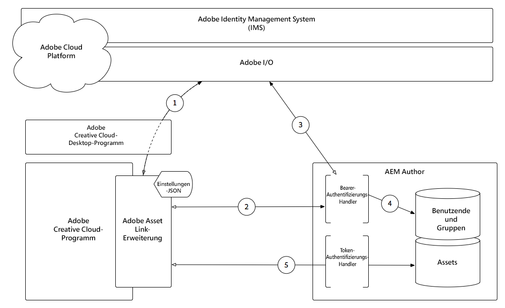

# Verwenden der Adobe Asset Link Extension mit AEM Assets{#using-adobe-asset-link-extension-with-aem-assets}

Adobe Experience Manager-Assets können jetzt von Designern und Kreativanwendern in ihren bevorzugten Adobe Creative Cloud-Desktop-Anwendungen verwendet werden. Adobe Asset Link Extension for Adobe Creative Cloud Enterprise erweitert die Funktionalität zum Suchen und Durchsuchen, Sortieren, Vorschau, Hochladen von Assets, Auschecken, Ändern, Einchecken und Ansicht von Metadaten von AEM Assets in Creative Cloud-Tools wie Adobe Photoshop, InDesign und Illustrator.

## Adobe Asset Link 1.1

Adobe Asset Link v1.1 bietet jetzt InDesign-Unterstützung für direkte Verknüpfungen zwischen Adobe Asset Link und AEM Assets. Mit der InDesign-Unterstützung für die direkte Verknüpfung können Sie jetzt über das Bedienfeld &quot;Asset-Verknüpfung&quot;digitale Assets aus AEM Assets platzieren (Verknüpfen oder Kopieren platzieren) oder per Drag &amp; Drop in InDesign verschieben. Stellt außerdem die Darstellung *Nur für Platzierung* (FPO) vor.

>[!VIDEO](https://video.tv.adobe.com/v/28988/?quality=12&learn=on)

>[!NOTE]
>
>Verwenden Sie nur Ihre Adobe Creative Cloud Enterprise ID oder Ihr Federated ID. Stellen Sie sicher, dass Sie [AEM für Adobe Asset Link](https://helpx.adobe.com/de/enterprise/admin-guide.html/enterprise/using/adobe-asset-link.ug.html) konfigurieren.

### Adobe Asset Link-Funktionen

* Adobe Asset Link ist eine Erweiterung, die innerhalb von PS, AI und ID funktioniert und direkten Zugriff auf digitale Assets bietet, die sich in AEM Assets befinden
* Kreative Benutzer werden automatisch über ihre Adobe IMS Enterprise ID oder ihr Federated ID bei AEM angemeldet
* Kreative können digitale Assets, die sich in AEM Assets befinden, durchsuchen und außerdem nach AEM Assets- und Creative Cloud-Assets suchen.
* Kreative können auf Dateidetails für in AEM Assets befindliche Assets zugreifen. Miniaturansicht, einfache Metadaten und Versionen aus dem Bedienfeld
* Kreative Benutzer können Assets platzieren, herunterladen oder per Drag &amp; Drop in ihr Layout ziehen
* Kreative können Assets ändern, indem sie sie aus AEM Assets auschecken und innerhalb ihres Creative Cloud Assets-Kontos daran arbeiten (WIP)
* Kreativelemente können ein Asset nach Abschluss der Bearbeitung wieder in AEM Assets einchecken. Die neue Version wird in AEM Assets übernommen
* Unterstützt Desktop-Apps für Creative Cloud 2020, 2019 und 2018 für InDesign, Photoshop und Illustrator
* Ein Benutzer kann über das Bedienfeld &quot;Asset-Link in der App&quot;eine Asset-Suche durchführen und sie nach Größe, alphabetisch und Relevanz sortieren.
* Benutzer können direkt über das Bedienfeld &quot;Asset-Link&quot;auf AEM Assets-Sammlungen und intelligente Sammlungen zugreifen und sie durchsuchen
* hinzufügen neu erstellten Assets direkt über das Bedienfeld an AEM Assets
* Benutzer können Assets direkt in InDesign-Frames ziehen und ablegen

### AEM Assets in InDesign

Sie können ein Asset mit einer der folgenden Optionen in das InDesign-Layout platzieren:

* **Kopieren**  platzieren - Beim Einbetten eines Assets (mit der Option &quot;Kopieren platzieren&quot;) wird eine Kopie des Originalassets nach dem Herunterladen der Binärdateien auf Ihr lokales InDesign-Layout kopiert. Adobe Asset Link behält keine Verknüpfung zwischen der eingebetteten Kopie und dem ursprünglichen Asset bei. Wenn das ursprüngliche Asset in AEM Assets geändert wurde, müssen Sie das eingebettete Asset aus der InDesign-Datei löschen und es erneut aus AEM Assets einbetten.

* **Linked**  platzieren: Beim Arbeiten mit InDesign-Dokumenten haben Sie jetzt die Möglichkeit, neben der direkten Einbettung der Assets auch auf die Assets aus AEM Assets zu verweisen (über die Option &quot;Kopieren platzieren&quot;im Kontextmenü). Wenn Sie Assets referenzieren, können Sie mit anderen Benutzern zusammenarbeiten und alle Aktualisierungen, die am Original-Asset in AEM Assets vorgenommen wurden, integrieren. Um auf ein Asset aus AEM Assets zu verweisen, verwenden Sie die Option &quot;Verknüpfte platzieren&quot;im Kontextmenü.

### Auflösung nur für Platzierung (FPO)

Wenn große Asset-Dateien mithilfe von Adobe Asset Link in InDesign-Dokumente von AEM Assets platziert werden, müssen kreative Benutzer nach dem Starten des Platzierungsvorgangs einige Sekunden warten. Dies wirkt sich auf das gesamte Benutzererlebnis aus. Mit Adobe Asset Link können Sie jetzt vorübergehend ein Bild mit niedriger Auflösung des Originalassets aus AEM Assets platzieren und so die Platzierungszeit verringern. Gleichzeitig wird die Benutzerfreundlichkeit und Produktivität insgesamt gesteigert. Das Bild mit niedrigerer Auflösung wird vorübergehend platziert. Wenn die endgültige Ausgabe zum Drucken oder Veröffentlichen erforderlich ist, müssen Sie die FPO-Darstellungen durch die Originale ersetzen. Wenn Sie mehrere FPO-Bilder durch die entsprechenden Originalbilder ersetzen möchten, navigieren Sie zum Bedienfeld **_Windows > Links_** und laden Sie dann die Originalelemente herunter. Nachdem die Originalbilder heruntergeladen wurden, wählen Sie &quot;Alle FPOs durch Originale ersetzen&quot;.

>[!NOTE]
>
> *Die Darstellung &quot;Nur Platzierung&quot;(FPO)* funktioniert nur für die Option &quot;Verknüpfte Platzierung&quot;. Sie sollten außerdem die Unterstützung für FPO-Darstellungen im Arbeitsablauf AEM Assets *Dam Update Asset* aktivieren.

Bei FPO-Darstellungen handelt es sich um leichte Ersatzprodukte der Originalassets. Sie haben das gleiche Seitenverhältnis, sind aber im Vergleich zu den Originalbildern kleiner. Derzeit unterstützt InDesign den Import von FPO-Darstellungen nur für die folgenden Bildtypen:

* JPEG
* GIF
* PNG
* TIFF
* PSD
* BMP

Wenn für ein bestimmtes Asset in AEM Assets keine FPO-Darstellung verfügbar ist, wird stattdessen auf das ursprüngliche hochauflösende Asset verwiesen. Bei FPO-Bildern wird der Status FPO im Bedienfeld InDesign-Links angezeigt.

## Grundlagen zur Adobe-Asset-Link-Authentifizierung mit AEM Assets{#understanding-adobe-asset-link-authentication-with-aem-assets}

Funktionsweise der Adobe Asset Link-Authentifizierung im Kontext von Adobe Identity Management Services (IMS) und Adobe Experience Manager Author.

[Adobe Asset Link Architecture](assets/adobe-asset-link-article-understand-1.png)

1. Die Adobe Asset Link Extension stellt über die Adobe Creative Cloud Desktop-App eine Autorisierungsanfrage an den Identitätsverwaltungs-Dienst (IMS) der Adobe und erhält bei erfolgreichem Abschluss ein Inhabertoken.
2. Adobe Asset Link Extension stellt über HTTP(S) eine Verbindung zu AEM Author her, einschließlich des in **Schritt 1** abgerufenen Inhabertokens unter Verwendung des Schemas (HTTP/HTTPS), des Hosts und des Anschlusses, der in den Einstellungen JSON der Erweiterung bereitgestellt wird.
3. AEM Bearer Authentication Handler extrahiert das Bearer-Token aus der Anforderung und validiert es gegen die Adobe IMS.
4. Sobald die Adobe IMS das Inhabertoken validiert hat, wird ein Benutzer in AEM erstellt (sofern es nicht bereits vorhanden ist) und synchronisiert Profil- und Gruppen-/Mitgliedschaftsdaten aus der Adobe IMS. Der AEM Benutzer erhält ein standardmäßiges AEM Login-Token, das als Cookie in der HTTP(S)-Antwort an die Adobe Asset Link Extension zurückgesendet wird.
5. Nachfolgende Interaktionen (d. h. Suchen, Suchen, Einchecken/Auschecken von Assets usw.) mit der Adobe Asset Link Extension werden HTTP(S)-Anforderungen an AEM Author gesendet, die mithilfe des AEM Login-Tokens unter Verwendung des standardmäßigen AEM Token Authentication Handler validiert werden.

>[!NOTE]
>
>Nach Ablauf des Anmeldetokens werden die Schritte 1-5 **automatisch aufgerufen, wobei die Adobe-Asset-Link-Erweiterung mithilfe des Inhabertokens authentifiziert und ein neues gültiges Anmeldetoken ausgegeben wird.**

## Zusätzliche Ressourcen{#additional-resources}

* [Website &quot;Adobe Asset Link&quot;](https://www.adobe.com/de/creativecloud/business/enterprise/adobe-asset-link.html)