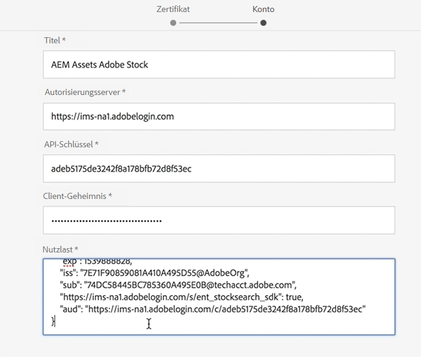

# Verwenden von Adobe Stock mit AEM Assets{#using-adobe-stock-assets-with-aem-assets}

AEM 6.4.2 bietet Benutzern die Möglichkeit, Adobe Stock-Assets direkt von AEM aus zu suchen, zu Vorschau, zu speichern und zu lizenzieren. Unternehmen können nun ihren Adobe Stock Enterprise-Plan mit AEM Assets integrieren, um sicherzustellen, dass lizenzierte Assets jetzt für ihre Kreativ- und Marketingprojekte verfügbar sind, mit den leistungsstarken Asset-Management-Funktionen von AEM.

>[!VIDEO](https://video.tv.adobe.com/v/24678/?quality=9&learn=on)

>[!NOTE]
>
>Die Integration erfordert ein [Adobe Stock-Unternehmensabo](https://landing.adobe.com/en/na/products/creative-cloud/ctir-4625-stock-for-enterprise/index.html) sowie AEM 6.4 mit Service Pack 2 oder höher. Informationen zum AEM 6.4 Service Pack finden Sie in den [Versionshinweisen](https://helpx.adobe.com/de/experience-manager/6-4/release-notes/sp-release-notes.html).

Die Integration von Adobe Stock und AEM Assets ermöglicht es Autoren und Marketingexperten, einfach zu lizenzieren und Assets für kreative oder Marketing-Zwecke zu verwenden. Sie können eine Asset-Suche entweder mit der Omni-Suche durchführen, indem Sie den Standortfilter als Adobe Stock hinzufügen oder indem Sie durch die AEM Assets-Hauptnavigation navigieren und auf das Symbol Adobe Stock Coral durchsuchen klicken.

## Funktionen

### Suchen und Speichern

* Führen Sie die Adobe Stock Asset-Suche aus, ohne AEM Arbeitsbereich zu verlassen.
* Speichern Sie Adobe Stock-Assets zur Vorschau, ohne das Asset zu lizenzieren.
* Möglichkeit zur Lizenzierung und Speicherung von Adobe Stock-Assets auf AEM Assets
* Möglichkeit, in der AEM Assets-Benutzeroberfläche nach ähnlichen Assets zu suchen
* Ansicht eines ausgewählten Assets aus der &quot;Stock Search&quot;innerhalb von AEM Assets auf der Adobe Stock-Website
* Lizenzierte Asset-Dateien werden zur einfachen Identifizierung mit einem blauen Genehmigungszeichen gekennzeichnet

### Asset-Metadaten

* Lizenzierte Assets werden in AEM Assets gespeichert. Asset-Eigenschaften enthalten Stock-Metadaten auf der Registerkarte &quot;Separate Asset-Metadaten&quot;
* Möglichkeit, Asset-Metadaten Lizenzverweise hinzuzufügen

### Asset Stock Profil

* Ein Benutzer kann unter &quot; *Benutzer&quot;> &quot;Meine Voreinstellungen&quot;> &quot;Lagerkonfiguration&quot;Adobe Stock-Profil auswählen*
* Im Fenster &quot;Asset-Lizenzierung&quot;können obligatorische und optionale Verweise hinzugefügt werden.
* Möglichkeit zur Auswahl der Spracheinstellung für das Fenster &quot;Asset-Lizenzierung&quot;je nach Region.

### Filter

* Ein Benutzer kann Assets nach Asset-Typ, Ausrichtung und Ansicht ähnlich filtern.
* Asset-Typ umfasst Fotos, Illustrationen, Vektoren, Videos, Vorlagen, 3D, Premium, Editorial
* Die Ausrichtung umfasst &quot;Horizontal&quot;, &quot;Vertikal&quot;und &quot;Quadrat&quot;.
* Für Ansicht Ähnlicher Filter ist die Adobe Stock-Dateinummer erforderlich.

### Zugriffssteuerung

* Administratoren können bestimmten Benutzern/Gruppen Berechtigungen zur Lizenzierung von Stammelementen erteilen, wenn sie die Konfiguration des Adobe Stock Cloud-Dienstes einrichten.
* Wenn ein bestimmter Benutzer bzw. eine bestimmte Gruppe nicht über die Berechtigung zum Lizenzieren von Asset- *Assets verfügt, ist die Asset-Suche bzw. die Asset-Lizenzierung* deaktiviert.

## Einrichten von Adobe Stock mit AEM Assets{#set-up-adobe-stock-with-aem-assets}

AEM 6.4.2 bietet Benutzern die Möglichkeit, Adobe Stock-Assets direkt von AEM aus zu suchen, zu Vorschau, zu speichern und zu lizenzieren. In diesem Video wird eine kurze Anleitung zum Einrichten von Adoben-Stocks mit AEM Assets mithilfe der Adobe-E/A-Konsole beschrieben.

>[!VIDEO](https://video.tv.adobe.com/v/25043/?quality=12&learn=on)

>[!NOTE]
>
>Für die Konfiguration des Adobe Stock Cloud-Dienstes müssen Sie die Pfad- &quot;Benutzerdefinierte Umgebung&quot;und &quot;Lizenziertes Asset&quot;auf &quot;/content/dam&quot;auswählen. Das Feld &quot;Umgebung&quot;wird in der nächsten AEM entfernt und der lizenzierte Asset-Pfad ist Teil einer kommenden Funktion. Die Unterstützung für dieses Feld wird in der nächsten AEM Version eingeführt.

>[!NOTE]
>
>Die Integration erfordert ein [Adobe Stock-Unternehmensabo](https://landing.adobe.com/en/na/products/creative-cloud/ctir-4625-stock-for-enterprise/index.html) sowie AEM 6.4 mit Service Pack 2 oder höher.  Informationen zum AEM 6.4 Service Pack finden Sie in den [Versionshinweisen](https://helpx.adobe.com/de/experience-manager/6-4/release-notes/sp-release-notes.html). Sie benötigen außerdem Administratorberechtigungen für die [Adobe-E/A-Konsole](https://console.adobe.io/), [Adobe Admin Console](https://adminconsole.adobe.com/) und Adobe Experience Manager, um die Integration einzurichten.

### Installation {#installations}

* Für AEM 6.4 müssen Sie das [AEM Service Pack 2](https://www.adobeaemcloud.com/content/marketplace/marketplaceProxy.html?packagePath=/content/companies/public/adobe/packages/cq640/AEM-6.4.2.0-Service-Pack) installieren und dann die Datei cq-dam-stock-integration-content-1.0.4.zip erneut installieren.
* Vergewissern Sie sich, dass Sie über Administratorberechtigungen für [Adobe-E/A-Konsole](https://console.adobe.io/), [Adobe Admin Console](https://adminconsole.adobe.com/) und Adobe Experience Manager zum Einrichten der Integration verfügen.

#### Adobe-IMS-Konfiguration mithilfe der Adobe-E/A-Konsole einrichten {#set-up-adobe-ims-configuration-using-adobe-i-o-console}

1. Erstellen Sie eine Adobe-IMS-Konfiguration unter **Tools > Sicherheit**
2. Wählen Sie die *Cloud-Lösung* als *Adobe Stock* aus und erstellen Sie ein neues Zertifikat oder verwenden Sie ein vorhandenes Zertifikat erneut für die Konfiguration.
3. Navigieren Sie zur Adobe-E/A-Konsole und erstellen Sie eine neue Dienstkontointegration für *Adobe Stock*.
4. Laden Sie das Zertifikat von Schritt 2 in Ihre Adobe Stock Service Account-Integration hoch.
5. Wählen Sie die erforderliche Adobe Stock-Profil-Konfiguration und schließen Sie die Dienstintegration ab.
6. Verwenden Sie die Integrationsdetails, um die Konfiguration des technischen Kontos der Adobe IMS abzuschließen.
7. Vergewissern Sie sich, dass Sie das Zugriffstoken mit dem Adobe IMS Technical Account erhalten können.

#### Adobe Stock-Cloud Services einrichten {#set-up-adobe-stock-cloud-services}

1. Erstellen Sie unter **Tools > Cloud Services eine neue Cloud-Dienstkonfiguration für Adobe Stock.**
2. Wählen Sie die *Adobe IMS Configuration* aus, die im obigen Abschnitt für Ihre *Adobe Stock Cloud* -Konfiguration erstellt wurde.

3. Stellen Sie sicher, dass Sie die **UMGEBUNG** als &quot;author&quot;auswählen. Staging-Umgebung wird nicht unterstützt und wird in der nächsten Version von AEM entfernt.
4. **Der lizenzierte Asset-Pfad** kann auf jedes Verzeichnis unter /content/dam verweisen. Die Funktionsunterstützung für dieses Feld wird in der nächsten Version von AEM hinzugefügt
5. Wählen Sie das Gebietsschema aus und führen Sie die Einrichtung durch.
6. Sie können Ihrem Adobe Stock Cloud-Dienst auch Benutzer/Gruppen hinzufügen, um den Zugriff für bestimmte Benutzer oder Gruppen zu ermöglichen.

### Zusätzliche Ressourcen

* [Enterprise Stock Plan](https://landing.adobe.com/en/na/products/creative-cloud/ctir-4625-stock-for-enterprise/index.html)
* [AEM 6.4 Service Pack 2 - Versionshinweise](https://helpx.adobe.com/de/experience-manager/6-4/release-notes/sp-release-notes.html)
* [Integrieren von AEM und Adobe Stock](https://helpx.adobe.com/experience-manager/6-5/assets/using/aem-assets-adobe-stock.html#IntegrateAEMandAdobeStock)
* [Adobe-I/O-Konsolenintegrations-API](https://www.adobe.io/apis/cloudplatform/console/authentication/gettingstarted.html)
* [Adobe Stock API-Dokumente](https://www.adobe.io/apis/creativecloud/stock/docs.html)