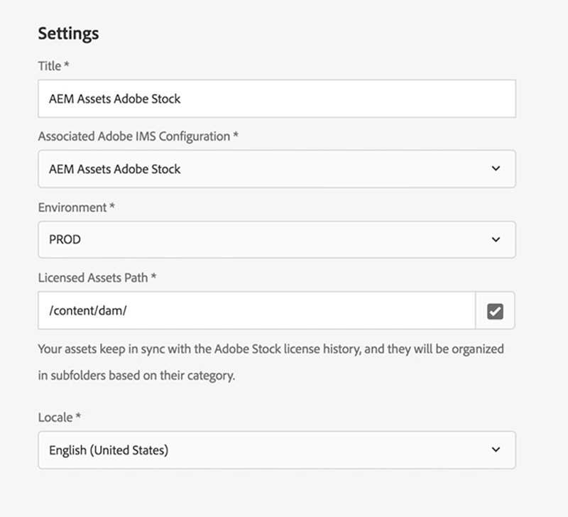

# Verwenden von Adobe Stock mit AEM Assets{#using-adobe-stock-assets-with-aem-assets}

AEM 6.4.2 bietet Benutzern die Möglichkeit, Adobe Stock-Assets direkt aus AEM zu suchen, in der Vorschau anzuzeigen, zu speichern und zu lizenzieren. Unternehmen können jetzt ihr Adobe Stock Enterprise-Programm in AEM Assets integrieren, um sicherzustellen, dass lizenzierte Assets nun für Kreativ- und Marketingprojekte umfassend verfügbar sind und über die leistungsstarken Asset-Management-Funktionen von AEM verfügen.

>[!VIDEO](https://video.tv.adobe.com/v/24678/?quality=9&learn=on)

>[!NOTE]
>
>Die Integration erfordert ein [Adobe Stock-Unternehmensabo](https://landing.adobe.com/en/na/products/creative-cloud/ctir-4625-stock-for-enterprise/index.html) sowie AEM 6.4 mit Service Pack 2 oder höher. Informationen zum AEM 6.4 Service Pack finden Sie in den [Versionshinweisen](https://helpx.adobe.com/de/experience-manager/6-4/release-notes/sp-release-notes.html).

Durch die Integration von Adobe Stock und AEM Assets können Inhaltsautoren und Marketingexperten auf einfache Weise Stock-Assets für Kreativ- oder Marketingzwecke lizenzieren und verwenden. Sie können eine Asset-Suche entweder mithilfe der Omni-Suche durchführen, indem Sie den Standortfilter als Adobe Stock hinzufügen oder indem Sie durch die AEM Assets-Hauptnavigation navigieren und auf das Symbol &quot;Adobe Stock Coral durchsuchen&quot;klicken.

## Funktionen

### Suchen und Speichern

* Führen Sie die Adobe Stock-Asset-Suche aus, ohne AEM Arbeitsbereich zu verlassen.
* Speichern Sie Adobe Stock-Assets für die Vorschau, ohne das Asset lizenzieren zu müssen.
* Möglichkeit der Lizenzierung und Speicherung von Adobe Stock-Assets in AEM Assets
* Möglichkeit, über die AEM Assets-Benutzeroberfläche nach ähnlichen Assets zu suchen
* Ausgewähltes Asset aus der Stock Search-Suche in AEM Assets auf der Adobe Stock-Website anzeigen
* Lizenzierte Asset-Dateien werden zur einfachen Identifizierung mit einem blauen lizenzierten Badge gekennzeichnet

### Asset-Metadaten

* Lizenzierte Assets werden in AEM Assets gespeichert. Asset-Eigenschaften enthalten Stock-Metadaten auf der Registerkarte &quot;Separate Asset-Metadaten&quot;
* Möglichkeit zum Hinzufügen von Lizenzverweisen zu Asset-Metadaten

### Asset Stock-Profil

* Ein Benutzer kann das Adobe Stock-Profil unter *Benutzer > Benutzereinstellungen > Stock-Konfiguration* auswählen.
* Dem Fenster &quot;Asset-Lizenzierung&quot;können obligatorische und optionale Referenzen hinzugefügt werden.
* Möglichkeit zur Auswahl einer Spracheinstellung für das Asset Licensing-Fenster basierend auf der Region.

### Filter

* Benutzer können Asset-Assets nach Asset-Typ, Ausrichtung und ähnlichen Elementen filtern
* Der Asset-Typ umfasst Fotos, Illustrationen, Vektoren, Videos, Vorlagen, 3D, Premium, Editorprogramm
* Die Ausrichtung umfasst &quot;Horizontal&quot;, &quot;Vertikal&quot;und &quot;Quadrat&quot;.
* Ähnliche Filter anzeigen erfordert Adobe Stock-Dateinummer

### Zugriffssteuerung

* Administratoren können bestimmten Benutzern/Gruppen Berechtigungen erteilen, um bei der Einrichtung der Adobe Stock Cloud Service-Konfiguration Stock-Assets zu lizenzieren.
* Wenn ein bestimmter Benutzer/eine bestimmte Gruppe nicht über die Berechtigung zum Lizenzieren von Stock-Assets verfügt, wird die Funktion *Asset-Suche/Asset-Lizenzierung* deaktiviert.

## Einrichten von Adobe Stock mit AEM Assets{#set-up-adobe-stock-with-aem-assets}

AEM 6.4.2 bietet Benutzern die Möglichkeit, Adobe Stock-Assets direkt aus AEM zu suchen, in der Vorschau anzuzeigen, zu speichern und zu lizenzieren. In diesem Video wird eine kurze Anleitung zum Einrichten von Adobe-Stocks mit AEM Assets mithilfe der Adobe I/O Console beschrieben.

>[!VIDEO](https://video.tv.adobe.com/v/25043/?quality=12&learn=on)

>[!NOTE]
>
>Für die Konfiguration des Adobe Stock Cloud-Dienstes müssen Sie die PROD-Umgebung und den Pfad des lizenzierten Assets auf /content/dam festlegen. Das Feld Umgebung wird in der nächsten AEM entfernt und der lizenzierte Asset-Pfad ist Teil einer zukünftigen Funktion. Die Unterstützung für dieses Feld wird in der nächsten AEM eingeführt.

>[!NOTE]
>
>Die Integration erfordert ein [Adobe Stock-Unternehmensabo](https://landing.adobe.com/en/na/products/creative-cloud/ctir-4625-stock-for-enterprise/index.html) sowie AEM 6.4 mit Service Pack 2 oder höher.  Informationen zum AEM 6.4 Service Pack finden Sie in den [Versionshinweisen](https://helpx.adobe.com/experience-manager/6-4/release-notes/sp-release-notes.html). Außerdem benötigen Sie Administratorberechtigungen für [Adobe I/O Console](https://console.adobe.io/), [Adobe Admin Console](https://adminconsole.adobe.com/) und Adobe Experience Manager, um die Integration einzurichten.

### Installation {#installations}

* Für AEM 6.4 müssen Sie das [AEM Service Pack 2](https://www.adobeaemcloud.com/content/marketplace/marketplaceProxy.html?packagePath=/content/companies/public/adobe/packages/cq640/servicepack/AEM-6.4.2.0) installieren und dann die Datei cq-dam-stock-integration-content-1.0.4.zip erneut installieren.
* Stellen Sie sicher, dass Sie über Administratorberechtigungen für [Adobe I/O Console](https://console.adobe.io/), [Adobe Admin Console](https://adminconsole.adobe.com/) und Adobe Experience Manager verfügen, um die Integration einzurichten.

#### Einrichten der Adobe IMS-Konfiguration mithilfe der Adobe I/O Console {#set-up-adobe-ims-configuration-using-adobe-i-o-console}

1. Erstellen Sie unter **Tools > Sicherheit** eine Adobe für die Konfiguration des technischen IMS-Kontos.
2. Wählen Sie *Cloud Solution* als *Adobe Stock* aus und erstellen Sie ein neues Zertifikat oder verwenden Sie ein vorhandenes Zertifikat erneut für die Konfiguration.
3. Navigieren Sie zur Adobe I/O Console und erstellen Sie eine neue Dienstkontointegration für *Adobe Stock*.
4. Laden Sie das Zertifikat aus Schritt 2 in Ihre Adobe Stock Service-Kontointegration hoch.
5. Wählen Sie die erforderliche Adobe Stock-Profilkonfiguration aus und schließen Sie die Dienstintegration ab.
6. Verwenden Sie die Integrationsdetails, um die Konfiguration des technischen IMS-Kontos für die Adobe abzuschließen.
7. Stellen Sie sicher, dass Sie das Zugriffs-Token über das technische Adobe IMS-Konto erhalten können.

#### Einrichten von Adobe Stock-Cloud Services {#set-up-adobe-stock-cloud-services}

1. Erstellen Sie eine neue Cloud-Dienstkonfiguration für Adobe Stock unter **Tools > Cloud Services.**
2. Wählen Sie die im obigen Abschnitt erstellte *Adobe IMS Configuration* für Ihre *Adobe Stock Cloud*-Konfiguration aus.

3. Stellen Sie sicher, dass Sie **UMGEBUNG** als PROD auswählen. Die Staging-Umgebung wird nicht unterstützt und in der nächsten Version von AEM entfernt.
4. **Der Pfad lizenzierter Assets** kann auf jedes Verzeichnis unter /content/dam verweisen. Unterstützung für Funktionen für dieses Feld wird in der nächsten Version von AEM hinzugefügt.
5. Wählen Sie Ihr Gebietsschema aus und schließen Sie die Einrichtung ab.
6. Sie können Ihrem Adobe Stock Cloud-Dienst auch Benutzer/Gruppen hinzufügen, um den Zugriff für bestimmte Benutzer oder Gruppen zu ermöglichen.

### Zusätzliche Ressourcen

* [Enterprise Stock Plan](https://landing.adobe.com/en/na/products/creative-cloud/ctir-4625-stock-for-enterprise/index.html)
* [AEM 6.4 Service Pack 2 - Versionshinweise](https://helpx.adobe.com/experience-manager/6-4/release-notes/sp-release-notes.html)
* [Integrieren von AEM und Adobe Stock](https://helpx.adobe.com/experience-manager/6-5/assets/using/aem-assets-adobe-stock.html#IntegrateAEMandAdobeStock)
* [Adobe I/O Console-Integrations-API](https://www.adobe.io/apis/cloudplatform/console/authentication/gettingstarted.html)
* [Adobe Stock API-Dokumente](https://www.adobe.io/apis/creativecloud/stock/docs.html)