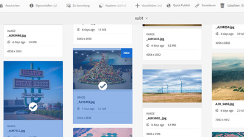

# Überblick {#overview}

Adobe Experience Manager Assets ist ein Werkzeug zur Verwaltung digitaler Assets auf AEM Plattform, mit dem Benutzer ihre digitalen Assets (Bilder, Videos, Dokumente und Audioclips) in einem webbasierten Repository erstellen, verwalten und freigeben können. Dieses Benutzerhandbuch enthält Videos und Tutorials zu den zahlreichen Funktionen und Funktionen von AEM Assets.

## Neue Funktionen

* **[Grundlegende Berechtigungen (Video)](./configuring/baseline-permissions.md)**

    
   *Erfahren Sie, wie und warum es wichtig ist, AEM Assets mit Grundberechtigungen zu konfigurieren*

* **[Workflows (Video)](./configuring/auto-start-workflows.md)**

    
   *Erfahren Sie, wie Sie AEM Arbeitsablauf bei hochgeladenen oder erneut verarbeiteten Assets automatisch aufrufen*

* **[Profile bearbeiten (Video)](./configuring/processing-profiles.md)**

    
   *Erfahren Sie, wie Sie Assets Microservices zu Darstellungselementen aufrufen können*

* **[Assets-Sammlungen verwenden (Video)](./search-and-discovery/collections.md)**

    
   *Entdecken Sie, wie Sammlungen in AEM Assets neue Möglichkeiten zum Organisieren und Entdecken von Assets bieten.*

* **[Verwenden der Review-Aufgabe (Video)](./collaboration/review-task.md)**

    
   *Verwenden Sie den Arbeitsablauf für Review-Aufgaben, um Assets schnell und einfach zu genehmigen (oder abzulehnen).*

## Personalauswahl

<table>
<td>
   
   

      <a href="./creative-workflows/aem-desktop-app.md">
      <strong>Verwenden von AEM Desktop App</strong>
      </a>
   

   

      <em>Zugriff auf Assets in AEM direkt vom Desktop aus</em>
   

</td>
<td>
   
   

      <a href="./advanced/asset-insights-launch-tutorial.md">
      <strong>Verwenden AEM Asset Insights beim Start</strong>
      </a>
   

   

      <em>Erhalten Sie Einblicke in die Verwendung von Assets</em>
   

</td>
<td>
   
   

      <a href="./dynamic-media/dynamic-media-overview-feature-video-use.md">
      <strong>Übersicht über dynamische Medien</strong>
      </a>
   

   

      <em>Verwalten und Zugreifen auf Medieninhalte mit dynamischen Medien</em>
   

</td>
</table>

## Zusätzliche Ressourcen

* [Experience League - AEM](https://experienceleague.adobe.com/#recommended/solutions/experience-manager)
* [AEM Assets-Dokumentation](https://helpx.adobe.com/de/experience-manager/6-5/assets/user-guide.html)
* [AEM als Cloud Service Tutorials](/help/cloud-service/overview.md)
* [AEM Sites Tutorials](/help/sites/overview.md)
* [AEM Forms Tutorials](/help/forms/overview.md)
* [AEM Foundation-Tutorials](/help/foundation/overview.md)
