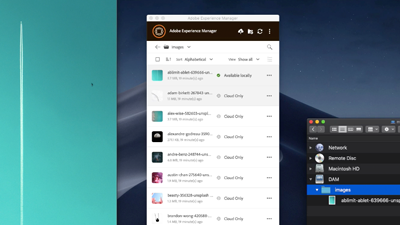

# Überblick {#overview}

Adobe Experience Manager Assets ist ein digitales Asset-Management-Tool in AEM Platform, mit dem Benutzer ihre digitalen Assets (Bilder, Videos, Dokumente und Audioclips) in einem webbasierten Repository erstellen, verwalten und freigeben können. Dieses Benutzerhandbuch enthält Videos und Tutorials zu den zahlreichen Funktionen und Features von AEM Assets.

## Neue Funktionen

* **[Relation und Aufheben der Verknüpfung (Video)](./authoring/relate-unrelate.md)**

   *Erfahren Sie, wie Sie in AEM Beziehungen zwischen Assets herstellen und verwalten.*

* **[Veröffentlichen von Assets (Video)](./sharing/publish.md)**

   *Lernen Sie die Ins- und Outs der Veröffentlichung von Assets von der AEM-Autoreninstanz zur AEM-Veröffentlichung kennen*

* **[Wasserzeichen (Video)](./advanced/watermarks.md)**

   *Erfahren Sie, wie Sie Asset-Ausgabedarstellungen in AEM as a Cloud Service mit Wasserzeichen versehen.*

* **[Grundlegende Berechtigungen (Video)](./configuring/baseline-permissions.md)**

   *Erfahren Sie, wie und warum es wichtig ist, AEM Assets mit Basisberechtigungen zu konfigurieren*

* **[Automatisch startende Workflows (Video)](./configuring/auto-start-workflows.md)**

   *Erfahren Sie, wie Sie AEM Workflow für hochgeladene oder erneut verarbeitete Assets automatisch aufrufen*

## Mitarbeiterauswahl

<table>
<td>
   
   

      <a href="./creative-workflows/aem-desktop-app.md">
      <strong>Verwenden von AEM Desktop App</strong>
      </a>
   

   

      <em>Zugreifen auf Assets in AEM direkt über den Desktop</em>
   

</td>
<td>
   
   

      <a href="./advanced/asset-insights-launch-tutorial.md">
      <strong>Verwenden AEM Asset Insights mit Launch</strong>
      </a>
   

   

      <em>Gewinnen Sie Einblicke in die Verwendung von Assets</em>
   

</td>
<td>
   
   

      <a href="./dynamic-media/dynamic-media-overview-feature-video-use.md">
      <strong>Übersicht über Dynamic Media</strong>
      </a>
   

   

      <em>Medieninhalte mit Dynamic Media verwalten und aufrufen</em>
   

</td>
</table>

## Zusätzliche Ressourcen

* [Experience League - AEM](https://experienceleague.adobe.com/#recommended/solutions/experience-manager)
* [Dokumentation zu AEM Assets](https://helpx.adobe.com/de/experience-manager/6-5/assets/user-guide.html)
* [Tutorials zu AEM as a Cloud Service](/help/cloud-service/overview.md)
* [AEM Sites-Tutorials](/help/sites/overview.md)
* [AEM Forms-Tutorials](/help/forms/overview.md)
* [AEM Foundation-Tutorials](/help/foundation/overview.md)
