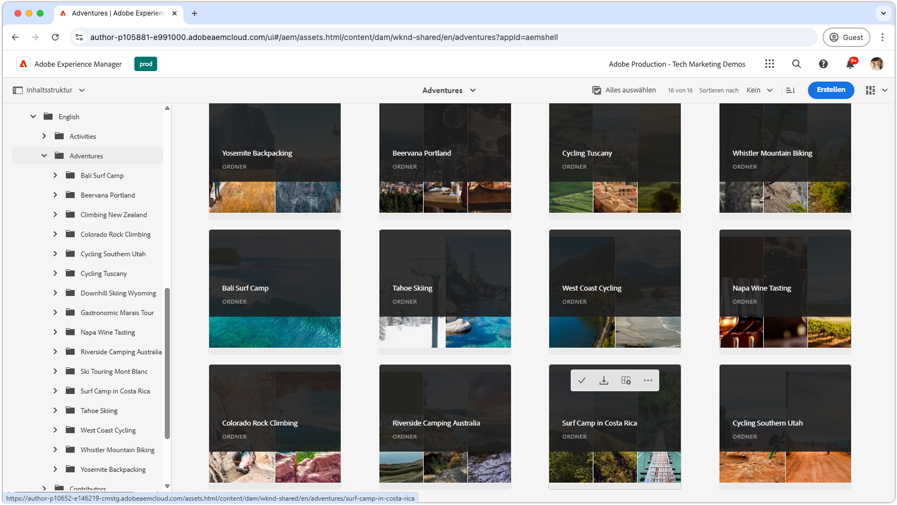

# Video-Playlists für die Admin-Ansicht

{align="center"}

Erkunden Sie diese Playlists, um sich mit der Admin-Ansicht von AEM Assets as a Cloud Service vertraut zu machen, einschließlich der Konfiguration, Optimierung, Verwendung und nahtlosen Integration mit kreativen Workflows. Gewinnen Sie die notwendigen Erkenntnisse, um AEM Assets as a Cloud Service erfolgreich einsetzen zu können.

## Konfigurieren der Admin-Ansicht

Beginnen Sie mit den grundlegenden Einrichtungs- und Konfigurationsschritten, um eine nahtlose Funktionsweise von AEM Assets as a Cloud Service für Ihr Team und Ihre Projekte sicherzustellen.

<!-- CARDS

* https://experienceleague.adobe.com/de/playlists/experience-manager-all-configure-administrative-access
* https://experienceleague.adobe.com/de/playlists/experience-manager-assets-configure-administrators

-->
<!-- START CARDS HTML - DO NOT MODIFY BY HAND -->

    

        

            

                <figure class="image x-is-16by9">
                    
                </figure>
            

            

                

                    

                        <a href="https://experienceleague.adobe.com/de/playlists/experience-manager-all-configure-administrative-access" target="_blank" rel="referrer" title="Konfigurieren des administrativen Zugriffs auf Experience Manager">Konfigurieren des administrativen Zugriffs auf Experience Manager</a>
                    

                    
Erfahren Sie, wie sich Benutzende mit Adobe IMS bei AEM as a Cloud Service authentifizieren und wie mit Adobe IMS-Benutzenden, -Benutzergruppen und -Produktprofilen der Zugriff auf AEM und seine Funktionen gesteuert werden kann.

                

                <a href="https://experienceleague.adobe.com/de/playlists/experience-manager-all-configure-administrative-access" target="_blank" rel="referrer" class="spectrum-Button spectrum-Button--outline spectrum-Button--primary spectrum-Button--sizeM" style="align-self: flex-start; margin-top: 1rem;">
                    Ansehen
                </a>
            

        

    

    

        

            

                <figure class="image x-is-16by9">
                    
                </figure>
            

            

                

                    

                        <a href="https://experienceleague.adobe.com/de/playlists/experience-manager-assets-configure-administrators" target="_blank" rel="referrer" title="Konfigurieren von AEM Assets">Konfigurieren von AEM Assets</a>
                    

                    
Erfahren Sie, wie Sie eine solide Grundlage für Ihre AEM Assets-Implementierung schaffen, indem Sie die wichtigsten Aspekte konfigurieren – von der Einrichtung einer grundlegenden Inhaltsarchitektur und Taxonomie bis hin zur Anpassung von Metadaten und Asset-Verarbeitung.

                

                <a href="https://experienceleague.adobe.com/de/playlists/experience-manager-assets-configure-administrators" target="_blank" rel="referrer" class="spectrum-Button spectrum-Button--outline spectrum-Button--primary spectrum-Button--sizeM" style="align-self: flex-start; margin-top: 1rem;">
                    Ansehen
                </a>
            

        

    

<!-- END CARDS HTML - DO NOT MODIFY BY HAND -->

## Erste Schritte mit der Admin-Ansicht

Navigieren Sie in der Admin-Benutzeroberfläche wie ein Profi und lernen Sie die Tools und Techniken kennen, um Assets effizient verwalten zu können.

<!-- CARDS

* https://experienceleague.adobe.com/de/playlists/experience-manager-assets-get-started-business-users  
* https://experienceleague.adobe.com/de/playlists/experience-manager-assets-understand-metadata
* https://experienceleague.adobe.com/de/playlists/experience-manager-assets-optimize-search
* https://experienceleague.adobe.com/de/playlists/experience-manager-assets-use-smart-tags

-->
<!-- START CARDS HTML - DO NOT MODIFY BY HAND -->

    

        

            

                <figure class="image x-is-16by9">
                    
                </figure>
            

            

                

                    

                        <a href="https://experienceleague.adobe.com/de/playlists/experience-manager-assets-get-started-business-users" target="_blank" rel="referrer" title="Erste Schritte mit der Admin-Ansicht von AEM Assets für Geschäftsbenutzende">Erste Schritte mit der Admin-Ansicht von AEM Assets für Geschäftsbenutzende</a>
                    

                    
Erfahren Sie mehr über die Grundlagen der Admin-Ansicht von AEM Assets, einschließlich der Navigation, Organisation und Modellierung von Assets sowie der Standardvorgänge wie Erstellung, Aktualisierung und Löschung.

                

                <a href="https://experienceleague.adobe.com/de/playlists/experience-manager-assets-get-started-business-users" target="_blank" rel="referrer" class="spectrum-Button spectrum-Button--outline spectrum-Button--primary spectrum-Button--sizeM" style="align-self: flex-start; margin-top: 1rem;">
                    Ansehen
                </a>
            

        

    

    

        

            

                <figure class="image x-is-16by9">
                    
                </figure>
            

            

                

                    

                        <a href="https://experienceleague.adobe.com/de/playlists/experience-manager-assets-understand-metadata" target="_blank" rel="referrer" title="Grundlegendes zu Asset-Metadaten in AEM Assets">Grundlegendes zu Asset-Metadaten in AEM Assets</a>
                    

                    
Erfahren Sie alles, was Sie über die Asset-Metadaten von AEM Assets wissen müssen.

                

                <a href="https://experienceleague.adobe.com/de/playlists/experience-manager-assets-understand-metadata" target="_blank" rel="referrer" class="spectrum-Button spectrum-Button--outline spectrum-Button--primary spectrum-Button--sizeM" style="align-self: flex-start; margin-top: 1rem;">
                    Ansehen
                </a>
            

        

    

    

        

            

                <figure class="image x-is-16by9">
                    
                </figure>
            

            

                

                    

                        <a href="https://experienceleague.adobe.com/de/playlists/experience-manager-assets-optimize-search" target="_blank" rel="referrer" title="Optimieren der Suche in AEM Assets">Optimieren der Suche in AEM Assets</a>
                    

                    
Erfahren Sie, wie Sie das Sucherlebnis in AEM Assets optimieren.

                

                <a href="https://experienceleague.adobe.com/de/playlists/experience-manager-assets-optimize-search" target="_blank" rel="referrer" class="spectrum-Button spectrum-Button--outline spectrum-Button--primary spectrum-Button--sizeM" style="align-self: flex-start; margin-top: 1rem;">                     Ansehen                 </a>
            

        

    

    

        

            

                <figure class="image x-is-16by9">
                    
                </figure>
            

            

                

                    

                        <a href="https://experienceleague.adobe.com/de/playlists/experience-manager-assets-use-smart-tags" target="_blank" rel="referrer" title="Verwenden von Smart-Tags für eine bessere Asset-Erkennung">Verwenden von Smart-Tags für eine bessere Asset-Erkennung</a>
                    

                    
Erfahren Sie, wie Sie mit Smart-Tags in AEM Assets erreichen können, dass Ihre Assets leichter gefunden werden.

                

                <a href="https://experienceleague.adobe.com/de/playlists/experience-manager-assets-use-smart-tags" target="_blank" rel="referrer" class="spectrum-Button spectrum-Button--outline spectrum-Button--primary spectrum-Button--sizeM" style="align-self: flex-start; margin-top: 1rem;">
                    Ansehen
                </a>
            

        

    

<!-- END CARDS HTML - DO NOT MODIFY BY HAND -->

## Verbinden kreativer Workflows mit AEM Assets

Ermöglichen Sie eine reibungslose Zusammenarbeit, indem Sie AEM Assets as a Cloud Service mit Ihren Kreativ-Tools integrieren und so kohärente und effiziente Workflows sicherstellen.

<!-- CARDS

* https://experienceleague.adobe.com/de/playlists/experience-manager-assets-create-renditions-content-automation
* https://experienceleague.adobe.com/de/playlists/experience-manager-assets-use-creative-operations-with-content-automation

-->
<!-- START CARDS HTML - DO NOT MODIFY BY HAND -->

    

        

            

                <figure class="image x-is-16by9">
                    
                </figure>
            

            

                

                    

                        <a href="https://experienceleague.adobe.com/de/playlists/experience-manager-assets-create-renditions-content-automation" target="_blank" rel="referrer" title="Erstellen benutzerdefinierter Ausgabedarstellungen mit der Inhaltsautomatisierung von AEM">Erstellen benutzerdefinierter Ausgabedarstellungen mit der Inhaltsautomatisierung von AEM</a>
                    

                    
Erfahren Sie, wie Sie mit dem Add-on zur Inhaltsautomatisierung Adobe Experience Manager Assets as a Cloud Service mit den Adobe Creative Cloud-Service-APIs integrieren, um eine effiziente Asset-Verarbeitung zu ermöglichen.

                

                <a href="https://experienceleague.adobe.com/de/playlists/experience-manager-assets-create-renditions-content-automation" target="_blank" rel="referrer" class="spectrum-Button spectrum-Button--outline spectrum-Button--primary spectrum-Button--sizeM" style="align-self: flex-start; margin-top: 1rem;">
                    Ansehen
                </a>
            

        

    

    

        

            

                <figure class="image x-is-16by9">
                    
                </figure>
            

            

                

                    

                        <a href="https://experienceleague.adobe.com/de/playlists/experience-manager-assets-use-creative-operations-with-content-automation" target="_blank" rel="referrer" title="Verwenden kreativer Vorgänge mit der Inhaltsautomatisierung von AEM Assets">Verwenden kreativer Vorgänge mit der Inhaltsautomatisierung von AEM Assets</a>
                    

                    
Erfahren Sie, wie Sie mit dem Add-on zur Inhaltsautomatisierung Creative Cloud-Vorgänge für Adobe Experience Manager Assets durchführen.

                

                <a href="https://experienceleague.adobe.com/de/playlists/experience-manager-assets-use-creative-operations-with-content-automation" target="_blank" rel="referrer" class="spectrum-Button spectrum-Button--outline spectrum-Button--primary spectrum-Button--sizeM" style="align-self: flex-start; margin-top: 1rem;">
                    Ansehen
                </a>
            

        

    

<!-- END CARDS HTML - DO NOT MODIFY BY HAND -->

