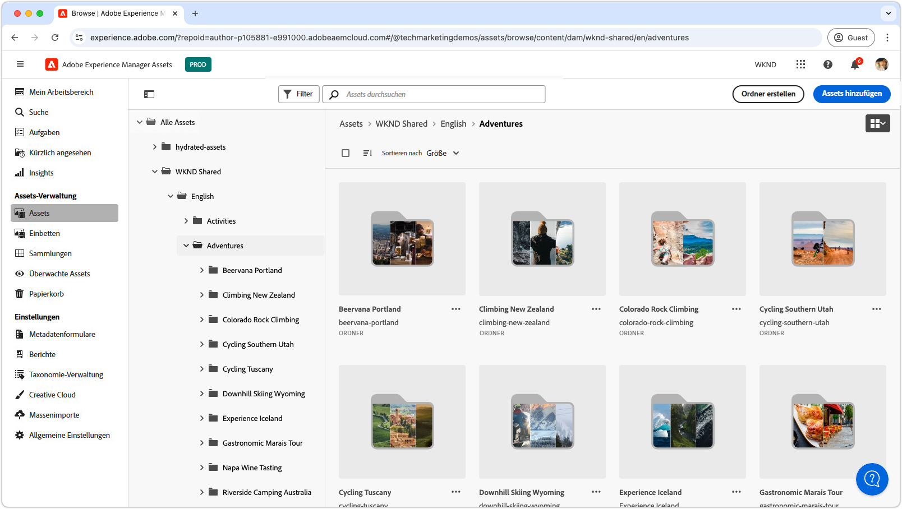

# Videowiedergabelisten für die Assets-Ansicht

{align=center}

Erkunden Sie diese Wiedergabelisten, um die AEM Assets as a Cloud Service Assets-Ansicht zu meistern. Diese umfasst Konfiguration, Optimierung, Nutzung und nahtlose Integration in kreative Workflows. Hier erhalten Sie die Einblicke, die Sie benötigen, um mit AEM Assets as a Cloud Service erfolgreich zu sein.

## Assets-Ansicht konfigurieren

Beginnen Sie mit den grundlegenden Konfigurationen, damit AEM Assets as a Cloud Service für Ihr Team und Ihre Projekte reibungslos funktioniert.

<!-- CARDS

* https://experienceleague.adobe.com/en/playlists/experience-manager-all-configure-administrative-access
* https://experienceleague.adobe.com/en/playlists/experience-manager-assets-get-started-assets-essentials

-->
<!-- START CARDS HTML - DO NOT MODIFY BY HAND -->

    

        

            

                <figure class="image x-is-16by9">
                    
                </figure>
            

            

                

                    

                        <a href="https://experienceleague.adobe.com/en/playlists/experience-manager-all-configure-administrative-access" target="_blank" rel="referrer" title="Administratorzugriff auf Experience Manager konfigurieren">Konfigurieren des Administratorzugriffs auf Experience Manager</a>
                    

                    
Erfahren Sie, wie sich Benutzer mit Adobe IMS bei AEM as a Cloud Service authentifizieren und wie Adobe IMS-Benutzer, Benutzergruppen und Produktprofile verwendet werden, um den Zugriff auf AEM und die zugehörigen Funktionen zu steuern.

                

                <a href="https://experienceleague.adobe.com/en/playlists/experience-manager-all-configure-administrative-access" target="_blank" rel="referrer" class="spectrum-Button spectrum-Button--outline spectrum-Button--primary spectrum-Button--sizeM" style="align-self: flex-start; margin-top: 1rem;">
                    Watch
                </a>
            

        

    

    

        

            

                <figure class="image x-is-16by9">
                    
                </figure>
            

            

                

                    

                        <a href="https://experienceleague.adobe.com/en/playlists/experience-manager-assets-get-started-assets-essentials" target="_blank" rel="referrer" title="Erste Schritte mit AEM Assets Essentials">Erste Schritte mit AEM Assets Essentials</a>
                    

                    
Erfahren Sie, wie AEM Assets Essentials die Asset-Verwaltung für Ihre Abteilung optimieren kann.

                

                <a href="https://experienceleague.adobe.com/en/playlists/experience-manager-assets-get-started-assets-essentials" target="_blank" rel="referrer" class="spectrum-Button spectrum-Button--outline spectrum-Button--primary spectrum-Button--sizeM" style="align-self: flex-start; margin-top: 1rem;">
                    Watch
                </a>
            

        

    

<!-- END CARDS HTML - DO NOT MODIFY BY HAND -->

## Erste Schritte mit der Assets-Ansicht

Navigieren Sie zur Assets-Ansichtsoberfläche wie ein Profi - lernen Sie die Tools und Techniken zum effizienten Verwalten von Assets kennen.

<!-- CARDS

* https://experienceleague.adobe.com/en/playlists/experience-manager-assets-generate-image-assets-with-adobe-firefly
* https://experienceleague.adobe.com/en/playlists/experience-manager-assets-assets-view-search-use

-->
<!-- START CARDS HTML - DO NOT MODIFY BY HAND -->

    

        

            

                <figure class="image x-is-16by9">
                    
                </figure>
            

            

                

                    

                        <a href="https://experienceleague.adobe.com/en/playlists/experience-manager-assets-generate-image-assets-with-adobe-firefly" target="_blank" rel="referrer" title="Generieren von Image Assets mithilfe von Adobe Firefly">Generieren von Bild-Assets mit Adobe Firefly</a>
                    

                    
Erfahren Sie, wie AEM Assets mithilfe von Adobe Firefly und Gen AI die Inhaltsgeschwindigkeit erhöhen kann.

                

                <a href="https://experienceleague.adobe.com/en/playlists/experience-manager-assets-generate-image-assets-with-adobe-firefly" target="_blank" rel="referrer" class="spectrum-Button spectrum-Button--outline spectrum-Button--primary spectrum-Button--sizeM" style="align-self: flex-start; margin-top: 1rem;">
                    Watch
                </a>
            

        

    

    

        

            

                <figure class="image x-is-16by9">
                    
                </figure>
            

            

                

                    

                        <a href="https://experienceleague.adobe.com/en/playlists/experience-manager-assets-assets-view-search-use" target="_blank" rel="referrer" title="Suchen in der AEM Assets Assets-Ansicht, um Assets zu finden">Durchsuchen der AEM Assets Assets-Ansicht nach Assets</a>
                    

                    
Erfahren Sie, wie Sie mit der AEM Assets Assets-Ansichtssuche Assets schnell und einfach finden können.

                

                <a href="https://experienceleague.adobe.com/en/playlists/experience-manager-assets-assets-view-search-use" target="_blank" rel="referrer" class="spectrum-Button spectrum-Button--outline spectrum-Button--primary spectrum-Button--sizeM" style="align-self: flex-start; margin-top: 1rem;">
                    Watch
                </a>
            

        

    

<!-- END CARDS HTML - DO NOT MODIFY BY HAND -->

## Verbinden von kreativen Workflows mit AEM Assets

Ermöglichen Sie eine reibungslose Zusammenarbeit, indem Sie AEM Assets as a Cloud Service in Ihre Kreativ-Tools integrieren und so einen kohärenten und effizienten Workflow gewährleisten.

<!-- CARDS

* https://experienceleague.adobe.com/en/playlists/experience-manager-assets-manage-creative-workflows-with-workfront-and-assets-essentials

-->
<!-- START CARDS HTML - DO NOT MODIFY BY HAND -->

    

        

            

                <figure class="image x-is-16by9">
                    
                </figure>
            

            

                

                    

                        <a href="https://experienceleague.adobe.com/en/playlists/experience-manager-assets-manage-creative-workflows-with-workfront-and-assets-essentials" target="_blank" rel="referrer" title="Verwalten von kreativen Workflows mit Workfront und Assets Essentials">Verwalten von kreativen Workflows mit Workfront und Assets Essentials</a>
                    

                    
Erfahren Sie, wie Adobe Workfront und Experience Manager Assets Essentials Ihr Unternehmen bei der Verwaltung des kreativen Workflows unterstützen.

                

                <a href="https://experienceleague.adobe.com/en/playlists/experience-manager-assets-manage-creative-workflows-with-workfront-and-assets-essentials" target="_blank" rel="referrer" class="spectrum-Button spectrum-Button--outline spectrum-Button--primary spectrum-Button--sizeM" style="align-self: flex-start; margin-top: 1rem;">
                    Watch
                </a>
            

        

    

<!-- END CARDS HTML - DO NOT MODIFY BY HAND -->

