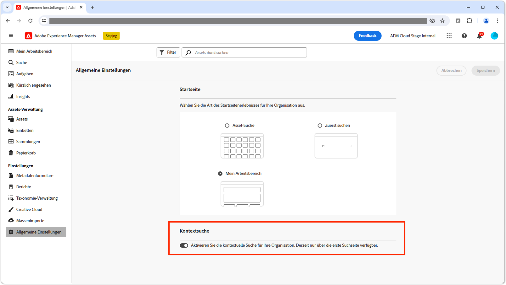

# Kontextsuche

Erfahren Sie, wie Sie Assets mithilfe der Kontextsuche in Adobe Experience Manager Assets mit kostenlosen Sprachabfragen effizient finden können.

>[!VIDEO](https://video.tv.adobe.com/v/3428667/?learn=on)

## Ein-/Ausschalten der Kontextsuche

Um die Kontextsuche für alle Benutzenden zu aktivieren bzw. zu deaktivieren, können AEM-Admins zu den __allgemeinen Einstellungen__ navigieren und den Schalter __Kontextsuche__ auf die gewünschte Einstellung schalten.

Die Kontextsuche ist standardmäßig für alle Benutzenden aktiviert.

