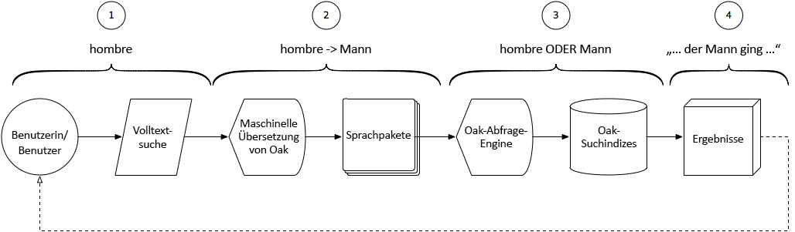

# Intelligente Übersetzungssuche mit AEM Assets{#using-smart-translation-search-with-aem-assets}

Die intelligente Suche nach Übersetzungen ermöglicht die automatische Suche und Erkennung von Inhalten in mehreren Sprachen, sowohl über Assets als auch über Seiten hinweg. Dadurch werden mehr als 50 Sprachen unterstützt und die manuelle Übersetzung von Inhalten wird reduziert.

>[!VIDEO](https://video.tv.adobe.com/v/21297/?quality=9&learn=on)

AEM Suche nach intelligenter Übersetzung ermöglicht es Benutzern, mithilfe von nicht englischen Begriffen nach Inhalten in AEM zu suchen, um mit den Assets in AEM zu übereinstimmen, die entsprechende englische Begriffe enthalten.

Die intelligente Übersetzungssuche ist ein perfektes Kompliment für AEM Smart Tags, die auf Assets in Englisch angewendet werden.

In diesem Video wird davon ausgegangen, dass [AEM Suche nach intelligenter Übersetzung](smart-translation-search-technical-video-setup.md) eingerichtet wurde.

## Funktionsweise der Suche nach intelligenter Übersetzung {#how-smart-translation-search-works}

1. AEM Benutzer führt eine Volltextsuche durch und gibt einen lokalisierten Suchbegriff (z. der spanische Begriff &quot;Mann&quot;, &quot;hombre&quot;).
2. Die intelligente Übersetzungssuche, die vom Apache Oak Machine Translation OSGi-Bundle bereitgestellt wird, wird aktiviert und bewertet, ob die angegebenen Suchbegriffe mit den registrierten Sprachpaketen übersetzt werden können.
3. Alle übersetzten Begriffe aus Schritt 2 werden erfasst und die Abfrage wird intern erweitert, um sie als Suchbegriffe einzuschließen. Dieser erweiterte Satz von Suchbegriffen, wenn sie normal mit AEM Suchindizes ausgewertet werden, die relevante Übereinstimmungen finden.
4. Die Suchergebnisse, die mit dem ursprünglichen Begriff (&#39;hombre&#39;) oder dem übersetzten Begriff (&#39;man&#39;) übereinstimmen, werden erfasst und dem Benutzer als Suchergebnisse zurückgegeben.

## Zusätzliche Ressourcen{#additional-resources}

* [Intelligente Übersetzungssuche mit AEM Assets einrichten](smart-translation-search-technical-video-setup.md)
* [Apache Joshua-Sprachpakete](https://cwiki.apache.org/confluence/display/JOSHUA/Language+Packs)