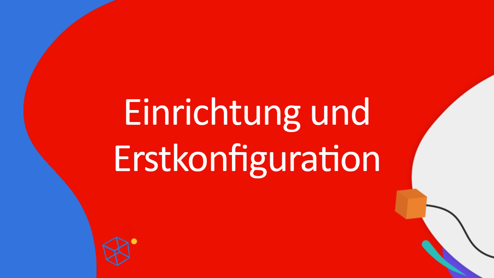
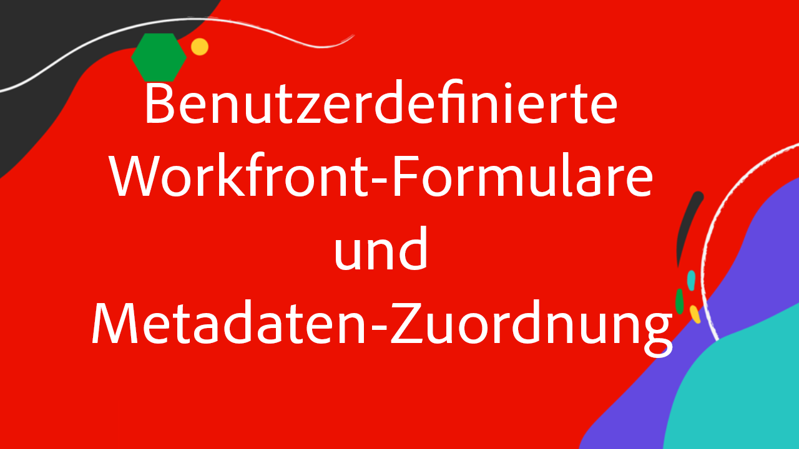
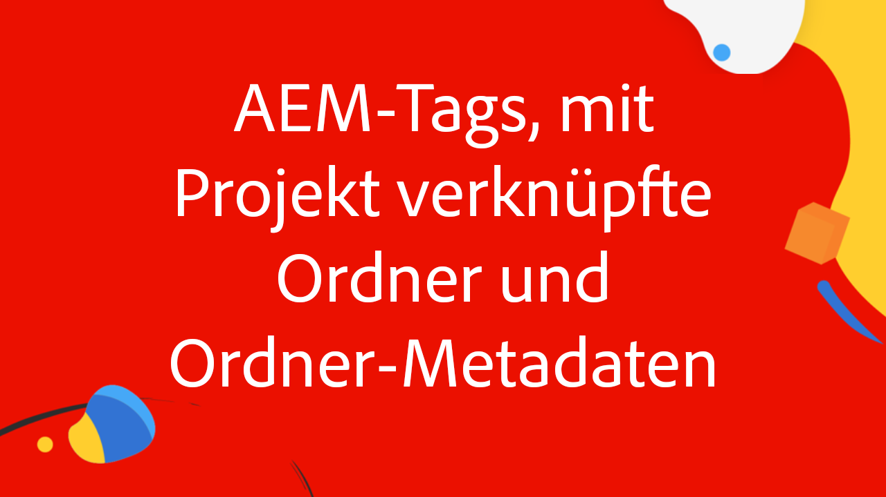
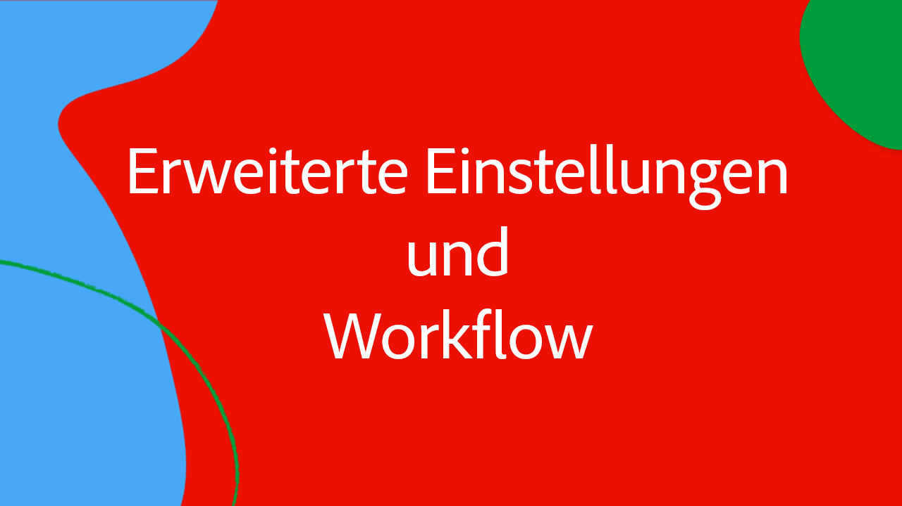

# Integrieren von Workfront und AEM Assets mit dem erweiterten Connector

In dieser vierteiligen Videoserie demonstrieren und diskutieren Adobe-Fachleute für Workfront und Experience Manager Assets die Vorzüge des erweiterten Connectors von Workfront für Experience Manager.

In dieser vierteiligen Expertenreihe diskutieren verschiedene Adobe-Fachleute aus unterschiedlichen Bereichen wie Produkt-Management, Beratung und Partnerunternehmen folgende Themen:

1. [Durchführen der erstmaligen Setup-Konfigurationen in Workfront und AEM](./setup.md)
2. [Konfigurieren der Metadatensynchronisierung zwischen benutzerdefinierten Workfront-Formularen und AEM](./custom-forms.md)
3. [Verwenden von AEM-Tags, projektverknüpften Ordnern, Adobe Asset Link und Ordner-Metadatenschemata zur Wertmaximierung](./aem-tags-project-linked-folders-and-folder-metadata.md)
4. [Verwenden des erweiterten AEM-Workflows zur Optimierung von Geschäftsprozessen in AEM und Workfront und andere erweiterte Einstellungen](./advanced-settings-and-workflows.md)

<table>
  <td>
      
      

         <a href="./setup.md"><strong>Einrichtung und Erstkonfiguration</strong></a>
  <em>Teil 1/4</em>
      

      

         
 Erfahren Sie, wie Sie den erweiterten Connector von Workfront für Experience Manager einrichten und die Erstkonfiguration durchführen.
      

   </td>
   <!-- Workfront custom forms and metadata mapping -->
   <td>
      
      

         <a href="./custom-forms.md"><strong>Benutzerdefinierte Formulare und Metadatenzuordnung in Workfront</strong></a>
  <em>Teil 2/4</em>
      

      

         
 Erfahren Sie mehr über benutzerdefinierte Workfront-Formulare und darüber, wie sie den Metadatenschemata von Experience Manager Assets zugeordnet werden, um Daten zu synchronisieren.
      

    </td>
    <!-- AEM Tags, project linked folders, and folder metadata -->
    <td>
      
      

         <a href="./aem-tags-project-linked-folders-and-folder-metadata.md"><strong>AEM Tags, projektverknüpfte Ordner und Ordnermetadaten</strong></a>
  <em>Teil 3/4</em> 
      

      

         
 Erfahren Sie, wie Sie die AEM-Taxonomie von Workfront aus steuern, projektverknüpfte Ordner verwenden und Daten zu AEM-Asset-Ordner-Metadaten hinzufügen.
      

   </td>   
   <!-- Advanced workflows -->
    <td>
      
      

         <a href="./advanced-settings-and-workflows.md"><strong>Erweiterte Einstellungen und Workflows</strong></a>
  <em>Teil 4/4</em>
      

      

         
 Erfahren Sie, wie Sie erweiterte Einstellungen für den erweiterten Connector von Workfront für AEM vornehmen und die Datensynchronisierung mithilfe erweiterter Workflows verwalten.
      

   </td>
  </tr>  
</tbody></table>
