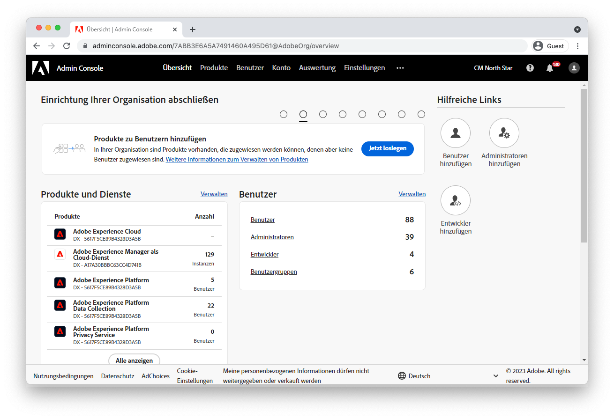

# Konfigurieren des Zugriffs auf AEM as a Cloud Service {#configuring-access-to-aem-as-a-cloud-service}

>[!CONTEXTUALHELP]
>id="aemcloud_adobeims_overview"
>title="Einführung in Adobe IMS"
>abstract="AEM as a Cloud Service nutzt Adobe IMS (Identity Management System), um die Anmeldung von Benutzern, sowohl Administratoren als auch normale Benutzer, beim AEM-Autorendienst zu erleichtern. Erfahren Sie, wie Adobe IMS-Benutzer, -Gruppen und -Produktprofile gemeinsam mit AEM Gruppen und Berechtigungen verwendet werden, um einen differenzierten Zugriff auf den AEM-Autorendienst zu ermöglichen."

AEM as a Cloud Service ist die Cloud-native Methode zur Nutzung der AEM-Anwendungen und nutzt daher Adobe IMS (Identity Management System), um die Anmeldung von Benutzern, sowohl Administratoren als auch reguläre Benutzer, beim AEM-Autorendienst zu erleichtern.

Erfahren Sie, wie Adobe IMS-Benutzer, -Gruppen und -Produktprofile gemeinsam mit AEM Gruppen und Berechtigungen verwendet werden, um einen differenzierten Zugriff auf den AEM-Autorendienst zu ermöglichen.

## Adobe IMS-Benutzer

Benutzer, die Zugriff auf den AEM-Autorendienst benötigen, werden als [Adobe IMS-Benutzer](https://helpx.adobe.com/de/enterprise/using/set-up-identity.html) in [Admin Console der Adobe](https://adminconsole.adobe.com). Erfahren Sie, was Adobe IMS-Benutzer sind und wie sie in Admin Console aufgerufen und verwaltet werden.

[Erfahren Sie mehr über Adobe IMS-Benutzer](./adobe-ims-users.md)

## Adobe IMS-Benutzergruppen

Benutzer, die auf den AEM-Autorendienst zugreifen, sollten mithilfe von [Adobe IMS-Benutzergruppen](https://helpx.adobe.com/de/enterprise/using/user-groups.html) in [Admin Console der Adobe](https://adminconsole.adobe.com). Adobe IMS-Benutzergruppen gewähren keine direkten Berechtigungen oder Zugriff auf AEM (dies ist der Auftrag von [Adobe IMS-Produktprofile](#adobe-ims-product-profiles)), sind jedoch eine hervorragende Möglichkeit, logische Benutzergruppen zu definieren, die mithilfe von AEM Gruppen und Berechtigungen in bestimmte Zugriffsebenen des AEM-Autorendienstes übersetzt werden können.

[Informationen zu Adobe IMS-Benutzergruppen](./adobe-ims-user-groups.md)

## Adobe IMS-Produktprofile

[Adobe IMS-Produktprofile](https://helpx.adobe.com/enterprise/using/manage-permissions-and-roles.html)verwaltet in [Admin Console der Adobe](https://adminconsole.adobe.com), sind die Mechanismen, die [Adobe IMS-Benutzer](#adobe-ims-users) Zugriff auf die Anmeldung beim AEM-Autorendienst mit Basiszugriff.

+ Die __AEM__ Das Produktprofil ermöglicht Benutzern schreibgeschützten Zugriff auf AEM über die Mitgliedschaft in AEM Gruppe &quot;Mitwirkende&quot;.
+ Die __AEM Administratoren__ Das Produktprofil bietet Benutzern vollständigen, administrativen Zugriff auf AEM.

[Informationen zu Adobe IMS-Produktprofilen](./adobe-ims-product-profiles.md)

## AEM Benutzergruppen und Berechtigungen

Adobe Experience Manager baut auf Adobe IMS-Benutzern, Benutzergruppen und Produktprofilen auf, um Benutzern anpassbaren Zugriff auf AEM zu ermöglichen. Erfahren Sie, wie Sie AEM Gruppen und Berechtigungen erstellen und wie diese in Abstimmung mit Adobe IMS-Abstraktionen funktionieren, um nahtlosen und anpassbaren Zugriff auf AEM zu ermöglichen.

[Erfahren Sie mehr über AEM Benutzer, Gruppen und Berechtigungen](./aem-users-groups-and-permissions.md)

## schrittweise Einführung in Zugriff und Berechtigungen

Eine kurze Anleitung zur Konfiguration von Adobe IMS-Benutzern, Benutzergruppen und Produktprofilen in der Adobe Admin Console und zur Verwendung dieser Adobe IMS-Abstraktionen in der AEM-Autoreninstanz, um bestimmte gruppenbasierte Berechtigungen zu definieren und zu verwalten.

[AEM und Berechtigungen - schrittweise](./walk-through.md)

## Zusätzliche Adobe Admin Console-Ressourcen

Die folgende Dokumentation behandelt [Adobe Admin Console](https://adminconsole.adobe.com)-spezifische Details und Bedenken, die zu einem besseren Verständnis der Adobe Admin Console und deren Verwendung bei der Verwaltung von Benutzern und dem Zugriff über Experience Cloud-Produkte hinweg beitragen können.

+ [Adobe Admin Console Identity - Übersicht](https://helpx.adobe.com/enterprise/using/identity.html)
+ [Adobe Admin Console-Administratorrollen](https://helpx.adobe.com/de/enterprise/using/admin-roles.html)
+ [Adobe Admin Console-Entwicklerrollen](https://helpx.adobe.com/de/enterprise/using/manage-developers.html)
