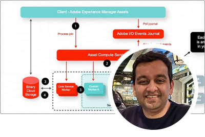

# Adobe Experience Manager as a Cloud Service Expert-Serie

Erfahren Sie mehr über Adobe Experience Manager (AEM), as a Cloud Service von den Fachingenieuren der Adobe, die das Projekt erstellen, und vom Professional Services-Team, das es bereitstellt. Schließen Sie sich den Experten der Adobe an, um zu erkunden, was AEM as a Cloud Service ist, wie es sich von AEM 6 unterscheidet und wie der Übergang von AEM 6 zu AEM as a Cloud Service ist.

  
 

## Erste Schritte mit AEM as a Cloud Service

Lernen Sie die Grundlagen von AEM als Cloud Services kennen und erfahren Sie, wie er sich von AEM 6 von den Senior Cloud Architects von Adobe Engineering unterscheidet.

<table>
  <tr>
   <td>
      
      

         <a href="./migration/moving-to-aem-as-a-cloud-service/introduction.md"><strong>Anders denken</strong></a>         
          <em>mit Darin Kuntze, Senior Cloud Architect</em>
      

      

         
         Werfen Sie einen Blick auf AEM as a Cloud Service Architektur und wie Sie über AEM as a Cloud Service Implementierungen anders denken.
      

     </td>   
     <td>
      
      

         <a href="./migration/moving-to-aem-as-a-cloud-service/onboarding.md"><strong>Einstieg in AEM as a Cloud Service</strong></a>
          <em>mit Damian Langsweirdt, Senior Cloud Architect</em>
      

      

         
         Erfahren Sie mehr über das Onboarding von AEM as a Cloud Service, beginnend mit der Vertragsphase zum Einrichten von Self-Service-Umgebungen mit Cloud Manager.
      

   </td>     
   </td>   
     <td>
      
      

         <a href="./migration/moving-to-aem-as-a-cloud-service/cloud-manager.md"><strong>Cloud Manager für AEM as a Cloud Service</strong></a>
          <em>mit Bryan Stopp, Senior Cloud Architect</em>
      

      

         
         Erfahren Sie mehr über Cloud Manager für AEM as a Cloud Service und die Unterschiede zu Cloud Manager für AEM in Adobe Manager Services (AMS).
      

   </td> 
  </tr>
</table>

## Wechseln zu AEM as a Cloud Service?

Planen Sie den Übergang von AEM 6 zu AEM as a Cloud Service? Erfahren Sie mehr über die Methodik der Adobe für den Übergang zu AEM as a Cloud Service sowie über die verschiedenen Tools und Funktionen, die diesen Übergang reibungslos gestalten.

<table>
  <tr>
   <td>
      
      

         <a href="./migration/moving-to-aem-as-a-cloud-service/bpa-and-cam.md" target="_aem-experts-series-video"><strong>Migrationsmethode</strong></a>
          <em>mit Roger Blanton, Adobe Consulting Services Technical Architect</em>
      

      

         
        Informieren Sie sich über die Best Practices für die Migration von AEM 6 zu AEM as a Cloud Service mithilfe von AEM Best Practice Analyzer (BPA) und Cloud Acceleration Manager (CAM).
      

   </td>   
     <td>
      
      

         <a href="./migration/moving-to-aem-as-a-cloud-service/aem-modernization-tools.md" target="_aem-experts-series-video"><strong>Modernisieren Ihres Inhalts</strong></a>
          <em>mit Bryan Stopp, Senior Cloud Architect</em>
      

      

         
         Erfahren Sie, wie Sie Ihre AEM automatisch modernisieren können, um die neuesten AEM as a Cloud Service Funktionen nutzen zu können.
      

   </td>     
   </td>   
     <td>
      
      

         <a href="./migration/moving-to-aem-as-a-cloud-service/repository-modernization.md" target="_aem-experts-series-video"><strong>Modernisierung Ihres AEM Maven-Projekts</strong></a>
          <em>mit Varun Mitra, Cloud Architect</em>
      

      

         
         Erfahren Sie, wie Sie die Projektstruktur und -organisation Ihrer benutzerdefinierten AEM-Anwendung automatisch modernisieren, um sie as a Cloud Service kompatibel zu machen und an die neuesten Best Practices der Adobe anzupassen.
      

   </td> 
  </tr>
  <tr>
   <td>
      
      

         <a href="./migration/moving-to-aem-as-a-cloud-service/search-and-indexing.md" target="_aem-experts-series-video"><strong>Modernisieren Ihrer Oak-Indizes</strong></a>
          <em>mit Darin Kuntze, Senior Cloud Architect</em>
      

      

         
        Erfahren Sie, wie Sie automatisch AEM 6 Oak-Indexdefinitionen konvertieren, um sie AEM as a Cloud Service kompatibel zu sein, und wie Sie Oak-Indizes für AEM as a Cloud Service Zukunft verwalten können.
      

   </td>   
     <td>
      
      

         <a href="./migration/moving-to-aem-as-a-cloud-service/dispatcher.md" target="_aem-experts-series-video"><strong>Modernisierung der Dispatcher-Konfiguration</strong></a>
          <em>mit Bryan Stopp, Senior Cloud Architect</em>
      

      

         
         Erfahren Sie mehr über AEM Dispatcher für AEM as a Cloud Service, wobei Sie sich auf wichtige Änderungen vom Dispatcher für AEM 6, das Dispatcher-Konvertierungstool und die Verwendung des Dispatcher Tools SDK konzentrieren.
      

   </td>     
   </td>   
     <td>
      
      

         <a href="./migration/moving-to-aem-as-a-cloud-service/content-migration/content-transfer-tool.md" target="_aem-experts-series-video"><strong>Übertragen Ihres Inhalts auf AEM as a Cloud Service</strong></a>
          <em>mit Kiran Murugulla, Senior Cloud Architect</em>
      

      

         
         Erfahren Sie, wie Sie mit dem Content Transfer Tool Inhalte von AEM 6.3+ auf AEM as a Cloud Service migrieren können.
      

   </td> 
  </tr>  
</table>

## Funktionen von AEM as a Cloud Services

Erfahren Sie mehr über AEM einzigartigen Funktionen von as a Cloud Service von Experten der Adobe.

<table>
  <tr>
   <td>
      
      

         <a href="./migration/moving-to-aem-as-a-cloud-service/asset-compute-microservices.md" target="_aem-experts-series-video"><strong>asset compute-Microservices</strong></a>
          <em>mit Amol Anand, Principal Cloud Architect</em>
      

      

         
        Erfahren Sie mehr über die Asset compute-Microservices von AEM Assets, wie sie AEM 6-Asset-Verarbeitung ersetzen und wie sie erweitert werden können, um benutzerdefinierte Asset-Ausgabedarstellungen zu generieren.
      

   </td>   
   <td>
      
      

         <a href="./migration/moving-to-aem-as-a-cloud-service/content-migration/bulk-import-service.md" target="_aem-experts-series-video"><strong>Massenimport von Inhalten</strong></a>
          <em>mit Kiran Murugulla, Senior Cloud Architect</em>
      

      

         
        Erfahren Sie, wie Sie mit dem Bulk Import Service und Package Manager Inhalte sicher und effizient AEM as a Cloud Service importieren können.
      

   </td> 
    <td></td>
  </tr>
</table>

## Benötigen Sie Hilfe mit AEM als Cloud Services?

Erfahren Sie, wie Sie AEM as a Cloud Service und das AEM SDK von den Experten debuggen und beheben können!

<table>
  <tr>
   <td>
      
      

         <a href="./migration/moving-to-aem-as-a-cloud-service/troubleshooting.md" 
         target="_aem-experts-series-video"><strong>Fehlerbehebung AEM as a Cloud Service</strong></a>
          <em>mit Kunwar Saluja, Cloud Architect</em>
      

      

         
        Erfahren Sie, wie Sie verschiedene Aspekte AEM as a Cloud Service beheben können, von der Fehlerbehebung beim AEM SDK und AEM as a Cloud Service bis hin zu Build- und Bereitstellungsfehlern in Cloud Manager.
      

   </td>   
    <td></td>
    <td></td>
  </tr>
</table>
