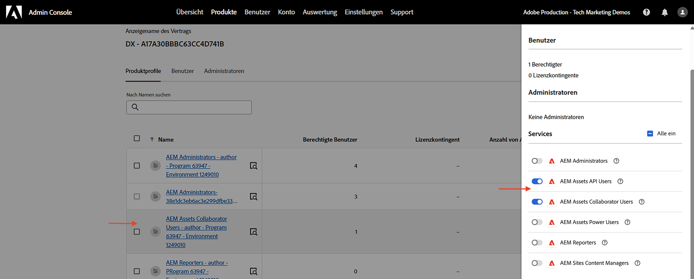
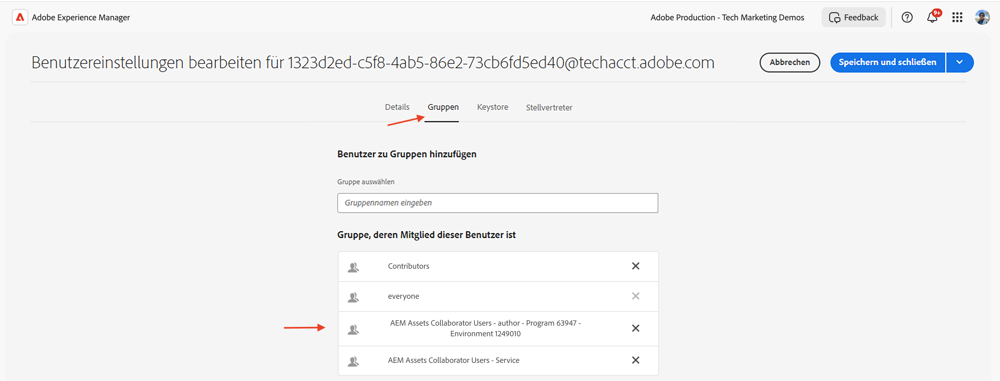

# Verwaltung von API-Anmeldedaten und -Produktprofilen

Erfahren Sie, wie Sie _Anmeldaten und Produktprofile_ für OpenAPI-basierte AEM-APIs verwalten.

In diesem Tutorial lernen Sie, wie Sie Folgendes hinzufügen oder entfernen:

- _Anmeldedaten_: Geben Sie die Authentifizierung für ein AEM-API an.
- _Produktprofile_: Geben Sie Berechtigungen (oder Autorisierungen) für Anmeldedaten für den Zugriff auf die AEM-Ressourcen an.

## Hintergrund

Wenn Sie ein AEM-API verwenden, müssen Sie die _Anmeldedaten_ und das _Produktprofil_ im Adobe Developer Console(ADC)-Projekt definieren. Im folgenden Screenshot sehen Sie die _Anmeldedaten_ und das _Produktprofil_ für ein AEM Assets Author-API:

Die _Anmeldedaten_ stellen den Authentifizierungsmechanismus für das API bereit. Das _Produktprofil_ gewährt den Anmeldedaten _Berechtigungen (oder eine Autorisierung)_ und bietet so Zugriff auf die AEM-Ressourcen. Die API-Anfrage kann im Namen einer Anwendung oder einer Benutzerin bzw. eines Benutzers erfolgen.

Ein Produktprofil ist mit einem oder mehreren _Services_ verknüpft. In AEM as a Cloud Service stellt ein _Service_ Benutzergruppen mit vordefinierten Zugriffssteuerungslisten (Access Control Lists, ACLs) für Repository-Knoten dar, was eine granulare Berechtigungsverwaltung ermöglicht.

Nach erfolgreichem API-Aufruf werden im AEM-Autoren-Service ein Benutzerprofil, das die Anmeldedaten des ADC-Projekts darstellt, sowie Benutzergruppen erstellt, die der Produktprofil- und Service-Konfiguration entsprechen. 

Im obigen Szenario wird das Benutzerprofil `1323d2...` im AEM-Autoren-Service erstellt und ist Mitglied der Benutzergruppen `AEM Assets Collaborator Users - Service` und `AEM Assets Collaborator Users - author - Program XXX - Environment XXX`.

## Hinzufügen oder Entfernen von Anmeldedaten

Die AEM-APIs unterstützen die folgenden Arten von Anmeldedaten für die Authentifizierung:

1. **OAuth-Server-zu-Server**: Entwickelt für Maschine-zu-Maschine-Interaktionen.
1. **OAuth-Web-Anwendung**: Entwickelt für benutzergesteuerte Interaktionen mit einem Backend-Server in Ihrer Client-Anwendung.
1. **OAuth-Single-Page-Application**: Entwickelt für benutzergesteuerte Interaktionen ohne Backend-Server in Ihrer Client-Anwendung.

Sie können verschiedene Anwendungsfälle mit verschiedenen Arten von Anmeldedaten unterstützen.

Alle Anmeldedaten werden in Ihrem ADC-Projekt verwaltet.

>[!BEGINTABS]

>[!TAB Hinzufügen von Anmeldedaten]

Um Anmeldedaten für ein AEM-API hinzuzufügen, gehen Sie zum Abschnitt **APIs** Ihres ADC-Projekts und klicken Sie auf **Connect another credential** (Weitere Anmeldedaten verbinden). Befolgen Sie dann die Anweisungen für Ihre spezifische Art von Anmeldedaten.

>[!TAB Entfernen von Anmeldedaten]

Um Anmeldedaten für ein AEM-API zu entfernen, wählen Sie das API im Abschnitt **APIs** Ihres ADC-Projekts aus und klicken Sie dann auf **Delete credential** (Anmeldedaten löschen).

>[!ENDTABS]

## Hinzufügen oder Entfernen von Produktprofilen

Das _Produktprofil_ gewährt den Anmeldedaten _Berechtigungen (oder eine Autorisierung)_ für den Zugriff auf die AEM-Ressourcen. Die vom _Produktprofil_ bereitgestellten Berechtigungen basieren auf den _Services_, die mit dem _Produktprofil_ verknüpft sind. Die meisten _Services_ stellen den AEM-Ressourcen die Berechtigung _READ_ (Lesen) über die Benutzergruppen in der AEM-Instanz bereit, die denselben Namen wie der _Service_ haben.

Es gibt Fälle, in denen die Anmeldedaten (auch als Benutzerprofil des technischen Kontos bezeichnet) zusätzliche Berechtigungen von AEM-Ressourcen benötigen, z. B. _Create, Update, Delete_ (CUD) (Erstellen, Aktualisieren, Löschen). In solchen Fällen müssen Sie ein neues _Produktprofil_ hinzufügen, das mit den _Services_ verknüpft ist, die die erforderlichen Berechtigungen bereitstellen.

Wenn beispielsweise der AEM Assets-Autoren-API-Aufruf den [Fehler 403 bei Nicht-GET-Anfragen](../use-cases/invoke-api-using-oauth-s2s.md#403-error-for-non-get-requests) erhält, können Sie das _Produktprofil_ **AEM Administrators - author - Program XXX - Environment XXX** (AEM-Admins - Autorin bzw. Autor - Programm XXX - Umgebung XXX) hinzufügen, um das Problem zu beheben.

>[!CAUTION]
>
>Der Service **AEM Administrators** (AEM-Admins) bieten _vollen_ administrativem Zugriff auf Experience Manager. Alternativ können Sie [Berechtigungen für Services](./services-user-group-permission-management.md) aktualisieren, um nur die erforderlichen Berechtigungen bereitzustellen.

>[!BEGINTABS]

>[!TAB Hinzufügen von Produktprofilen]

Um Produktprofile für ein AEM-API hinzuzufügen, klicken Sie im Abschnitt **APIs** des ADC-Projekts auf **Edit product profiles** (Produktprofile bearbeiten), wählen Sie im Dialogfeld **Configure API** (API konfigurieren) das gewünschte Produktprofil aus und speichern Sie Ihre Änderungen.

Wählen Sie das gewünschte Produktprofil (z.B. **AEM Administrators - author - Program XXX - Environment XXX**) (AEM-Admins – Autorin bzw. Autor – Programm XXX – Umgebung XXX) aus, das mit den erforderlichen Services verknüpft ist, und speichern Sie dann Ihre Änderungen.

Beachten Sie, dass das Produktprofil **AEM Administrators - author - Program XXX - Environment XXX** (AEM-Admins – Autorin bzw. Autor – Programm XXX – Umgebung XXX) sowohl mit dem Service **AEM Administrators** (AEM-Admins) als auch mit dem Service **AEM Assets API** (AEM Assets-API) verknüpft ist. Ohne Letzteres wird das Produktprofil nicht in der Liste der verfügbaren Produktprofile angezeigt.

Die **PATCH**-Anfrage zum Aktualisieren der Asset-Metadaten sollte jetzt ohne Probleme funktionieren.

>[!TAB Entfernen von Produktprofilen]

Um Produktprofile für ein AEM-API zu entfernen, klicken Sie im Abschnitt **APIs** des ADC-Projekts auf **Edit product profiles** (Produktprofile bearbeiten), wählen Sie im Dialogfeld **Configure API** (API konfigurieren) das gewünschte Produktprofil ab und speichern Sie Ihre Änderungen.

>[!ENDTABS]

## Zusammenfassung

Sie haben gelernt, wie Sie den Authentifizierungsmechanismus und die Berechtigungen für AEM-APIs mithilfe von _Anmeldedaten und dem Produktprofil_ in im Adobe Developer Console(ADC)-Projekt ändern können.
