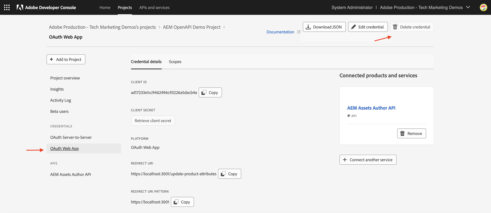

# API-Anmeldeinformationen und Produktprofilverwaltung

Erfahren Sie, wie Sie _Anmeldeinformationen und Produktprofile_ für OpenAPI-basierte AEM-APIs verwalten.

In diesem Tutorial erfahren Sie, wie Sie Folgendes hinzufügen oder entfernen:

- _Anmeldeinformationen_: Geben Sie Authentifizierung für eine AEM-API an.
- _Produktprofile_: Geben Sie Berechtigungen (oder Autorisierungen) für Anmeldeinformationen für den Zugriff auf die AEM-Ressourcen an.

## Hintergrund

Wenn Sie eine AEM-API verwenden, müssen Sie die _Anmeldeinformationen_ und _Produktprofil_ im Adobe Developer Console-Projekt (oder ADC) definieren. Im folgenden Screenshot sehen Sie die _Anmeldedaten_ und _Produktprofil_ für eine AEM Assets Author-API:

Die _Anmeldeinformationen_ stellen den Authentifizierungsmechanismus für die API bereit. Das _Produktprofil_ gewährt den Anmeldeinformationen _Berechtigungen (oder Autorisierung_ und gewährt so Zugriff auf die AEM-Ressourcen. Die API-Anfrage kann im Namen einer Anwendung oder eines Benutzers erfolgen.

Ein Produktprofil ist mit einem oder mehreren _Services_ verknüpft. In AEM as a Cloud Service stellt ein _Service_ Benutzergruppen mit vordefinierten Zugriffssteuerungslisten (ACLs) für Repository-Knoten dar, was eine granulare Berechtigungsverwaltung ermöglicht.

Nach erfolgreichem API-Aufruf wird im AEM-Autoren-Service ein Benutzer erstellt, der die Anmeldeinformationen des ADC-Projekts darstellt, sowie die Benutzergruppen, die der Produktprofil- und Service-Konfiguration entsprechen.

Im obigen Szenario wird die `1323d2...` im AEM-Autoren-Service erstellt und ist Mitglied der Benutzergruppen `AEM Assets Collaborator Users - Service` und `AEM Assets Collaborator Users - author - Program XXX - Environment XXX`.

## Hinzufügen oder Entfernen von Anmeldeinformationen

Die AEM-APIs unterstützen die folgenden Arten von Anmeldeinformationen für die Authentifizierung:

1. **OAuth Server-zu-Server**: Für Maschine-zu-Maschine-Interaktionen entwickelt.
1. **OAuth Web App**: Für benutzergesteuerte Interaktionen mit einem Backend-Server in Ihrer Client-Anwendung.
1. **OAuth Single Page App**: Für benutzergesteuerte Interaktionen ohne Backend-Server in Ihrer Client-Anwendung.

Sie können verschiedene Anwendungsfälle mit verschiedenen Arten von Anmeldeinformationen unterstützen.

Alle Anmeldeinformationen werden in Ihrem ADC-Projekt verwaltet.

>[!BEGINTABS]

>[!TAB Anmeldeinformationen hinzufügen]

Um Anmeldeinformationen für eine AEM-API hinzuzufügen, gehen Sie zum Abschnitt **APIs** Ihres ADC-Projekts und klicken Sie auf **Weitere Anmeldeinformationen verbinden**. Befolgen Sie dann die Anweisungen für Ihren spezifischen Berechtigungstyp.

>[!TAB Entfernen von Anmeldeinformationen]

Um eine AEM-API-Berechtigung zu entfernen, wählen Sie sie im Abschnitt **APIs** Ihres ADC-Projekts aus und klicken Sie dann auf **Berechtigung löschen**.

>[!ENDTABS]

## Produktprofile hinzufügen oder entfernen

Das _Produktprofil_ stellt die _Berechtigungen (oder Autorisierung)_ zu den Anmeldeinformationen für den Zugriff auf die AEM-Ressourcen bereit. Die vom _Produktprofil_ bereitgestellten Berechtigungen basieren auf den _Services_, die mit dem _Produktprofil_ verknüpft sind. Die meisten _Services_ stellen den AEM-Ressourcen über die Benutzergruppen in _AEM-Instanz, die denselben Namen wie der_ Service _haben,_ Berechtigung „LESEN“ bereit.

Es gibt Fälle, in denen die Anmeldeinformationen (auch als Benutzer des technischen Kontos bezeichnet) zusätzliche Berechtigungen wie _Erstellen, Aktualisieren, Löschen_ (CUD) von AEM-Ressourcen benötigen. In solchen Fällen müssen Sie ein neues &quot;_&quot; hinzufügen_ das den _Services“ zugeordnet ist_ die die erforderlichen Berechtigungen bereitstellen.

Wenn beispielsweise der AEM Assets-Autoren-API-Aufruf den [403-Fehler für Nicht-GET-Anfragen erhält](../use-cases/invoke-api-using-oauth-s2s.md#403-error-for-non-get-requests) können Sie **AEM-Administratoren - Autor - Programm XXX - Umgebung XXX** _Produktprofil_ hinzufügen, um das Problem zu beheben.

>[!CAUTION]
>
>Der **AEM-**-Service bietet _VOLLSTÄNDIGEN_ Administratorzugriff auf Experience Manager. Alternativ können Sie &quot;[ Berechtigungen“ aktualisieren](./services-user-group-permission-management.md) um nur die erforderlichen Berechtigungen bereitzustellen.

>[!BEGINTABS]

>[!TAB Hinzufügen von Produktprofilen]

Um Produktprofile für eine AEM-API hinzuzufügen, klicken Sie **Produktprofile bearbeiten** im Abschnitt **APIs** des ADC-Projekts, wählen Sie das gewünschte Produktprofil im Dialogfeld **API konfigurieren** aus und speichern Sie Ihre Änderungen.

    

Wählen Sie das gewünschte Produktprofil (z. B. **AEM-Administratoren - Autor - Programm XXX - Umgebung XXX**) aus, das mit den erforderlichen Services verknüpft ist, und speichern Sie dann Ihre Änderungen.

    

Beachten Sie, dass das Produktprofil **AEM-Administratoren - Autor - Programm XXX - Umgebung XXX** sowohl mit dem Service **AEM-Administratoren** als auch mit dem Service **AEM Assets-API-** verknüpft ist. Ohne Letzteres wird das Produktprofil nicht in der Liste der verfügbaren Produktprofile angezeigt.

    

Die **PATCH**-Anfrage zum Aktualisieren der Asset-Metadaten sollte jetzt ohne Probleme funktionieren.

    

>[!TAB Entfernen von Produktprofilen]

Um Produktprofile für eine AEM-API zu entfernen, klicken Sie im Abschnitt **APIs** des ADC-Projekts auf **Produktprofile bearbeiten**, heben Sie die Auswahl des gewünschten Produktprofils im Dialogfeld **API konfigurieren** auf und speichern Sie Ihre Änderungen.

>[!ENDTABS]

## Zusammenfassung

Sie haben gelernt, wie Sie den Authentifizierungsmechanismus und die Berechtigungen für AEM-APIs mithilfe von _Anmeldeinformationen und Produktprofil_ im Adobe Developer Console-Projekt (ADC) ändern können.
