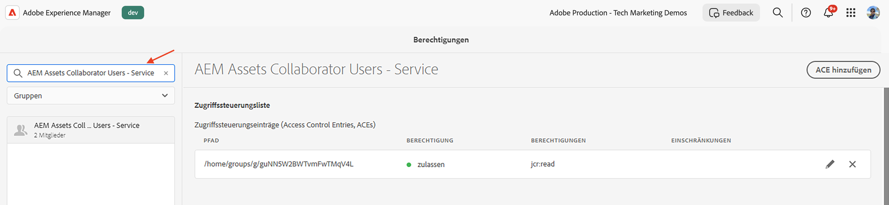
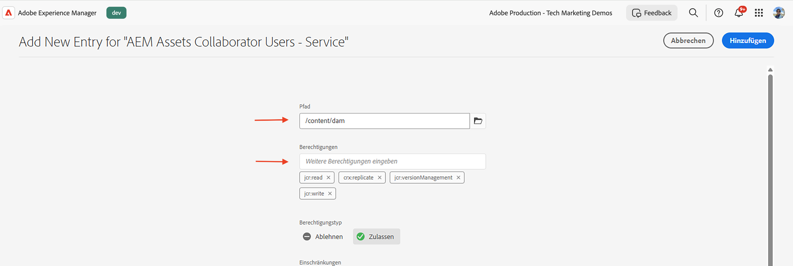
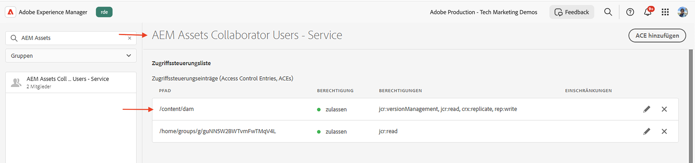

# Berechtigungsverwaltung für Produktprofil und Services-Benutzergruppe

Erfahren Sie, wie Sie Berechtigungen für die Benutzergruppen „Produktprofil“ und „Dienste“ in AEM as a Cloud Service verwalten.

In diesem Tutorial erfahren Sie mehr über:

- Produktprofil und dessen Verknüpfung mit Services.
- Die Berechtigungen der Benutzergruppe „Dienste“ werden aktualisiert.

## Hintergrund

Wenn Sie eine AEM-API verwenden, müssen Sie das _Produktprofil_ dem _Anmeldeinformationen_ im Adobe Developer Console-Projekt (oder ADC) zuweisen. Das _Produktprofil_ (und der zugehörige Service) stellt die _Berechtigungen oder Autorisierung_ für den Zugriff auf die AEM-Ressourcen bereit. Im folgenden Screenshot sehen Sie die _Anmeldedaten_ und _Produktprofil_ für eine AEM Assets Author-API:


Ein Produktprofil ist mit einem oder mehreren _Services_ verknüpft. In AEM as a Cloud Service stellt ein _Service_ Benutzergruppen mit vordefinierten Zugriffssteuerungslisten (ACLs) für Repository-Knoten dar, was eine granulare Berechtigungsverwaltung ermöglicht.


Nach erfolgreichem API-Aufruf wird im AEM-Autoren-Service ein Benutzer erstellt, der die Anmeldeinformationen des ADC-Projekts darstellt, sowie die Benutzergruppen, die der Produktprofil- und Service-Konfiguration entsprechen.


Im obigen Szenario wird die `1323d2...` im AEM-Autoren-Service erstellt und ist Mitglied der Benutzergruppen `AEM Assets Collaborator Users - Service` und `AEM Assets Collaborator Users - author - Program XXX - Environment XXX`.

## Berechtigungen für Benutzergruppen von Services aktualisieren

Die meisten _Services_ stellen den AEM-Ressourcen über die Benutzergruppen in _AEM-Instanz, die denselben Namen wie der_ Service _haben,_ Berechtigung „LESEN“ bereit.

Es gibt Fälle, in denen die Anmeldeinformationen (auch als Benutzer des technischen Kontos bezeichnet) zusätzliche Berechtigungen wie _Erstellen, Aktualisieren, Löschen_ (CUD) von AEM-Ressourcen benötigen. In solchen Fällen können Sie die Berechtigungen der Benutzergruppen _Services_ in der AEM-Instanz aktualisieren.

Wenn beispielsweise der AEM Assets-Autoren-API-Aufruf einen [403-Fehler für Nicht-GET-Anfragen erhält](../use-cases/invoke-api-using-oauth-s2s.md#403-error-for-non-get-requests) können Sie die Berechtigungen der _Benutzenden von AEM Assets Collaborator - Service_-Benutzergruppe in der AEM-Instanz aktualisieren.

Mithilfe der Benutzeroberfläche „Berechtigungen“ oder [ Skripts „Sling Repository](https://sling.apache.org/documentation/bundles/repository-initialization.html)Initialisierung“ können Sie die Berechtigungen der vordefinierten Benutzergruppen in der AEM-Instanz aktualisieren.

### Aktualisieren von Berechtigungen mithilfe der Benutzeroberfläche „Berechtigungen“

Gehen Sie wie folgt vor, um die Berechtigungen der Benutzergruppe „Services“ (z. B. &quot;`AEM Assets Collaborator Users - Service`„) über die Benutzeroberfläche „Berechtigungen“ zu aktualisieren:

- Navigieren Sie in **AEM-Instanz zu** Tools > **Sicherheit** > **Berechtigungen**.

- Suchen Sie nach der Benutzergruppe Services (z. B. `AEM Assets Collaborator Users - Service`).

  

- Klicken Sie **ACE hinzufügen**, um einen neuen Zugriffssteuerungseintrag (ACE) für die Benutzergruppe hinzuzufügen.

  

### Aktualisieren von Berechtigungen mithilfe des Repository-Initialisierungsskripts

Führen Sie die folgenden Schritte aus, um die Berechtigungen der Benutzergruppe „Services“ (z. B. &quot;`AEM Assets Collaborator Users - Service`„) mithilfe des Repository-Initialisierungsskripts zu aktualisieren:

- Öffnen Sie das AEM-Projekt in Ihrer bevorzugten IDE.

- Navigieren Sie zum `ui.config`

- Erstellen Sie in `ui.config/src/main/content/jcr_root/apps/<PROJECT-NAME>/osgiconfig/config.author` eine Datei mit dem Namen `org.apache.sling.jcr.repoinit.RepositoryInitializer-services-group-acl-update.cfg.json` mit folgendem Inhalt:

  ```json
  {
      "scripts": [
          "set ACL for \"AEM Assets Collaborator Users - Service\" (ACLOptions=ignoreMissingPrincipal)",
          "    allow jcr:read,jcr:versionManagement,crx:replicate,rep:write on /content/dam",
          "end"
      ]
  }
  ```

- Übergeben Sie die Änderungen und übertragen Sie sie in das Repository.

- Stellen Sie die Änderungen mithilfe der Full-Stack-Pipeline [ von Cloud Manager auf der AEM-Instanz ](https://experienceleague.adobe.com/de/docs/experience-manager-cloud-service/content/implementing/using-cloud-manager/cicd-pipelines/introduction-ci-cd-pipelines#full-stack-pipeline).

- Sie können die Berechtigungen der Benutzergruppe auch mithilfe der Ansicht **Berechtigungen** überprüfen. Navigieren Sie in **AEM-Instanz zu** Tools > **Sicherheit** > **Berechtigungen**.

  

### Überprüfen der Berechtigungen

Nachdem Sie die Berechtigungen mit einer der oben genannten Methoden aktualisiert haben, sollte die PATCH-Anfrage zum Aktualisieren der Asset-Metadaten jetzt problemlos funktionieren.


## Zusammenfassung

Sie haben gelernt, wie Sie Berechtigungen für die Benutzergruppen „Produktprofil“ und „Dienste“ in AEM as a Cloud Service verwalten. Sie können die Berechtigungen der Dienstbenutzergruppen in der AEM-Instanz mithilfe der Benutzeroberfläche „Berechtigungen“ oder des Repository-Initialisierungsskripts aktualisieren.
