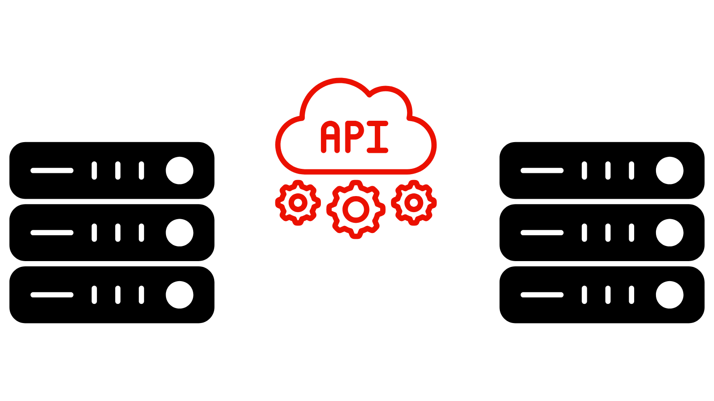

# OpenAPI-basierte AEM-APIs

>[!IMPORTANT]
>
>Die OpenAPI-basierten AEM-APIs sind nur in AEM as a Cloud Service verfügbar und nicht mit AEM 6.X kompatibel.

Erfahren Sie mehr über die OpenAPI-basierten AEM-APIs, einschließlich Authentifizierungsunterstützung, Schlüsselkonzepten und Informationen zum Zugriff auf Adobe-APIs.

Die [OpenAPI-Spezifikation](https://swagger.io/specification/) (früher bekannt als Swagger) ist ein weit verbreiteter Standard zur Definition von RESTful-APIs. AEM as a Cloud Service bietet mehrere APIs, die auf OpenAPI-Spezifikationen basieren (oder einfach OpenAPI-basierte AEM-APIs). Sie vereinfachen die Erstellung benutzerdefinierter Anwendungen, die mit den Service-Typen „Autor/Autorin“ oder „Veröffentlichen“ von AEM interagieren. Im Folgenden einige Beispiele:

**Sites**

- [Sites-API](https://developer.adobe.com/experience-cloud/experience-manager-apis/api/stable/sites/): APIs zum Arbeiten mit Inhaltsfragmenten.

**Assets**

- [Folders-API](https://developer.adobe.com/experience-cloud/experience-manager-apis/api/experimental/folders/): APIs zum Arbeiten mit Ordnern wie das Erstellen, Auflisten und Löschen von Ordnern.

- [Assets Author-API](https://developer.adobe.com/experience-cloud/experience-manager-apis/api/experimental/assets/author/): APIs zum Arbeiten mit Assets und den zugehörigen Metadaten.

**Forms**

- [Forms – Kommunikations-APIs](https://developer.adobe.com/experience-cloud/experience-manager-apis/api/experimental/document/): APIs zum Arbeiten mit Formularen und Dokumenten.

In zukünftigen Versionen werden weitere OpenAPI-basierte AEM-APIs hinzugefügt, um weitere Anwendungsfälle zu unterstützen.

## Authentifizierungsunterstützung{#authentication-support}

Die OpenAPI-basierten AEM-APIs unterstützen die OAuth 2.0-Authentifizierung, einschließlich der folgenden Grant-Typen:

- **OAuth-Server-zu-Server-Anmeldedaten**: Ideal für Backend-Services, die API-Zugriff ohne Benutzerinteraktion benötigen. Verwendet wird der Grant-Typ _client_credentials_, der eine sichere Zugriffsverwaltung auf Server-Ebene ermöglicht. Weitere Informationen finden Sie unter [OAuth-Server-zu-Server-Anmeldedaten](https://developer.adobe.com/developer-console/docs/guides/authentication/ServerToServerAuthentication/#oauth-server-to-server-credential).

- **OAuth-Web-Anwendungs-Anmeldedaten**: Geeignet für Web-Anwendungen mit Frontend- und _Backend_-Komponenten, die im Namen von Benutzenden auf AEM-APIs zugreifen. Verwendet wird der Grant-Typ _authorization_code_, dem der Backend-Server Geheimnisse und Token sicher verwaltet. Weitere Informationen finden Sie unter [OAuth-Web-Anwendungs-Anmeldedaten](https://developer.adobe.com/developer-console/docs/guides/authentication/UserAuthentication/implementation#oauth-web-app-credential).

- **OAuth-Single-Page-Application-Anmeldedaten**: Entwickelt für SPAs, die im Browser ausgeführt werden, der im Namen einer Benutzerin bzw. eines Benutzers ohne Backend-Server auf APIs zugreifen muss. Verwendet wird der Grant-Typ _authorization_code_. Dieser verlässt sich auf Client-seitige Sicherheitsmechanismen, die PKCE (Proof Key for Code Exchange) verwenden, um den Autorisierungs-Code-Fluss zu sichern. Weitere Informationen finden Sie unter [OAuth-Single-Page-Application-Anmeldedaten](https://developer.adobe.com/developer-console/docs/guides/authentication/UserAuthentication/implementation#oauth-single-page-app-credential).

## Authentifizierungsmethoden und ihre Anwendung{#auth-method-decision}

Beachten Sie bei Auswahl der Authentifizierungsmethode Folgendes:

Benutzerauthentifizierung (Web-Anwendung oder Single Page Application) sollte die Standardoption sein, wenn AEM-Benutzerkontext betroffen ist. Dadurch wird sichergestellt, dass alle Aktionen im Repository ordnungsgemäß der authentifizierten Benutzerin bzw. dem authentifizierten Benutzer zugeordnet werden und dass die Benutzerin bzw. der Benutzer nur auf die Berechtigungen beschränkt ist, die ihr bzw. ihm gewährt wurden.
Die Verwendung des Server-zu-Server-Kontos (oder des technischen Systemkontos) zum Ausführen von Aktionen für eine einzelne Benutzerin bzw. einen einzelnen Benutzer umgeht das Sicherheitsmodell und birgt Risiken wie Berechtigungseskalation und ungenaues Auditing.

## Unterschied zwischen OAuth-Server-zu-Server-, Web-Anwendungs- und Single-Page-Application-Anmeldedaten{#difference-between-oauth-server-to-server-vs-web-app-vs-single-page-app-credentials}

In der folgenden Tabelle werden die Unterschiede zwischen den drei OAuth-Authentifizierungsmethoden zusammengefasst, die von OpenAPI-basierten AEM-APIs unterstützt werden:

|  | OAuth-Server-zu-Server | OAuth-Web-Anwendung | OAuth-Single-Page-Application (SPA) |
| --- | --- | --- | --- |
| **Authentifizierungszweck** | Entwickelt für Maschine-zu-Maschine-Interaktionen. | Entwickelt für benutzergesteuerte Interaktionen in einer Web-Anwendung mit _Backend_. | Entwickelt für benutzergesteuerte Interaktionen in einer _Client-seitigen JavaScript-Anwendung_. |
| **Token-Verhalten** | Gibt Zugriffs-Token aus, die für die Client-Anwendung selbst stehen. | Gibt Zugriffs-Token in Namen von authentifizierten Benutzenden _über ein Backend_ aus. | Gibt Zugriffs-Token im Namen von authentifizierten Benutzenden _über einen reinen Frontend-Fluss_ aus. |
| **Anwendungsfälle** | Backend-Services, die API-Zugriff ohne Benutzerinteraktion benötigen. | Web-Anwendungen mit Frontend- und Backend-Komponenten, die im Namen von Benutzenden auf APIs zugreifen. | Reine Frontend-Anwendungen (JavaScript), die ohne Backend im Namen von Benutzenden auf APIs zugreifen. |
| **Sicherheitsaspekte** | Sicheres Speichern vertraulicher Anmeldedaten (`client_id`, `client_secret`) in Backend-Systemen. | Nach der Benutzerauthentifizierung erhalten sie _über einen Backend-Aufruf ein eigenes temporäres Zugriffs-Token_. Sicheres Speichern vertraulicher Anmeldedaten (`client_id`, `client_secret`) in Backend-Systemen, um den Autorisierungs-Code gegen ein Zugriffs-Token auszutauschen. | Nach der Benutzerauthentifizierung erhalten sie _über einen Frontend-Aufruf ein eigenes temporäres Zugriffs-Token_. Verwendet nicht `client_secret`, da das Speichern in Frontend-Anwendungen unsicher ist. Stützt sich beim Austausch von Autorisierungs-Code gegen Zugriffs-Token auf PKCE. |
| **Grant-Typ** | _client_credentials_ | _authorization_code_ | _authorization_code_ mit **PKCE** |
| **Anmeldedatentyp für Adobe Developer Console** | OAuth-Server-zu-Server | OAuth-Web-Anwendung | OAuth-Single-Page-App |
| **Tutorial** | [Aufrufen des APIs mit Server-zu-Server-Authentifizierung](./use-cases/invoke-api-using-oauth-s2s.md) | [Aufrufen des APIs mit Web-Anwendungs-Authentifizierung](./use-cases/invoke-api-using-oauth-web-app.md) | [Aufrufen des APIs mit Single-Page-Application-Authentifizierung](./use-cases/invoke-api-using-oauth-single-page-app.md) |

## Zugreifen auf Adobe-APIs und zugehörige Konzepte{#accessing-adobe-apis-and-related-concepts}

Bevor Sie auf Adobe-APIs zugreifen, müssen Sie diese Schlüsselkonstrukte verstehen:

- **[Adobe Developer Console](https://developer.adobe.com/)**: Der Entwicklungs-Hub für den Zugriff auf Adobe-APIs, SDKs, Echtzeitereignisse, Server-lose Funktionen usw. Beachten Sie, dass sie sich von der _AEM_ Developer Console unterscheidet, die zum Debugging von AEM-Anwendungen verwendet wird.

- **[Adobe Developer Console-Projekt](https://developer.adobe.com/developer-console/docs/guides/projects/)**: Zentraler Ort für die Verwaltung von API-Integrationen, Ereignissen und Laufzeitfunktionen. Hier konfigurieren Sie APIs, legen die zugehörige Authentifizierung fest und generieren die erforderlichen Anmeldedaten.

- **[Produktprofile](https://helpx.adobe.com/de/enterprise/using/manage-product-profiles.html)**: Produktprofile bieten eine Berechtigungsvoreinstellung, mit der Sie den Benutzer- oder Anwendungszugriff auf Adobe-Produkte wie AEM, Adobe Target, Adobe Analytics usw. steuern können. Jedem Adobe-Produkt sind vordefinierte Produktprofile zugeordnet.

- **Services**: Services definieren die tatsächlichen Berechtigungen und sind mit dem Produktprofil verknüpft. Um die Berechtigungsvoreinstellungen einzuschränken oder zu erweitern, können Sie die dem Produktprofil zugeordneten Services ab- oder auswählen. Auf diese Weise können Sie die Zugriffsebene für das Produkt und seine APIs steuern. In AEM as a Cloud Service stellen Services Benutzergruppen mit vordefinierten Zugriffssteuerungslisten (Access Control Lists, ACLs) für Repository-Knoten dar, was eine granulare Berechtigungsverwaltung ermöglicht.

## Erste Schritte

Erfahren Sie, wie Sie Ihre AEM as a Cloud Service-Umgebung und ein Adobe Developer Console-Projekt einrichten, um den Zugriff auf OpenAPI-basierte AEM-APIs zu aktivieren. Sie können auch über den Browser auf das AEM-API zugreifen, um die Einrichtung zu verifizieren und die Anfrage und Antwort zu überprüfen.

<!-- CARDS
{target = _self}

* ./setup.md
  {title = Set up OpenAPI-based AEM APIs}
  {description = Learn how to set up your AEM as a Cloud Service environment to enable access to the OpenAPI-based AEM APIs.}
  {image = ./assets/setup/OpenAPI-Setup.png}
-->
<!-- START CARDS HTML - DO NOT MODIFY BY HAND -->

    

        

            

                <figure class="image x-is-16by9">
                    
                </figure>
            

            

                

                    

                        <a href="./setup.md" target="_self" rel="referrer" title="Einrichten von OpenAPI-basierten AEM-APIs">Einrichten von OpenAPI-basierten AEM-APIs</a>
                    

                    
Erfahren Sie, wie Sie Ihre AEM as a Cloud Service-Umgebung einrichten, um den Zugriff auf OpenAPI-basierte AEM-APIs zu aktivieren.

                

                <a href="./setup.md" target="_self" rel="referrer" class="spectrum-Button spectrum-Button--outline spectrum-Button--primary spectrum-Button--sizeM" style="align-self: flex-start; margin-top: 1rem;">
                    Mehr erfahren
                </a>
            

        

    

<!-- END CARDS HTML - DO NOT MODIFY BY HAND -->

## API-Tutorials

Erfahren Sie, wie Sie die OpenAPI-basierten AEM-APIs mit verschiedenen OAuth-Authentifizierungsmethoden verwenden:

<!-- CARDS
{target = _self}

* ./use-cases/invoke-api-using-oauth-s2s.md
  {title = Invoke API using Server-to-Server authentication}
  {description = Learn how to invoke OpenAPI-based AEM APIs from a custom NodeJS application using OAuth Server-to-Server authentication.}
  {image = ./assets/s2s/OAuth-S2S.png}
* ./use-cases/invoke-api-using-oauth-web-app.md
  {title = Invoke API using Web App authentication}
  {description = Learn how to invoke OpenAPI-based AEM APIs from a custom web application using OAuth Web App authentication.}
  {image = ./assets/web-app/OAuth-WebApp.png}
* ./use-cases/invoke-api-using-oauth-single-page-app.md
  {title = Invoke API using Single Page App authentication}
  {description = Learn how to invoke OpenAPI-based AEM APIs from a custom Single Page App (SPA) using OAuth Single Page App authentication.}
  {image = ./assets/spa/OAuth-SPA.png}  
-->
<!-- START CARDS HTML - DO NOT MODIFY BY HAND -->

    

        

            

                <figure class="image x-is-16by9">
                    
                </figure>
            

            

                

                    

                        <a href="./use-cases/invoke-api-using-oauth-s2s.md" target="_self" rel="referrer" title="Aufrufen des APIs mit Server-zu-Server-Authentifizierung">Aufrufen des APIs mit Server-zu-Server-Authentifizierung</a>
                    

                    
Erfahren Sie, wie Sie OpenAPI-basierte AEM-APIs aus einer benutzerdefinierten NodeJS-Anwendung mithilfe der OAuth-Server-zu-Server-Authentifizierung aufrufen.

                

                <a href="./use-cases/invoke-api-using-oauth-s2s.md" target="_self" rel="referrer" class="spectrum-Button spectrum-Button--outline spectrum-Button--primary spectrum-Button--sizeM" style="align-self: flex-start; margin-top: 1rem;">
                    Mehr erfahren
                </a>
            

        

    

    

        

            

                <figure class="image x-is-16by9">
                    
                </figure>
            

            

                

                    

                        <a href="./use-cases/invoke-api-using-oauth-web-app.md" target="_self" rel="referrer" title="Aufrufen des APIs mit Web-Anwendungs-Authentifizierung">Aufrufen des APIs mit Web-Anwendungs-Authentifizierung</a>
                    

                    
Erfahren Sie, wie Sie OpenAPI-basierte AEM-APIs aus einer benutzerdefinierten Web-Anwendung mithilfe der OAuth-Web-Anwendungs-Authentifizierung aufrufen.

                

                <a href="./use-cases/invoke-api-using-oauth-web-app.md" target="_self" rel="referrer" class="spectrum-Button spectrum-Button--outline spectrum-Button--primary spectrum-Button--sizeM" style="align-self: flex-start; margin-top: 1rem;">
                    Mehr erfahren
                </a>
            

        

    

    

        

            

                <figure class="image x-is-16by9">
                    
                </figure>
            

            

                

                    

                        <a href="./use-cases/invoke-api-using-oauth-single-page-app.md" target="_self" rel="referrer" title="Aufrufen des APIs mit Single-Page-Application-Authentifizierung">Aufrufen des APIs mit Single-Page-Application-Authentifizierung</a>
                    

                    
Erfahren Sie, wie Sie OpenAPI-basierte AEM-APIs aus einer benutzerdefinierten Single Page Application (SPA) mithilfe der OAuth-Single-Page-Application-Authentifizierung aufrufen.

                

                <a href="./use-cases/invoke-api-using-oauth-single-page-app.md" target="_self" rel="referrer" class="spectrum-Button spectrum-Button--outline spectrum-Button--primary spectrum-Button--sizeM" style="align-self: flex-start; margin-top: 1rem;">
                    Mehr erfahren
                </a>
            

        

    

<!-- END CARDS HTML - DO NOT MODIFY BY HAND -->
