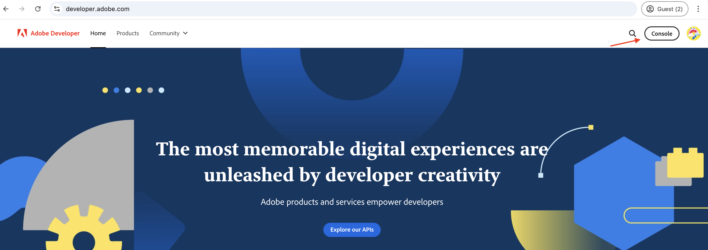

# Einrichten von OpenAPI-basierten AEM-APIs

Erfahren Sie, wie Sie Ihre AEM as a Cloud Service-Umgebung einrichten, um den Zugriff auf die OpenAPI-basierten AEM-APIs zu ermöglichen.

>[!VIDEO](https://video.tv.adobe.com/v/3457510?quality=12&learn=on)

Der Einrichtungsprozess auf hoher Ebene umfasst die folgenden Schritte:

1. Modernisierung der AEM as a Cloud Service-Umgebung.
1. Aktivieren des Zugriffs auf AEM-APIs.
1. Erstellen Sie ein Adobe Developer Console-Projekt (ADC).
1. Konfigurieren des ADC-Projekts.
1. Konfigurieren Sie die AEM-Instanz, um die ADC-Projektkommunikation zu aktivieren.

## Modernisierung der AEM as a Cloud Service-Umgebung{#modernization-of-aem-as-a-cloud-service-environment}

Die Modernisierung der AEM as a Cloud Service-Umgebung ist eine einmalige Aktivität pro Umgebung, die die folgenden Schritte umfasst:

- Aktualisierung auf die AEM-Version **2024.10.18459.20241031T210302Z** oder höher.
- Fügen Sie neue Produktprofile hinzu, wenn die Umgebung vor der Version 2024.10.18459.20241031T.210302 erstellt wurde.

### AEM-Instanz aktualisieren{#update-aem-instance}

Um die AEM-Instanz zu aktualisieren, klicken Sie im Abschnitt _Umgebungen_ von Adobe &lbrace;0[&#128279;](https://my.cloudmanager.adobe.com/)Cloud Manager auf das Symbol _Auslassungspunkte_ neben dem Umgebungsnamen und wählen Sie die Option **Aktualisieren** aus.


Klicken Sie dann auf **Senden** und führen Sie die _vorgeschlagene_ Full-Stack-Pipeline aus.


In meinem Fall heißt die Full-Stack-Pipeline **dev :: fullstack-Deploy** und die AEM-Umgebung heißt **wknd-program-dev**. Ihre Namen können unterschiedlich sein.

### Hinzufügen neuer Produktprofile{#add-new-product-profiles}

Um der AEM-Instanz neue Produktprofile hinzuzufügen, klicken Sie im Abschnitt _Umgebungen_ von Adobe [Cloud Manager](https://my.cloudmanager.adobe.com/) auf das Symbol _Auslassungspunkte_ neben dem Umgebungsnamen und wählen Sie die Option **Produktprofile hinzufügen** aus.


Sie können die neu hinzugefügten Produktprofile überprüfen, indem Sie auf das Symbol _Auslassungspunkte_ neben dem Umgebungsnamen klicken und **Zugriff verwalten** > **Autorenprofile** auswählen.

Im Fenster _Admin Console_ werden die neu hinzugefügten Produktprofile angezeigt.


Mit den oben genannten Schritten wird die Modernisierung der AEM as a Cloud Service-Umgebung abgeschlossen.

## Zugriff auf AEM-APIs aktivieren{#enable-aem-apis-access}

Das Vorhandensein der _neuen Produktprofile_ ermöglicht den OpenAPI-basierten Zugriff auf AEM-APIs in Adobe Developer Console (ADC). Denken Sie daran, dass [Adobe Developer Console (ADC)](./overview.md#accessing-adobe-apis-and-related-concepts) der Entwicklungs-Hub für den Zugriff auf Adobe-APIs, SDKs, Echtzeit-Ereignisse, Server-lose Funktionen und mehr ist.

Die neu hinzugefügten Produktprofile sind mit den _Services_ verknüpft, die _AEM-Benutzergruppen mit vordefinierten Zugriffssteuerungslisten (ACLs) darstellen_. Die _Services_ werden verwendet, um die Zugriffsebene auf die AEM-APIs zu steuern.

Sie können auch die mit dem Produktprofil verknüpften _Services_ auswählen oder die Auswahl aufheben, um die Zugriffsebene zu reduzieren oder zu erhöhen.

Überprüfen Sie die Verknüpfung, indem Sie auf das Symbol _Details anzeigen_ neben dem Namen des Produktprofils klicken.


Standardmäßig ist der Service **AEM Assets API Users** mit keinem Produktprofil verknüpft. Verknüpfen wir sie mit dem neu hinzugefügten Produktprofil **AEM Assets Collaborator Users - Author - Program XXX - Environment XXX**. Nach dieser Verknüpfung kann die _Asset-Autoren-API_ des ADC-Projekts die gewünschte Server-zu-Server-Authentifizierung einrichten und das Authentifizierungskonto aus dem ADC-Projekt (im nächsten Schritt erstellt) mit dem Produktprofil verknüpfen.


>[!IMPORTANT]
>
>Der obige Schritt ist wichtig, um die Server-zu-Server-Authentifizierung für die AEM Assets-API zu aktivieren. Ohne diese Zuordnung kann die AEM Assets-API nicht mit der Server-zu-Server-Authentifizierungsmethode verwendet werden.

## Erstellen eines Adobe Developer Console-Projekts (ADC){#adc-project}

Das ADC-Projekt wird verwendet, um die gewünschten APIs hinzuzufügen, seine Authentifizierung einzurichten und das Authentifizierungskonto mit dem Produktprofil zu verknüpfen.

Erstellen eines ADC-Projekts:

1. Melden Sie sich mit Ihrer Adobe ID bei [&#128279;](https://developer.adobe.com/console) Adobe Developer Console an.

   

1. Klicken Sie _Abschnitt „Schnellstart_ auf die Schaltfläche **Neues Projekt erstellen**.

   

1. Es wird ein neues Projekt mit dem Standardnamen erstellt.

   

1. Bearbeiten Sie den Projektnamen, indem Sie auf die **Projekt bearbeiten** oben rechts klicken. Geben Sie einen aussagekräftigen Namen ein und klicken Sie auf **Speichern**.

   

## ADC-Projekt konfigurieren{#configure-adc-project}

Nachdem Sie das ADC-Projekt erstellt haben, müssen Sie die gewünschten AEM-APIs hinzufügen, die Authentifizierung einrichten und das Authentifizierungskonto mit dem Produktprofil verknüpfen.

1. Um AEM-APIs hinzuzufügen, klicken Sie auf die Schaltfläche **API hinzufügen**.

   

1. Filtern _im Dialogfeld „API hinzufügen_ nach _Experience Cloud_ und wählen Sie die gewünschte AEM-API aus. In diesem Fall ist beispielsweise die _Asset-Autoren-API_ ausgewählt.

   

1. Wählen Sie anschließend im Dialogfeld _API konfigurieren_ die gewünschte Authentifizierungsoption aus. In diesem Fall ist beispielsweise die Option **Server-zu-Server**-Authentifizierung ausgewählt.

   

   Die Server-zu-Server-Authentifizierung ist ideal für Backend-Services, die API-Zugriff ohne Benutzerinteraktion benötigen. Die Authentifizierungsoptionen für Web-Apps und Einzelseiten-Apps eignen sich für Anwendungen, die API-Zugriff im Namen von Benutzern benötigen. Weitere Informationen finden Sie [Unterschied zwischen OAuth Server-zu-Server- und Web-App-Anmeldeinformationen ](./overview.md#difference-between-oauth-server-to-server-vs-web-app-vs-single-page-app-credentials) Einzelseiten-App-Anmeldeinformationen“.

1. Bei Bedarf können Sie die API umbenennen, um die Identifizierung zu erleichtern. Zu Demozwecken wird der Standardname verwendet.

   

1. In diesem Fall lautet die Authentifizierungsmethode **OAuth Server-zu-Server**. Daher müssen Sie das Authentifizierungskonto mit dem Produktprofil verknüpfen. Wählen Sie das Produktprofil **AEM Assets Collaborator Users - Author - Program XXX - Environment XXX** und klicken Sie auf **Speichern**.

   

1. Überprüfen Sie die AEM-API und die Authentifizierungskonfiguration.

   

   

Wenn Sie die Authentifizierungsmethode **OAuth Web App** oder **OAuth Single Page App** wählen, wird die Produktprofilzuordnung nicht aufgefordert, aber die Umleitungs-URI der Anwendung ist erforderlich. Der Anwendungsumleitungs-URI wird verwendet, um den Benutzer nach der Authentifizierung mit einem Autorisierungs-Code an die Anwendung umzuleiten. In den Tutorials zu den entsprechenden Anwendungsfällen werden solche authentifizierungsspezifischen Konfigurationen beschrieben.

## Konfigurieren der AEM-Instanz, um die ADC-Projektkommunikation zu aktivieren{#configure-aem-instance}

Um die ClientID des ADC-Projekts für die Kommunikation mit der AEM-Instanz zu aktivieren, müssen Sie die AEM-Instanz konfigurieren.

Dies geschieht, indem die API-Konfiguration in einer YAML-Datei definiert und mithilfe der Konfigurations-Pipeline in der Cloud Manager bereitgestellt wird. Die YAML-Datei definiert die zulässigen Client-IDs aus dem ADC-Projekt, die mit der AEM-Instanz kommunizieren können.

1. Suchen Sie im AEM-Projekt im Ordner `config` nach der Datei `api.yaml` oder erstellen Sie diese.

   {width="500" zoomable="no"}

1. Fügen Sie der Datei `api.yaml` die folgende Konfiguration hinzu:

   ```yaml
   kind: "API"
   version: "1.0"
   metadata: 
       envTypes: ["dev", "stage", "prod"]
   data:
       allowedClientIDs:
           author:
           - "<ADC Project's Credentials ClientID>"
   ```

   Ersetzen Sie `<ADC Project's Credentials ClientID>` durch die tatsächliche ClientID des Wertes der Anmeldeinformationen des ADC-Projekts. Der in diesem Tutorial verwendete API-Endpunkt ist nur auf der Autorenebene verfügbar, aber für andere APIs kann die YAML-Konfiguration auch über einen Knoten _publish_ oder _preview_ verfügen.

   >[!CAUTION]
   >
   > Zu Demozwecken wird für alle Umgebungen dieselbe Client-ID verwendet. Es wird empfohlen, für mehr Sicherheit und Kontrolle eine separate Client-ID pro Umgebung (Entwicklung, Staging, Produktion) zu verwenden.

1. Übergeben Sie die Konfigurationsänderungen und übertragen Sie die Änderungen an das Remote-Git-Repository, mit dem die Cloud Manager-Pipeline verbunden ist.

1. Stellen Sie die oben genannten Änderungen mithilfe der Konfigurations-Pipeline in Cloud Manager bereit. Beachten Sie, dass die Datei `api.yaml` mithilfe von Befehlszeilenprogrammen auch in einer schnellen Entwicklungsumgebung installiert werden kann.

   

## Nächste Schritte

Sobald die AEM-Instanz so konfiguriert ist, dass die ADC-Projektkommunikation aktiviert wird, können Sie mit der Verwendung der OpenAPI-basierten AEM-APIs beginnen. Erfahren Sie, wie Sie die OpenAPI-basierten AEM-APIs mit verschiedenen OAuth-Authentifizierungsmethoden verwenden:

<!-- CARDS
{target = _self}

* ./use-cases/invoke-api-using-oauth-s2s.md
  {title = Invoke API using Server-to-Server authentication}
  {description = Learn how to invoke OpenAPI-based AEM APIs from a custom NodeJS application using OAuth Server-to-Server authentication.}
  {image = ./assets/s2s/OAuth-S2S.png}
* ./use-cases/invoke-api-using-oauth-web-app.md
  {title = Invoke API using Web App authentication}
  {description = Learn how to invoke OpenAPI-based AEM APIs from a custom web application using OAuth Web App authentication.}
  {image = ./assets/web-app/OAuth-WebApp.png}
* ./use-cases/invoke-api-using-oauth-single-page-app.md
  {title = Invoke API using Single Page App authentication}
  {description = Learn how to invoke OpenAPI-based AEM APIs from a custom Single Page App (SPA) using OAuth 2.0 PKCE flow.}
  {image = ./assets/spa/OAuth-SPA.png}  
-->
<!-- START CARDS HTML - DO NOT MODIFY BY HAND -->
<div class="columns">
    <div class="column is-half-tablet is-half-desktop is-one-third-widescreen" aria-label="Invoke API using Server-to-Server authentication">
        <div class="card" style="height: 100%; display: flex; flex-direction: column; height: 100%;">
            <div class="card-image">
                <figure class="image x-is-16by9">
                    <a href="./use-cases/invoke-api-using-oauth-s2s.md" title="Aufrufen der API mithilfe der Server-zu-Server-Authentifizierung" target="_self" rel="referrer">
                        
                    </a>
                </figure>
            </div>
            <div class="card-content is-padded-small" style="display: flex; flex-direction: column; flex-grow: 1; justify-content: space-between;">
                <div class="top-card-content">
                    <p class="headline is-size-6 has-text-weight-bold">
                        <a href="./use-cases/invoke-api-using-oauth-s2s.md" target="_self" rel="referrer" title="Aufrufen der API mithilfe der Server-zu-Server-Authentifizierung">Aufrufen der API mithilfe der Server-zu-Server-Authentifizierung</a>
                    </p>
                    <p class="is-size-6">Erfahren Sie, wie Sie OpenAPI-basierte AEM-APIs aus einem benutzerdefinierten NodeJS-Programm mithilfe der OAuth-Server-zu-Server-Authentifizierung aufrufen.</p>
                </div>
                <a href="./use-cases/invoke-api-using-oauth-s2s.md" target="_self" rel="referrer" class="spectrum-Button spectrum-Button--outline spectrum-Button--primary spectrum-Button--sizeM" style="align-self: flex-start; margin-top: 1rem;">
<span class="spectrum-Button-label has-no-wrap has-text-weight-bold">Mehr erfahren</span>
</a>
            </div>
        </div>
    </div>
    <div class="column is-half-tablet is-half-desktop is-one-third-widescreen" aria-label="Invoke API using Web App authentication">
        <div class="card" style="height: 100%; display: flex; flex-direction: column; height: 100%;">
            <div class="card-image">
                <figure class="image x-is-16by9">
                    <a href="./use-cases/invoke-api-using-oauth-web-app.md" title="Aufrufen der API mithilfe der Web-App-Authentifizierung" target="_self" rel="referrer">
                        
                    </a>
                </figure>
            </div>
            <div class="card-content is-padded-small" style="display: flex; flex-direction: column; flex-grow: 1; justify-content: space-between;">
                <div class="top-card-content">
                    <p class="headline is-size-6 has-text-weight-bold">
                        <a href="./use-cases/invoke-api-using-oauth-web-app.md" target="_self" rel="referrer" title="Aufrufen der API mithilfe der Web-App-Authentifizierung">Aufrufen der API mithilfe der Web-App-Authentifizierung</a>
                    </p>
                    <p class="is-size-6">Erfahren Sie, wie Sie OpenAPI-basierte AEM-APIs über eine benutzerdefinierte Web-Anwendung mithilfe der OAuth-Web-App-Authentifizierung aufrufen.</p>
                </div>
                <a href="./use-cases/invoke-api-using-oauth-web-app.md" target="_self" rel="referrer" class="spectrum-Button spectrum-Button--outline spectrum-Button--primary spectrum-Button--sizeM" style="align-self: flex-start; margin-top: 1rem;">
<span class="spectrum-Button-label has-no-wrap has-text-weight-bold">Mehr erfahren</span>
</a>
            </div>
        </div>
    </div>
    <div class="column is-half-tablet is-half-desktop is-one-third-widescreen" aria-label="Invoke API using Single Page App authentication">
        <div class="card" style="height: 100%; display: flex; flex-direction: column; height: 100%;">
            <div class="card-image">
                <figure class="image x-is-16by9">
                    <a href="./use-cases/invoke-api-using-oauth-single-page-app.md" title="Aufrufen der API mithilfe der Authentifizierung über die Einzelseiten-App" target="_self" rel="referrer">
                        
                    </a>
                </figure>
            </div>
            <div class="card-content is-padded-small" style="display: flex; flex-direction: column; flex-grow: 1; justify-content: space-between;">
                <div class="top-card-content">
                    <p class="headline is-size-6 has-text-weight-bold">
                        <a href="./use-cases/invoke-api-using-oauth-single-page-app.md" target="_self" rel="referrer" title="Aufrufen der API mithilfe der Authentifizierung über die Einzelseiten-App">Aufrufen der API mithilfe der Einzelseiten-App-Authentifizierung</a>
                    </p>
                    <p class="is-size-6">Erfahren Sie, wie Sie OpenAPI-basierte AEM-APIs aus einer benutzerdefinierten Single Page App (SPA) mithilfe des OAuth 2.0 PKCE-Flusses aufrufen.</p>
                </div>
                <a href="./use-cases/invoke-api-using-oauth-single-page-app.md" target="_self" rel="referrer" class="spectrum-Button spectrum-Button--outline spectrum-Button--primary spectrum-Button--sizeM" style="align-self: flex-start; margin-top: 1rem;">
<span class="spectrum-Button-label has-no-wrap has-text-weight-bold">Mehr erfahren</span>
</a>
            </div>
        </div>
    </div>
</div>
<!-- END CARDS HTML - DO NOT MODIFY BY HAND -->
