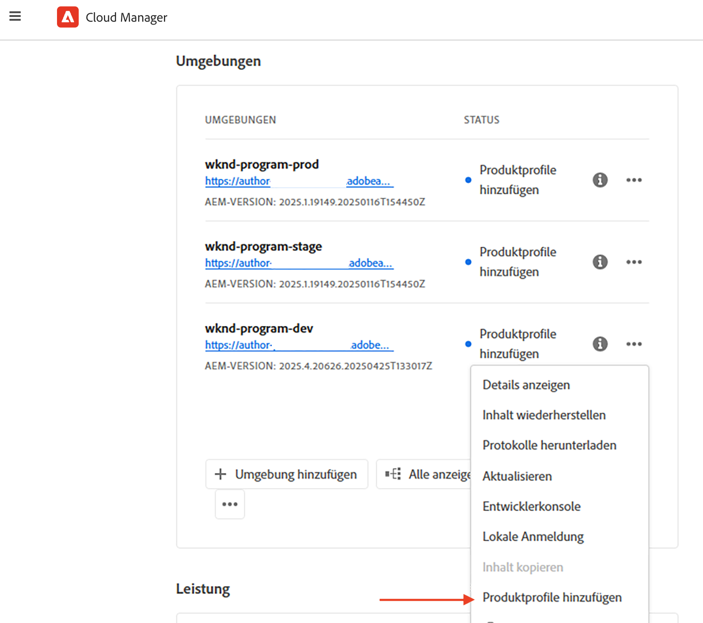
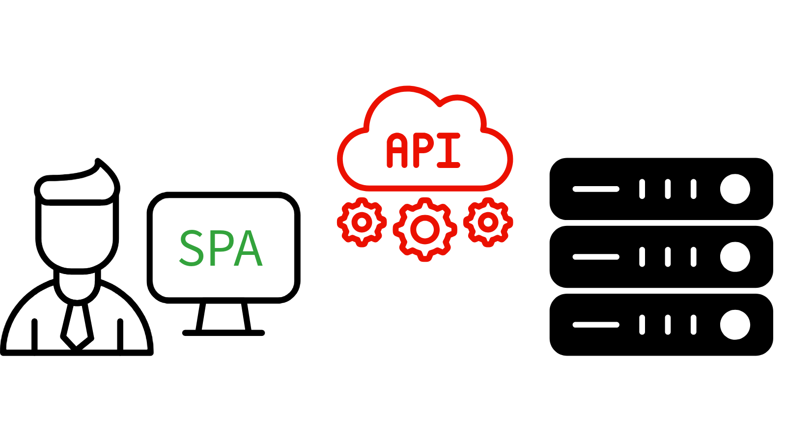

# Einrichten von OpenAPI-basierten AEM-APIs

Erfahren Sie, wie Sie Ihre AEM as a Cloud Service-Umgebung einrichten, um den Zugriff auf OpenAPI-basierte AEM-APIs zu aktivieren.

In diesem Beispiel wird die AEM Assets-API unter Verwendung der Server-zu-Server-Authentifizierungsmethode verwendet, um den Einrichtungsprozess zu demonstrieren. Die gleichen Schritte können für andere OpenAPI-basierte AEM-APIs ausgeführt werden.

>[!VIDEO](https://video.tv.adobe.com/v/3457510?quality=12&learn=on)

Der allgemeine Einrichtungsprozess umfasst die folgenden Schritte:

1. Modernisieren der AEM as a Cloud Service-Umgebung
1. Aktivieren des AEM-API-Zugriffs
1. Erstellen eines Adobe Developer Console(ADC)-Projekts
1. Konfigurieren des ADC-Projekts
1. Konfigurieren der AEM-Instanz zur Aktivierung der ADC-Projektkommunikation

## Modernisieren der AEM as a Cloud Service-Umgebung{#modernization-of-aem-as-a-cloud-service-environment}

Die Modernisierung der AEM as a Cloud Service-Umgebung ist eine einmalige Aktivität pro Umgebung, die die folgenden Schritte vorsieht:

- Aktualisieren auf die AEM-Version **2024.10.18459.20241031T210302Z** oder höher
- Hinzufügen neuer Produktprofile, wenn die Umgebung vor der Version 2024.10.18459.20241031T210302Z erstellt wurde

### Aktualisieren der AEM-Instanz{#update-aem-instance}

Um die AEM-Instanz zu aktualisieren, wählen Sie im Abschnitt _Umgebungen_ von Adobe [Cloud Manager](https://my.cloudmanager.adobe.com/) das Symbol mit den _Auslassungspunkten_ neben dem Umgebungsnamen und dann die Option **Aktualisieren** aus.


Klicken Sie anschließend auf die Schaltfläche **Absenden** und führen Sie die _vorgeschlagene_ Fullstack-Pipeline aus.


Im vorliegenden Fall heißt die Fullstack-Pipeline **Dev :: Fullstack-Deploy** und die AEM-Umgebung **wknd-program-dev**. Bei Ihnen lauten die Namen womöglich anders.

### Hinzufügen neuer Produktprofile{#add-new-product-profiles}

Um der AEM-Instanz neue Produktprofile hinzuzufügen, wählen Sie im Abschnitt _Umgebungen_ von Adobe [Cloud Manager](https://my.cloudmanager.adobe.com/) das Symbol mit den _Auslassungspunkten_ neben dem Umgebungsnamen und dann die Option **Produktprofile hinzufügen** aus.



Sie können die neu hinzugefügten Produktprofile überprüfen, indem Sie auf das Symbol mit den _Auslassungspunkten_ neben dem Umgebungsnamen klicken und **Zugriff verwalten** > **Autorenprofile** auswählen.

Im Fenster _Admin Console_ werden die neu hinzugefügten Produktprofile angezeigt.


Mit den oben genannten Schritten wird die Modernisierung der AEM as a Cloud Service-Umgebung abgeschlossen.

## Aktivieren des AEM-API-Zugriffs{#enable-aem-apis-access}

Die vorhandenen _neuen Produktprofile_ ermöglichen den OpenAPI-basierten Zugriff auf AEM-APIs in der Adobe Developer Console (ADC). Denken Sie daran, dass die [Adobe Developer Console (ADC)](./overview.md#accessing-adobe-apis-and-related-concepts) der Entwicklungs-Hub für den Zugriff auf Adobe-APIs, SDKs, Echtzeitereignisse, Server-lose Funktionen usw. ist.

Die neu hinzugefügten Produktprofile sind mit den _Services_ verknüpft, die _AEM-Benutzergruppen mit vordefinierten Zugriffssteuerungslisten (Access Control Lists, ACLs)_ darstellen. Die _Services_ werden verwendet, um die Zugriffsebene auf die AEM-APIs zu steuern.

Sie können auch die mit dem Produktprofil verknüpften _Services_ aus- oder abwählen, um die Zugriffsebene herab- oder heraufzusetzen.

Überprüfen Sie die Verknüpfung, indem Sie neben dem Namen des Produktprofils auf das Symbol _Details anzeigen_ klicken.


### Zugriff auf AEM Assets-APIs aktivieren{#enable-aem-assets-apis-access}

Standardmäßig ist der Service für **AEM Assets-API-Benutzende** mit keinem Produktprofil verknüpft. Verknüpfen wir sie mit dem neu hinzugefügten **AEM Assets Collaborator Users - Author - Program XXX - Environment XXX**-Produktprofil oder jedem anderen Produktprofil, das Sie für den Zugriff auf die AEM Assets-API verwenden möchten.


### Server-zu-Server-Authentifizierung aktivieren

Um die Server-zu-Server-Authentifizierung für die gewünschten AEM-APIs zu aktivieren, muss die Person, die die Integration mit dem Adobe Developer Console (ADC) einrichtet, dem Produktprofil, mit dem der Service verknüpft ist, als Entwickler hinzugefügt werden.

Um beispielsweise die Server-zu-Server-Authentifizierung für die AEM Assets-API zu aktivieren, muss der Benutzer dem Produktprofil **AEM Assets Collaborator Users - Author - Program XXX - Umgebung XXX** als Entwickler hinzugefügt werden.


Nach dieser Verknüpfung kann die _Asset Author-API_ des ADC-Projekts die gewünschte Server-zu-Server-Authentifizierung einrichten und das Authentifizierungskonto aus dem (im nächsten Schritt erstellten) ADC-Projekt dem Produktprofil zuordnen.

>[!IMPORTANT]
>
>Der obige Schritt ist wichtig, um die Server-zu-Server-Authentifizierung für die gewünschte AEM-API zu aktivieren. Ohne diese Zuordnung kann die AEM-API nicht mit der Server-zu-Server-Authentifizierungsmethode verwendet werden.

## Erstellen eines Adobe Developer Console(ADC)-Projekts{#adc-project}

Das ADC-Projekt wird verwendet, um die gewünschten APIs hinzuzufügen, die zugehörige Authentifizierung einzurichten und das Authentifizierungskonto mit dem Produktprofil zu verknüpfen.

So erstellen Sie ein ADC-Projekt:

1. Melden Sie sich mit Ihrer Adobe ID bei der [Adobe Developer Console](https://developer.adobe.com/console) an.

   

1. Klicken Sie im Abschnitt _Quick Start_ (Schnellstart) auf die Schaltfläche **Create new project** (Neues Projekt erstellen).

   

1. Es wird ein neues Projekt mit dem Standardnamen erstellt.

   

1. Bearbeiten Sie den Projektnamen, indem Sie oben rechts auf die Schaltfläche **Edit project** (Projekt bearbeiten) klicken. Geben Sie einen aussagekräftigen Namen ein und klicken Sie auf **Save** (Speichern).

   

## Konfigurieren des ADC-Projekts{#configure-adc-project}

Nachdem Sie das ADC-Projekt erstellt haben, müssen Sie die gewünschten AEM-APIs hinzufügen, die zugehörige Authentifizierung einrichten und das Authentifizierungskonto mit dem Produktprofil verknüpfen.

1. Um AEM-APIs hinzuzufügen, klicken Sie auf die Schaltfläche **Add API** (API hinzufügen).

   

1. Filtern Sie im Dialogfeld _Add an API_ (API hinzufügen) auf _Experience Cloud_ und wählen Sie das gewünschte AEM-API aus. In diesem Fall ist beispielsweise das _Asset Author-API_ ausgewählt.

   

1. Wählen Sie anschließend im Dialogfeld _Configure API_ (API konfigurieren) die gewünschte Authentifizierungsoption aus. In diesem Fall ist beispielsweise die Option zur **Server-zu-Server**-Authentifizierung ausgewählt.

   

   Die Server-zu-Server-Authentifizierung ist ideal für Backend-Services, die API-Zugriff ohne Benutzerinteraktion benötigen. Die Authentifizierungsoptionen für Web-Anwendungen und Single Page Applications eignen sich für Anwendungen, die API-Zugriff im Namen von Benutzenden benötigen. Weitere Informationen finden Sie unter [Unterschied zwischen OAuth-Server-zu-Server-, Web-Anwendungs- und Single-Page-Application-Anmeldedaten](./overview.md#difference-between-oauth-server-to-server-vs-web-app-vs-single-page-app-credentials).

   >[!TIP]
   >
   >Wenn die Option Server-zu-Server-Authentifizierung nicht angezeigt wird, bedeutet dies, dass der Benutzer, der die Integration einrichtet, nicht als Entwickler zum Produktprofil hinzugefügt wird, mit dem der Service verknüpft ist. Weitere Informationen finden [ unter „Server-zu-Server](#enable-server-to-server-authentication)Authentifizierung aktivieren“.


1. Bei Bedarf können Sie das API umbenennen, um eine einfachere Identifizierung zu ermöglichen. Zu Demozwecken wird der Standardname verwendet.

   

1. In diesem Fall wird die **OAuth-Server-zu-Server**-Authentifizierungsmethode verwendet. Daher müssen Sie das Authentifizierungskonto mit dem Produktprofil verknüpfen. Wählen Sie das Produktprofil für **AEM Assets-Mitarbeiter-Benutzende – Autorin/Autor – Programm XXX – Umgebung XXX** aus und klicken Sie auf **Save** (Speichern).

   

1. Überprüfen Sie das AEM-API und die Authentifizierungskonfiguration.

   

   

Wenn Sie die Authentifizierungsmethode **OAuth Web App** (OAuth-Web-Anwendung) oder **OAuth Single Page App** (OAuth-Single-Page-Application) wählen, wird nicht zur Produktprofilzuordnung aufgerufen, aber der Umleitungs-URI der Anwendung ist erforderlich. Der Umleitungs-URI der Anwendung wird verwendet, um Benutzende nach der Authentifizierung mit einem Autorisierungs-Code an die Anwendung umzuleiten. In den Tutorials zu den entsprechenden Anwendungsfällen werden solche authentifizierungsspezifischen Konfigurationen beschrieben.

## Konfigurieren der AEM-Instanz zur Aktivierung der ADC-Projektkommunikation{#configure-aem-instance}

Um die Client-ID des ADC-Projekts für die Kommunikation mit der AEM-Instanz zu aktivieren, müssen Sie die AEM-Instanz konfigurieren.

Definieren Sie hierzu die API-Konfiguration in einer YAML-Datei und stellen Sie sie mithilfe der Konfigurations-Pipeline in Cloud Manager bereit. Die YAML-Datei definiert die zulässigen Client-IDs aus dem ADC-Projekt, die mit der AEM-Instanz kommunizieren können.

1. Suchen Sie im AEM-Projekt im Ordner `config` nach der Datei `api.yaml` oder erstellen Sie diese.

   {width="500" zoomable="no"}

1. Fügen Sie der Datei `api.yaml` die folgende Konfiguration hinzu:

   ```yaml
   kind: "API"
   version: "1.0"
   metadata: 
       envTypes: ["dev", "stage", "prod"]
   data:
       allowedClientIDs:
           author:
           - "<ADC Project's Credentials ClientID>"
   ```

   Ersetzen Sie `<ADC Project's Credentials ClientID>` durch die tatsächliche Client-ID der Anmeldedaten des ADC-Projekts. Der in diesem Tutorial verwendete API-Endpunkt ist nur auf der Erstellungsebene verfügbar. Bei anderen APIs kann die YAML-Konfiguration auch über einen Knoten _publish_ oder _preview_ verfügen.

   >[!CAUTION]
   >
   > Zu Demozwecken wird für alle Umgebungen dieselbe Client-ID verwendet. Es wird empfohlen, für mehr Sicherheit und Kontrolle eine separate Client-ID pro Umgebung (Entwicklung, Staging, Produktion) zu verwenden.

1. Übergeben Sie die Konfigurationsänderungen und pushen Sie die Änderungen an das Remote-Git-Repository, mit dem die Cloud Manager-Pipeline verbunden ist.

1. Stellen Sie die oben genannten Änderungen mithilfe der Konfigurations-Pipeline in Cloud Manager bereit. Beachten Sie, dass die Datei `api.yaml` mithilfe von Befehlszeilenprogrammen auch in einer schnellen Entwicklungsumgebung installiert werden kann.

   

## Nächste Schritte

Sobald die AEM-Instanz so konfiguriert ist, dass die ADC-Projektkommunikation aktiviert wird, können Sie die OpenAPI-basierten AEM-APIs verwenden. Erfahren Sie, wie Sie die OpenAPI-basierten AEM-APIs mit verschiedenen OAuth-Authentifizierungsmethoden verwenden:

<!-- CARDS
{target = _self}

* ./use-cases/invoke-api-using-oauth-s2s.md
  {title = Invoke API using Server-to-Server authentication}
  {description = Learn how to invoke OpenAPI-based AEM APIs from a custom NodeJS application using OAuth Server-to-Server authentication.}
  {image = ./assets/s2s/OAuth-S2S.png}
* ./use-cases/invoke-api-using-oauth-web-app.md
  {title = Invoke API using Web App authentication}
  {description = Learn how to invoke OpenAPI-based AEM APIs from a custom web application using OAuth Web App authentication.}
  {image = ./assets/web-app/OAuth-WebApp.png}
* ./use-cases/invoke-api-using-oauth-single-page-app.md
  {title = Invoke API using Single Page App authentication}
  {description = Learn how to invoke OpenAPI-based AEM APIs from a custom Single Page App (SPA) using OAuth 2.0 PKCE flow.}
  {image = ./assets/spa/OAuth-SPA.png}  
-->
<!-- START CARDS HTML - DO NOT MODIFY BY HAND -->
<div class="columns">
    <div class="column is-half-tablet is-half-desktop is-one-third-widescreen" aria-label="Invoke API using Server-to-Server authentication">
        <div class="card" style="height: 100%; display: flex; flex-direction: column; height: 100%;">
            <div class="card-image">
                <figure class="image x-is-16by9">
                    <a href="./use-cases/invoke-api-using-oauth-s2s.md" title="Aufrufen des APIs mit Server-zu-Server-Authentifizierung" target="_self" rel="referrer">
                        
                    </a>
                </figure>
            </div>
            <div class="card-content is-padded-small" style="display: flex; flex-direction: column; flex-grow: 1; justify-content: space-between;">
                <div class="top-card-content">
                    <p class="headline is-size-6 has-text-weight-bold">
                        <a href="./use-cases/invoke-api-using-oauth-s2s.md" target="_self" rel="referrer" title="Aufrufen des APIs mit Server-zu-Server-Authentifizierung">Aufrufen des APIs mit Server-zu-Server-Authentifizierung</a>
                    </p>
                    <p class="is-size-6">Erfahren Sie, wie Sie OpenAPI-basierte AEM-APIs aus einer benutzerdefinierten NodeJS-Anwendung mithilfe der OAuth-Server-zu-Server-Authentifizierung aufrufen.</p>
                </div>
                <a href="./use-cases/invoke-api-using-oauth-s2s.md" target="_self" rel="referrer" class="spectrum-Button spectrum-Button--outline spectrum-Button--primary spectrum-Button--sizeM" style="align-self: flex-start; margin-top: 1rem;">
                    <span class="spectrum-Button-label has-no-wrap has-text-weight-bold">Mehr erfahren</span>
                </a>
            </div>
        </div>
    </div>
    <div class="column is-half-tablet is-half-desktop is-one-third-widescreen" aria-label="Invoke API using Web App authentication">
        <div class="card" style="height: 100%; display: flex; flex-direction: column; height: 100%;">
            <div class="card-image">
                <figure class="image x-is-16by9">
                    <a href="./use-cases/invoke-api-using-oauth-web-app.md" title="Aufrufen des APIs mit Web-Anwendungs-Authentifizierung" target="_self" rel="referrer">
                        
                    </a>
                </figure>
            </div>
            <div class="card-content is-padded-small" style="display: flex; flex-direction: column; flex-grow: 1; justify-content: space-between;">
                <div class="top-card-content">
                    <p class="headline is-size-6 has-text-weight-bold">
                        <a href="./use-cases/invoke-api-using-oauth-web-app.md" target="_self" rel="referrer" title="Aufrufen des APIs mit Web-Anwendungs-Authentifizierung">Aufrufen des APIs mit Web-Anwendungs-Authentifizierung</a>
                    </p>
                    <p class="is-size-6">Erfahren Sie, wie Sie OpenAPI-basierte AEM-APIs aus einer benutzerdefinierten Web-Anwendung mithilfe der OAuth-Web-Anwendungs-Authentifizierung aufrufen.</p>
                </div>
                <a href="./use-cases/invoke-api-using-oauth-web-app.md" target="_self" rel="referrer" class="spectrum-Button spectrum-Button--outline spectrum-Button--primary spectrum-Button--sizeM" style="align-self: flex-start; margin-top: 1rem;">
                    <span class="spectrum-Button-label has-no-wrap has-text-weight-bold">Mehr erfahren</span>
                </a>
            </div>
        </div>
    </div>
    <div class="column is-half-tablet is-half-desktop is-one-third-widescreen" aria-label="Invoke API using Single Page App authentication">
        <div class="card" style="height: 100%; display: flex; flex-direction: column; height: 100%;">
            <div class="card-image">
                <figure class="image x-is-16by9">
                    <a href="./use-cases/invoke-api-using-oauth-single-page-app.md" title="Aufrufen des APIs mit Single-Page-Application-Authentifizierung" target="_self" rel="referrer">
                        
                    </a>
                </figure>
            </div>
            <div class="card-content is-padded-small" style="display: flex; flex-direction: column; flex-grow: 1; justify-content: space-between;">
                <div class="top-card-content">
                    <p class="headline is-size-6 has-text-weight-bold">
                        <a href="./use-cases/invoke-api-using-oauth-single-page-app.md" target="_self" rel="referrer" title="Aufrufen des APIs mit Single-Page-Application-Authentifizierung">Aufrufen des APIs mit Single-Page-Application-Authentifizierung</a>
                    </p>
                    <p class="is-size-6">Erfahren Sie, wie Sie OpenAPI-basierte AEM-APIs aus einer benutzerdefinierten Single Page Application (SPA) mithilfe des OAuth 2.0 PKCE-Flusses aufrufen.</p>
                </div>
                <a href="./use-cases/invoke-api-using-oauth-single-page-app.md" target="_self" rel="referrer" class="spectrum-Button spectrum-Button--outline spectrum-Button--primary spectrum-Button--sizeM" style="align-self: flex-start; margin-top: 1rem;">
                    <span class="spectrum-Button-label has-no-wrap has-text-weight-bold">Mehr erfahren</span>
                </a>
            </div>
        </div>
    </div>
</div>
<!-- END CARDS HTML - DO NOT MODIFY BY HAND -->
