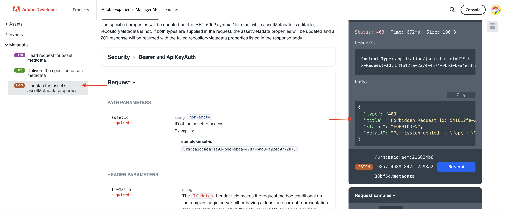

# Aufrufen von OpenAPI-basierten AEM-APIs mithilfe der OAuth-Server-zu-Server-Authentifizierung

Erfahren Sie, wie Sie OpenAPI-basierte AEM-APIs für AEM as a Cloud Service aus benutzerdefinierten Anwendungen mithilfe der _OAuth-Server-zu-Server_-Authentifizierung aufrufen.

Die OAuth-Server-zu-Server-Authentifizierung ist ideal für Backend-Services, die API-Zugriff ohne Benutzerinteraktion benötigen. Sie nutzt den OAuth 2.0-Grant-Typ _client_credentials_ zur Authentifizierung der Client-Anwendung.

## Lerninhalt{#what-you-learn}

In diesem Tutorial lernen Sie Folgendes:

- Konfigurieren eines Adobe Developer Console(ADC)-Projekts für den Zugriff auf das Assets Author-API mithilfe der _OAuth-Server-zu-Server-Authentifizierung_

- Entwickeln einer NodeJS-Beispielanwendung, die das Assets Author-API aufruft, um Metadaten für ein bestimmtes Asset abzurufen

Bevor Sie beginnen, stellen Sie sicher, dass Sie sich Folgendes angesehen haben:

- den Abschnitt [Zugreifen auf Adobe-APIs und zugehörige Konzepte](../overview.md#accessing-adobe-apis-and-related-concepts)
- den Artikel [Einrichten von OpenAPI-basierten AEM-APIs](../setup.md)

## Voraussetzungen

Zum Durchführen dieses Tutorials benötigen Sie Folgendes:

- Eine modernisierte AEM as a Cloud Service-Umgebung mit:
   - AEM der Version `2024.10.18459.20241031T210302Z` oder höher
   - Produktprofilen im neuen Stil (wenn die Umgebung vor November 2024 erstellt wurde)

  Weitere Informationen finden Sie im Artikel [Einrichten von OpenAPI-basierten AEM-APIs](../setup.md).

- Außerdem muss das [WKND-Sites](https://github.com/adobe/aem-guides-wknd?#aem-wknd-sites-project)-Beispielprojekt darin bereitgestellt sein.

- Rufen Sie die [Adobe Developer Console](https://developer.adobe.com/developer-console/docs/guides/getting-started?lang=de) auf.

- Installieren Sie [Node.js](https://nodejs.org/de/) auf Ihrem lokalen Computer, um die NodeJS-Beispielanwendung auszuführen.

## Entwicklungsschritte

Die allgemeinen Entwicklungsschritte lauten:

1. Konfigurieren des ADC-Projekts
   1. Hinzufügen des Assets Author-APIs
   1. Konfigurieren von „OAuth-Server-zu-Server“ als zugehörige Authentifizierungsmethode
   1. Verknüpfen des Produktprofils mit der Authentifizierungskonfiguration
1. Konfigurieren der AEM-Instanz zur Aktivierung der ADC-Projektkommunikation
1. Entwickeln einer NodeJS-Beispielanwendung
1. Überprüfen des End-to-End-Flusses

## Konfigurieren des ADC-Projekts

Der Schritt zum Konfigurieren des ADC-Projekts ist mit dem entsprechenden Schritt unter [Einrichten der OpenAPI-basierten AEM-APIs](../setup.md) identisch und wird _wiederholt_. Er wird wiederholt, um das Assets Author-API hinzuzufügen und „OAuth-Server-zu-Server“ als zugehörige Authentifizierungsmethode zu konfigurieren.

>[!TIP]
>
>Vergewissern Sie sich, dass Sie den Schritt **Aktivieren des AEM-API-Zugriffs** im Artikel [Einrichten von OpenAPI-basierten AEM-APIs](../setup.md#enable-aem-apis-access) abgeschlossen haben. Andernfalls ist die Server-zu-Server-Authentifizierungsoption nicht verfügbar.


1. Öffnen Sie in der [Adobe Developer Console](https://developer.adobe.com/console/projects) das gewünschte Projekt.

1. Um AEM-APIs hinzuzufügen, klicken Sie auf die Schaltfläche **Add API** (API hinzufügen).

   

1. Filtern Sie im Dialogfeld _Add API_ (API hinzufügen) auf _Experience Cloud_, wählen Sie die Karte **AEM Assets Author API** (AEM Assets Author-API) und klicken Sie auf **Next** (Weiter).

   

1. Wählen Sie anschließend im Dialogfeld _Configure API_ (API konfigurieren) die Authentifizierungsoption **Server-to-Server** (Server-zu-Server) aus und klicken Sie auf **Next** (Weiter). Die Server-zu-Server-Authentifizierung ist ideal für Backend-Services, die API-Zugriff ohne Benutzerinteraktion benötigen. 

   

   >[!TIP]
   >
   >Wenn die Option für die Server-zu-Server-Authentifizierung nicht angezeigt wird, bedeutet dies, dass die Benutzenden, die die Integration einrichten, nicht als Entwickelnde zu dem mit dem Dienst verknüpften Produktprofil hinzugefügt werden. Weitere Informationen finden Sie unter [ Aktivieren der Server-zu-Server-Authentifizierung](../setup.md#enable-server-to-server-authentication).

1. Benennen Sie die Anmeldedaten für eine einfachere Identifizierung um (falls erforderlich) und klicken Sie auf **Next** (Weiter). Zu Demozwecken wird der Standardname verwendet.

   

1. Wählen Sie das Produktprofil **AEM Assets Collaborator Users - author - Program XXX - Environment XXX** (AEM Assets-Mitarbeiter-Benutzende – Autorin/Autor – Programm XXX – Umgebung XXX) und klicken Sie auf **Save** (Speichern). Wie Sie sehen können, steht nur das mit dem AEM Assets-API-Benutzerdienst verknüpfte Produktprofil zur Auswahl.

   

1. Überprüfen Sie das AEM-API und die Authentifizierungskonfiguration.

   

   

## Konfigurieren der AEM-Instanz zur Aktivierung der ADC-Projektkommunikation

Befolgen Sie die Anweisungen im Artikel [Einrichten von OpenAPI-basierten AEM-APIs](../setup.md#configure-the-aem-instance-to-enable-adc-project-communication), um die AEM-Instanz so zu konfigurieren, dass die ADC-Projektkommunikation aktiviert wird.

## Entwickeln einer NodeJS-Beispielanwendung

Entwickeln Sie eine NodeJS-Beispielanwendung, die das Assets Author-API aufruft.

Sie können andere Programmiersprachen wie Java, Python usw. verwenden, um die Anwendung zu entwickeln.

Zu Testzwecken können Sie den [Postman](https://www.postman.com/)-, [curl](https://curl.se/)- oder einen beliebigen anderen REST-Client verwenden, um die AEM APIs aufzurufen.

### Überprüfen des APIs

Überprüfen Sie vor der Entwicklung der Anwendung den Endpunkt [Bereitstellen der Metadaten des angegebenen Assets](https://developer.adobe.com/experience-cloud/experience-manager-apis/api/experimental/assets/author/#operation/getAssetMetadata) über das _Assets Author-API_. Die API-Syntax lautet:

```http
GET https://{bucket}.adobeaemcloud.com/adobe/../assets/{assetId}/metadata
```

Um die Metadaten eines bestimmten Assets abzurufen, benötigen Sie die Werte `bucket` und `assetId`. Der `bucket` ist der AEM-Instanzname ohne den Adobe-Domain-Namen (.adobeaemcloud.com), z. B. `author-p63947-e1420428`.

Die `assetId` ist die JCR-UUID des Assets mit dem Präfix `urn:aaid:aem:`, z. B. `urn:aaid:aem:a200faf1-6d12-4abc-bc16-1b9a21f870da`. Es gibt mehrere Möglichkeiten, um die `assetId` zu erhalten:

- Hängen Sie die Erweiterung `.json` des AEM Asset-Pfads an, um die Asset-Metadaten abzurufen, zum Beispiel `https://author-p63947-e1420429.adobeaemcloud.com/content/dam/wknd-shared/en/adventures/cycling-southern-utah/adobestock-221043703.jpg.json`, und suchen Sie nach der Eigenschaft `jcr:uuid`.

- Alternativ können Sie die `assetId` abrufen, indem Sie das Asset im Elementinspektor des Browsers überprüfen. Suchen Sie nach dem Attribut `data-id="urn:aaid:aem:..."`.

  

### Aufrufen des APIs über den Browser

Rufen Sie vor der Entwicklung der Anwendung das API mithilfe der Funktion **Try it** (Ausprobieren) in der [API-Dokumentation](https://developer.adobe.com/experience-cloud/experience-manager-apis/api/stable/assets/author/) auf. 

1. Öffnen Sie die [Dokumentation zum Assets Author-API](https://developer.adobe.com/experience-cloud/experience-manager-apis/api/stable/assets/author/) im Browser.

1. Erweitern Sie den Abschnitt _Metadaten_ und klicken Sie auf die Option **Stellt die Metadaten des angegebenen Assets bereit**.

1. Klicken Sie im rechten Bereich auf die Schaltfläche **Try it** (Ausprobieren).
   

1. Geben Sie die folgenden Werte ein:

   | Abschnitt | Parameter | Wert  |
   | --- | --- | --- |
   |  | bucket | Der AEM-Instanzname ohne den Adobe-Domain-Namen (.adobeaemcloud.com), z. B. `author-p63947-e1420428`. |
   | **Sicherheit** | Bearer Token | Verwenden Sie das Zugriffs-Token aus den OAuth-Server-zu-Server-Anmeldedaten des ADC-Projekts. |
   | **Sicherheit** | X-Api-Key | Verwenden Sie den Wert `ClientID` aus den OAuth-Server-zu-Server-Anmeldedaten des ADC-Projekts. |
   | **Parameter** | assetId | Die eindeutige Kennung für das Asset in AEM, z. B. `urn:aaid:aem:a200faf1-6d12-4abc-bc16-1b9a21f870da`. |
   | **Parameter** | X-Adobe-Accept-Experimental | 1 |

   

   

1. Klicken Sie auf **Send** (Senden), um das API aufzurufen, und überprüfen Sie die Antwort auf der Registerkarte **Response** (Antwort).

   

Mit den oben genannten Schritten wird die Modernisierung der AEM as a Cloud Service-Umgebung bestätigt und der AEM-API-Zugriff aktiviert. Außerdem werden die erfolgreiche Konfiguration des ADC-Projekts und die Client-ID der OAuth-Server-zu-Server-Anmeldedaten für die Kommunikation mit der AEM-Autoreninstanz bestätigt.

### NodeJS-Beispielanwendung

Entwickeln wir nun eine NodeJS-Beispielanwendung.

Zur Entwicklung der Anwendung können Sie entweder die Anweisungen zum _Ausführen der Beispielanwendung_ oder zur _schrittweisen Entwicklung_ befolgen.

>[!BEGINTABS]

>[!TAB Ausführen der Beispielanwendung]

1. Laden Sie die ZIP-Datei [demo-nodejs-app-to-invoke-aem-openapi](../assets/s2s/demo-nodejs-app-to-invoke-aem-openapi.zip) mit der Beispielanwendung herunter und extrahieren Sie sie.

1. Navigieren Sie zum extrahierten Ordner und installieren Sie die Abhängigkeiten. 

   ```bash
   $ npm install
   ```

1. Ersetzen Sie die Platzhalter in der `.env`-Datei durch die tatsächlichen Werte aus den OAuth-Server-zu-Server-Anmeldedaten des ADC-Projekts.

1. Ersetzen Sie `<BUCKETNAME>` und `<ASSETID>` in der Datei `src/index.js` durch die tatsächlichen Werte.

1. Führen Sie die NodeJS-Anwendung aus.

   ```bash
   $ node src/index.js
   ```

>[!TAB Schrittweise Entwicklung]

1. Erstellen Sie ein neues NodeJS-Projekt.

   ```bash
   $ mkdir demo-nodejs-app-to-invoke-aem-openapi
   $ cd demo-nodejs-app-to-invoke-aem-openapi
   $ npm init -y
   ```

1. Installieren Sie die _fetch_- und _dotenv_-Bibliothek, um HTTP-Anfragen durchzuführen bzw. die Umgebungsvariablen zu lesen.

   ```bash
   $ npm install node-fetch
   $ npm install dotenv
   ```

1. Öffnen Sie das Projekt in Ihrem bevorzugten Code-Editor und aktualisieren Sie die Datei `package.json`, indem Sie `type` zu `module` hinzuzufügen.

   ```json
   {
       ...
       "version": "1.0.0",
       "type": "module",
       "main": "index.js",
       ...
   }
   ```

1. Erstellen Sie die `.env`-Datei und fügen Sie die folgende Konfiguration hinzu. Ersetzen Sie die Platzhalter durch die tatsächlichen Werte aus den OAuth-Server-zu-Server-Anmeldedaten des ADC-Projekts.

   ```properties
   CLIENT_ID=<ADC Project OAuth Server-to-Server credential ClientID>
   CLIENT_SECRET=<ADC Project OAuth Server-to-Server credential Client Secret>
   SCOPES=<ADC Project OAuth Server-to-Server credential Scopes>
   ```

1. Erstellen Sie die Datei `src/index.js`, fügen Sie den folgenden Code hinzu und ersetzen Sie `<BUCKETNAME>` und `<ASSETID>` durch die tatsächlichen Werte.

   ```javascript
   // Import the dotenv configuration to load environment variables from the .env file
   import "dotenv/config";
   
   // Import the fetch function to make HTTP requests
   import fetch from "node-fetch";
   
   // REPLACE THE FOLLOWING VALUES WITH YOUR OWN
   const bucket = "<BUCKETNAME>"; // Bucket name is the AEM instance name (e.g. author-p63947-e1420428)
   const assetId = "<ASSETID>"; // Asset ID is the unique identifier for the asset in AEM (e.g. urn:aaid:aem:a200faf1-6d12-4abc-bc16-1b9a21f870da). You can get it by inspecting the asset in browser's element inspector, look for data-id="urn:aaid:aem:..."
   
   // Load environment variables for authentication
   const clientId = process.env.CLIENT_ID; // Adobe IMS client ID
   const clientSecret = process.env.CLIENT_SECRET; // Adobe IMS client secret
   const scopes = process.env.SCOPES; // Scope for the API access
   
   // Adobe IMS endpoint for obtaining an access token
   const adobeIMSV3TokenEndpointURL =
   "https://ims-na1.adobelogin.com/ims/token/v3";
   
   // Function to obtain an access token from Adobe IMS
   const getAccessToken = async () => {
       console.log("Getting access token from IMS"); // Log process initiation
       //console.log("Client ID: " + clientId); // Display client ID for debugging purposes
   
       // Configure the HTTP POST request to fetch the access token
       const options = {
           method: "POST",
           headers: {
           "Content-Type": "application/x-www-form-urlencoded", // Specify form data content type
           },
           // Send client ID, client secret, and scopes as the request body
           body: `grant_type=client_credentials&client_id=${clientId}&client_secret=${clientSecret}&scope=${scopes}`,
       };
   
       // Make the HTTP request to fetch the access token
       const response = await fetch(adobeIMSV3TokenEndpointURL, options);
   
       //console.log("Response status: " + response.status); // Log the HTTP status for debugging
   
       const responseJSON = await response.json(); // Parse the JSON response
   
       console.log("Access token received"); // Log success message
   
       // Return the access token
       return responseJSON.access_token;
   };
   
   // Function to retrieve metadata for a specific asset from AEM
   const getAssetMetadat = async () => {
       // Fetch the access token using the getAccessToken function
       const accessToken = await getAccessToken();
   
       console.log("Getting asset metadata from AEM");
   
       // Invoke the Assets Author API to retrieve metadata for a specific asset
       const resp = await fetch(
           `https://${bucket}.adobeaemcloud.com/adobe/../assets/${assetId}/metadata`, // Construct the URL with bucket and asset ID
           {
           method: "GET",
           headers: {
               "If-None-Match": "string", // Header to handle caching (not critical for this tutorial)
               "X-Adobe-Accept-Experimental": "1", // Header to enable experimental Adobe API features
               Authorization: "Bearer " + accessToken, // Provide the access token for authorization
               "X-Api-Key": clientId, // Include the OAuth S2S ClientId for identification
           },
           }
       );
   
       const data = await resp.json(); // Parse the JSON response
   
       console.log("Asset metadata received"); // Log success message
       console.log(data); // Display the retrieved metadata
   };
   
   // Call the getAssets function to start the process
   getAssetMetadat();
   ```

1. Führen Sie die NodeJS-Anwendung aus.

   ```bash
   $ node src/index.js
   ```

>[!ENDTABS]

### API-Antwort

Nach erfolgreicher Ausführung wird die API-Antwort in der Konsole angezeigt. Die Antwort enthält die Metadaten des angegebenen Assets.

```json
{
  "assetId": "urn:aaid:aem:9c09ff70-9ee8-4b14-a5fa-ec37baa0d1b3",
  "assetMetadata": {    
    ...
    "dc:title": "A Young Mountain Biking Couple Takes A Minute To Take In The Scenery",
    "xmp:CreatorTool": "Adobe Photoshop Lightroom Classic 7.5 (Macintosh)",
    ...
  },
  "repositoryMetadata": {
    ...
    "repo:name": "adobestock-221043703.jpg",
    "repo:path": "/content/dam/wknd-shared/en/adventures/cycling-southern-utah/adobestock-221043703.jpg",
    "repo:state": "ACTIVE",
    ...
  }
}
```

Herzlichen Glückwunsch! Sie haben die OpenAPI-basierten AEM-APIs erfolgreich aus Ihrer benutzerdefinierten Anwendung mithilfe der OAuth-Server-zu-Server-Authentifizierung aufgerufen.

### Überprüfen des Anwendungs-Codes

Dies sind die wichtigsten Schritte aus dem Beispiel-Code der NodeJS-Anwendung:

1. **IMS-Authentifizierung**: Ruft ein Zugriffs-Token mithilfe der im ADC-Projekt eingerichteten OAuth-Server-zu-Server-Anmeldedaten ab.

   ```javascript
   // Function to obtain an access token from Adobe IMS
   const getAccessToken = async () => {
   
       // Configure the HTTP POST request to fetch the access token
       const options = {
           method: "POST",
           headers: {
           "Content-Type": "application/x-www-form-urlencoded", // Specify form data content type
           },
           // Send client ID, client secret, and scopes as the request body
           body: `grant_type=client_credentials&client_id=${clientId}&client_secret=${clientSecret}&scope=${scopes}`,
       };
   
       // Make the HTTP request to fetch the access token from Adobe IMS token endpoint https://ims-na1.adobelogin.com/ims/token/v3
       const response = await fetch(adobeIMSV3TokenEndpointURL, options);
   
       const responseJSON = await response.json(); // Parse the JSON response
   
       // Return the access token
       return responseJSON.access_token;
   };
   ...
   ```

1. **API-Aufruf**: Ruft das Assets Author-API auf, um Metadaten für ein bestimmtes Asset abzurufen, indem das Zugriffs-Token zur Autorisierung angegeben wird.

   ```javascript
   // Function to retrieve metadata for a specific asset from AEM
   const getAssetMetadat = async () => {
       // Fetch the access token using the getAccessToken function
       const accessToken = await getAccessToken();
   
       console.log("Getting asset metadata from AEM");
   
       // Invoke the Assets Author API to retrieve metadata for a specific asset
       const resp = await fetch(
           `https://${bucket}.adobeaemcloud.com/adobe/../assets/${assetId}/metadata`, // Construct the URL with bucket and asset ID
           {
           method: "GET",
           headers: {
               "If-None-Match": "string", // Header to handle caching (not critical for this tutorial)
               "X-Adobe-Accept-Experimental": "1", // Header to enable experimental Adobe API features
               Authorization: "Bearer " + accessToken, // Provide the access token for authorization
               "X-Api-Key": clientId, // Include the OAuth S2S ClientId for identification
           },
           }
       );
   
       const data = await resp.json(); // Parse the JSON response
   
       console.log("Asset metadata received"); // Log success message
       console.log(data); // Display the retrieved metadata
   };
   ...
   ```

## Im Hintergrund

Nach erfolgreichem API-Aufruf werden im AEM Author-Service ein Benutzerprofil, das für die OAuth-Server-zu-Server-Anmeldedaten des ADC-Projekts steht, sowie Benutzergruppen, die der Produktprofil- und Service-Konfiguration entsprechen, erstellt. Das _Benutzerprofil des technischen Kontos_ ist der Benutzergruppe für Produktprofile und _Services_ zugeordnet, die über die erforderlichen Berechtigungen zum _LESEN_ der Asset-Metadaten verfügt.

Gehen Sie wie folgt vor, um die Erstellung des Benutzerprofils des technischen Kontos und der Benutzergruppe zu überprüfen:

- Navigieren Sie im ADC-Projekt zur Konfiguration mit den **OAuth-Server-zu-Server**-Anmeldedaten. Notieren Sie den Wert für die **E-Mail-Adresse des technischen Kontos**.

  

- Navigieren Sie im AEM Author-Service zu **Tools** > **Sicherheit** > **Benutzerinnen und Benutzer** und suchen Sie nach dem Wert für die **E-Mail-Adresse des technischen Kontos**.

  

- Klicken Sie auf das Benutzerprofil des technischen Kontos, um Benutzerdetails anzuzeigen, z. B. die **Gruppenmitgliedschaft**. Wie unten dargestellt, ist das Benutzerprofil des technischen Kontos den Benutzergruppen für **AEM Assets-Mitarbeiter-Benutzende – Autorin/Autor – Programm XXX – Umgebung XXX** und **AEM Assets-Mitarbeiter-Benutzende – Service** zugeordnet.

  

- Beachten Sie, dass das Benutzerprofil des technischen Kontos dem Produktprofil für **AEM Assets-Mitarbeiter-Benutzende – Autorin/Autor – Programm XXX – Umgebung XXX** zugeordnet ist. Das Produktprofil ist mit den Services für **AEM Assets-API-Benutzende** und **AEM Assets-Mitarbeiter-Benutzende** verknüpft.

  

- Die Zuordnung des Produktprofils und des Benutzerprofils des technischen Kontos kann in den **Produktprofilen** auf der Registerkarte **API-Zugangsberechtigungen** überprüft werden.

  

## Fehler 403 bei Nicht-GET-Anfragen

Zum _LESEN_ der Asset-Metadaten verfügt das Benutzerprofil des technischen Kontos, das für die OAuth-Server-zu-Server-Anmeldedaten erstellt wurde, über die erforderlichen Berechtigungen in der Services-Benutzergruppe (z. B. für AEM Assets-Mitarbeiter-Benutzende – Service).

Zum _Erstellen, Aktualisieren, Löschen_ (Create, Update, Delete (CUD)) der Asset-Metadaten benötigt das Benutzerprofil des technischen Kontos jedoch zusätzliche Berechtigungen. Sie können dies überprüfen, indem Sie das API mit einer Nicht-GET-Anfrage (z. B. PATCH, DELETE) aufrufen und sich die 403-Fehlerantwort ansehen.

Rufen wir nun die _PATCH_-Anfrage auf, um die Asset-Metadaten zu aktualisieren und uns die 403-Fehlerantwort anzusehen.

- Öffnen Sie die [Dokumentation zum Assets Author-API](https://developer.adobe.com/experience-cloud/experience-manager-apis/api/experimental/assets/author/) im Browser.

- Geben Sie die folgenden Werte ein:

  | Abschnitt | Parameter | Wert  |
  | --- | --- | --- |
  | **Bucket** |  | Der AEM-Instanzname ohne den Adobe-Domain-Namen (.adobeaemcloud.com), z. B. `author-p63947-e1420428`. |
  | **Sicherheit** | Bearer Token | Verwenden Sie das Zugriffs-Token aus den OAuth-Server-zu-Server-Anmeldedaten des ADC-Projekts. |
  | **Sicherheit** | X-Api-Key | Verwenden Sie den Wert `ClientID` aus den OAuth-Server-zu-Server-Anmeldedaten des ADC-Projekts. |
  | **Text** |  | `[{ "op": "add", "path": "foo","value": "bar"}]` |
  | **Parameter** | assetId | Die eindeutige Kennung für das Asset in AEM, z. B. `urn:aaid:aem:a200faf1-6d12-4abc-bc16-1b9a21f870da`. |
  | **Parameter** | X-Adobe-Accept-Experimental | * |
  | **Parameter** | X-Adobe-Accept-Experimental | 1 |

- Klicken Sie auf **Send** (Senden), um die _PATCH_-Anfrage aufzurufen und sich die 403-Fehlerantwort anzusehen.

  

Um den Fehler 403 zu beheben, haben Sie zwei Möglichkeiten:

- Aktualisieren Sie im ADC-Projekt das zugeordnete Produktprofil der OAuth-Server-zu-Server-Anmeldedaten mit einem geeigneten Produktprofil, das über die erforderlichen Berechtigungen zum _Erstellen, Aktualisieren, Löschen_ (Create, Update, Delete (CUD)) der Asset-Metadaten verfügt, z. B. das Produktprofil für **AEM-Admins – Autorin/Autor – Programm XXX – Umgebung XXX**. Weitere Informationen finden Sie im Tutorial [Verwaltung von API-Anmeldedaten und -Produktprofilen](../how-to/credentials-and-product-profile-management.md).

- Aktualisieren Sie mit AEM-Projekten die Berechtigungen der zugehörigen AEM-Service-Benutzergruppe (z. B. für AEM Assets-Mitarbeiter-Benutzende – Service) in AEM Author, um das _Erstellen, Aktualisieren, Löschen_ (Create, Update, Delete (CUD)) der Asset-Metadaten zuzulassen. Weitere Informationen finden Sie im Tutorial [Verwalten von AEM-Service-Benutzergruppenberechtigungen](../how-to/services-user-group-permission-management.md).

## Zusammenfassung

In diesem Tutorial haben Sie erfahren, wie Sie OpenAPI-basierte AEM-APIs aus benutzerdefinierten Anwendungen aufrufen. Sie haben den AEM-API-Zugriff aktiviert sowie ein Adobe Developer Console(ADC)-Projekt erstellt und konfiguriert.
Im ADC-Projekt haben Sie die AEM-APIs hinzugefügt, den zugehörigen Authentifizierungstyp konfiguriert und das Produktprofil zugeordnet. Sie haben zudem die AEM-Instanz konfiguriert, um die ADC-Projektkommunikation zu aktivieren, und eine NodeJS-Beispielanwendung entwickelt, die das Assets Author-API aufruft.

## Zusätzliche Ressourcen

- [OAuth-Implementierungshandbuch für Server-zu-Server-Anmeldedaten](https://developer.adobe.com/developer-console/docs/guides/authentication/ServerToServerAuthentication/implementation)
