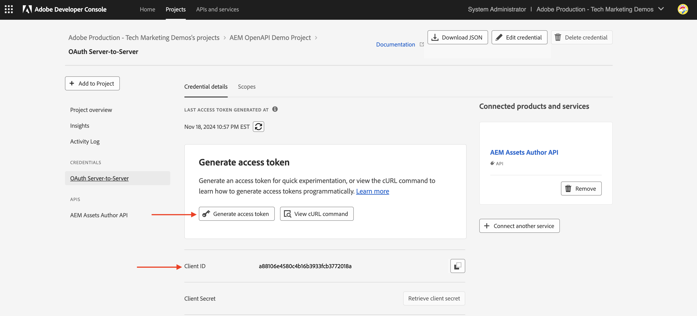

# Aufrufen von OpenAPI-basierten AEM-APIs mithilfe der OAuth-Server-zu-Server-Authentifizierung

Erfahren Sie, wie Sie OpenAPI-basierte AEM-APIs für AEM as a Cloud Service aus benutzerdefinierten Programmen mithilfe der _OAuth Server-zu-Server_-Authentifizierung aufrufen.

Die OAuth Server-zu-Server-Authentifizierung ist ideal für Backend-Services, die API-Zugriff ohne Benutzerinteraktion benötigen. Sie verwendet den Grant-Typ OAuth _.0_ client_credentials) für die Authentifizierung des Client-Programms.

## Lerninhalt{#what-you-learn}

In diesem Tutorial erfahren Sie, wie Sie:

- Konfigurieren Sie ein Adobe Developer Console-Projekt (ADC) für den Zugriff auf die Assets-Autoren-API mit _OAuth-Server-zu-Server-Authentifizierung_.

- Entwickeln Sie eine NodeJS-Beispielanwendung, die die Assets-Autoren-API aufruft, um Metadaten für ein bestimmtes Asset abzurufen.

Bevor Sie beginnen, stellen Sie sicher, dass Sie Folgendes überprüft haben:

- [ Abschnitt „Zugriff auf Adobe-APIs und ](../overview.md#accessing-adobe-apis-and-related-concepts) Konzepte“.
- [ Artikel zum Einrichten von OpenAPI-basierten AEM](../setup.md)APIs.

## Voraussetzungen

Zum Durchführen dieses Tutorials benötigen Sie Folgendes:

- Modernisierte AEM as a Cloud Service-Umgebung mit folgenden Neuerungen:
   - AEM-Version `2024.10.18459.20241031T210302Z` oder höher.
   - Neue Stil-Produktprofile (wenn die Umgebung vor November 2024 erstellt wurde)

  Weitere [ finden Sie im Artikel zum Einrichten von OpenAPI](../setup.md)basierten AEM-APIs .

- Das Beispielprojekt [WKND Sites](https://github.com/adobe/aem-guides-wknd?#aem-wknd-sites-project) muss darin bereitgestellt werden.

- Rufen Sie die [Adobe Developer Console](https://developer.adobe.com/developer-console/docs/guides/getting-started?lang=de) auf.

- Installieren Sie [Node.js](https://nodejs.org/de/) auf Ihrem lokalen Computer, um die NodeJS-Beispielanwendung auszuführen.

## Entwicklungsschritte

Die allgemeinen Entwicklungsschritte lauten:

1. ADC-Projekt konfigurieren
   1. Hinzufügen der Assets Author-API
   1. Konfigurieren Sie die Authentifizierungsmethode als OAuth-Server-zu-Server
   1. Verknüpfen des Produktprofils mit der Authentifizierungskonfiguration
1. Konfigurieren der AEM-Instanz, um die ADC-Projektkommunikation zu aktivieren
1. Entwickeln einer NodeJS-Beispielanwendung
1. Überprüfen des End-to-End-Flusses

## ADC-Projekt konfigurieren

Der Schritt zum Konfigurieren des ADC _Projekts wird_ der [OpenAPI-basierten AEM-APIs](../setup.md) wiederholt. Wiederholt wird dies, um die Assets Author-API hinzuzufügen und ihre Authentifizierungsmethode als OAuth-Server-zu-Server zu konfigurieren.

>[!TIP]
>
>Vergewissern Sie sich, dass Sie den Schritt **Aktivieren des Zugriffs auf AEM** im Artikel [Einrichten von OpenAPI-basierten AEM-](../setup.md#enable-aem-apis-access)) abgeschlossen haben. Ohne diese Option ist die Server-zu-Server-Authentifizierung nicht verfügbar.


1. Öffnen Sie in der {0[&#128279;](https://developer.adobe.com/console/projects)Adobe Developer Console} das gewünschte Projekt.

1. Um AEM-APIs hinzuzufügen, klicken Sie auf die Schaltfläche **API hinzufügen**.

   

1. Filtern Sie _Dialogfeld &quot;_ hinzufügen“ nach _Experience Cloud_ und wählen Sie die Karte **AEM Assets Author API** aus und klicken Sie auf **Weiter**.

   

1. Wählen Sie anschließend im Dialogfeld _API konfigurieren_ die Option **Server-zu-Server**-Authentifizierung aus und klicken Sie auf **Weiter**. Die Server-zu-Server-Authentifizierung ist ideal für Backend-Services, die API-Zugriff ohne Benutzerinteraktion benötigen.

   

   >[!TIP]
   >
   >Wenn die Option Server-zu-Server-Authentifizierung nicht angezeigt wird, bedeutet dies, dass der Benutzer, der die Integration einrichtet, nicht als Entwickler zum Produktprofil hinzugefügt wird, mit dem der Service verknüpft ist. Weitere Informationen finden [ unter „Server-zu-Server](../setup.md#enable-server-to-server-authentication)Authentifizierung aktivieren“.

1. Benennen Sie die Berechtigung um (falls erforderlich) und klicken Sie auf **Weiter**. Zu Demozwecken wird der Standardname verwendet.

   

1. Wählen Sie das Produktprofil **AEM Assets Collaborator Users - Author - Program XXX - Environment XXX** und klicken Sie auf **Speichern**. Wie zu sehen ist, steht nur das mit dem AEM Assets-API-Benutzerdienst verknüpfte Produktprofil zur Auswahl.

   

1. Überprüfen Sie die AEM-API und die Authentifizierungskonfiguration.

   

   

## Konfigurieren der AEM-Instanz zur Aktivierung der ADC-Projektkommunikation

Befolgen Sie die Anweisungen im Artikel [Einrichten von OpenAPI-basierten AEM](../setup.md#configure-the-aem-instance-to-enable-adc-project-communication)APIs , um die AEM-Instanz so zu konfigurieren, dass die ADC-Projektkommunikation aktiviert wird.

## Entwickeln einer NodeJS-Beispielanwendung

Entwickeln wir ein NodeJS-Beispielprogramm, das die Assets Author-API aufruft.

Sie können andere Programmiersprachen wie Java, Python usw. verwenden, um die Anwendung zu entwickeln.

Zu Testzwecken können Sie den [Postman](https://www.postman.com/), [curl](https://curl.se/) oder einen anderen REST-Client verwenden, um die AEM-APIs aufzurufen.

### Überprüfen der API

Bevor wir das Programm entwickeln, sollten wir den Endpunkt [Bereitstellen der Metadaten des angegebenen Assets](https://developer.adobe.com/experience-cloud/experience-manager-apis/api/experimental/assets/author/#operation/getAssetMetadata) über die _Assets Author-API_ überprüfen. Die API-Syntax lautet:

```http
GET https://{bucket}.adobeaemcloud.com/adobe/../assets/{assetId}/metadata
```

Um die Metadaten eines bestimmten Assets abzurufen, benötigen Sie die `bucket` und `assetId` Werte. Der `bucket` ist der AEM-Instanzname ohne den Adobe-Domain-Namen (.adobeaemcloud.com), z. B. `author-p63947-e1420428`.

Der `assetId` ist die JCR-UUID des Assets mit dem `urn:aaid:aem:` Präfix, z. B. `urn:aaid:aem:a200faf1-6d12-4abc-bc16-1b9a21f870da`. Es gibt mehrere Möglichkeiten, die `assetId` zu erhalten:

- Hängen Sie die Erweiterung AEM Asset Path `.json` an, um die Asset-Metadaten abzurufen. `https://author-p63947-e1420429.adobeaemcloud.com/content/dam/wknd-shared/en/adventures/cycling-southern-utah/adobestock-221043703.jpg.json` Sie beispielsweise und suchen Sie nach der Eigenschaft `jcr:uuid` .

- Alternativ können Sie die `assetId` abrufen, indem Sie das Asset im Element-Inspektor des Browsers überprüfen. Suchen Sie nach dem Attribut `data-id="urn:aaid:aem:..."` .

  

### Aufrufen der API über den Browser

Bevor wir das Programm entwickeln, rufen wir die API mithilfe der Funktion &quot;**&quot;** der [API-Dokumentation](https://developer.adobe.com/experience-cloud/experience-manager-apis/api/experimental/assets/author/) auf.

1. Öffnen Sie die Dokumentation zur [Assets Author](https://developer.adobe.com/experience-cloud/experience-manager-apis/api/experimental/assets/author/)API im Browser.

1. Erweitern Sie den Abschnitt _Metadaten_ und klicken Sie auf die Option **Übermittelt die Metadaten des angegebenen Assets** .

1. Klicken Sie im rechten Bereich auf die Schaltfläche **Probieren Sie es aus**.
   

1. Geben Sie die folgenden Werte ein:

   | Abschnitt | Parameter | Wert  |
   | --- | --- | --- |
   |  | Eimer | Der AEM-Instanzname ohne den Adobe-Domain-Namen (.adobeaemcloud.com), z. B. `author-p63947-e1420428`. |
   | **Sicherheit** | Bearer-Token | Verwenden Sie das Zugriffstoken aus den OAuth Server-zu-Server-Anmeldeinformationen des ADC-Projekts. |
   | **Sicherheit** | x-api-key | Verwenden Sie den `ClientID` aus den OAuth Server-zu-Server-Anmeldeinformationen des ADC-Projekts. |
   | **Parameter** | assetId | Die eindeutige Kennung für das Asset in AEM, z. B. `urn:aaid:aem:a200faf1-6d12-4abc-bc16-1b9a21f870da` |
   | **Parameter** | x-Adobe-Accept-Experimental | 1 |

   

   

1. Klicken Sie auf **Senden**, um die API aufzurufen, und überprüfen Sie die Antwort auf der Registerkarte **Antwort**.

   

Die oben genannten Schritte bestätigen die Modernisierung der AEM as a Cloud Service-Umgebung und ermöglichen den Zugriff auf AEM-APIs. Außerdem wird die erfolgreiche Konfiguration des ADC-Projekts und die Kommunikation der OAuth-Server-zu-Server-Anmeldeinformationen mit der ClientID mit der AEM-Autoreninstanz bestätigt.

### Beispielhafte NodeJS-Anwendung

Entwickeln wir ein NodeJS-Beispielprogramm.

Zur Entwicklung der Anwendung können Sie entweder die _Run-the-sample_ application) oder _Step-by-Step-Development_ Anweisungen verwenden.

>[!BEGINTABS]

>[!TAB Run-the-sample-application]

1. Laden Sie die ZIP-Datei [ Beispielanwendung „demo-nodejs-app-to-invoke-aem-openapi](../assets/s2s/demo-nodejs-app-to-invoke-aem-openapi.zip) herunter und extrahieren Sie sie.

1. Navigieren Sie zum extrahierten Ordner und installieren Sie die Abhängigkeiten.

   ```bash
   $ npm install
   ```

1. Ersetzen Sie die Platzhalter in der `.env`-Datei durch die tatsächlichen Werte aus den OAuth Server-zu-Server-Anmeldeinformationen des ADC-Projekts.

1. Ersetzen Sie `<BUCKETNAME>` und `<ASSETID>` in der `src/index.js`-Datei durch die tatsächlichen Werte.

1. Führen Sie die NodeJS-Anwendung aus.

   ```bash
   $ node src/index.js
   ```

>[!TAB Schrittweise Entwicklung]

1. Erstellen Sie ein neues NodeJS-Projekt.

   ```bash
   $ mkdir demo-nodejs-app-to-invoke-aem-openapi
   $ cd demo-nodejs-app-to-invoke-aem-openapi
   $ npm init -y
   ```

1. Installieren Sie die _fetch_ und _dotenv_-Bibliothek, um HTTP-Anfragen durchzuführen bzw. die Umgebungsvariablen zu lesen.

   ```bash
   $ npm install node-fetch
   $ npm install dotenv
   ```

1. Öffnen Sie das Projekt in Ihrem bevorzugten Code-Editor und aktualisieren Sie die `package.json`, um die `type` zu `module` hinzuzufügen.

   ```json
   {
       ...
       "version": "1.0.0",
       "type": "module",
       "main": "index.js",
       ...
   }
   ```

1. Erstellen Sie `.env` Datei und fügen Sie die folgende Konfiguration hinzu. Ersetzen Sie die Platzhalter durch die tatsächlichen Werte aus den OAuth Server-zu-Server-Anmeldeinformationen des ADC-Projekts.

   ```properties
   CLIENT_ID=<ADC Project OAuth Server-to-Server credential ClientID>
   CLIENT_SECRET=<ADC Project OAuth Server-to-Server credential Client Secret>
   SCOPES=<ADC Project OAuth Server-to-Server credential Scopes>
   ```

1. Erstellen Sie `src/index.js` Datei , fügen Sie den folgenden Code hinzu und ersetzen Sie die `<BUCKETNAME>` und `<ASSETID>` durch die tatsächlichen Werte.

   ```javascript
   // Import the dotenv configuration to load environment variables from the .env file
   import "dotenv/config";
   
   // Import the fetch function to make HTTP requests
   import fetch from "node-fetch";
   
   // REPLACE THE FOLLOWING VALUES WITH YOUR OWN
   const bucket = "<BUCKETNAME>"; // Bucket name is the AEM instance name (e.g. author-p63947-e1420428)
   const assetId = "<ASSETID>"; // Asset ID is the unique identifier for the asset in AEM (e.g. urn:aaid:aem:a200faf1-6d12-4abc-bc16-1b9a21f870da). You can get it by inspecting the asset in browser's element inspector, look for data-id="urn:aaid:aem:..."
   
   // Load environment variables for authentication
   const clientId = process.env.CLIENT_ID; // Adobe IMS client ID
   const clientSecret = process.env.CLIENT_SECRET; // Adobe IMS client secret
   const scopes = process.env.SCOPES; // Scope for the API access
   
   // Adobe IMS endpoint for obtaining an access token
   const adobeIMSV3TokenEndpointURL =
   "https://ims-na1.adobelogin.com/ims/token/v3";
   
   // Function to obtain an access token from Adobe IMS
   const getAccessToken = async () => {
       console.log("Getting access token from IMS"); // Log process initiation
       //console.log("Client ID: " + clientId); // Display client ID for debugging purposes
   
       // Configure the HTTP POST request to fetch the access token
       const options = {
           method: "POST",
           headers: {
           "Content-Type": "application/x-www-form-urlencoded", // Specify form data content type
           },
           // Send client ID, client secret, and scopes as the request body
           body: `grant_type=client_credentials&client_id=${clientId}&client_secret=${clientSecret}&scope=${scopes}`,
       };
   
       // Make the HTTP request to fetch the access token
       const response = await fetch(adobeIMSV3TokenEndpointURL, options);
   
       //console.log("Response status: " + response.status); // Log the HTTP status for debugging
   
       const responseJSON = await response.json(); // Parse the JSON response
   
       console.log("Access token received"); // Log success message
   
       // Return the access token
       return responseJSON.access_token;
   };
   
   // Function to retrieve metadata for a specific asset from AEM
   const getAssetMetadat = async () => {
       // Fetch the access token using the getAccessToken function
       const accessToken = await getAccessToken();
   
       console.log("Getting asset metadata from AEM");
   
       // Invoke the Assets Author API to retrieve metadata for a specific asset
       const resp = await fetch(
           `https://${bucket}.adobeaemcloud.com/adobe/../assets/${assetId}/metadata`, // Construct the URL with bucket and asset ID
           {
           method: "GET",
           headers: {
               "If-None-Match": "string", // Header to handle caching (not critical for this tutorial)
               "X-Adobe-Accept-Experimental": "1", // Header to enable experimental Adobe API features
               Authorization: "Bearer " + accessToken, // Provide the access token for authorization
               "X-Api-Key": clientId, // Include the OAuth S2S ClientId for identification
           },
           }
       );
   
       const data = await resp.json(); // Parse the JSON response
   
       console.log("Asset metadata received"); // Log success message
       console.log(data); // Display the retrieved metadata
   };
   
   // Call the getAssets function to start the process
   getAssetMetadat();
   ```

1. Führen Sie die NodeJS-Anwendung aus.

   ```bash
   $ node src/index.js
   ```

>[!ENDTABS]

### API-Antwort

Nach erfolgreicher Ausführung wird die API-Antwort in der Konsole angezeigt. Die Antwort enthält die Metadaten des angegebenen Assets.

```json
{
  "assetId": "urn:aaid:aem:9c09ff70-9ee8-4b14-a5fa-ec37baa0d1b3",
  "assetMetadata": {    
    ...
    "dc:title": "A Young Mountain Biking Couple Takes A Minute To Take In The Scenery",
    "xmp:CreatorTool": "Adobe Photoshop Lightroom Classic 7.5 (Macintosh)",
    ...
  },
  "repositoryMetadata": {
    ...
    "repo:name": "adobestock-221043703.jpg",
    "repo:path": "/content/dam/wknd-shared/en/adventures/cycling-southern-utah/adobestock-221043703.jpg",
    "repo:state": "ACTIVE",
    ...
  }
}
```

Herzlichen Glückwunsch! Sie haben die OpenAPI-basierten AEM-APIs erfolgreich aus Ihrem benutzerdefinierten Programm mithilfe der OAuth-Server-zu-Server-Authentifizierung aufgerufen.

### Überprüfen des Anwendungs-Codes

Die wichtigsten Hinweise aus dem Beispiel-Code der NodeJS-Anwendung sind:

1. **IMS-Authentifizierung**: Ruft ein Zugriffstoken mithilfe der OAuth-Server-zu-Server-Anmeldedaten-Einrichtung im ADC-Projekt ab.

   ```javascript
   // Function to obtain an access token from Adobe IMS
   const getAccessToken = async () => {
   
       // Configure the HTTP POST request to fetch the access token
       const options = {
           method: "POST",
           headers: {
           "Content-Type": "application/x-www-form-urlencoded", // Specify form data content type
           },
           // Send client ID, client secret, and scopes as the request body
           body: `grant_type=client_credentials&client_id=${clientId}&client_secret=${clientSecret}&scope=${scopes}`,
       };
   
       // Make the HTTP request to fetch the access token from Adobe IMS token endpoint https://ims-na1.adobelogin.com/ims/token/v3
       const response = await fetch(adobeIMSV3TokenEndpointURL, options);
   
       const responseJSON = await response.json(); // Parse the JSON response
   
       // Return the access token
       return responseJSON.access_token;
   };
   ...
   ```

1. **API-Aufruf**: Ruft die Assets-Autoren-API auf, um Metadaten für ein bestimmtes Asset abzurufen, indem das Zugriffstoken zur Autorisierung angegeben wird.

   ```javascript
   // Function to retrieve metadata for a specific asset from AEM
   const getAssetMetadat = async () => {
       // Fetch the access token using the getAccessToken function
       const accessToken = await getAccessToken();
   
       console.log("Getting asset metadata from AEM");
   
       // Invoke the Assets Author API to retrieve metadata for a specific asset
       const resp = await fetch(
           `https://${bucket}.adobeaemcloud.com/adobe/../assets/${assetId}/metadata`, // Construct the URL with bucket and asset ID
           {
           method: "GET",
           headers: {
               "If-None-Match": "string", // Header to handle caching (not critical for this tutorial)
               "X-Adobe-Accept-Experimental": "1", // Header to enable experimental Adobe API features
               Authorization: "Bearer " + accessToken, // Provide the access token for authorization
               "X-Api-Key": clientId, // Include the OAuth S2S ClientId for identification
           },
           }
       );
   
       const data = await resp.json(); // Parse the JSON response
   
       console.log("Asset metadata received"); // Log success message
       console.log(data); // Display the retrieved metadata
   };
   ...
   ```

## Im Hintergrund

Nach erfolgreichem API-Aufruf wird im AEM-Autoren-Service ein Benutzer erstellt, der die OAuth-Server-zu-Server-Anmeldedaten des ADC-Projekts darstellt, zusammen mit den Benutzergruppen, die der Produktprofil- und Service-Konfiguration entsprechen. Der _Benutzer des technischen Kontos_ ist mit der Benutzergruppe Produktprofil und _Services_ verknüpft, die über die erforderlichen Berechtigungen zum _LESEN_ der Asset-Metadaten verfügt.

Gehen Sie wie folgt vor, um die Erstellung des technischen Benutzerkontos und der Benutzergruppe zu überprüfen:

- Navigieren Sie im ADC-Projekt zur **OAuth Server-zu-Server** Berechtigungskonfiguration. Notieren Sie den Wert **E-Mail des technischen Kontos**.

  

- Navigieren Sie im AEM-Autoren-Service zu **Tools** > **Sicherheit** > **Benutzer** und suchen Sie nach dem Wert **E-Mail für technisches Konto**.

  

- Klicken Sie auf den Benutzer des technischen Kontos, um die Benutzerdetails anzuzeigen, z. B. **Gruppen** Mitgliedschaft. Wie unten dargestellt, ist der Benutzer des technischen Kontos den Benutzergruppen **AEM Assets Collaborator Users - Author - Program XXX - Environment XXX** und **AEM Assets Collaborator Users - Service** zugeordnet.

  

- Beachten Sie, dass der Benutzer des technischen Kontos mit dem Produktprofil **AEM Assets Collaborator Users - Author - Program XXX - Environment XXX** verknüpft ist. Das Produktprofil ist mit den **AEM Assets-API-** und **AEM Assets Collaborator-** verknüpft.

  

- Die Zuordnung des Produktprofils und des technischen Kontos kann auf der Registerkarte **Produktprofile** der **API-Anmeldeinformationen** überprüft werden.

  

## 403-Fehler bei Nicht-GET-Anfragen

Zum _LESEN_ der Asset-Metadaten verfügt der Benutzer des technischen Kontos, der für die OAuth-Server-zu-Server-Anmeldedaten erstellt wurde, über die erforderlichen Berechtigungen in der Services-Benutzergruppe (z. B. AEM Assets Collaborator Users - Service).

Zum _(Erstellen, Aktualisieren, Löschen_ (CUD) der Asset-Metadaten benötigt der Benutzer des technischen Kontos jedoch zusätzliche Berechtigungen. Sie können dies überprüfen, indem Sie die -API mit einer Nicht-GET-Anfrage (z. B. PATCH, DELETE) aufrufen und die 403-Fehlerantwort beobachten.

Rufen wir die _PATCH_-Anfrage auf, um die Asset-Metadaten zu aktualisieren und die 403-Fehlerantwort zu beobachten.

- Öffnen Sie die Dokumentation zur [Assets Author](https://developer.adobe.com/experience-cloud/experience-manager-apis/api/experimental/assets/author/)API im Browser.

- Geben Sie die folgenden Werte ein:

  | Abschnitt | Parameter | Wert  |
  | --- | --- | --- |
  | **Bucket** |  | Der AEM-Instanzname ohne den Adobe-Domain-Namen (.adobeaemcloud.com), z. B. `author-p63947-e1420428`. |
  | **Sicherheit** | Bearer-Token | Verwenden Sie das Zugriffstoken aus den OAuth Server-zu-Server-Anmeldeinformationen des ADC-Projekts. |
  | **Sicherheit** | x-api-key | Verwenden Sie den `ClientID` aus den OAuth Server-zu-Server-Anmeldeinformationen des ADC-Projekts. |
  | **body** |  | `[{ "op": "add", "path": "foo","value": "bar"}]` |
  | **Parameter** | assetId | Die eindeutige Kennung für das Asset in AEM, z. B. `urn:aaid:aem:a200faf1-6d12-4abc-bc16-1b9a21f870da` |
  | **Parameter** | x-Adobe-Accept-Experimental | * |
  | **Parameter** | x-Adobe-Accept-Experimental | 1 |

- Klicken Sie auf **Senden**, um die _PATCH_-Anfrage aufzurufen und die 403-Fehlerantwort zu beobachten.

  

Um den 403-Fehler zu beheben, haben Sie zwei Möglichkeiten:

- Aktualisieren Sie im ADC-Projekt das zugeordnete Produktprofil der OAuth-Server-zu-Server-Anmeldeinformationen mit einem entsprechenden Produktprofil, das über die erforderlichen Berechtigungen zum _Erstellen, Aktualisieren, Löschen_ (CUD) der Asset-Metadaten verfügt, z. B. **AEM-Administratoren - Autor - Programm XXX - Umgebung XXX**. Weitere Informationen finden Sie [ Artikel „Vorgehensweise - Verwaltung von verbundenen API-Anmeldeinformationen und Produktprofilen](../how-to/credentials-and-product-profile-management.md) .

- Aktualisieren Sie mithilfe von AEM Project die Berechtigungen der zugehörigen AEM-Service-Benutzergruppe (z. B. AEM Assets Collaborator Users - Service) in der AEM-Autoreninstanz, um _Erstellen, Aktualisieren, Löschen_ (CUD) der Asset-Metadaten zuzulassen. Weitere Informationen finden Sie [ Artikel „So wird die Berechtigungsverwaltung für Benutzergruppen des AEM](../how-to/services-user-group-permission-management.md)Dienstes durchgeführt.

## Zusammenfassung

In diesem Tutorial haben Sie erfahren, wie Sie OpenAPI-basierte AEM-APIs aus benutzerdefinierten Programmen aufrufen. Sie haben APIs für AEM aktiviert, um auf ein Adobe Developer Console-Projekt (ADC) zuzugreifen, es zu erstellen und zu konfigurieren.
Im ADC-Projekt haben Sie die AEM-APIs hinzugefügt, ihren Authentifizierungstyp konfiguriert und das Produktprofil zugeordnet. Sie haben auch die AEM-Instanz konfiguriert, um ADC Project-Kommunikation zu aktivieren, und eine NodeJS-Beispielanwendung entwickelt, die die Assets-Autoren-API aufruft.

## Zusätzliche Ressourcen

- [OAuth-Implementierungshandbuch für Server-zu-Server-Anmeldedaten](https://developer.adobe.com/developer-console/docs/guides/authentication/ServerToServerAuthentication/implementation?lang=de)
