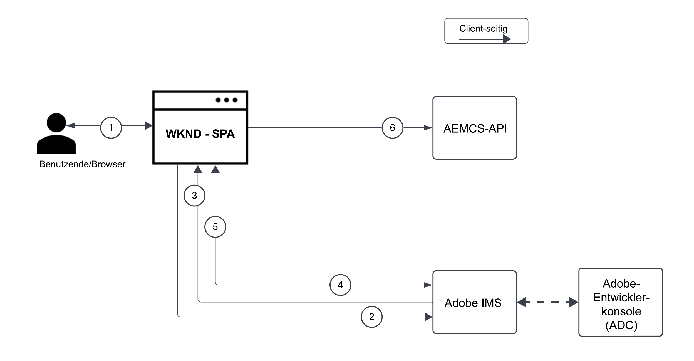
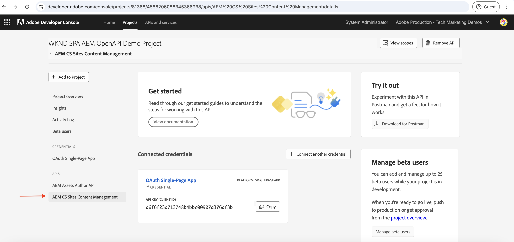

# Aufrufen von OpenAPI-basierten AEM-APIs mithilfe der OAuth-Single-Page-Application-Authentifizierung

Erfahren Sie, wie Sie OpenAPI-basierte AEM-APIs in AEM as a Cloud Service mithilfe der **OAuth-Single-Page-Application-Authentifizierung** aufrufen. Gefolgt wird dabei dem OAuth 2.0 PKCE(Proof Key for Code Exchange)-Fluss zur benutzerbasierten Authentifizierung in einer Single Page Application (SPA).

Die OAuth-Single-Page-Application-Authentifizierung ist ideal für JavaScript-basierte Anwendungen, die im Browser ausgeführt werden. Dies gilt unabhängig davon, ob nun ein Backend-Server fehlt oder Zugriffs-Token abgerufen werden müssen, um im Namen einer Benutzerin oder eines Benutzers mit AEM-APIs zu interagieren.

Der PKCE-Fluss erweitert den OAuth 2.0-Grant-Typ _authorization_code_ und erhöht die Sicherheit, indem er das Abfangen von Autorisierungs-Code verhindert. Weitere Informationen finden Sie unter [Unterschied zwischen OAuth-Server-zu-Server-, Web-Anwendungs- und Single-Page-Application-Anmeldedaten](../overview.md#difference-between-oauth-server-to-server-vs-web-app-vs-single-page-app-credentials).

## Lerninhalt{#what-you-learn}

In diesem Tutorial lernen Sie Folgendes:

- Konfigurieren eines Adobe Developer Console(ADC)-Projekts für den Zugriff auf die OpenAPI-basierten AEM-APIs mithilfe der _OAuth-Single-Page-Application_-Authentifizierung, allgemein auch als _OAuth 2.0 PKCE-Fluss_ bekannt

- Implementieren des OAuth-Single-Page-Application-Authentifizierungsflusses in einer benutzerdefinierten SPA
   - IMS-Benutzerauthentifizierung und Anwendungsautorisierung
   - Abrufen von Zugriffs-Token mithilfe des OAuth 2.0 PKCE-Flusses
   - Verwenden des Zugriffs-Token, um OpenAPI-basierte AEM-APIs aufzurufen

Bevor Sie beginnen, stellen Sie sicher, dass Sie sich Folgendes angesehen haben:

- den Abschnitt [Zugreifen auf Adobe-APIs und zugehörige Konzepte](../overview.md#accessing-adobe-apis-and-related-concepts)
- den Artikel [Einrichten von OpenAPI-basierten AEM-APIs](../setup.md)

## WKND-SPA – Überblick und Funktionsfluss{#wknd-spa-overview-and-functional-flow}

Im Folgenden erfahren Sie, was die WKND-SPA eigentlich ist, wie sie aufgebaut ist und wie sie funktioniert.

Die WKND-SPA ist eine **React-basierte Single Page Application**, die zeigt, wie Sie ein benutzerspezifisches Zugriffs-Token sicher abrufen und von der Client-Seite aus direkt mit AEM-APIs interagieren können. Sie implementiert den OAuth 2.0 PKCE-Authentifizierungsfluss über das IMS von Adobe und lässt sich mit zwei wichtigen AEM-APIs integrieren:

1. **Sites-API**: zum Zugreifen auf Inhaltsfragmentmodelle
1. **Assets-API**: zum Verwalten von DAM-Ordnern

Das Adobe Developer Console(ADC)-Projekt ist so konfiguriert, dass es die OAuth-Single-Page-Application-Authentifizierung aktiviert und die erforderliche **client_id** bereitstellt, um den OAuth 2.0 PKCE-Fluss zu initiieren.

>[!IMPORTANT]
>
>Das ADC-Projekt stellt KEIN _client_secret_ bereit. Stattdessen generiert die SPA einen _code_verifier_ und eine _code_challenge_, um den Autorisierungs-Code sicher gegen ein _Zugriffs-Token_ auszutauschen. Dadurch entfällt die Notwendigkeit, Client-Geheimnisse Client-seitig zu speichern, was die Sicherheit erhöht.


>[!VIDEO](https://video.tv.adobe.com/v/3456973?quality=12&learn=on&captions=ger)


Die folgende Abbildung zeigt den Funktionsfluss der WKND-SPA zum _Abrufen eines benutzerspezifischen Zugriffs-Token zum Aufrufen von OpenAPI-basierten AEM-APIs_:



1. Die SPA initiiert den Authentifizierungsfluss, indem sie die Benutzerin bzw. den Benutzer über eine Autorisierungsanfrage an das Identitäts-Management-System (IMS) von Adobe weiterleitet.
1. Im Rahmen der Autorisierungsanfrage sendet die SPA die _client_id_, den _redirect_uri_ und die _code_challenge_ nach dem OAuth 2.0 PKCE-Fluss an das IMS. Die SPA generiert einen zufälligen _code_verifier_, hasht ihn mit SHA-256, und Base64-kodiert das Ergebnis, um die _code_challenge_ zu erstellen.
1. Das IMS authentifiziert die Benutzerin bzw. den Benutzer und gibt nach erfolgreicher Authentifizierung einen _authorization_code_ aus, der über den _redirect_uri_ an die SPA zurückgesendet wird.
1. Die SPA tauscht den _authorization_code_ gegen ein _Zugriffs-Token_ aus, indem eine POST-Anfrage an den IMS-Token-Endpunkt gesendet wird. In der Anfrage ist dabei der _code_verifier_ zur Validierung der zuvor gesendeten _code_challenge_ enthalten. So wird sichergestellt, dass die Autorisierungsanfrage (Schritt 2) und die Token-Anfrage (Schritt 4) mit demselben Authentifizierungsfluss verknüpft sind, wodurch Abfangangriffe verhindert werden.
1. Das IMS validiert den _code_verifier_ und gibt das benutzerspezifische _Zugriffs-Token_ zurück.
1. Die SPA enthält das _Zugriffs-Token_ in API-Anfragen an AEM zum Authentifizieren und Abrufen benutzerspezifischer Inhalte.

Die WKND-SPA ist eine [React](https://react.dev/)-basierte Anwendung und verwendet den [React-Kontext](https://react.dev/reference/react/createContext) für die Verwaltung des Authentifizierungsstatus und [React Router](https://reactrouter.com/home) für die Navigation.

Andere SPA-Frameworks wie Angular, Vue oder Vanilla JavaScript können verwendet werden, um eine SPA zu erstellen, die sich mithilfe der in diesem Tutorial beschriebenen Ansätze mit Adobe-APIs integrieren lässt.

## Verwendung dieses Tutorials{#how-to-use-this-tutorial}

Sie können dieses Tutorial auf zwei Arten angehen:

- [Überprüfen der wichtigsten SPA-Code-Snippets](#review-spa-key-code-snippets): Machen Sie sich mit dem OAuth-SPA-Authentifizierungsfluss vertraut und erkunden Sie die Implementierungen der wichtigsten API-Aufrufe in der WKND-SPA.
- [Einrichten und Ausführen der SPA](#setup-and-run-the-spa): Befolgen Sie die schrittweisen Anweisungen zum Konfigurieren und Ausführen der WKND-SPA auf Ihrem lokalen Computer.

Wählen Sie den Weg, der Ihren Bedürfnissen am besten entspricht.

## Überprüfen der wichtigsten SPA-Code-Snippets{#review-spa-key-code-snippets}

Sehen Sie sich die wichtigsten Code-Snippets aus der WKND-SPA an, die Folgendes zeigen:

- Aufrufen eines benutzerspezifischen Zugriffs-Token mithilfe des OAuth-SPA-Authentifizierungsflusses

- Aufrufen von OpenAPI-basierten AEM-APIs direkt von der Client-Seite aus

Diese Snippets helfen Ihnen, den Authentifizierungsprozess und die API-Interaktionen innerhalb der SPA zu verstehen.

### Herunterladen des SPA-Codes{#download-the-spa-code}

1. Laden Sie die ZIP-Datei [WKND SPA &amp; AEM APIs – Demo App](../assets/spa/wknd-spa-with-aemapis-demo.zip) herunter und extrahieren Sie sie.

1. Navigieren Sie zum extrahierten Ordner und öffnen Sie die Datei `.env.example` in Ihrem bevorzugten Code-Editor. Überprüfen Sie die erforderlichen Konfigurationsparameter.

   ```plaintext
   ########################################################################
   # Adobe IMS, Adobe Developer Console (ADC), and AEM as a Cloud Service Information
   ########################################################################
   # Adobe IMS OAuth endpoints
   REACT_APP_ADOBE_IMS_AUTHORIZATION_ENDPOINT=https://ims-na1.adobelogin.com/ims/authorize/v2
   REACT_APP_ADOBE_IMS_TOKEN_ENDPOINT=https://ims-na1.adobelogin.com/ims/token/v3
   
   # Adobe Developer Console (ADC) Project's OAuth Single-Page App credential
   REACT_APP_ADC_CLIENT_ID=<ADC Project OAuth Single-Page App credential ClientID>
   REACT_APP_ADC_SCOPES=<ADC Project OAuth Single-Page App credential Scopes>
   
   # AEM Assets Information
   REACT_APP_AEM_ASSET_HOSTNAME=<AEMCS Hostname, e.g., https://author-p63947-e1502138.adobeaemcloud.com/>
   
   ################################################
   # Single Page Application Information
   ################################################
   
   # Enable HTTPS for local development
   HTTPS=true
   PORT=3001
   
   # SSL Certificate and Key for local development 
   SSL_CRT_FILE=./ssl/server.crt
   SSL_KEY_FILE=./ssl/server.key
   
   # The URL to which the user will be redirected after the OAuth flow is complete
   REACT_APP_REDIRECT_URI=https://localhost:3000/callback
   ```

   Sie müssen die Platzhalter durch die tatsächlichen Werte aus dem Adobe Developer Console(ADC)-Projekt und der AEM as a Cloud Service Assets-Instanz ersetzen.

### IMS-Benutzerauthentifizierung und SPA-Autorisierung{#ims-user-authentication-and-spa-authorization}

Erkunden wir nun den Code, durch den die IMS-Benutzerauthentifizierung und die Anwendungsautorisierung verwaltet werden. Um Inhaltsfragmentmodelle und DAM-Ordner abzurufen, muss sich die Benutzerin bzw. der Benutzer beim IMS von Adobe authentifizieren und der WKND-SPA die Berechtigung zum Zugriff auf AEM-APIs in ihrem bzw. seinem Namen gewähren.

Während der ersten Anmeldung wird die Benutzerin bzw. der Benutzer aufgefordert, ihr bzw. sein Einverständnis zu erteilen, sodass die WKND-SPA sicher auf die erforderlichen Ressourcen zugreifen kann.


1. Die Funktion `login` initiiert in der Datei `src/context/IMSAuthContext.js` den Fluss zur IMS-Benutzerauthentifizierung und Anwendungsautorisierung. Sie generiert einen zufälligen `code_verifier` und eine zufällige `code_challenge`, um den `code` sicher gegen ein Zugriffs-Token auszutauschen. Der `code_verifier` wird zur späteren Verwendung im lokalen Speicher gespeichert. Wie bereits erwähnt, speichert oder verwendet die SPA das `client_secret` nicht, sondern generiert eines spontan und verwendet es in zwei Schritten: den Anfragen `authorize` und `token`.

   ```javascript
   ...
   const login = async () => {
       try {
           const codeVerifier = generateCodeVerifier();
           const codeChallenge = generateCodeChallenge(codeVerifier);
   
           localStorage.setItem(STORAGE_KEYS.CODE_VERIFIER, codeVerifier);
   
           const params = new URLSearchParams(
               getAuthParams(AUTH_METHODS.S256, codeChallenge, codeVerifier)
           );
   
           window.location.href = `${
               APP_CONFIG.adobe.ims.authorizationEndpoint //https://ims-na1.adobelogin.com/ims/authorize/v2
           }?${params.toString()}`;
       } catch (error) {
           console.error("Login initialization failed:", error);
           throw error;
       }
   };
   ...
   
   // Generate a random code verifier
   export function generateCodeVerifier() {
       const array = new Uint8Array(32);
       window.crypto.getRandomValues(array);
       const wordArray = CryptoJS.lib.WordArray.create(array);
       return base64URLEncode(wordArray);
   }
   
   // Generate code challenge using SHA-256
   export function generateCodeChallenge(codeVerifier) {
       const hash = CryptoJS.SHA256(codeVerifier);
       return base64URLEncode(hash);
   }
   
   // Get authorization URL parameters
   const getAuthParams = useCallback((method, codeChallenge, codeVerifier) => {
       const baseParams = {
           client_id: APP_CONFIG.adobe.adc.clientId, // ADC Project OAuth Single-Page App credential ClientID
           scope: APP_CONFIG.adobe.adc.scopes, // ADC Project OAuth Single-Page App credential Scopes
           response_type: "code",
           redirect_uri: APP_CONFIG.adobe.spa.redirectUri, // SPA redirect URI https://localhost:3000/callback
           code_challenge_method: method, // S256 or plain
       };
   
       return {
           ...baseParams,
           code_challenge:
               method === AUTH_METHODS.S256 ? codeChallenge : codeVerifier,
           };
   }, []);    
   ...
   ```

   Wenn die Benutzerin bzw. der Benutzer nicht über Adobe IMS authentifiziert wird, wird die Adobe ID-Anmeldeseite angezeigt, auf der die Benutzerin bzw. der Benutzer zur Authentifizierung aufgefordert wird.

   Bei bereits erfolgter Authentifizierung wird die Person mit einem _authorization_code_ wieder an den angegebenen _redirect_uri_ der WKND-SPA umgeleitet.

### Abrufen von Zugriffs-Token mithilfe des OAuth 2.0 PKCE-Flusses{#access-token-retrieval-using-oauth-20-pkce-flow}

Die WKND-SPA tauscht den _authorization_code_ auf sichere Weise mit dem IMS von Adobe gegen ein benutzerspezifisches Zugriffs-Token aus. Hierzu verwendet sie die _client_id_ und den _code_verifier_.

1. In der Datei `src/context/IMSAuthContext.js` tauscht die Funktion `exchangeCodeForToken` den _authorization_code_ gegen ein benutzerspezifisches Zugriffs-Token aus.

   ```javascript
   ...
   // Handle the callback from the Adobe IMS authorization endpoint
   const handleCallback = async (code) => {
       if (authState.isProcessingCallback) return;
   
       try {
           updateAuthState({ isProcessingCallback: true });
   
           const data = await exchangeCodeForToken(code);
   
           if (data.access_token) {
               handleStorageToken(data.access_token);
               localStorage.removeItem(STORAGE_KEYS.CODE_VERIFIER);
           }
       } catch (error) {
           console.error("Error exchanging code for token:", error);
           throw error;
       } finally {
           updateAuthState({ isProcessingCallback: false });
       }
   };
   
   ...
   // Exchange the authorization code for an access token
   const exchangeCodeForToken = useCallback(async (code) => {
       const codeVerifier = localStorage.getItem(STORAGE_KEYS.CODE_VERIFIER);
   
       if (!codeVerifier) {
           throw new Error("No code verifier found");
       }
   
       //https://ims-na1.adobelogin.com/ims/token/v3
       const response = await fetch(APP_CONFIG.adobe.ims.tokenEndpoint, {
           method: "POST",
           headers: { "Content-Type": "application/x-www-form-urlencoded" },
           body: new URLSearchParams({
               grant_type: "authorization_code",
               client_id: APP_CONFIG.adobe.adc.clientId, // ADC Project OAuth Single-Page App credential ClientID
               code_verifier: codeVerifier, // Code verifier generated during login
               code, // Authorization code received from the IMS
               redirect_uri: `${window.location.origin}/callback`,
           }),
       });
   
       if (!response.ok) {
           throw new Error("Token request failed");
       }
   
       return response.json();
   }, []);
   
   const handleStorageToken = useCallback(
       (token) => {
           if (token) {
               localStorage.setItem(STORAGE_KEYS.ACCESS_TOKEN, token);
               updateAuthState({ isLoggedIn: true, accessToken: token });
           }
       },
       [updateAuthState]
   );
   ...
   ```

   Das Zugriffs-Token wird im lokalen Speicher des Browsers gespeichert und in den nachfolgenden API-Aufrufen an die AEM-APIs verwendet.

### Zugreifen auf OpenAPI-basierte AEM-APIs mithilfe des Zugriffs-Token{#accessing-openapi-based-aem-apis-using-the-access-token}

Die WKND-SPA verwendet das benutzerspezifische Zugriffs-Token, um die Inhaltsfragmentmodelle und DAM-Ordner-API-Endpunkte aufzurufen.

Die Funktion `fetchContentFragmentModels` zeigt in der Datei `src/components/InvokeAemApis.js`, wie Sie mit dem Zugriffs-Token die OpenAPI-basierten AEM-APIs von der Client-Seite aus aufrufen können.

```javascript
    ...
  // Fetch Content Fragment Models
  const fetchContentFragmentModels = useCallback(async () => {
    try {
      updateState({ isLoading: true, error: null });
      const data = await makeApiRequest({
        endpoint: `${API_PATHS.CF_MODELS}?cursor=0&limit=10&projection=summary`,
      });
      updateState({ cfModels: data.items });
    } catch (err) {
      updateState({ error: err.message });
      console.error("Error fetching CF models:", err);
    } finally {
      updateState({ isLoading: false });
    }
  }, [makeApiRequest, updateState]);

  // Common API request helper
  const makeApiRequest = useCallback(
    async ({ endpoint, method = "GET", passAPIKey = false, body = null }) => {
    
      // Get the access token from the local storage
      const token = localStorage.getItem("adobe_ims_access_token");
      if (!token) {
        throw new Error("No access token available. Please login again.");
      }

      const headers = {
        Authorization: `Bearer ${token}`,
        "Content-Type": "application/json",
        ...(passAPIKey && { "x-api-key": APP_CONFIG.adobe.adc.clientId }),
      };

      const response = await fetch(
        `${APP_CONFIG.adobe.aem.hostname}${endpoint}`,
        {
          method,
          headers,
          ...(body && { body: JSON.stringify(body) }),
        }
      );

      if (!response.ok) {
        throw new Error(`API request failed: ${response.statusText}`);
      }

      return method === "DELETE" ? null : response.json();
    },
    []
  );
  ...
```

## Einrichten und Ausführen der SPA{#setup-and-run-the-spa}

Konfigurieren Sie nun die WKND-PIM-SPA auf Ihrem lokalen Computer und führen Sie sie aus, um den OAuth-SPA-Authentifizierungsfluss und die API-Aufrufe zu verstehen.

### Voraussetzungen{#prerequisites}

Zum Durchführen dieses Tutorials benötigen Sie Folgendes:

- Eine modernisierte AEM as a Cloud Service-Umgebung mit:
   - AEM der Version `2024.10.18459.20241031T210302Z` oder höher
   - Produktprofilen im neuen Stil (wenn die Umgebung vor November 2024 erstellt wurde)

  Weitere Informationen finden Sie im Artikel [Einrichten von OpenAPI-basierten AEM-APIs](../setup.md).

- Das [WKND-Sites](https://github.com/adobe/aem-guides-wknd?#aem-wknd-sites-project)-Beispielprojekt muss darin bereitgestellt sein.

- Zugriff auf die [Adobe Developer Console](https://developer.adobe.com/developer-console/docs/guides/getting-started?lang=de) auf.

- Sie müssen [Node.js](https://nodejs.org/de/) auf Ihrem lokalen Computer installieren, um die NodeJS-Beispielanwendung auszuführen.

### Entwicklungsschritte{#development-steps}

Die allgemeinen Entwicklungsschritte lauten:

1. Konfigurieren des ADC-Projekts
   1. Hinzufügen der Assets- und Sites-APIs
   1. Konfigurieren der OAuth-Single-Page-Application-Anmeldedaten
1. Konfigurieren der AEM-Instanz
   1. Zum Aktivieren der ADC-Projektkommunikation
   1. Zum Zulassen des SPA-Zugriffs auf die AEM-APIs, indem die CORS-Einstellungen konfiguriert werden
1. Konfigurieren und Ausführen der WKND-SPA auf dem lokalen Computer
1. Überprüfen des End-to-End-Flusses

### Konfigurieren des ADC-Projekts{#configure-adc-project}

Der Schritt zum Konfigurieren des ADC-Projekts ist mit dem entsprechenden Schritt unter [Einrichten der OpenAPI-basierten AEM-APIs](../setup.md) identisch und wird _wiederholt_. Er wird wiederholt, um die Assets- und Site-API hinzuzufügen und „OAuth Single Page Application“ als zugehörige Authentifizierungsmethode zu konfigurieren.

1. Öffnen Sie in der [Adobe Developer Console](https://developer.adobe.com/console/projects) das gewünschte Projekt.

1. Um AEM-APIs hinzuzufügen, klicken Sie auf die Schaltfläche **Add API** (API hinzufügen).

   

1. Filtern Sie im Dialogfeld _Add an API_ (API hinzufügen) auf _Experience Cloud_, wählen Sie die Karte **AEM CS Sites Content Management** (AEM CS Sites-Content-Management) aus und klicken Sie auf **Next** (Weiter).

   

1. Wählen Sie anschließend im Dialogfeld _Configure API_ (API konfigurieren) die Authentifizierungsoption **User Authentication** (Benutzerauthentifizierung) aus und klicken Sie auf **Next** (Weiter). 

   

1. Wählen Sie im nächsten Dialogfeld _Configure API_ (API konfigurieren) die Authentifizierungsoption **OAuth Single-Page App** (OAuth-Single-Page-Application) aus und klicken Sie auf **Next** (Weiter). 

   

1. Geben Sie im Dialogfeld _Configure OAuth Single-Page App_ (OAuth-Single-Page-Application konfigurieren) die folgenden Details ein und klicken Sie auf **Next** (Weiter).
   - Default redirect URI (Standard-Umleitungs-URI): `https://localhost:3001/callback`
   - Redirect URI pattern (Muster des Umleitungs-URI): `https://localhost:3001/callback`

   

1. Überprüfen Sie die verfügbaren Bereiche und klicken Sie auf **Save configured API** (Konfiguriertes API speichern).

   

1. Wiederholen Sie die obigen Schritte, um das **AEM Assets Author-API** hinzuzufügen.

1. Überprüfen Sie das AEM-API und die Authentifizierungskonfiguration.

   

   

### Konfigurieren der AEM-Instanz zur Aktivierung der ADC-Projektkommunikation{#configure-aem-instance-to-enable-adc-project-communication}

Befolgen Sie die Anweisungen im Artikel [Einrichten von OpenAPI-basierten AEM-APIs](../setup.md#configure-the-aem-instance-to-enable-adc-project-communication), um die AEM-Instanz so zu konfigurieren, dass die ADC-Projektkommunikation aktiviert wird.

### AEM-CORS-Konfiguration{#aem-cors-configuration}

Cross-Origin Resource Sharing (CORS) von AEM as a Cloud Service ermöglicht AEM-fremde Web-Eigenschaften, um Browser-basierte Client-seitige Aufrufe an AEM-APIs durchzuführen.

1. Suchen Sie im AEM-Projekt im Ordner `/ui.config/src/main/content/jcr_root/apps/wknd/osgiconfig/config.author/` nach der Datei `com.adobe.granite.cors.impl.CORSPolicyImpl~wknd-graphql.cfg.json` oder erstellen Sie diese.

   

1. Fügen Sie der Datei die folgende Konfiguration hinzu.

   ```json
   {
       "alloworigin":[
         ""
       ],
       "alloworiginregexp":[
         "https://localhost:.*",
         "http://localhost:.*"
       ],
       "allowedpaths": [
         "/adobe/sites/.*",
         "/graphql/execute.json.*",
         "/content/_cq_graphql/wknd-shared/endpoint.json",
         "/content/experience-fragments/.*"
       ],
       "supportedheaders": [
         "Origin",
         "Accept",
         "X-Requested-With",
         "Content-Type",
         "Access-Control-Request-Method",
         "Access-Control-Request-Headers",
         "Authorization"
       ],
       "supportedmethods":[
         "GET",
         "HEAD",
         "POST"
       ],
       "maxage:Integer": 1800,
       "supportscredentials": true,
       "exposedheaders":[ "" ]
   }
   ```

1. Übergeben Sie die Konfigurationsänderungen und pushen Sie die Änderungen an das Remote-Git-Repository, mit dem die Cloud Manager-Pipeline verbunden ist.

1. Stellen Sie die oben genannten Änderungen mithilfe der Fullstack-Pipeline in Cloud Manager bereit.

### Konfigurieren und Ausführen der SPA{#configure-and-run-the-spa}

1. Laden Sie die ZIP-Datei [WKND SPA &amp; AEM APIs – Demo App](../assets/spa/wknd-spa-with-aemapis-demo.zip) herunter und extrahieren Sie sie.

1. Navigieren Sie zum extrahierten Ordner und kopieren Sie die Datei `.env.example` nach `.env`.

1. Aktualisieren Sie die `.env`-Datei mit den erforderlichen Konfigurationsparametern aus dem Adobe Developer Console(ADC)-Projekt und der AEM as a Cloud Service-Umgebung. Zum Beispiel:

   ```plaintext
   ########################################################################
   # Adobe IMS, Adobe Developer Console (ADC), and AEM as a Cloud Service Information
   ########################################################################
   # Adobe IMS OAuth endpoints
   REACT_APP_ADOBE_IMS_AUTHORIZATION_ENDPOINT=https://ims-na1.adobelogin.com/ims/authorize/v2
   REACT_APP_ADOBE_IMS_TOKEN_ENDPOINT=https://ims-na1.adobelogin.com/ims/token/v3
   REACT_APP_ADOBE_IMS_USERINFO_ENDPOINT=https://ims-na1.adobelogin.com/ims/userinfo/v2
   
   # Adobe Developer Console (ADC) Project's OAuth Single-Page App credential
   REACT_APP_ADC_CLIENT_ID=ddsfs455a4a440c48c7474687c96945d
   REACT_APP_ADC_SCOPES=AdobeID,openid,aem.folders,aem.assets.author,aem.fragments.management
   
   # AEM Assets Information
   REACT_APP_AEM_ASSET_HOSTNAME=https://author-p69647-e1453424.adobeaemcloud.com/
   
   ################################################
   # Single Page Application Information
   ################################################
   
   # Enable HTTPS for local development
   HTTPS=true
   PORT=3001
   
   # SSL Certificate and Key for local development 
   SSL_CRT_FILE=./ssl/server.crt
   SSL_KEY_FILE=./ssl/server.key
   
   # The URL to which the user will be redirected after the OAuth flow is complete
   REACT_APP_REDIRECT_URI=https://localhost:3000/callback
   ```

1. Öffnen Sie ein Terminal und navigieren Sie zum extrahierten Ordner. Installieren Sie die erforderlichen Abhängigkeiten und starten Sie die WKND-SPA mit dem folgenden Befehl.

   ```bash
   $ npm install
   $ npm start
   ```

### Überprüfen des End-to-End-Flusses{#verify-the-end-to-end-flow}

1. Öffnen Sie einen Browser und navigieren Sie zu `https://localhost:3001`, um auf die WKND-SPA zuzugreifen. Akzeptieren Sie die Warnung zum selbstsignierten Zertifikat.

   

1. Klicken Sie auf die Schaltfläche **Adobe IMS Login** (Adobe-IMS-Anmeldung), um den OAuth-Single-Page-Application-Authentifizierungsfluss zu initiieren.

1. Führen Sie eine Authentifizierung über das IMS von Adobe durch und geben Sie Ihr Einverständnis, dass die WKND-SPA in Ihrem Namen auf die Ressourcen zugreifen darf.

1. Nach erfolgreicher Authentifizierung werden Sie zurück zur Route `/invoke-aem-apis` der WKND-SPA geleitet, und das Zugriffs-Token wird im lokalen Speicher des Browsers gespeichert.

   

1. Klicken Sie über `https://localhost:3001/invoke-aem-apis` auf die Schaltfläche **Fetch Content Fragment Models** (Inhaltsfragmentmodelle abrufen), um das API für Inhaltsfragmentmodelle aufzurufen. Die SPA zeigt die Liste der Inhaltsfragmentmodelle an.

   

1. Ebenso können Sie auf der Registerkarte **Assets – Folders API** (Assets – Folders-API) DAM-Ordner auflisten, erstellen und löschen.

   

1. In den Entwickler-Tools des Browsers können Sie die Netzwerkanfragen und -antworten einsehen, um die API-Aufrufe nachzuvollziehen

   

>[!IMPORTANT]
>
>Wenn die authentifizierte Benutzerin bzw. der authentifizierte Benutzer nicht über die erforderlichen Berechtigungen zum Auflisten, Erstellen oder Löschen von AEM-Ressourcen verfügt, schlagen die API-Aufrufe mit dem Fehler 403 „Forbidden“ (403 Verboten) fehl. Dadurch wird sichergestellt, dass Benutzende auch dann nicht ohne die erforderlichen Berechtigungen auf AEM-Ressourcen zugreifen können, wenn sie authentifiziert sind und über ein gültiges IMS-Zugriffs-Token verfügen.

### Überprüfen des SPA-Codes{#review-the-spa-code}

Sehen Sie sich nun die allgemeine Code-Struktur und die wichtigsten Einstiegspunkte der WKND-SPA an. Die SPA basiert auf dem React-Framework und nutzt die React Context-API zur Authentifizierung und Statusverwaltung.

1. Die Datei `src/App.js` ist der Haupteinstiegspunkt der WKND-SPA. Die App-Komponente umschließt die gesamte Anwendung und initialisiert den Kontext `IMSAuthProvider`.

1. Die `src/context/IMSAuthContext.js` erstellt den Adobe IMSAuthContext, um den Authentifizierungsstatus für die untergeordneten Komponenten bereitzustellen. Sie enthält die Anmelde-, Abmelde- und handleCallback-Funktionen, um den OAuth-Single-Page-Application-Authentifizierungsfluss zu initiieren.

1. Der Ordner `src/components` umfasst verschiedene Komponenten, um die API-Aufrufe an die AEM-APIs zu veranschaulichen. Die Komponente `InvokeAemApis.js` zeigt, wie das Zugriffs-Token zum Aufrufen der AEM-APIs verwendet wird.

1. Die Datei `src/config/config.js` lädt die Umgebungsvariablen aus der `.env`-Datei und exportiert sie zur Verwendung in der Anwendung.

1. Die Datei `src/utils/auth.js` enthält Dienstprogrammfunktionen zum Generieren des code_verifier und der code_challenge für den OAuth 2.0 PKCE-Fluss.

1. Der Ordner `ssl` enthält das selbstsignierte Zertifikat und die Schlüsseldateien zum Ausführen des lokalen SSL-HTTP-Proxys.

Sie können die vorhandene SPA entwickeln oder mit den Adobe-APIs integrieren, indem Sie so wie in diesem Tutorial beschrieben vorgehen.

## Zusammenfassung{#summary}

In diesem Tutorial haben Sie erfahren, wie Sie OpenAPI-basierte AEM-APIs in AEM as a Cloud Service mithilfe der benutzerbasierten Authentifizierung aus einer Single Page App (SPA) über den OAuth 2.0 PKCE-Fluss aufrufen.

## Zusätzliche Ressourcen{#additional-resources}

- [Adobe Experience Manager as a Cloud Service-APIs](https://developer.adobe.com/experience-cloud/experience-manager-apis/?lang=de)
- [Implementierungshandbuch zur Benutzerauthentifizierung](https://developer.adobe.com/developer-console/docs/guides/authentication/UserAuthentication/implementation)
- [Autorisieren von Anfragen](https://developer.adobe.com/developer-console/docs/guides/authentication/UserAuthentication/ims#authorize-request)
- [Abrufen von Zugriffs-Token](https://developer.adobe.com/developer-console/docs/guides/authentication/UserAuthentication/ims#fetching-access-tokens)
