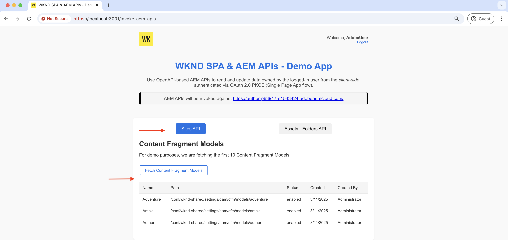

# Aufrufen von OpenAPI-basierten AEM-APIs mithilfe der OAuth-Einzelseiten-App

Erfahren Sie, wie Sie OpenAPI-basierte AEM-APIs in AEM as a Cloud Service mithilfe der **OAuth Single Page App-Authentifizierung** aufrufen. Es folgt dem OAuth 2.0 PKCE-Fluss (Proof Key for Code Exchange) für die benutzerbasierte Authentifizierung in einer Single Page Application (SPA).

Die OAuth Single Page App-Authentifizierung ist ideal für JavaScript-basierte Anwendungen, die im Browser ausgeführt werden. Unabhängig davon, ob ein Backend-Server fehlt oder ob Zugriffstoken abgerufen werden müssen, um im Namen eines Benutzers mit AEM-APIs zu interagieren.

Der PKCE-Fluss erweitert den Gewährungstyp OAuth 2.0 _authorization_code_ und erhöht die Sicherheit, indem er das Abfangen von Autorisierungs-Code verhindert. Weitere Informationen finden Sie im Abschnitt [Unterschied zwischen OAuth Server-zu-Server- und Web-App- bzw. Single Page App-Anmeldeinformationen](../overview.md#difference-between-oauth-server-to-server-vs-web-app-vs-single-page-app-credentials) .

>[!AVAILABILITY]
>
>OpenAPI-basierte AEM-APIs sind als Teil eines Early-Access-Programms verfügbar. Wenn Sie daran interessiert sind, darauf zuzugreifen, empfehlen wir Ihnen, eine E-Mail an [aem-apis@adobe.com](mailto:aem-apis@adobe.com) mit einer Beschreibung Ihres Anwendungsfalls zu senden.

## Lerninhalt{#what-you-learn}

In diesem Tutorial erfahren Sie, wie Sie:

- Konfigurieren Sie ein Adobe Developer Console (ADC)-Projekt für den Zugriff auf die OpenAPI-basierten AEM-APIs mithilfe der _OAuth Single Page App_-Authentifizierung oder allgemein als _OAuth 2.0 PKCE Flow_ bekannt.

- Implementieren des OAuth Single Page App-Authentifizierungsflusses in einer benutzerdefinierten SPA.
   - IMS-Benutzerauthentifizierung und App-Autorisierung.
   - Abrufen von Zugriffstoken mithilfe des OAuth 2.0 PKCE-Flusses.
   - Verwenden Sie das Zugriffstoken, um OpenAPI-basierte AEM-APIs aufzurufen.

Bevor Sie beginnen, stellen Sie sicher, dass Sie Folgendes überprüft haben:

- [ Abschnitt „Zugriff auf Adobe-APIs und ](../overview.md#accessing-adobe-apis-and-related-concepts) Konzepte“.
- [ Artikel zum Einrichten von OpenAPI-basierten AEM](../setup.md)APIs.

## Übersicht über WKND SPA und funktionaler Ablauf{#wknd-spa-overview-and-functional-flow}

Lassen Sie uns untersuchen, was die WKND-SPA ist, wie sie aufgebaut ist und wie sie funktioniert.

Die WKND-SPA ist eine **React-basierte Einzelseitenanwendung** die zeigt, wie Sie ein benutzerspezifisches Zugriffstoken sicher abrufen und direkt von der Client-Seite aus mit AEM-APIs interagieren können. Es implementiert den OAuth 2.0 PKCE-Authentifizierungsfluss über Adobe IMS und integriert sich mit zwei wichtigen AEM-APIs:

1. **Sites-**: für den Zugriff auf Inhaltsfragmentmodelle
1. **Assets API**: Zum Verwalten von DAM-Ordnern

Das Adobe Developer Console-Projekt (ADC) ist so konfiguriert, dass es die OAuth Single Page App-Authentifizierung aktiviert und die erforderliche **client_id** bereitstellt, um den OAuth 2.0 PKCE-Fluss zu initiieren.

>[!IMPORTANT]
>
>Das ADC-Projekt stellt KEIN &quot;__secret“_. Stattdessen generiert die SPA einen _code_verifier_ und _code_Challenge_, um den Autorisierungs-Code sicher gegen ein _Zugriffstoken_ einzutauschen. Dadurch entfällt die Notwendigkeit, Client-Geheimnisse Client-seitig zu speichern, was die Sicherheit erhöht.

>[!VIDEO](https://video.tv.adobe.com/v/3456964?quality=12&learn=on)


Das folgende Diagramm veranschaulicht den funktionalen Ablauf der WKND-SPA _Abrufen eines benutzerspezifischen Zugriffstokens zum Aufrufen von OpenAPI-basierten AEM-APIs_:


1. Die SPA initiiert den Authentifizierungsfluss, indem sie den Benutzer über eine Autorisierungsanfrage an das Adobe Identity Management System (IMS) weiterleitet.
1. Im Rahmen der Autorisierungsanfrage sendet die SPA die _client_id_, _redirect_uri_ und _code_Challenge_ nach dem OAuth 2.0 PKCE-Fluss an IMS. Die SPA generiert einen zufälligen _code_verifier_, hasht ihn mit SHA-256, und Base64 codiert das Ergebnis, um die _code_Challenge_ zu erstellen.
1. Das IMS authentifiziert den Benutzer und gibt nach erfolgreicher Authentifizierung einen _authorization_code_ aus, der über den _redirect_uri_ an die SPA zurückgesendet wird.
1. Die SPA tauscht den _authorization_code_ gegen ein _Zugriffstoken_ durch Senden einer POST-Anfrage an den IMS-Token-Endpunkt aus. Er enthält den _code_verifier_ in der Anfrage zur Validierung der _code_Challenge_ die zuvor gesendet wurde. Dadurch wird sichergestellt, dass die Autorisierungsanfrage (Schritt 2) und die Token-Anfrage (Schritt 4) mit demselben Authentifizierungsfluss verknüpft sind, wodurch Abfangangriffe verhindert werden.
1. Das IMS validiert den _code_verifier_ und gibt das benutzerspezifische _Zugriffstoken“_.
1. Die SPA enthält das _Zugriffstoken_ in API-Anfragen an AEM zum Authentifizieren und Abrufen benutzerspezifischer Inhalte.

Die WKND-SPA ist eine [React](https://react.dev/)-basierte Anwendung und verwendet [.React Context](https://react.dev/reference/react/createContext) für die Verwaltung des Authentifizierungsstatus [React Router](https://reactrouter.com/home) für die Navigation.

Andere SPA-Frameworks wie Angular, Vue oder Vanilla JavaScript können verwendet werden, um SPA zu erstellen, die sich mithilfe der in diesem Tutorial beschriebenen Ansätze in die Adobe-APIs integrieren lässt.

## Verwendung dieses Tutorials{#how-to-use-this-tutorial}

Sie haben zwei Möglichkeiten, sich mit diesem Tutorial vertraut zu machen:

- [Überprüfen von SPA-Schlüssel-Code-Snippets](#review-spa-key-code-snippets): Machen Sie sich mit dem Authentifizierungsfluss der OAuth-Single-Page-App vertraut und erkunden Sie die Implementierungen der wichtigsten API-Aufrufe in der WKND-SPA.
- [Einrichten und Ausführen der SPA](#setup-and-run-the-spa): Befolgen Sie die schrittweisen Anweisungen zum Konfigurieren und Ausführen der WKND-SPA auf Ihrem lokalen Computer.

Wählen Sie den Weg, der Ihren Bedürfnissen am besten entspricht!

## Überprüfen von SPA-Schlüssel-Code-Snippets{#review-spa-key-code-snippets}

Sehen wir uns die wichtigsten Code-Snippets aus der WKND-SPA an, die Folgendes zeigen:

- Rufen Sie ein benutzerspezifisches Zugriffstoken mithilfe des OAuth-Authentifizierungsflusses für Einzelseiten-Apps ab.

- Rufen Sie OpenAPI-basierte AEM-APIs direkt von der Client-Seite aus auf.

Diese Snippets helfen Ihnen, den Authentifizierungsprozess und die API-Interaktionen innerhalb der SPA zu verstehen.

### Herunterladen des SPA-Codes{#download-the-spa-code}

1. Laden Sie die [WKND SPA &amp; AEM APIs - Demo App](../assets/spa/wknd-spa-with-aemapis-demo.zip) Zip-Datei herunter und extrahieren Sie sie.

1. Navigieren Sie zum extrahierten Ordner und öffnen Sie die `.env.example` in Ihrem bevorzugten Code-Editor. Überprüfen Sie die erforderlichen Konfigurationsparameter.

   ```plaintext
   ########################################################################
   # Adobe IMS, Adobe Developer Console (ADC), and AEM as a Cloud Service Information
   ########################################################################
   # Adobe IMS OAuth endpoints
   REACT_APP_ADOBE_IMS_AUTHORIZATION_ENDPOINT=https://ims-na1.adobelogin.com/ims/authorize/v2
   REACT_APP_ADOBE_IMS_TOKEN_ENDPOINT=https://ims-na1.adobelogin.com/ims/token/v3
   
   # Adobe Developer Console (ADC) Project's OAuth Single-Page App credential
   REACT_APP_ADC_CLIENT_ID=<ADC Project OAuth Single-Page App credential ClientID>
   REACT_APP_ADC_SCOPES=<ADC Project OAuth Single-Page App credential Scopes>
   
   # AEM Assets Information
   REACT_APP_AEM_ASSET_HOSTNAME=<AEMCS Hostname, e.g., https://author-p63947-e1502138.adobeaemcloud.com/>
   
   ################################################
   # Single Page Application Information
   ################################################
   
   # Enable HTTPS for local development
   HTTPS=true
   PORT=3001
   
   # SSL Certificate and Key for local development 
   SSL_CRT_FILE=./ssl/server.crt
   SSL_KEY_FILE=./ssl/server.key
   
   # The URL to which the user will be redirected after the OAuth flow is complete
   REACT_APP_REDIRECT_URI=https://localhost:3000/callback
   ```

   Sie müssen die Platzhalter durch die tatsächlichen Werte aus dem Adobe Developer Console (ADC)-Projekt und der AEM as a Cloud Service Assets-Instanz ersetzen.

### IMS-Benutzerauthentifizierung und SPA-Autorisierung{#ims-user-authentication-and-spa-authorization}

Im Folgenden wird der Code für die IMS-Benutzerauthentifizierung und SPA-Autorisierung vorgestellt. Um Inhaltsfragmentmodelle und DAM-Ordner abzurufen, muss sich der Benutzer bei Adobe IMS authentifizieren und der WKND-SPA die Berechtigung zum Zugriff auf AEM-APIs in seinem Namen gewähren.

Während der ersten Anmeldung wird der Benutzer aufgefordert, sein Einverständnis zu erteilen, sodass die WKND-SPA sicher auf die erforderlichen Ressourcen zugreifen kann.


1. In `src/context/IMSAuthContext.js` Datei initiiert die Funktion `login` den IMS-Benutzerauthentifizierungs- und App-Autorisierungsfluss. Es generiert eine zufällige `code_verifier` und `code_challenge`, um die `code` sicher gegen ein Zugriffstoken einzutauschen. Der `code_verifier` wird zur späteren Verwendung im lokalen Speicher gespeichert. Wie bereits erwähnt, speichert oder verwendet die SPA die `client_secret` nicht, sondern generiert eine spontan und verwendet sie in zwei Schritten: `authorize` und `token`.

   ```javascript
   ...
   const login = async () => {
       try {
           const codeVerifier = generateCodeVerifier();
           const codeChallenge = generateCodeChallenge(codeVerifier);
   
           localStorage.setItem(STORAGE_KEYS.CODE_VERIFIER, codeVerifier);
   
           const params = new URLSearchParams(
               getAuthParams(AUTH_METHODS.S256, codeChallenge, codeVerifier)
           );
   
           window.location.href = `${
               APP_CONFIG.adobe.ims.authorizationEndpoint //https://ims-na1.adobelogin.com/ims/authorize/v2
           }?${params.toString()}`;
       } catch (error) {
           console.error("Login initialization failed:", error);
           throw error;
       }
   };
   ...
   
   // Generate a random code verifier
   export function generateCodeVerifier() {
       const array = new Uint8Array(32);
       window.crypto.getRandomValues(array);
       const wordArray = CryptoJS.lib.WordArray.create(array);
       return base64URLEncode(wordArray);
   }
   
   // Generate code challenge using SHA-256
   export function generateCodeChallenge(codeVerifier) {
       const hash = CryptoJS.SHA256(codeVerifier);
       return base64URLEncode(hash);
   }
   
   // Get authorization URL parameters
   const getAuthParams = useCallback((method, codeChallenge, codeVerifier) => {
       const baseParams = {
           client_id: APP_CONFIG.adobe.adc.clientId, // ADC Project OAuth Single-Page App credential ClientID
           scope: APP_CONFIG.adobe.adc.scopes, // ADC Project OAuth Single-Page App credential Scopes
           response_type: "code",
           redirect_uri: APP_CONFIG.adobe.spa.redirectUri, // SPA redirect URI https://localhost:3000/callback
           code_challenge_method: method, // S256 or plain
       };
   
       return {
           ...baseParams,
           code_challenge:
               method === AUTH_METHODS.S256 ? codeChallenge : codeVerifier,
           };
   }, []);    
   ...
   ```

   Wenn die Benutzerin bzw. der Benutzer nicht über Adobe IMS authentifiziert wird, wird die Adobe ID-Anmeldeseite angezeigt, auf der die Benutzerin bzw. der Benutzer zur Authentifizierung aufgefordert wird.

   Wenn der Benutzer bereits authentifiziert ist, wird er mit einem _authorization_code_ zurück zum angegebenen _redirect_uri_ der WKND-SPA geleitet.

### Abrufen von Zugriffstoken mithilfe des OAuth 2.0 PKCE-Flusses{#access-token-retrieval-using-oauth-20-pkce-flow}

Die WKND-SPA tauscht den _authorization_code_ sicher mit dem Adobe IMS gegen ein benutzerspezifisches Zugriffstoken aus und verwendet dabei _client_id_ und _code_verifier_.

1. In der `src/context/IMSAuthContext.js` tauscht die Funktion `exchangeCodeForToken` den _authorization_code_ gegen ein benutzerspezifisches Zugriffstoken aus.

   ```javascript
   ...
   // Handle the callback from the Adobe IMS authorization endpoint
   const handleCallback = async (code) => {
       if (authState.isProcessingCallback) return;
   
       try {
           updateAuthState({ isProcessingCallback: true });
   
           const data = await exchangeCodeForToken(code);
   
           if (data.access_token) {
               handleStorageToken(data.access_token);
               localStorage.removeItem(STORAGE_KEYS.CODE_VERIFIER);
           }
       } catch (error) {
           console.error("Error exchanging code for token:", error);
           throw error;
       } finally {
           updateAuthState({ isProcessingCallback: false });
       }
   };
   
   ...
   // Exchange the authorization code for an access token
   const exchangeCodeForToken = useCallback(async (code) => {
       const codeVerifier = localStorage.getItem(STORAGE_KEYS.CODE_VERIFIER);
   
       if (!codeVerifier) {
           throw new Error("No code verifier found");
       }
   
       //https://ims-na1.adobelogin.com/ims/token/v3
       const response = await fetch(APP_CONFIG.adobe.ims.tokenEndpoint, {
           method: "POST",
           headers: { "Content-Type": "application/x-www-form-urlencoded" },
           body: new URLSearchParams({
               grant_type: "authorization_code",
               client_id: APP_CONFIG.adobe.adc.clientId, // ADC Project OAuth Single-Page App credential ClientID
               code_verifier: codeVerifier, // Code verifier generated during login
               code, // Authorization code received from the IMS
               redirect_uri: `${window.location.origin}/callback`,
           }),
       });
   
       if (!response.ok) {
           throw new Error("Token request failed");
       }
   
       return response.json();
   }, []);
   
   const handleStorageToken = useCallback(
       (token) => {
           if (token) {
               localStorage.setItem(STORAGE_KEYS.ACCESS_TOKEN, token);
               updateAuthState({ isLoggedIn: true, accessToken: token });
           }
       },
       [updateAuthState]
   );
   ...
   ```

   Das Zugriffstoken wird im lokalen Speicher des Browsers gespeichert und in den nachfolgenden API-Aufrufen an die AEM-APIs verwendet.

### Zugriff auf OpenAPI-basierte AEM-APIs mithilfe des Zugriffstokens{#accessing-openapi-based-aem-apis-using-the-access-token}

Die WKND-SPA verwendet das benutzerspezifische Zugriffstoken, um die Inhaltsfragmentmodelle und DAM-Ordner-API-Endpunkte aufzurufen.

In der `src/components/InvokeAemApis.js`-Datei zeigt die `fetchContentFragmentModels`, wie Sie mit dem Zugriffstoken die OpenAPI-basierten AEM-APIs Client-seitig aufrufen können.

```javascript
    ...
  // Fetch Content Fragment Models
  const fetchContentFragmentModels = useCallback(async () => {
    try {
      updateState({ isLoading: true, error: null });
      const data = await makeApiRequest({
        endpoint: `${API_PATHS.CF_MODELS}?cursor=0&limit=10&projection=summary`,
      });
      updateState({ cfModels: data.items });
    } catch (err) {
      updateState({ error: err.message });
      console.error("Error fetching CF models:", err);
    } finally {
      updateState({ isLoading: false });
    }
  }, [makeApiRequest, updateState]);

  // Common API request helper
  const makeApiRequest = useCallback(
    async ({ endpoint, method = "GET", passAPIKey = false, body = null }) => {
    
      // Get the access token from the local storage
      const token = localStorage.getItem("adobe_ims_access_token");
      if (!token) {
        throw new Error("No access token available. Please login again.");
      }

      const headers = {
        Authorization: `Bearer ${token}`,
        "Content-Type": "application/json",
        ...(passAPIKey && { "x-api-key": APP_CONFIG.adobe.adc.clientId }),
      };

      const response = await fetch(
        `${APP_CONFIG.adobe.aem.hostname}${endpoint}`,
        {
          method,
          headers,
          ...(body && { body: JSON.stringify(body) }),
        }
      );

      if (!response.ok) {
        throw new Error(`API request failed: ${response.statusText}`);
      }

      return method === "DELETE" ? null : response.json();
    },
    []
  );
  ...
```

## Einrichten und Ausführen der SPA{#setup-and-run-the-spa}

Konfigurieren wir die WKND-SPA und führen sie auf Ihrem lokalen Computer aus, um den OAuth-Ablauf der Einzelseiten-App-Authentifizierung und die API-Aufrufe zu verstehen.

### Voraussetzungen{#prerequisites}

Zum Durchführen dieses Tutorials benötigen Sie Folgendes:

- Modernisierte AEM as a Cloud Service-Umgebung mit folgenden Neuerungen:
   - AEM-Version `2024.10.18459.20241031T210302Z` oder höher.
   - Neue Stil-Produktprofile (wenn die Umgebung vor November 2024 erstellt wurde)

  Weitere Einzelheiten finden Sie [ Artikel zum Einrichten von OpenAPI](../setup.md)basierten AEM-APIs .

- Das Beispielprojekt [WKND Sites](https://github.com/adobe/aem-guides-wknd?#aem-wknd-sites-project) muss darin bereitgestellt werden.

- Rufen Sie die [Adobe Developer Console](https://developer.adobe.com/developer-console/docs/guides/getting-started/) auf.

- Installieren Sie [Node.js](https://nodejs.org/de/) auf Ihrem lokalen Computer, um die NodeJS-Beispielanwendung auszuführen.

### Entwicklungsschritte{#development-steps}

Die allgemeinen Entwicklungsschritte lauten:

1. ADC-Projekt konfigurieren
   1. Fügen Sie die Assets- und Sites-APIs hinzu.
   1. Konfigurieren von OAuth Single Page App-Anmeldeinformationen.
1. Konfigurieren der AEM-Instanz
   1. So aktivieren Sie die ADC-Projektkommunikation
   1. Um der SPA Zugriff auf die AEM-APIs zu gewähren, konfigurieren Sie die CORS-Einstellungen.
1. Konfigurieren und führen Sie die WKND-SPA auf Ihrem lokalen Computer aus
1. Überprüfen des End-to-End-Flusses

### ADC-Projekt konfigurieren{#configure-adc-project}

Der Schritt zum Konfigurieren des ADC _Projekts wird_ der [OpenAPI-basierten AEM-APIs](../setup.md) wiederholt. Wiederholt wird, um die Assets Sites-API hinzuzufügen und ihre Authentifizierungsmethode als OAuth-Einzelseiten-App zu konfigurieren.

1. Öffnen Sie in der {0](https://developer.adobe.com/console/projects)Adobe Developer Console} das gewünschte Projekt.[

1. Um AEM-APIs hinzuzufügen, klicken Sie auf die Schaltfläche **API hinzufügen**.

   

1. Filtern Sie _Dialogfeld „API hinzufügen_ nach _Experience Cloud_ und wählen Sie die Karte **Content-Management für AEM CS Sites** klicken Sie auf **Weiter**.

   

1. Wählen Sie anschließend im Dialogfeld _API konfigurieren_ die Option **Benutzerauthentifizierung** und klicken Sie auf **Weiter**.

   

1. Wählen Sie im nächsten _API konfigurieren_ die Authentifizierungsoption **OAuth Single-Page App** und klicken Sie auf **Weiter**.

   

1. Geben _im Dialogfeld OAuth Single-Page App konfigurieren_ die folgenden Details ein und klicken Sie auf **Weiter**.
   - Standard-Umleitungs-URI: `https://localhost:3001/callback`
   - Umleitungs-URI-Muster: `https://localhost:3001/callback`

   

1. Überprüfen Sie die verfügbaren Bereiche und klicken Sie auf **Konfigurierte API speichern**.

   

1. Wiederholen Sie die obigen Schritte, um die **AEM Assets Author-API hinzuzufügen**.

1. Überprüfen Sie die AEM-API und die Authentifizierungskonfiguration.

   

   

### Konfigurieren der AEM-Instanz zur Aktivierung der ADC-Projektkommunikation{#configure-aem-instance-to-enable-adc-project-communication}

Befolgen Sie die Anweisungen im Artikel [Einrichten von OpenAPI-basierten AEM](../setup.md#configure-the-aem-instance-to-enable-adc-project-communication)APIs , um die AEM-Instanz so zu konfigurieren, dass die ADC-Projektkommunikation aktiviert wird.

### AEM CORS-Konfiguration{#aem-cors-configuration}

Die Ressourcenfreigabe zwischen verschiedenen Ursprüngen (Cross-Origin Resource Sharing, CORS) von AEM as a Cloud Service ermöglicht AEM-fremden Web-Eigenschaften browserbasierte Client-seitige Aufrufe an AEM-APIs.

1. Suchen Sie im AEM-Projekt im Ordner `/ui.config/src/main/content/jcr_root/apps/wknd/osgiconfig/config.author/` nach der Datei `com.adobe.granite.cors.impl.CORSPolicyImpl~wknd-graphql.cfg.json` oder erstellen Sie diese.

   

1. Fügen Sie der Datei die folgende Konfiguration hinzu.

   ```json
   {
       "alloworigin":[
         ""
       ],
       "alloworiginregexp":[
         "https://localhost:.*",
         "http://localhost:.*"
       ],
       "allowedpaths": [
         "/adobe/sites/.*",
         "/graphql/execute.json.*",
         "/content/_cq_graphql/wknd-shared/endpoint.json",
         "/content/experience-fragments/.*"
       ],
       "supportedheaders": [
         "Origin",
         "Accept",
         "X-Requested-With",
         "Content-Type",
         "Access-Control-Request-Method",
         "Access-Control-Request-Headers",
         "Authorization"
       ],
       "supportedmethods":[
         "GET",
         "HEAD",
         "POST"
       ],
       "maxage:Integer": 1800,
       "supportscredentials": true,
       "exposedheaders":[ "" ]
   }
   ```

1. Übergeben Sie die Konfigurationsänderungen und übertragen Sie die Änderungen an das Remote-Git-Repository, mit dem die Cloud Manager-Pipeline verbunden ist.

1. Stellen Sie die oben genannten Änderungen mithilfe der Full-Stack-Pipeline in der Cloud Manager bereit.

### Konfigurieren und Ausführen der SPA{#configure-and-run-the-spa}

1. Laden Sie die [WKND SPA &amp; AEM APIs - Demo App](../assets/spa/wknd-spa-with-aemapis-demo.zip) Zip-Datei herunter und extrahieren Sie sie.

1. Navigieren Sie zum extrahierten Ordner und kopieren Sie die `.env.example` in `.env`.

1. Aktualisieren Sie die `.env` mit den erforderlichen Konfigurationsparametern aus dem Adobe Developer Console (ADC)-Projekt und der AEM as a Cloud Service-Umgebung. Zum Beispiel:

   ```plaintext
   ########################################################################
   # Adobe IMS, Adobe Developer Console (ADC), and AEM as a Cloud Service Information
   ########################################################################
   # Adobe IMS OAuth endpoints
   REACT_APP_ADOBE_IMS_AUTHORIZATION_ENDPOINT=https://ims-na1.adobelogin.com/ims/authorize/v2
   REACT_APP_ADOBE_IMS_TOKEN_ENDPOINT=https://ims-na1.adobelogin.com/ims/token/v3
   REACT_APP_ADOBE_IMS_USERINFO_ENDPOINT=https://ims-na1.adobelogin.com/ims/userinfo/v2
   
   # Adobe Developer Console (ADC) Project's OAuth Single-Page App credential
   REACT_APP_ADC_CLIENT_ID=ddsfs455a4a440c48c7474687c96945d
   REACT_APP_ADC_SCOPES=AdobeID,openid,aem.folders,aem.assets.author,aem.fragments.management
   
   # AEM Assets Information
   REACT_APP_AEM_ASSET_HOSTNAME=https://author-p69647-e1453424.adobeaemcloud.com/
   
   ################################################
   # Single Page Application Information
   ################################################
   
   # Enable HTTPS for local development
   HTTPS=true
   PORT=3001
   
   # SSL Certificate and Key for local development 
   SSL_CRT_FILE=./ssl/server.crt
   SSL_KEY_FILE=./ssl/server.key
   
   # The URL to which the user will be redirected after the OAuth flow is complete
   REACT_APP_REDIRECT_URI=https://localhost:3000/callback
   ```

1. Öffnen Sie ein Terminal und navigieren Sie zum extrahierten Ordner. Installieren Sie die erforderlichen Abhängigkeiten und starten Sie die WKND-SPA mit dem folgenden Befehl.

   ```bash
   $ npm install
   $ npm start
   ```

### Überprüfen des End-to-End-Flusses{#verify-the-end-to-end-flow}

1. Öffnen Sie einen Browser und navigieren Sie zu `https://localhost:3001` , um auf die WKND-SPA zuzugreifen. Akzeptieren Sie die Warnung zum selbstsignierten Zertifikat.

   

1. Klicken Sie auf die Schaltfläche **Adobe IMS-Anmeldung**, um den OAuth-Authentifizierungsfluss für Einzelseiten-Apps zu starten.

1. Authentifizierung über Adobe IMS und Einverständnis, um der WKND-SPA den Zugriff auf die Ressourcen in Ihrem Namen zu ermöglichen.

1. Nach erfolgreicher Authentifizierung werden Sie zurück zur `/invoke-aem-apis` Route der WKND-SPA weitergeleitet, und das Zugriffstoken wird im lokalen Speicher des Browsers gespeichert.

   

1. Klicken Sie auf der `https://localhost:3001/invoke-aem-apis` Route auf die Schaltfläche **Inhaltsfragmentmodelle abrufen**, um die API für Inhaltsfragmentmodelle aufzurufen. Die SPA zeigt die Liste der Inhaltsfragmentmodelle an.

   

1. Ebenso können Sie auf der Registerkarte **Assets -**-API DAM-Ordner auflisten, erstellen und löschen.

   

1. In den Entwickler-Tools des Browsers können Sie die Netzwerkanfragen und -antworten einsehen, um die API-Aufrufe zu verstehen.

   

>[!IMPORTANT]
>
>Wenn der authentifizierte Benutzer nicht über die erforderlichen Berechtigungen zum Auflisten, Erstellen oder Löschen von AEM-Ressourcen verfügt, schlagen die API-Aufrufe mit dem Fehler „403 Forbidden“ fehl. Dadurch wird sichergestellt, dass Benutzende auch dann nicht ohne die erforderlichen Berechtigungen auf AEM-Ressourcen zugreifen können, wenn sie authentifiziert sind und über ein gültiges IMS-Zugriffstoken verfügen.

### Überprüfen des SPA-Codes{#review-the-spa-code}

Sehen wir uns die allgemeine Code-Struktur und die wichtigsten Einstiegspunkte der WKND-SPA an. Die SPA wird mit dem React-Framework erstellt und verwendet die React Context-API für die Authentifizierung und die Statusverwaltung.

1. Die `src/App.js`-Datei ist der Haupteinstiegspunkt der WKND-SPA. Die App-Komponente umschließt die gesamte Anwendung und initialisiert den `IMSAuthProvider`.

1. Der `src/context/IMSAuthContext.js` erstellt den Adobe IMSAuthContext, um den Authentifizierungsstatus für die untergeordneten Komponenten bereitzustellen. Sie enthält die Anmelde-, Abmelde- und HandleCallback-Funktionen, um den OAuth-Authentifizierungsfluss für Einzelseiten-Apps zu initiieren.

1. Der `src/components`-Ordner enthält verschiedene Komponenten, um die API-Aufrufe an die AEM-APIs zu veranschaulichen. Die `InvokeAemApis.js`-Komponente zeigt, wie das Zugriffstoken zum Aufrufen der AEM-APIs verwendet wird.

1. Die `src/config/config.js`-Datei lädt die Umgebungsvariablen aus der `.env`-Datei und exportiert sie zur Verwendung in der Anwendung.

1. Die `src/utils/auth.js`-Datei enthält Dienstprogrammfunktionen zum Generieren des Code Verifier und der Code Challenge für den OAuth 2.0 PKCE-Fluss.

1. Der `ssl`-Ordner enthält das selbstsignierte Zertifikat und die Schlüsseldateien zum Ausführen des lokalen SSL-HTTP-Proxys.

Sie können die vorhandene SPA mit den Adobe-APIs entwickeln oder integrieren, indem Sie die in diesem Tutorial beschriebenen Ansätze verwenden.

## Zusammenfassung{#summary}

In diesem Tutorial haben Sie erfahren, wie Sie OpenAPI-basierte AEM-APIs in AEM as a Cloud Service mithilfe der benutzerbasierten Authentifizierung von einer Single Page App (SPA) über den OAuth 2.0 PKCE-Fluss aufrufen.

## Zusätzliche Ressourcen{#additional-resources}

- [Implementierungshandbuch für die Benutzerauthentifizierung](https://developer.adobe.com/developer-console/docs/guides/authentication/UserAuthentication/implementation/)
- [Anfrage autorisieren](https://developer.adobe.com/developer-console/docs/guides/authentication/UserAuthentication/IMS/#authorize-request)
- [Abrufen von Zugriffstoken](https://developer.adobe.com/developer-console/docs/guides/authentication/UserAuthentication/IMS/#fetching-access-tokens)
