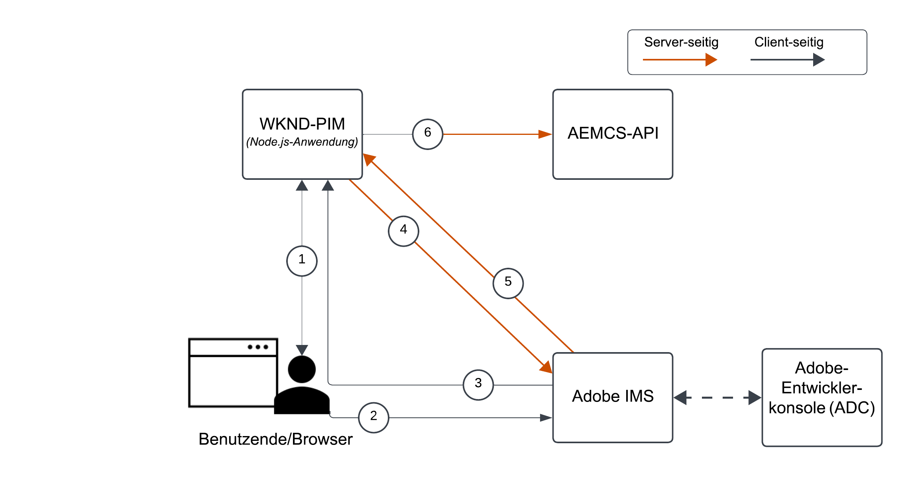
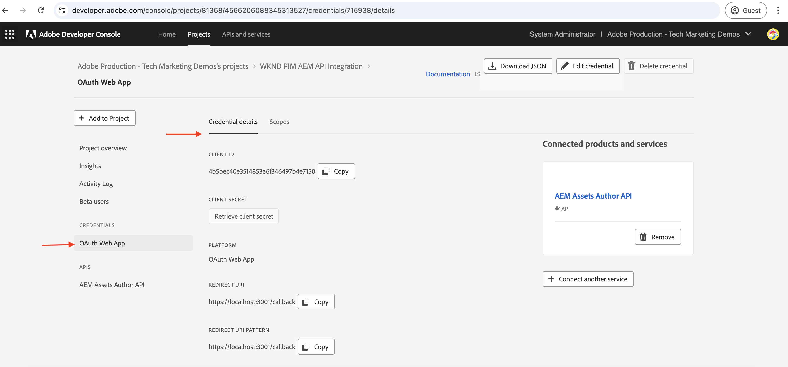
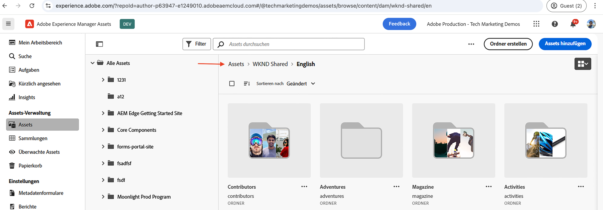
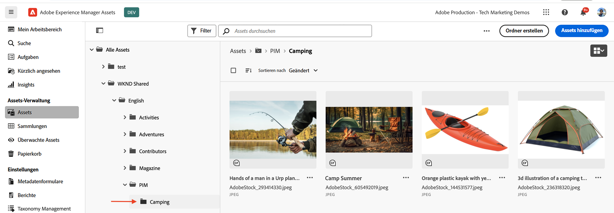
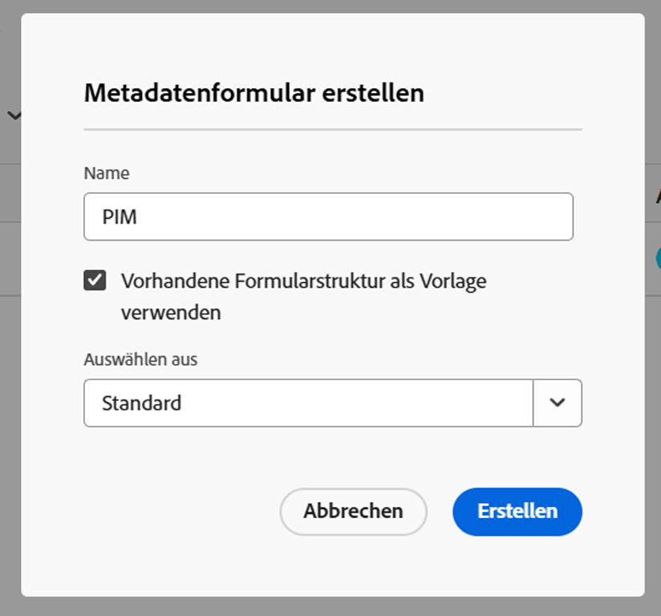
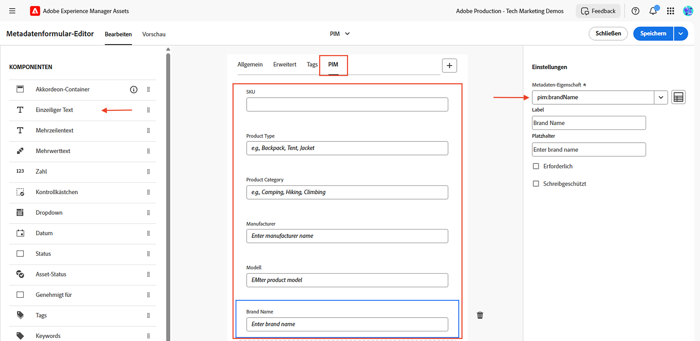
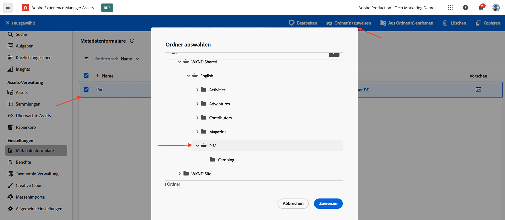

# Aufrufen von OpenAPI-basierten AEM-APIs mithilfe der OAuth-Web-Anwendungs-Authentifizierung

Erfahren Sie, wie Sie OpenAPI-basierte AEM-APIs in AEM as a Cloud Service mithilfe der benutzerbasierten Authentifizierung über eine benutzerdefinierte Web-Anwendung aufrufen, die die OAuth-Web-Anwendung verwendet.

Die OAuth-Web-Anwendungs-Authentifizierung eignet sich ideal für Web-Anwendungen mit Frontend- und _Backend_-Komponenten, die **im Namen einer Benutzerin bzw. eines Benutzers auf AEM-APIs zugreifen müssen**. Verwendet wird der OAuth 2.0-Grant-Typ _authorization_code_, um ein Zugriffs-Token im Namen der Benutzerin bzw. des Benutzers abzurufen, die bzw. der auf die AEM-APIs zugreift. Weitere Informationen finden Sie unter [Unterschied zwischen OAuth-Server-zu-Server-, Web-Anwendungs- und Single-Page-Application-Anmeldedaten](../overview.md#difference-between-oauth-server-to-server-vs-web-app-vs-single-page-app-credentials).

## Lerninhalt{#what-you-learn}

In diesem Tutorial lernen Sie Folgendes:

- Konfigurieren eines Adobe Developer Console(ADC)-Projekts für den Zugriff auf das Assets Author-API mithilfe der _OAuth-Web-Anwendungs-Authentifizierung_

- Implementieren des OAuth-Web-Anwendungs-Authentifizierungsflusses in einer benutzerdefinierten Web-Anwendung
   - IMS-Benutzerauthentifizierung und Anwendungsautorisierung
   - Abrufen benutzerspezifischer Zugriffs-Token
   - Zugreifen auf OpenAPI-basierte AEM-APIs mithilfe des benutzerspezifischen Zugriffs-Token

Bevor Sie beginnen, stellen Sie sicher, dass Sie sich Folgendes angesehen haben:

- den Abschnitt [Zugreifen auf Adobe-APIs und zugehörige Konzepte](../overview.md#accessing-adobe-apis-and-related-concepts)
- den Artikel [Einrichten von OpenAPI-basierten AEM-APIs](../setup.md)

## Beispiel-Web-Anwendung: WKND-PIM – Überblick und Funktionsfluss

Erfahren Sie mehr über die Beispiel-Web-Anwendung, das WKND-Produktinformations-Management (PIM) und den Funktionsfluss.

Die WKND-PIM-Anwendung ist eine Beispiel-Web-Anwendung, die zur Verwaltung von Produktattributen und deren in AEM as a Cloud Service gespeicherten Asset-Metadaten entwickelt wurde. Dieses Beispiel zeigt, wie Web-Anwendungen nahtlos in Adobe-APIs integriert werden können, um effiziente, benutzerorientierte Workflows bereitzustellen.

Das Adobe Developer Console(ADC)-Projekt ist so konfiguriert, dass es über die OAuth-Web-Anwendungs-Authentifizierung auf die Assets Author-API zugreift. Es stellt der Web-Anwendung WKND-PIM die erforderliche _client_id_ und das erforderliche _client_secret_ bereit, um den _authorization_code_-Grant-Fluss zu initiieren.

>[!VIDEO](https://video.tv.adobe.com/v/3442757?quality=12&learn=on)


Die folgende Abbildung zeigt den Funktionsfluss der Web-Anwendung WKND-PIM zum _Abrufen benutzerspezifischer Zugriffs-Token für die Interaktion mit dem Assets Author-API_.



1. Die Web-Anwendung initiiert den Prozess, indem sie die Benutzerin bzw. den Benutzer zur Authentifizierung zum Adobe-Identitäts-Management-System (IMS) weiterleitet.
1. Die Web-Anwendung übergibt zusammen mit der Umleitung die erforderliche _client_id_ und den erforderlichen _redirect_uri_ an das IMS.
1. Das IMS authentifiziert die Benutzerin bzw. den Benutzer und sendet sie bzw. ihn mit einem _authorization_code_ zurück an den angegebenen _redirect_uri_.
1. Die Web-Anwendung tauscht den _authorization_code_ mit dem IMS gegen ein benutzerspezifisches Zugriffs-Token aus. Hierzu verwendet sie die _client_id_ und das _client_secret_.
1. Nach erfolgreicher Validierung gibt das IMS das benutzerspezifische _Zugriffs-Token_ aus.
1. Die Web-Anwendung verwendet auf sichere Weise das _Zugriffs-Token_, um mit dem Assets Author-API zu interagieren, sodass Benutzende Produkt-Asset-Metadaten abrufen oder aktualisieren können.

Die Web-Anwendung WKND-PIM wird mit [Node.js](https://nodejs.org/en) und [Express](https://expressjs.com/) entwickelt. Express dient als Server, der private Geheimnisse und benutzerspezifische Zugriffs-Token sicher verwaltet.

Andere Web-Stacks (Java, Python, .NET-basiert usw.) können mithilfe der in diesem Tutorial beschriebenen Ansätze zum Erstellen von Web-Anwendungen verwendet werden, die sich mit den Adobe-APIs integrieren lassen.

## Verwendung dieses Tutorials{#how-to-use-this-tutorial}

Im Abschnitt [Überprüfen der wichtigsten Code-Snippets der Web-Anwendung](#review-web-app-key-code-snippets) finden Sie weitere Informationen zum Authentifizierungsfluss der OAuth-Web-Anwendung und den in der Web-Anwendung WKND-PIM verwendeten Code-Snippets für API-Aufrufe. Sie können auch direkt mit dem Abschnitt [Einrichten und Ausführen der Web-Anwendung](#setup-run-web-app) fortfahren, um die Web-Anwendung WKND-PIM auf Ihrem lokalen Computer einzurichten und auszuführen und den OAuth-Web-Anwendungs-Authentifizierungsfluss sowie die API-Aufrufe zu verstehen.

## Überprüfen der wichtigsten Code-Snippets der Web-Anwendung{#review-web-app-key-code-snippets}

Sehen wir uns nun die wichtigsten Code-Snippets in der Web-Anwendung WKND-PIM an, um den OAuth-Web-Anwendungs-Authentifizierungsfluss und die API-Aufrufe zu verstehen.

### Herunterladen des Codes der Web-Anwendung WKND-PIM

1. Laden Sie die ZIP-Datei für die [Web-Anwendung WKND-PIM](../assets/web-app/wknd-pim-demo-web-app.zip) herunter und extrahieren Sie sie.

1. Navigieren Sie zum extrahierten Ordner und öffnen Sie die Datei `.env.example` in Ihrem bevorzugten Code-Editor. Überprüfen Sie die erforderlichen Konfigurationsparameter.

   ```plaintext
   ########################################################################
   # Adobe IMS, Adobe Developer Console (ADC), and AEM Assets Information
   ########################################################################
   # Adobe IMS OAuth endpoints
   ADOBE_IMS_AUTHORIZATION_ENDPOINT=https://ims-na1.adobelogin.com/ims/authorize/v2
   ADOBE_IMS_TOKEN_ENDPOINT=https://ims-na1.adobelogin.com/ims/token/v3
   ADOBE_IMS_USERINFO_ENDPOINT=https://ims-na1.adobelogin.com/ims/userinfo/v2
   
   # Adobe Developer Console (ADC) Project's OAuth Web App credential
   ADC_CLIENT_ID=<ADC Project OAuth Web App credential ClientID>
   ADC_CLIENT_SECRET=<ADC Project OAuth Web App credential Client Secret>
   ADC_SCOPES=<ADC Project OAuth Web App credential credential Scopes>
   
   # AEM Assets Information
   AEM_ASSET_HOSTNAME=<AEM Assets Hostname, e.g., https://author-p63947-e1502138.adobeaemcloud.com/>
   AEM_ASSET_IDS=< AEM Asset IDs Comma Seperated, e.g., urn:aaid:aem:9f20a8ce-934a-4560-8720-250e529fbb17,urn:aaid:aem:6e0123cd-8a67-4d1f-b721-1b3da987d831>
   
   ################################################
   # Web App Information
   ################################################
   # The port number on which this server (web app) will run
   PORT = 3000
   
   # The URL to which the user will be redirected after the OAuth flow is complete
   REDIRECT_URI=https://localhost:3001/callback
   
   # The Express (express-session) uses this secret to encrypt and verify the authenticity of that cookie
   EXPRESS_SESSION_SECRET=<Express Session Secret>
   ```

   Sie müssen die Platzhalter durch die tatsächlichen Werte aus dem Adobe Developer Console(ADC)-Projekt und der AEM as a Cloud Service Assets-Instanz ersetzen.

### IMS-Benutzerauthentifizierung und Anwendungsautorisierung

Überprüfen wir nun den Code, durch den die IMS-Benutzerauthentifizierung und die Anwendungsautorisierung initiiert werden. Um die Asset-Metadaten zu überprüfen oder zu aktualisieren, müssen sich die Benutzenden beim IMS von Adobe authentifizieren und die Web-Anwendung WKND-PIM autorisieren, in ihrem Namen auf das Assets Author-API zuzugreifen.

Beim ersten Anmeldeversuch müssen Benutzende ihr Einverständnis geben, damit die Web-Anwendung WKND-PIM in ihrem Namen auf das Assets Author-API zugreifen darf.


1. Die Datei `routes/update-product-attributes.js` überprüft, ob die [Express-Sitzung](https://www.npmjs.com/package/express-session) der Benutzerin bzw. des Benutzers über ein Zugriffs-Token verfügt. Andernfalls wird die Benutzerin bzw. der Benutzer zur `/auth`-Route weitergeleitet.

   ```javascript
   ...
   // The update-product-attributes route, shows the product attributes form with tabs
   router.get("/update-product-attributes", async (req, res) => {
     // Check if the user is authenticated, if not redirect to the auth route
     if (!req.session.accessToken) {
         return res.redirect("/auth");
     }
     ...
   });
   ```

1. In der Datei `routes/adobe-ims-auth.js` initiiert die `/auth`-Route den Fluss zur IMS-Benutzerauthentifizierung und Anwendungsautorisierung. Beachten Sie, dass die Parameter _client_id_, _redirect_uri_ und _response_type_ an den Adobe-IMS-Autorisierungsendpunkt übergeben werden.

   ```javascript
   ...
   // Route to initiate Adobe IMS user authentication
   router.get("/auth", (req, res) => {
     // Redirect user to Adobe IMS authorization endpoint
     try {
         // Constructing the authorization URL
         const params = new URLSearchParams({
         client_id: adobeADCConfig.clientId,
         redirect_uri: redirectUri,
         response_type: "code",
         });
   
         // Append scopes if defined in configuration
         if (adobeADCConfig?.scopes) params.append("scope", adobeADCConfig.scopes);
   
         // Redirect user to Adobe IMS authorization URL
         const imsAuthorizationUrl = `${
         adobeIMSConfig.authorizationEndpoint
         }?${params.toString()}`;
   
         res.redirect(imsAuthorizationUrl);
     } catch (error) {
         console.error("Error initiating Adobe IMS authentication:", error);
         res.status(500).send("Unable to initiate authentication");
     }
   });
   ...
   ```

Wenn die Benutzerin bzw. der Benutzer nicht über Adobe IMS authentifiziert wird, wird die Adobe ID-Anmeldeseite angezeigt, auf der die Benutzerin bzw. der Benutzer zur Authentifizierung aufgefordert wird.

Bei bereits erfolgter Authentifizierung wird die Person mit einem _authorization_code_ wieder an den angegebenen _redirect_uri_ der Web-Anwendung WKND-PIM umgeleitet.

### Abrufen des Zugriffs-Token

Die Web-Anwendung WKND-PIM tauscht den _authorization_code_ auf sichere Weise mit dem IMS von Adobe gegen ein benutzerspezifisches Zugriffs-Token aus. Hierzu verwendet sie die _client_id_ und das _client_secret_ der OAuth-Web-Anwendungs-Anmeldedaten des ADC-Projekts.

In der Datei `routes/adobe-ims-auth.js` tauscht die `/callback`-Route den _authorization_code_ mit dem IMS von Adobe gegen ein benutzerspezifisches Zugriffs-Token aus.

```javascript
...
// Callback route to exchange authorization code for access token
router.get("/callback", async (req, res) => {
  // Extracting authorization code from the query parameters
  const authorizationCode = req.query.code;

  if (!authorizationCode) {
    return res.status(400).send("Missing authorization code");
  }

  // Exchange authorization code for access token
  try {
    // Fetch access token from Adobe IMS token endpoint
    const response = await fetch(adobeIMSConfig.tokenEndpoint, {
      method: "POST",
      headers: {
        "Content-Type": "application/x-www-form-urlencoded",
        Authorization: `Basic ${Buffer.from(
          `${adobeADCConfig.clientId}:${adobeADCConfig.clientSecret}`
        ).toString("base64")}`,
      },
      body: new URLSearchParams({
        code: authorizationCode,
        grant_type: "authorization_code",
      }),
    });

    if (!response.ok) {
      console.error("Failed to fetch access token:", response.statusText);
      return res.status(500).send("Failed to fetch access token");
    }

    const data = await response.json();

    if (!data.access_token) {
      console.error("Access token missing in the response:", data);
      return res.status(500).send("Invalid response from token endpoint");
    }

    // For debugging purposes
    console.log("Access token:", data.access_token);

    // Store the access token in the session
    req.session.accessToken = data.access_token;

    // Redirect user to update product attributes
    res.redirect("/update-product-attributes");
  } catch (error) {
    console.error("Error exchanging authorization code:", error);
    res.status(500).send("Error during token exchange");
  }
});
```

Das Zugriffs-Token wird für nachfolgende Anfragen an das Assets Author-API in der [Express-Sitzung](https://www.npmjs.com/package/express-session) gespeichert.

### Zugreifen auf OpenAPI-basierte AEM-APIs mithilfe des Zugriffs-Token

Die Web-Anwendung WKND-PIM verwendet auf sichere Weise das benutzerspezifische Zugriffs-Token, um mit dem Assets Author-API zu interagieren, sodass Benutzende Produkt-Asset-Metadaten abrufen oder aktualisieren können.

In der Datei `routes/invoke-aem-apis.js` rufen die `/api/getAEMAssetMetadata`- und `/api/updateAEMAssetMetadata`-Routen die Assets Author-APIs über das Zugriffs-Token auf.

```javascript
...
// API Route: Get AEM Asset Metadata
router.get("/api/getAEMAssetMetadata", async (req, res) => {
  const assetId = req.query.assetId;
  const bucketName = getBucketName(aemAssetsConfig.hostname);

  if (!assetId || !bucketName) {
    return res.status(400).json({ error: "Missing AEM Information" });
  }

  // Get the access token from the session
  const accessToken = req.session.accessToken;

  if (!accessToken) {
    return res.status(401).json({ error: "Not Authenticated with Adobe IMS" });
  }

  try {
    const assetMetadata = await invokeGetAssetMetadataAPI(
      bucketName,
      assetId,
      accessToken
    );

    const filteredMetadata = getFilteredMetadata(JSON.parse(assetMetadata));
    res.status(200).json(filteredMetadata);
  } catch (error) {
    console.error("Error getting asset metadata:", error.message);
    res.status(500).json({ error: `Internal Server Error: ${error.message}` });
  }
});

// Helper function to invoke the AEM API to get asset metadata
async function invokeGetAssetMetadataAPI(bucketName, assetId, accessToken) {
  const apiUrl = `https://${bucketName}.adobeaemcloud.com/adobe/assets/${assetId}/metadata`;


  // For debugging purposes
  console.log("API URL:", apiUrl);
  console.log("Access Token:", accessToken);
  console.log("API Key:", adobeADCConfig.clientId);

  try {
    const response = await fetch(apiUrl, {
      method: "GET",
      headers: {
        "If-None-Match": "string",
        "X-Adobe-Accept-Experimental": "1",
        Authorization: `Bearer ${accessToken}`,
        "X-Api-Key": adobeADCConfig.clientId,
      },
    });

    console.log("Response Status:", response.status);

    if (!response.ok) {
      throw new Error(`AEM API Error: ${response.statusText}`);
    }

    return await response.text();
  } catch (error) {
    throw new Error(`Failed to fetch asset metadata: ${error.message}`);
  }
}

// Helper function to filter the metadata properties like pim: and dc:
function getFilteredMetadata(data) {
  if (!data || !data.assetMetadata) {
    throw new Error("Invalid metadata structure received from API");
  }

  const properties = data.assetMetadata;
  return Object.keys(properties).reduce((filtered, key) => {
    if (
      key.startsWith("pim:") ||
      key === "dc:title" ||
      key === "dc:description"
    ) {
      filtered[key] = properties[key];
    }
    return filtered;
  }, {});
}

// API Route: Update AEM Asset Metadata
router.post("/api/updateAEMAssetMetadata", async (req, res) => {
  const { assetId, metadata } = req.body;

  if (!assetId || !metadata || typeof metadata !== "object") {
    return res.status(400).json({ error: "Invalid or Missing Metadata" });
  }

  const bucketName = getBucketName(aemAssetsConfig.hostname);
  if (!bucketName) {
    return res.status(400).json({ error: "Missing AEM Information" });
  }

  const accessToken = req.session.accessToken;
  if (!accessToken) {
    return res.status(401).json({ error: "Not Authenticated with Adobe IMS" });
  }

  try {
    const updatedMetadata = await invokePatchAssetMetadataAPI(
      bucketName,
      assetId,
      metadata,
      accessToken
    );
    res.status(200).json(updatedMetadata);
  } catch (error) {
    console.error("Error updating asset metadata:", error.message);
    res.status(500).json({ error: `Internal Server Error: ${error.message}` });
  }
});

// Helper function to invoke the AEM API to update asset metadata
async function invokePatchAssetMetadataAPI(
  bucketName,
  assetId,
  metadata,
  accessToken
) {
  const apiUrl = `https://${bucketName}.adobeaemcloud.com/adobe/assets/${assetId}/metadata`;
  const headers = {
    "Content-Type": "application/json-patch+json",
    "If-Match": "*",
    "X-Adobe-Accept-Experimental": "1",
    Authorization: `Bearer ${accessToken}`,
    "X-Api-Key": adobeADCConfig.clientId,
  };

  try {
    const response = await fetch(apiUrl, {
      method: "PATCH",
      headers,
      body: JSON.stringify(getTransformedMetadata(metadata)),
    });

    if (!response.ok) {
      throw new Error(`AEM API Error: ${response.statusText}`);
    }

    return await response.json();
  } catch (error) {
    throw new Error(`Failed to update asset metadata: ${error.message}`);
  }
}

// Helper function to transform metadata into JSON Patch format, e.g. [{ op: "add", path: "dc:title", value: "New Title" }]
function getTransformedMetadata(metadata) {
  return Object.keys(metadata).map((key) => ({
    op: "add",
    path: `/${key}`,
    value: metadata[key],
  }));
}
```

Die OpenAPI-basierten AEM-API-Aufrufe erfolgen Server-seitig (Express-Middleware) und nicht direkt Client-seitig (Browser), um sicherzustellen, dass das Zugriffs-Token sicher verwaltet und nicht Client-seitig verfügbar gemacht wird.

### Aktualisieren des Zugriffs-Token

Um das Zugriffs-Token vor Ablauf zu aktualisieren, können Sie den Token-Aktualisierungsfluss implementieren. Um das Tutorial jedoch einfach zu halten, wird der Token-Aktualisierungsfluss nicht in der Web-Anwendung WKND-PIM implementiert.


>[!TIP]
>
>Im nächsten Abschnitt können Sie die Web-Anwendung WKND-PIM auf Ihrem lokalen Computer ausprobieren und praktische Erfahrungen mit OAuth-Web-Anwendungs-Authentifizierungsfluss und den API-Aufrufen sammeln.

## Einrichten und Ausführen der Web-Anwendung

Konfigurieren Sie nun die Web-Anwendung WKND-PIM auf Ihrem lokalen Computer und führen Sie sie aus, um den OAuth-Web-Anwendungs-Authentifizierungsfluss und die API-Aufrufe zu verstehen.

### Voraussetzungen

Zum Durchführen dieses Tutorials benötigen Sie Folgendes:

- Eine modernisierte AEM as a Cloud Service-Umgebung mit:
   - AEM der Version `2024.10.18459.20241031T210302Z` oder höher
   - Produktprofilen im neuen Stil (wenn die Umgebung vor November 2024 erstellt wurde)

  Weitere Informationen finden Sie im Artikel [Einrichten von OpenAPI-basierten AEM-APIs](../setup.md).

- Außerdem muss das [WKND-Sites](https://github.com/adobe/aem-guides-wknd?#aem-wknd-sites-project)-Beispielprojekt darin bereitgestellt sein.

- Rufen Sie die [Adobe Developer Console](https://developer.adobe.com/developer-console/docs/guides/getting-started?lang=de) auf.

- Sie müssen [Node.js](https://nodejs.org/de/) auf Ihrem lokalen Computer installieren, um die NodeJS-Beispielanwendung auszuführen.

- Sie müssen einen [local-ssl-proxy](https://www.npmjs.com/package/local-ssl-proxy#local-ssl-proxy) auf Ihrem lokalen Computer installieren, um einen lokalen SSL-HTTP-Proxy mit einem selbstsignierten Zertifikat zu erstellen.


### Entwicklungsschritte

Die allgemeinen Entwicklungsschritte lauten:

1. Konfigurieren des ADC-Projekts
   1. Hinzufügen des Assets Author-APIs
   1. Konfigurieren von OAuth-Web-Anwendungs-Anmeldedaten
1. Konfigurieren der AEM-Instanz zur Aktivierung der ADC-Projektkommunikation
1. Erstellen und Anwenden eines Asset-Metadatenschemas in AEM
1. Konfigurieren und Ausführen der Web-Anwendung WKND-PIM
1. Überprüfen des End-to-End-Flusses

### Konfigurieren des ADC-Projekts

Der Schritt zum Konfigurieren des ADC-Projekts ist mit dem entsprechenden Schritt unter [Einrichten der OpenAPI-basierten AEM-APIs](../setup.md) identisch und wird _wiederholt_. Er wird wiederholt, um das Assets Author-API hinzuzufügen und „OAuth-Web-Anwendung“ als zugehörige Authentifizierungsmethode zu konfigurieren.

1. Öffnen Sie in der [Adobe Developer Console](https://developer.adobe.com/console/projects) das gewünschte Projekt.

1. Um AEM-APIs hinzuzufügen, klicken Sie auf die Schaltfläche **Add API** (API hinzufügen).

   

1. Filtern Sie im Dialogfeld _Add API_ (API hinzufügen) auf _Experience Cloud_, wählen Sie die Karte **AEM Assets Author API** (AEM Assets Author-API) und klicken Sie auf **Next** (Weiter).

   

   >[!TIP]
   >
   >Wenn die gewünschte **AEM-API-Karte** deaktiviert ist und _Warum ist diese deaktiviert?_ Informationen werden die Meldung **Lizenz erforderlich** angezeigt. Dies kann daran liegen, dass Sie Ihre AEM as a Cloud Service-Umgebung NICHT modernisiert haben. Weitere Informationen finden Sie unter [Modernisierung ](../setup.md#modernization-of-aem-as-a-cloud-service-environment) AEM as a Cloud Service-Umgebung.

1. Wählen Sie anschließend im Dialogfeld _Configure API_ (API konfigurieren) die Authentifizierungsoption **User Authentication** (Benutzerauthentifizierung) aus und klicken Sie auf **Next** (Weiter). 

   

1. Wählen Sie im nächsten Dialogfeld _Configure API_ (API konfigurieren) die Authentifizierungsoption **OAuth Web App** (OAuth-Web-Anwendung) aus und klicken Sie auf **Next** (Weiter). 

   

1. Geben Sie im Dialogfeld _Configure OAuth Web App_ (OAuth-Web-Anwendung konfigurieren) die folgenden Details ein und klicken Sie auf **Next** (Weiter).
   - Standard-Umleitungs-URI: `https://localhost:3001/callback`
   - Muster des Umleitungs-URIs: `https://localhost:3001/callback`

   

1. Überprüfen Sie die verfügbaren Bereiche und klicken Sie auf **Save configured API** (Konfiguriertes API speichern).

   

1. Überprüfen Sie das AEM-API und die Authentifizierungskonfiguration.

   

   

### Konfigurieren der AEM-Instanz zur Aktivierung der ADC-Projektkommunikation

Befolgen Sie die Anweisungen im Artikel [Einrichten von OpenAPI-basierten AEM-APIs](../setup.md#configure-the-aem-instance-to-enable-adc-project-communication), um die AEM-Instanz so zu konfigurieren, dass die ADC-Projektkommunikation aktiviert wird.

### Erstellen und Anwenden eines Asset-Metadatenschemas

Standardmäßig verfügt das WKND Sites-Projekt nicht über das erforderliche Asset-Metadatenschema zum Anzeigen der Produktattribute. Erstellen wir nun das Asset-Metadatenschema und wenden es auf einen Asset-Ordner in der AEM-Instanz an.

1. Melden Sie sich bei der Asset-Instanz von AEM as a Cloud Service an. Navigieren Sie mithilfe [Asset-Ansicht](https://experienceleague.adobe.com/de/docs/experience-manager-learn/assets/authoring/switch-views) zum Ordner `/content/dam/wknd-shared/en`.

   

1. Erstellen Sie ein **PIM** und darin den Ordner **Camping** und laden Sie dann [Beispielbilder](../assets/web-app/camping-gear-imgs.zip) in den Ordner **Camping** hoch.

   

Erstellen Sie als Nächstes das PIM-Attribut-spezifische Metadatenschema und wenden es auf den Ordner **PIM** an.

1. Navigieren Sie über die linke Leiste zur Option **Einstellungen** > **Metadatenformulare** und klicken Sie auf die Schaltfläche **Erstellen**. 

1. Geben Sie im Dialogfeld **Metadatenformular erstellen** die folgenden Details ein und klicken Sie auf **Erstellen**.
   - Name: `PIM`
   - Vorhandene Formularstruktur als Vorlage verwenden: `Check`
   - Auswählen aus: `default`

   

1. Klicken Sie auf das Symbol **+**, um eine neue Registerkarte **PIM** und Komponenten vom Typ **Einzeiliger Text** hinzuzufügen. Die Namen der Metadateneigenschaften sollten mit dem Präfix `pim:` beginnen.

   

   | Bezeichnung | Platzhalter | Metadaten-Eigenschaft |
   | --- | --- | --- |
   | SKU | SKU-ID eingeben | `pim:sku` |
   | Produkttyp | z. B. Rucksack, Zelt, Jacke | `pim:productType` |
   | Produktkategorie | z. B. Camping, Wandern, Klettern | `pim:productCategory` |
   | Hersteller | Herstellernamen eingeben | `pim:manufacturer` |
   | Modell | Modellnamen eingeben | `pim:model` |
   | Markenname | Markennamen eingeben | `pim:brandName` |

1. Klicken Sie auf **Speichern** und **Schließen**, um das Metadatenformular zu speichern.

1. Wenden Sie abschließend das **PIM**-Metadatenschema auf den **PIM**-Ordner an.

   

Mit den oben genannten Schritten können die Assets aus dem Ordner **PIM** die Metadaten der Produktattribute speichern.

### Konfigurieren und Ausführen der Web-Anwendung WKND-PIM

1. Laden Sie die ZIP-Datei für die [Web-Anwendung WKND-PIM](../assets/web-app/wknd-pim-demo-web-app.zip) herunter und extrahieren Sie sie.

1. Navigieren Sie zum extrahierten Ordner und kopieren Sie die Datei `.env.example` nach `.env`.

1. Aktualisieren Sie die Datei `.env` mit den erforderlichen Konfigurationsparametern aus dem Adobe Developer Console(ADC)-Projekt und der AEM as a Cloud Service Assets-Instanz.

   ```plaintext
   ########################################################################
   # Adobe IMS, Adobe Developer Console (ADC), and AEM Assets Information
   ########################################################################
   # Adobe IMS OAuth endpoints
   ADOBE_IMS_AUTHORIZATION_ENDPOINT=https://ims-na1.adobelogin.com/ims/authorize/v2
   ADOBE_IMS_TOKEN_ENDPOINT=https://ims-na1.adobelogin.com/ims/token/v3
   ADOBE_IMS_USERINFO_ENDPOINT=https://ims-na1.adobelogin.com/ims/userinfo/v2
   
   # Adobe Developer Console (ADC) Project OAuth Web App credential
   ADC_CLIENT_ID=e1adsfsd59384320bbe4f9298f00b7ab
   ADC_CLIENT_SECRET=p8e-Mdfgfdsg43RHugVRTEOyWlmEU5m
   ADC_SCOPES=AdobeID,openid,aem.folders,aem.assets.author
   
   # AEM Assets Information
   AEM_ASSET_HOSTNAME=https://author-p3947-e1542138.adobeaemcloud.com/
   AEM_ASSET_IDS=urn:aaid:aem:aa689a9f-04da-4fbb-b460-74a5b6a69090,urn:aaid:aem:e4fdb6f6-1007-4e84-9726-a9522931786a
   
   ################################################
   # Web App Information
   ################################################
   # The port number on which this server (web app) will run
   PORT = 3000
   
   # The URL to which the user will be redirected after the OAuth flow is complete
   REDIRECT_URI=http://localhost:3000/auth/callback
   
   # The Express (express-session) uses this secret to encrypt and verify the authenticity of that cookie
   # For demonstration purposes, this is a simple secret. In production, you should use a strong secret
   EXPRESS_SESSION_SECRET=1234554321
   ```

   Die `AEM_ASSET_IDS` sind der Eigenschaftswert `jcr:uuid` der hochgeladenen Bilder im Ordner **Camping**. Weitere Informationen finden Sie in diesem [Abschnitt](./invoke-api-using-oauth-s2s.md#review-the-api).

1. Öffnen Sie ein Terminal und navigieren Sie zum extrahierten Ordner. Installieren Sie die erforderlichen Abhängigkeiten mithilfe des folgenden Befehls.

   ```bash
   $ npm install
   ```

1. Starten Sie die Web-Anwendung WKND-PIM mit dem folgenden Befehl.

   ```bash
   $ npm start
   ```

1. Führen Sie den lokalen SSL-HTTP-Proxy mit dem folgenden Befehl aus.

   ```bash
   $ local-ssl-proxy --source 3001 --target 3000 --cert ./ssl/server.crt --key ./ssl/server.key
   ```

   Der lokale SSL-HTTP-Proxy wird verwendet, da das IMS erfordert, dass der Umleitungs-URI vom Typ HTTPS ist.

### Überprüfen des End-to-End-Flusses

1. Öffnen Sie den Browser und navigieren Sie zu `https://localhost:3001`, um auf die Web-Anwendung WKND-PIM zuzugreifen. Akzeptieren Sie die Warnung zum selbstsignierten Zertifikat.

   

1. Klicken Sie auf **Try now** (Jetzt ausprobieren), um die Metadaten der Produktattribute zu überprüfen und zu aktualisieren. Dies initiiert den Fluss zur IMS-Benutzerauthentifizierung und Anwendungsautorisierung. 

1. Melden Sie sich mit den Anmeldeinformationen Ihrer Adobe ID an und geben Sie Ihr Einverständnis, dass die Web-Anwendung WKND-PIM in Ihrem Namen auf das Assets Author-API zugreifen darf.

1. Klicken Sie auf der Route/Seite `https://localhost:3001/update-product-attributes` auf die Registerkarte **AEM Asset Attributes** (AEM-Asset-Attribute). Wählen Sie aus der Dropdown-Liste **Asset ID** (Asset-ID) eine Asset-ID aus, um die Asset-Metadaten anzuzeigen.

   

1. Aktualisieren Sie die Asset-Metadaten und klicken Sie auf **Update AEM Asset Attributes** (AEM-Asset-Attribute aktualisieren), um die Asset-Metadaten zu aktualisieren.

   

>[!IMPORTANT]
>
>Wenn die authentifizierte Benutzerin bzw. der authentifizierte Benutzer nicht über die erforderlichen Berechtigungen zum Überprüfen oder Aktualisieren von Asset-Metadaten verfügt, geben die OpenAPI-basierten AEM-APIs einen Fehler 403 „Forbidden“ (Verboten) zurück. Dadurch wird sichergestellt, dass Benutzende auch dann nicht ohne die erforderlichen Berechtigungen auf AEM-Ressourcen zugreifen können, wenn sie authentifiziert sind und über ein gültiges IMS-Zugriffs-Token verfügen.


### Überprüfen des Anwendungs-Codes

Sehen Sie sich die allgemeine Code-Struktur und die wichtigsten Einstiegspunkte der Web-Anwendung WKND-PIM an. Die Anwendung wird mit Node.js und Express entwickelt.

1. `app.js` ist der Haupteinstiegspunkt der Anwendung. Er initialisiert die Express-Anwendung, richtet die Sitzung ein und stellt die Routen bereit.

1. Der Ordner `public` enthält die statischen Assets wie CSS, JavaScript und Bilder. Die Datei `script.js` enthält den Client-seitigen JavaScript-Code für die Interaktion mit den Express-Routen `/api/getAEMAssetMetadata` und `/api/updateAEMAssetMetadata`.

1. Der Ordner `routes` enthält die Express-Routen:
   1. `index.js`: Die Hauptroute, die die Homepage rendert.
   1. `update-product-attributes.js`: Die Route, die das Produktattribut-Formular mit Registerkarten rendert. Überprüft auch die Express-Sitzung für das Zugriffs-Token.
   1. `adobe-ims-auth.js`: Die Route, die den Fluss zur Adobe-IMS-Benutzerauthentifizierung und Anwendungsautorisierung initiiert. 
   1. `invoke-aem-apis.js`: Die Route, die die OpenAPI-basierten AEM-APIs mithilfe des benutzerspezifischen Zugriffs-Token aufruft.

1. Der Ordner `views` enthält die EJS-Vorlagen zum Rendern der HTML-Seiten.

1. Der Ordner `utils` enthält die Dienstprogrammfunktionen.

1. Der Ordner `ssl` enthält das selbstsignierte Zertifikat und die Schlüsseldateien zum Ausführen des lokalen SSL-HTTP-Proxys.

Sie können die vorhandene Web-Anwendung mit den Adobe-APIs entwickeln oder integrieren, indem Sie andere Server-seitige Technologien wie Java, Python oder .NET verwenden.

## Zusammenfassung

In diesem Tutorial haben Sie erfahren, wie Sie OpenAPI-basierte AEM-APIs für AEM as a Cloud Service aus einer benutzerdefinierten Web-Anwendung mithilfe der OAuth-Web-Anwendungs-Authentifizierung aufrufen. Sie haben sich die wichtigsten Code-Snippets in der Web-Anwendung WKND-PIM angesehen, um den OAuth-Web-Anwendungs-Authentifizierungsfluss zu verstehen.

Sie können das Tutorial als Referenz verwenden, um die OpenAPI-basierten AEM-APIs mit Ihren benutzerdefinierten Web-Anwendungen zu integrieren und so effiziente, benutzerorientierte Workflows bereitzustellen.

## Zusätzliche Ressourcen

- [Implementierungshandbuch zur Benutzerauthentifizierung](https://developer.adobe.com/developer-console/docs/guides/authentication/UserAuthentication/implementation)
- [Autorisieren von Anfragen](https://developer.adobe.com/developer-console/docs/guides/authentication/UserAuthentication/ims#authorize-request)
- [Abrufen von Zugriffs-Token](https://developer.adobe.com/developer-console/docs/guides/authentication/UserAuthentication/ims#fetching-access-tokens)
- [Aktualisieren von Zugriffs-Token](https://developer.adobe.com/developer-console/docs/guides/authentication/UserAuthentication/ims#refreshing-access-tokens)
