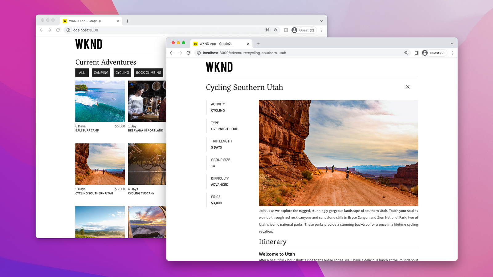
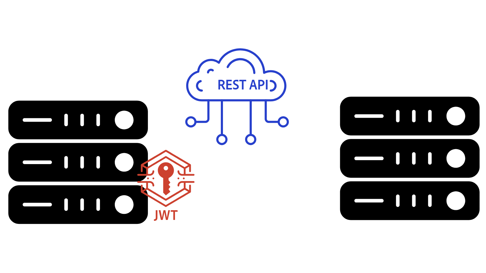

# Überblick über AEM-APIs{#aem-apis-overview}

Erfahren Sie mehr über die verschiedenen API-Typen in Adobe Experience Manager (AEM) und die Auswahl des richtigen APIs für Ihre Integration.

Zum Erstellen, Lesen, Aktualisieren und Löschen von Inhalten, Assets und Formularen in AEM können Entwickelnde eine Vielzahl von APIs verwenden. Diese APIs ermöglichen es Entwickelnden, benutzerdefinierte Programme zu erstellen, die mit AEM interagieren.

Im Folgenden werden die verschiedenen API-Typen in AEM vorgestellt und erklärt, welches API für Ihre Integration ausgewählt werden sollte.

## Typen von AEM-APIs{#types-of-aem-apis}

AEM bietet folgende APIs zur Interaktion mit zugehörigen Autoren- und Veröffentlichungs-Service-Typen.

| AEM-API-Typ | Beschreibung | Verfügbarkeit | Anwendungsfall | API-Beispiele |
| --- | --- | --- | --- | --- |
| OpenAPI-basierte AEM-APIs | Standardisierte, maschinenlesbare APIs für Assets, Sites und Forms | **Nur AEM as a Cloud Service** | API-First-Entwicklung, moderne Anwendungen | [Assets Author-API](https://developer.adobe.com/experience-cloud/experience-manager-apis/api/experimental/assets/author/), [Folders-API](https://developer.adobe.com/experience-cloud/experience-manager-apis/api/experimental/folders/), [AEM Sites-API](https://developer.adobe.com/experience-cloud/experience-manager-apis/api/stable/sites/), [Forms Document Services-API](https://developer.adobe.com/experience-cloud/experience-manager-apis/api/experimental/document/) und andere |
| RESTful-APIs | Herkömmliche REST-Endpunkte zur Interaktion mit AEM-Ressourcen | AEM 6.X, AEM as a Cloud Service | CRUD-Vorgänge, moderne Anwendungen | [Assets HTTP-API](https://experienceleague.adobe.com/de/docs/experience-manager-cloud-service/content/assets/admin/mac-api-assets), [Workflow REST-API](https://experienceleague.adobe.com/de/docs/experience-manager-65/content/implementing/developing/extending-aem/extending-workflows/workflows-program-interaction#using-the-workflow-rest-api), [JSON-Exporter für Content Services](https://experienceleague.adobe.com/de/docs/experience-manager-cloud-service/content/implementing/developing/full-stack/components-templates/json-exporter) und andere |
| GraphQL-APIs | Optimiert für effizientes Abrufen strukturierter Inhalte mit flexiblen Abfragen | AEM 6.X, AEM as a Cloud Service | Headless-CMS, SPAs, Apps | [GraphQL-API](https://experienceleague.adobe.com/de/docs/experience-manager-cloud-service/content/headless/graphql-api/content-fragments) |
| Herkömmliche (Nicht-RESTful-)APIs | Ältere APIs wie JCR, Sling-Modelle, Query Builder und andere | AEM 6.X, AEM as a Cloud Service | Ältere Integrationen, Abwärtskompatibilität | [Query Builder-API](https://experienceleague.adobe.com/dedocs/experience-manager-cloud-service/content/implementing/developing/full-stack/search/query-builder-api) und andere |

Weitere Informationen finden Sie auf der Seite [Adobe Experience Manager as a Cloud Service-APIs](https://developer.adobe.com/experience-cloud/experience-manager-apis/?lang=de).

## Auswählen des richtigen APIs{#which-api-to-choose}

Beachten Sie bei der Auswahl eines APIs für Ihre Integration die folgenden Faktoren:

- **Anwendungsfall**: Ermitteln Sie, ob das AEM-API Ihren Anwendungsfall unterstützt. Verwenden Sie nach Möglichkeit _OpenAPI-basierte AEM-APIs_, da sie einen standardisierten, modernen Ansatz für die Interaktion mit AEM bieten. Wenn keine OpenAPI-basierten APIs verfügbar sind, sollten Sie sich für RESTful- oder GraphQL-APIs und als letzte Option für herkömmliche APIs entscheiden.

- **Kompatibilität**: Stellen Sie sicher, dass das ausgewählte API mit Ihrer AEM-Version kompatibel ist. Beispielsweise sind _OpenAPI-basierte AEM-APIs AEM as a Cloud Service vorbehalten_ und nicht in AEM 6.X verfügbar.

- **AEM-Service-Typ („Author“ oder „Publish“)**: Die Auswahl des APIs hängt auch davon ab, ob sie im Rahmen des AEM Author- oder AEM Publish-Service ausgeführt werden, da diese unterschiedliche Zugriffsmodelle aufweisen. Der AEM Author-Service wird zur Inhaltserstellung verwendet und erfordert immer eine Authentifizierung. Der AEM Publish-Service wird zur Bereitstellung von Inhalten verwendet und erfordert je nach Anwendungsfall möglicherweise keine Authentifizierung.

- **Authentifizierung**: Stellen Sie sicher, dass das API die gewünschte Authentifizierungsmethode unterstützt. Zum Beispiel:
   - **OpenAPI-basierte AEM-APIs** unterstützen die OAuth 2.0-Authentifizierung, einschließlich der Grant-Tpen Client-Anmeldedaten (Server-zu-Server), Autorisierungs-Code (Web-Anwendung) und PKCE (Single Page Application). Andere AEM-APIs unterstützen nicht die OAuth 2.0-Authentifizierung.
   - **RESTful-APIs** unterstützen die JSON-Web-Token(JWT)-Authentifizierung und werden auch als Token-basierte Authentifizierung bezeichnet.

## Unterschied zwischen JSON-Web-Token (JWT) und OAuth 2.0{#difference-between-jwt-and-oauth}

Im Folgenden finden Sie einen Vergleich zwischen JSON-Web-Token (JWT) und OAuth 2.0, zwei gängigen in AEM-APIs verwendeten Authentifizierungsmechanismen:

| Funktion | JSON-Web-Token (JWT) | OAuth 2.0 |
| --- | --- | --- |
| Verwendung | RESTful-APIs | OpenAPI-basierte AEM-APIs (in RESTful- oder anderen APIs nicht unterstützt) |
| Zweck | Service-Authentifizierung | Benutzer- oder Service-Authentifizierung |
| Benutzerinteraktion | Keine Benutzerinteraktion erforderlich | Benutzerinteraktion für die Grant-Typen Autorisierungs-Code und Single Page Application erforderlich |
| Optimal für | Server-zu-Server-API-Aufrufe | Sicherer, zulässiger Zugriff für Anwendungen und Benutzende |
| Erforderliche Informationen | Private Key zur JWT-Signatur | Client-ID und Client-Geheimnis für OAuth 2.0 |
| Token-Ablauf | Kurzlebig, muss oft aktualisiert werden | Kurzlebiges Zugriffs-Token; langlebiges Aktualisierungs-Token, das zum Abrufen eines neuen Zugriffs-Tokens verwendet wird |
| Anmeldedaten-Management | [AEM Developer Console](https://experienceleague.adobe.com/de/docs/experience-manager-learn/cloud-service/debugging/debugging-aem-as-a-cloud-service/developer-console) | [Adobe Developer Console](https://developer.adobe.com/developer-console/) |

## OpenAPI-basierte AEM-APIs

Weitere Informationen zu OpenAPI-basierten AEM-APIs und wichtigen Konzepte für den Zugriff auf Adobe-APIs finden Sie im Handbuch zu [OpenAPI-basierten AEM-APIs](./openapis/overview.md).

### Anwendungsfälle

<!-- CARDS
{target = _self}

* ./openapis/use-cases/invoke-api-using-oauth-s2s.md
  {title = Invoke API using Server-to-Server authentication}
  {description = Learn how to invoke OpenAPI-based AEM APIs from a custom NodeJS application using OAuth Server-to-Server authentication.}
  {image = ./openapis/assets/s2s/OAuth-S2S.png}
* ./openapis/use-cases/invoke-api-using-oauth-web-app.md
  {title = Invoke API using Web App authentication}
  {description = Learn how to invoke OpenAPI-based AEM APIs from a custom web application using OAuth Web App authentication.}
  {image = ./openapis/assets/web-app/OAuth-WebApp.png} 
* ./openapis/use-cases/invoke-api-using-oauth-single-page-app.md
  {title = Invoke API using OAuth Single Page App}
  {description = Learn how to invoke OpenAPI-based AEM APIs from a custom Single Page App (SPA) using OAuth 2.0 PKCE flow.}
  {image = ./openapis/assets/spa/OAuth-SPA.png}
-->
<!-- START CARDS HTML - DO NOT MODIFY BY HAND -->

    

        

            

                <figure class="image x-is-16by9">
                    
                </figure>
            

            

                

                    

                        <a href="./openapis/use-cases/invoke-api-using-oauth-s2s.md" target="_self" rel="referrer" title="Aufrufen des APIs mit Server-zu-Server-Authentifizierung">Aufrufen des APIs mit Server-zu-Server-Authentifizierung</a>
                    

                    
Erfahren Sie, wie Sie OpenAPI-basierte AEM-APIs aus einer benutzerdefinierten NodeJS-Anwendung mithilfe der OAuth-Server-zu-Server-Authentifizierung aufrufen.

                

                <a href="./openapis/use-cases/invoke-api-using-oauth-s2s.md" target="_self" rel="referrer" class="spectrum-Button spectrum-Button--outline spectrum-Button--primary spectrum-Button--sizeM" style="align-self: flex-start; margin-top: 1rem;">
                    Mehr erfahren
                </a>
            

        

    

    

        

            

                <figure class="image x-is-16by9">
                    
                </figure>
            

            

                

                    

                        <a href="./openapis/use-cases/invoke-api-using-oauth-web-app.md" target="_self" rel="referrer" title="Aufrufen des APIs mit Web-Anwendungs-Authentifizierung">Aufrufen des APIs mit Web-Anwendungs-Authentifizierung</a>
                    

                    
Erfahren Sie, wie Sie OpenAPI-basierte AEM-APIs aus einer benutzerdefinierten Web-Anwendung mithilfe der OAuth-Web-Anwendungs-Authentifizierung aufrufen.

                

                <a href="./openapis/use-cases/invoke-api-using-oauth-web-app.md" target="_self" rel="referrer" class="spectrum-Button spectrum-Button--outline spectrum-Button--primary spectrum-Button--sizeM" style="align-self: flex-start; margin-top: 1rem;">
                    Mehr erfahren
                </a>
            

        

    

    

        

            

                <figure class="image x-is-16by9">
                    
                </figure>
            

            

                

                    

                        <a href="./openapis/use-cases/invoke-api-using-oauth-single-page-app.md" target="_self" rel="referrer" title="Aufrufen des APIs mit OAuth-Single-Page-Application">Aufrufen des APIs mit OAuth-Single-Page-Application</a>
                    

                    
Erfahren Sie, wie Sie OpenAPI-basierte AEM-APIs aus einer benutzerdefinierten Single Page Application (SPA) mithilfe des OAuth 2.0 PKCE-Flusses aufrufen.

                

                <a href="./openapis/use-cases/invoke-api-using-oauth-single-page-app.md" target="_self" rel="referrer" class="spectrum-Button spectrum-Button--outline spectrum-Button--primary spectrum-Button--sizeM" style="align-self: flex-start; margin-top: 1rem;">
                    Mehr erfahren
                </a>
            

        

    

<!-- END CARDS HTML - DO NOT MODIFY BY HAND -->

## GraphQL-APIs – Beispiele

Weitere Informationen zu den GraphQL-APIs und deren Verwendung finden Sie unter [Erste Schritte mit AEM Headless – GraphQL](https://experienceleague.adobe.com/de/docs/experience-manager-learn/getting-started-with-aem-headless/graphql/overview).

### Anwendungsfälle

<!-- CARDS
{target = _self}

* https://experienceleague.adobe.com/de/docs/experience-manager-learn/getting-started-with-aem-headless/deployments/spa#example-single-page-app
  {title = Single Page Application (SPA)}
  {description = Learn how to build a Single Page Application (SPA) that fetches content from AEM using GraphQL APIs.}
  {image = ./assets/react-app-card.png}
* https://experienceleague.adobe.com/de/docs/experience-manager-learn/getting-started-with-aem-headless/deployments/mobile#example-mobile-apps
  {title = Mobile App}
  {description = Learn how to build a mobile app that fetches content from AEM using GraphQL APIs.}
  {image = ./assets/ios-app-card.png}
* https://experienceleague.adobe.com/de/docs/experience-manager-learn/getting-started-with-aem-headless/deployments/web-component#example-web-component
  {title = Web Component}
  {description = Learn how to build a web component that fetches content from AEM using GraphQL APIs.}
  {image = ./assets/web-component-card.png}
-->
<!-- START CARDS HTML - DO NOT MODIFY BY HAND -->

    

        

            

                <figure class="image x-is-16by9">
                    
                </figure>
            

            

                

                    

                        <a href="https://experienceleague.adobe.com/de/docs/experience-manager-learn/getting-started-with-aem-headless/deployments/spa#example-single-page-app" target="_self" rel="referrer" title="Single Page Application (SPA)">Single Page Application (SPA)</a>
                    

                    
Erfahren Sie, wie Sie mithilfe von GraphQL-APIs eine Single Page Application (SPA) erstellen, die Inhalte aus AEM abruft.

                

                <a href="https://experienceleague.adobe.com/de/docs/experience-manager-learn/getting-started-with-aem-headless/deployments/spa#example-single-page-app" target="_self" rel="referrer" class="spectrum-Button spectrum-Button--outline spectrum-Button--primary spectrum-Button--sizeM" style="align-self: flex-start; margin-top: 1rem;">
                    Mehr erfahren
                </a>
            

        

    

    

        

            

                <figure class="image x-is-16by9">
                    
                </figure>
            

            

                

                    

                        <a href="https://experienceleague.adobe.com/de/docs/experience-manager-learn/getting-started-with-aem-headless/deployments/mobile#example-mobile-apps" target="_self" rel="referrer" title="App">App</a>
                    

                    
Erfahren Sie, wie Sie mithilfe von GraphQL-APIs eine App erstellen, die Inhalte aus AEM abruft.

                

                <a href="https://experienceleague.adobe.com/de/docs/experience-manager-learn/getting-started-with-aem-headless/deployments/mobile#example-mobile-apps" target="_self" rel="referrer" class="spectrum-Button spectrum-Button--outline spectrum-Button--primary spectrum-Button--sizeM" style="align-self: flex-start; margin-top: 1rem;">
                    Mehr erfahren
                </a>
            

        

    

    

        

            

                <figure class="image x-is-16by9">
                    
                </figure>
            

            

                

                    

                        <a href="https://experienceleague.adobe.com/de/docs/experience-manager-learn/getting-started-with-aem-headless/deployments/web-component#example-web-component" target="_self" rel="referrer" title="Web-Komponente">Web-Komponente</a>
                    

                    
Erfahren Sie, wie Sie mithilfe von GraphQL-APIs eine Web-Komponente erstellen, die Inhalte aus AEM abruft.

                

                <a href="https://experienceleague.adobe.com/de/docs/experience-manager-learn/getting-started-with-aem-headless/deployments/web-component#example-web-component" target="_self" rel="referrer" class="spectrum-Button spectrum-Button--outline spectrum-Button--primary spectrum-Button--sizeM" style="align-self: flex-start; margin-top: 1rem;">
                    Mehr erfahren
                </a>
            

        

    

<!-- END CARDS HTML - DO NOT MODIFY BY HAND -->

## RESTful-APIs – Beispiele

Erfahren Sie mehr über RESTful-APIs, z. B. [Assets HTTP-API](https://experienceleague.adobe.com/de/docs/experience-manager-cloud-service/content/assets/admin/mac-api-assets) und [JSON-Exporter](https://experienceleague.adobe.com/de/docs/experience-manager-cloud-service/content/implementing/developing/full-stack/components-templates/json-exporter).

### Anwendungsfälle

<!-- CARDS
{target = _self}

* https://experienceleague.adobe.com/de/docs/experience-manager-learn/getting-started-with-aem-headless/content-services/overview
  {title = Using Content Services for Headless App}
  {description = Learn how to build a native mobile app that fetches content from AEM using Content Services RESTful APIs.}
  {image = ./assets/RESTful-Content-Service.png}
* https://experienceleague.adobe.com/de/docs/experience-manager-learn/getting-started-with-aem-headless/authentication/overview
  {title = Token-based Authentication for RESTful APIs}
  {description = Learn how to invoke RESTful APIs using JSON Web Token (JWT) authentication.}
  {image = ./assets/RESTful-TokenAuth.png}
-->
<!-- START CARDS HTML - DO NOT MODIFY BY HAND -->

    

        

            

                <figure class="image x-is-16by9">
                    
                </figure>
            

            

                

                    

                        <a href="https://experienceleague.adobe.com/de/docs/experience-manager-learn/getting-started-with-aem-headless/content-services/overview" target="_self" rel="referrer" title="Verwenden von Content Services für die Headless-Anwendung">Verwenden von Content Services für die Headless-Anwendung</a>
                    

                    
Erfahren Sie, wie Sie mithilfe von Content Services-RESTful-APIs eine native App erstellen, die Inhalte aus AEM abruft.

                

                <a href="https://experienceleague.adobe.com/de/docs/experience-manager-learn/getting-started-with-aem-headless/content-services/overview" target="_self" rel="referrer" class="spectrum-Button spectrum-Button--outline spectrum-Button--primary spectrum-Button--sizeM" style="align-self: flex-start; margin-top: 1rem;">
                    Mehr erfahren
                </a>
            

        

    

    

        

            

                <figure class="image x-is-16by9">
                    
                </figure>
            

            

                

                    

                        <a href="https://experienceleague.adobe.com/de/docs/experience-manager-learn/getting-started-with-aem-headless/authentication/overview" target="_self" rel="referrer" title="Token-basierte Authentifizierung für RESTful-APIs">Token-basierte Authentifizierung für RESTful-APIs</a>
                    

                    
Erfahren Sie, wie Sie RESTful-APIs mithilfe der JSON-WebToken(JWT)-Authentifizierung aufrufen.

                

                <a href="https://experienceleague.adobe.com/de/docs/experience-manager-learn/getting-started-with-aem-headless/authentication/overview" target="_self" rel="referrer" class="spectrum-Button spectrum-Button--outline spectrum-Button--primary spectrum-Button--sizeM" style="align-self: flex-start; margin-top: 1rem;">
                    Mehr erfahren
                </a>
            

        

    

<!-- END CARDS HTML - DO NOT MODIFY BY HAND -->

