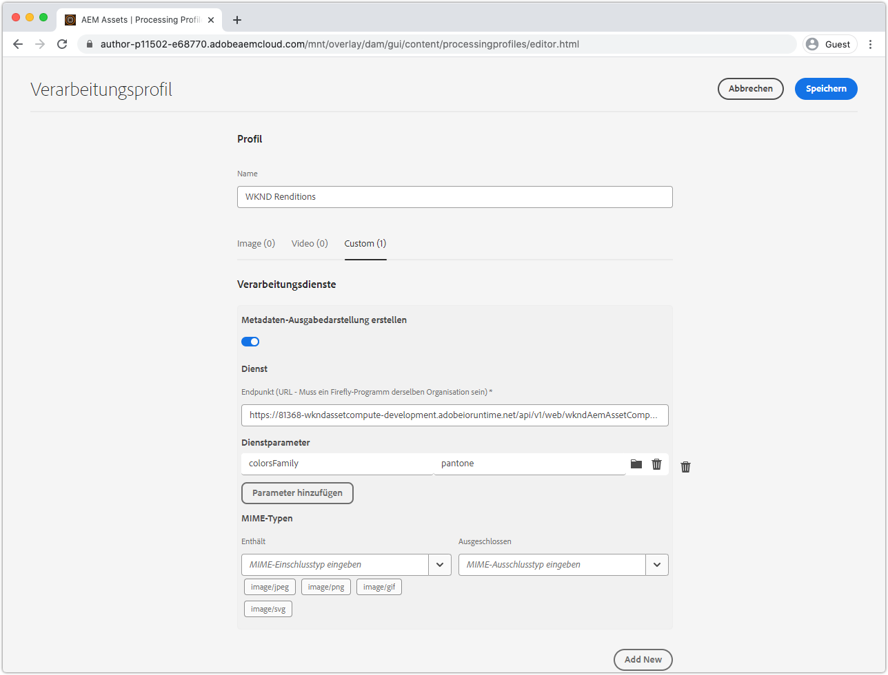
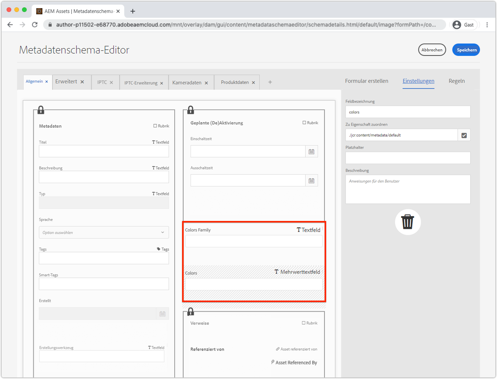
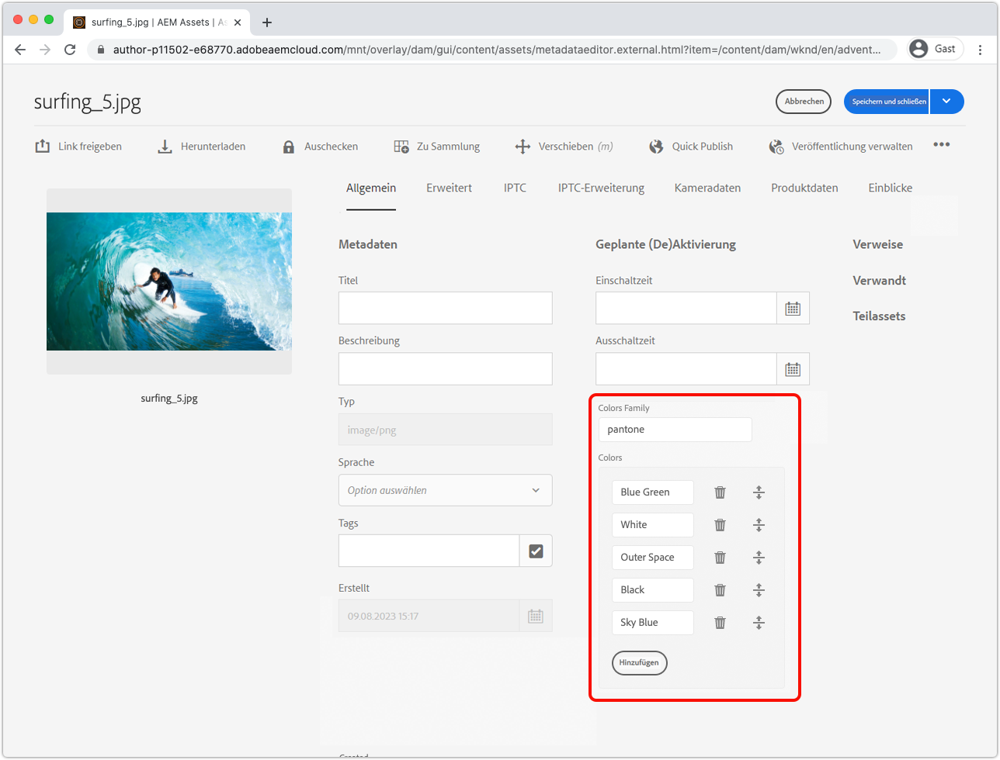
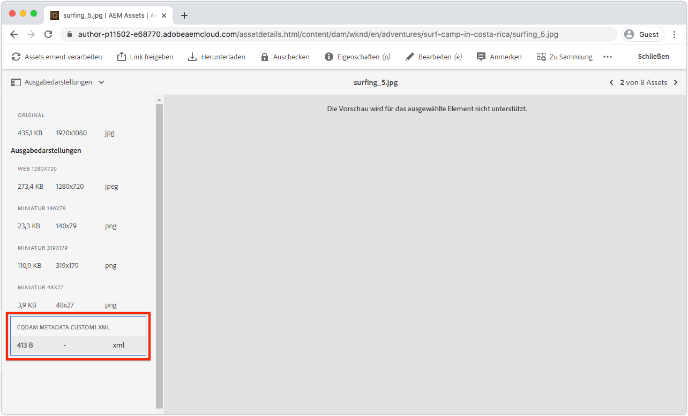

# Entwickeln eines Asset compute-Metadatenarbeiters

Benutzerdefinierte Asset compute-Mitarbeiter können XMP (XML) Daten erstellen, die an AEM zurückgesendet und als Metadaten für ein Asset gespeichert werden.

Häufige Anwendungsfälle sind:

+ Integrationen mit Drittanbietersystemen, z. B. einem PIM (Product Information Management System), bei dem zusätzliche Metadaten abgerufen und im Asset gespeichert werden müssen
+ Integration mit Adobe-Diensten wie Content and Commerce AI zur Erweiterung von Asset-Metadaten um zusätzliche Attribute für maschinelles Lernen
+ Ableiten von Metadaten zum Asset aus seiner Binärdatei und Speichern als Asset-Metadaten in AEM als Cloud Service

## Was Sie tun werden

>[!VIDEO](https://video.tv.adobe.com/v/327313?quality=12&learn=on)

In diesem Lernprogramm erstellen wir einen Asset compute-Metadaten-Mitarbeiter, der die am häufigsten verwendeten Farben in einem Bild-Asset ableitet und die Farbnamen zurück in die Metadaten des Assets in AEM schreibt. Obwohl der Arbeiter selbst ein grundlegendes Element ist, wird in diesem Lernprogramm untersucht, wie Asset compute-Workers verwendet werden können, um Metadaten als Cloud Service in Assets AEM zu schreiben.

## Logischer Fluss eines Asset compute-Metadaten-Workers beim Aufrufen

Der Aufruf von Asset compute-Metadaten-Workern ist fast identisch mit dem von [Binärdarstellung, wodurch Worker](../develop/worker.md) generiert werden, wobei der Hauptunterschied der Rückgabetyp eine XMP (XML) Darstellung ist, deren Werte auch in die Metadaten des Assets geschrieben werden.

asset compute-Worker implementieren den Asset compute SDK-Worker-API-Vertrag in der Funktion `renditionCallback(...)`, die konzeptionell Folgendes beinhaltet:

+ __Eingabe:__ Originalparameter des binären und verarbeitenden Profils eines AEM Assets
+ __Ausgabe:__ Eine XMP (XML)-Darstellung blieb beim AEM Asset als Darstellung und den Metadaten des Assets erhalten


1. Der AEM Author-Dienst ruft den Asset compute-Metadaten-Worker auf und stellt die Parameter __(1a)__ original binär und __(1b)__ bereit, die im Profil &quot;Verarbeitung&quot;definiert sind.
1. Das Asset compute-SDK orchestriert die Ausführung der `renditionCallback(...)`-Funktion des benutzerdefinierten Asset compute-Metadaten-Workers und leitet eine XMP (XML)-Darstellung ab, die auf der binären __(1a)__-Darstellung des Assets und allen Verarbeitungsparametern __(1b)__ basiert.
1. Der Asset compute-Worker speichert die XMP (XML)-Darstellung auf `rendition.path`.
1. Die XMP (XML) Daten, die in `rendition.path` geschrieben wurden, werden über das Asset compute SDK an den AEM Author-Dienst übertragen und als __(4a)__ eine Texterstellung und __(4b)__ auf dem Metadaten-Knoten des Assets beibehalten.

## manifest.yml{#manifest} konfigurieren

Alle Asset compute-Arbeiter müssen im Ordner [manifest.yml](../develop/manifest.md) registriert sein.

Öffnen Sie den Eintrag `manifest.yml` des Projekts und fügen Sie einen Eintrag für den Arbeiter hinzu, der den neuen Arbeiter konfiguriert, in diesem Fall `metadata-colors`.

_Denken Sie daran, dass  `.yml` Whitespace sensibel ist._

```
packages:
  __APP_PACKAGE__:
    license: Apache-2.0
    actions: 
      worker:
        function: actions/worker/index.js 
        web: 'yes' 
        runtime: 'nodejs:12'
        limits:
          timeout: 60000 # in ms
          memorySize: 512 # in MB
          concurrency: 10 
        annotations:
          require-adobe-auth: true
      metadata-colors:
        function: actions/metadata-colors/index.js 
        web: 'yes' 
        runtime: 'nodejs:12'
        limits:
          memorySize: 512 # in MB   
```

`function` verweist auf die im  [nächsten Schritt](#metadata-worker) erstellte Worker-Implementierung. Benennen Sie Arbeiter semantisch (z. B. `actions/worker/index.js` könnte besser `actions/rendition-circle/index.js` benannt sein), wie diese in der [Worker-URL](#deploy) und bestimmen Sie auch den Ordnernamen [Worker für die Testsuite](#test).

Die Werte `limits` und `require-adobe-auth` werden diskret pro Worker konfiguriert. In diesem Worker wird `512 MB` des Speichers zugeordnet, wenn der Code (potenziell) große binäre Bilddaten überprüft. Die anderen `limits` werden entfernt, um Standardwerte zu verwenden.

## Entwickeln eines Metadatenarbeiters{#metadata-worker}

Erstellen Sie im Asset compute-Projekt eine neue JavaScript-Metadatenarbeiterdatei unter dem Pfad [defined manifest.yml für den neuen Worker](#manifest) unter `/actions/metadata-colors/index.js`

### Installieren von npm-Modulen

Installieren Sie die zusätzlichen npm-Module ([@adobe/asset-compute-xmp](https://www.npmjs.com/package/@adobe/asset-compute-xmp?activeTab=versions), [get-image-color](https://www.npmjs.com/package/get-image-colors) und [color-namer](https://www.npmjs.com/package/color-namer)), die in diesem Asset compute-Worker verwendet werden.

```
$ npm install @adobe/asset-compute-xmp
$ npm install get-image-colors
$ npm install color-namer
```

### Metadaten-Arbeitscode

Dieser Worker sieht dem [rendition-generator](../develop/worker.md) sehr ähnlich. Der Hauptunterschied besteht darin, XMP (XML) Daten in das `rendition.path` zu schreiben, um wieder in AEM gespeichert zu werden.


```javascript
"use strict";

const { worker, SourceCorruptError } = require("@adobe/asset-compute-sdk");
const fs = require("fs").promises;

// Require the @adobe/asset-compute-xmp module to create XMP 
const { serializeXmp } = require("@adobe/asset-compute-xmp");

// Require supporting npm modules to derive image colors from image data
const getColors = require("get-image-colors");
// Require supporting npm modules to convert image colors to color names
const namer = require("color-namer");

exports.main = worker(async (source, rendition, params) => {
  // Perform any necessary source (input) checks
  const stats = await fs.stat(source.path);
  if (stats.size === 0) {
    // Throw appropriate errors whenever an erring condition is met
    throw new SourceCorruptError("source file is empty");
  }
  const MAX_COLORS = 10;
  const DEFAULT_COLORS_FAMILY = 'basic';

  // Read the color family parameter to use to derive the color names
  let colorsFamily = rendition.instructions.colorsFamily || DEFAULT_COLORS_FAMILY;

  if (['basic', 'hex', 'html', 'ntc', 'pantone', 'roygbiv'].indexOf(colorsFamily) === -1) { 
      colorsFamily = DEFAULT_COLORS_FAMILY;
  }
  
  // Use the `get-image-colors` module to derive the most common colors from the image
  let colors = await getColors(source.path, { options: MAX_COLORS });

  // Convert the color Chroma objects to their closest names
  let colorNames = colors.map((color) => getColorName(colorsFamily, color));

  // Serialize the data to XMP metadata
  // These properties are written to the [dam:Asset]/jcr:content/metadata resource
  // This stores
  // - The list of color names is stored in a JCR property named `wknd:colors`
  // - The colors family used to derive the color names is stored in a JCR property named `wknd:colorsFamily`
  const xmp = serializeXmp({
      // Use a Set to de-duplicate color names
      "wknd:colors": [...new Set(colorNames)],
      "wknd:colorsFamily": colorsFamily
    }, {
      // Define any property namespaces used in the above property/value definition
      // These namespaces will be automatically registered in AEM if they do not yet exist
      namespaces: {
        wknd: "https://wknd.site/assets/1.0/",
      },
    }
  );

  // Save the XMP metadata to be written back to the asset's metadata node
  await fs.writeFile(rendition.path, xmp, "utf-8");
});

/**
 * Helper function that derives the closest color name for the color, based on the colors family
 * 
 * @param {*} colorsFamily the colors name family to use
 * @param {*} color the color to convert to a name
 */
function getColorName(colorsFamily, color) {
    if ('hex' === colorsFamily) {  return color; }

    let names = namer(color.rgb())[colorsFamily];

    if (names.length >= 1) { return names[0].name; }
}
```

## Ausführen des Metadaten-Workers lokal{#development-tool}

Wenn der Arbeitscode abgeschlossen ist, kann er mit dem lokalen Asset compute Development Tool ausgeführt werden.

Da unser Asset compute-Projekt zwei Arbeiter enthält (die vorherige [Kreisdarstellung](../develop/worker.md) und dieser `metadata-colors`-Arbeiter), werden mit dem [Asset compute Development Tool](../develop/development-tool.md)-Profil-Definitionstool Profile zur Ausführung von Listen für beide Arbeitskräfte erstellt. Die zweite Profil-Definition verweist auf den neuen `metadata-colors`-Worker.


1. Aus der Wurzel des Asset compute-Projekts
1. Führen Sie `aio app run` aus, um das Asset compute Development Tool Beginn
1. Wählen Sie im Ordner __eine Datei aus...__ Dropdown-Liste wählen Sie ein [Beispielbild](../assets/samples/sample-file.jpg) zur Verarbeitung aus.
1. Aktualisieren Sie in der Definition-Konfiguration des zweiten Profils, die auf den `metadata-colors`-Worker verweist, `"name": "rendition.xml"`, da dieser Worker eine XMP (XML)-Darstellung generiert. Optional können Sie einen Parameter `colorsFamily` (unterstützte Werte `basic`, `hex`, `html`, `ntc`, `pantone`, `roygbiv`) hinzufügen.

   ```json
   {
       "renditions": [
           {
               "worker": "...",
               "name": "rendition.xml",
               "colorsFamily": "pantone"
           }
       ]
   }
   ```
1. Tippen Sie auf __Ausführen__ und warten Sie, bis die XML-Darstellung generiert wird.
   + Da beide Profil in der Definition aufgeführt sind, werden beide Darstellungen generiert. Optional kann die oberste Profil-Definition, die auf den [Kreis-Darstellungs-Worker](../develop/worker.md) verweist, gelöscht werden, um eine Ausführung aus dem Entwicklungstool zu vermeiden.
1. Im Abschnitt __Ausgabeformate__ wird die generierte Darstellung Vorschau. Tippen Sie auf das `rendition.xml`, um es herunterzuladen, und öffnen Sie es in VS-Code (oder Ihrem bevorzugten XML-/Texteditor), um es zu überprüfen.

## Testen Sie den Worker{#test}

Metadaten-Mitarbeiter können mit dem [gleichen Asset compute-Testframework getestet werden wie binäre Darstellungen](../test-debug/test.md). Der einzige Unterschied ist die `rendition.xxx`-Datei im Testfall muss die erwartete XMP (XML)-Darstellung sein.

1. Erstellen Sie die folgende Struktur im Asset compute-Projekt:

   ```
   /test/asset-compute/metadata-colors/success-pantone/
   
       file.jpg
       params.json
       rendition.xml
   ```

2. Verwenden Sie die Beispieldatei [a1/> als Testfall `file.jpg`.](../assets/samples/sample-file.jpg)
3. hinzufügen Sie die folgende JSON auf `params.json`.

   ```
   {
       "fmt": "xml",
       "colorsFamily": "pantone"
   }
   ```

   Beachten Sie, dass `"fmt": "xml"` erforderlich ist, um die Testsuite anzuweisen, eine textbasierte Darstellung zu generieren.`.xml`

4. Geben Sie die erwartete XML in der Datei `rendition.xml` an. Das können Sie wie folgt abrufen:
   + Ausführen der Testeingabedatei über das Entwicklungstool und Speichern der (validierten) XML-Darstellung.

   ```
   <?xml version="1.0" encoding="UTF-8"?><rdf:RDF xmlns:rdf="http://www.w3.org/1999/02/22-rdf-syntax-ns#" xmlns:wknd="https://wknd.site/assets/1.0/"><rdf:Description><wknd:colors><rdf:Seq><rdf:li>Silver</rdf:li><rdf:li>Black</rdf:li><rdf:li>Outer Space</rdf:li></rdf:Seq></wknd:colors><wknd:colorsFamily>pantone</wknd:colorsFamily></rdf:Description></rdf:RDF>
   ```

5. Führen Sie `aio app test` aus dem Stammverzeichnis des Asset compute-Projekts aus, um alle Testsuiten auszuführen.

### Mitarbeiter unter Adobe I/O Runtime bereitstellen{#deploy}

Um diesen neuen Metadaten-Worker aus AEM Assets aufzurufen, muss er unter Verwendung des Befehls unter Adobe I/O Runtime bereitgestellt werden:

```
$ aio app deploy
```


Beachten Sie, dass dadurch alle Arbeiter im Projekt bereitgestellt werden. Lesen Sie die [ungekürzten Bereitstellungsanweisungen](../deploy/runtime.md), um zu erfahren, wie Sie in den Arbeitsbereichen &quot;Stage&quot;und &quot;Produktion&quot;bereitstellen.

### Integration mit AEM-Profilen{#processing-profile}

Rufen Sie den Arbeiter von AEM auf, indem Sie einen neuen oder einen vorhandenen benutzerdefinierten Verarbeitungsdienst erstellen, der diesen bereitgestellten Profil aufruft.



1. Melden Sie sich bei AEM als Cloud Service-Autorendienst als __AEM Administrator__ an
1. Navigieren Sie zu __Tools > Assets > Processing Profils__
1. __Erstellen__ eines neuen oder  ____ bearbeiteten, bereits vorhandenen Profils
1. Tippen Sie auf die Registerkarte __Benutzerdefiniert__ und dann auf __Hinzufügen Neu__
1. Definieren des neuen Dienstes
   + __Metadaten-Darstellung__ erstellen: Zu aktiv wechseln
   + __Endpunkt:__ `https://...adobeioruntime.net/api/v1/web/wkndAemAssetCompute-0.0.1/metadata-colors`
      + Dies ist die URL für den Arbeiter, die während des [deploy](#deploy) oder mithilfe des Befehls `aio app get-url` abgerufen wurde. Stellen Sie sicher, dass die URL auf der Grundlage der AEM als Cloud Service-Umgebung auf den richtigen Arbeitsbereich verweist.
   + __Dienstparameter__
      + Tippen Sie auf __Hinzufügen Parameter__
         + Schlüssel: `colorFamily`
         + Wert: `pantone`
            + Unterstützte Werte: `basic`, `hex`, `html`, `ntc`, `pantone`, `roygbiv`
   + __MIME-Typen__
      + __Umfasst:__ `image/jpeg`,  `image/png`,  `image/gif`,  `image/svg`
         + Dies sind die einzigen MIME-Typen, die von den npm-Modulen von Drittanbietern unterstützt werden, die zur Ableitung der Farben verwendet werden.
      + __Schließt Folgendes aus:__ `Leave blank`
1. Tippen Sie oben rechts auf __Speichern__
1. Wenden Sie das Profil &quot;Verarbeitung&quot;auf einen AEM Assets-Ordner an, falls noch nicht geschehen

### Schema für Metadaten aktualisieren{#metadata-schema}

Um die Farbmetadaten zu überprüfen, ordnen Sie zwei neue Felder im Metadaten-Schema des Bilds den neuen Metadaten-Dateneigenschaften zu, die der Arbeiter ausfüllt.



1. Navigieren Sie im AEM Author-Dienst zu __Tools > Assets > Metadaten-Schema__
1. Navigieren Sie zu __default__, wählen Sie __image__ aus und bearbeiten Sie es und fügen Sie schreibgeschützte Formularfelder hinzu, um die generierten Farbmetadaten verfügbar zu machen.
1. hinzufügen eines __Einzelzeilentextes__
   + __Feldbezeichnung__: `Colors Family`
   + __Zu Eigenschaft zuordnen__: `./jcr:content/metadata/wknd:colorsFamily`
   + __Regeln > Feld > Bearbeitung__ deaktivieren: Überprüft
1. hinzufügen eines __Multi-Value-Textes__
   + __Feldbezeichnung__: `Colors`
   + __Zu Eigenschaft zuordnen__: `./jcr:content/metadata/wknd:colors`
1. Tippen Sie oben rechts auf __Speichern__

## Verarbeiten von Assets



1. Navigieren Sie im AEM Author-Dienst zu __Assets > Files__
1. Navigieren Sie zum Ordner oder Unterordner, auf den das Profil &quot;Verarbeitung&quot;angewendet wird
1. Laden Sie ein neues Bild (JPEG, PNG, GIF oder SVG) in den Ordner hoch oder verarbeiten Sie vorhandene Bilder mit dem aktualisierten [Profil für die Verarbeitung](#processing-profile) erneut.
1. Wenn die Verarbeitung abgeschlossen ist, wählen Sie das Asset aus und tippen Sie in der oberen Aktionsleiste auf __properties__, um die Metadaten anzuzeigen
1. Überprüfen Sie die Felder `Colors Family` und `Colors` [Metadatenfelder](#metadata-schema) für die Metadaten, die vom benutzerdefinierten Asset compute-Metadatenarbeiter zurückgeschrieben wurden.

Bei den Farbmetadaten, die in die Metadaten des Assets geschrieben wurden, werden diese Metadaten über die `[dam:Asset]/jcr:content/metadata`-Ressource indiziert und können mithilfe dieser Begriffe über die Suche leichter erkannt werden. Sie können sogar in die Binärdatei des Assets zurückgeschrieben werden, wenn anschließend __DAM Metadata Writeback__ aufgerufen wird.

### Metadaten-Darstellung in AEM Assets



Die vom Asset compute-Metadaten-Worker generierte tatsächliche XMP-Datei wird auch als diskrete Darstellung des Assets gespeichert. Diese Datei wird im Allgemeinen nicht verwendet, sondern die angewendeten Werte für den Metadaten-Knoten des Assets werden verwendet, aber die XML-Rohausgabe des Workers ist in AEM verfügbar.

## Metadaten-Farben-Arbeitercode auf Github

Das endgültige `metadata-colors/index.js` ist auf Github verfügbar unter:

+ [aem-guides-wknd-asset-compute/actions/metadata-colors/index.js](https://github.com/adobe/aem-guides-wknd-asset-compute/blob/master/actions/metadata-colors/index.js)

Die finale `test/asset-compute/metadata-colors` Testsuite ist auf Github verfügbar unter:

+ [aem-guides-work-asset-compute/test/asset-compute/metadata-color](https://github.com/adobe/aem-guides-wknd-asset-compute/blob/master/test/asset-compute/metadata-colors)
