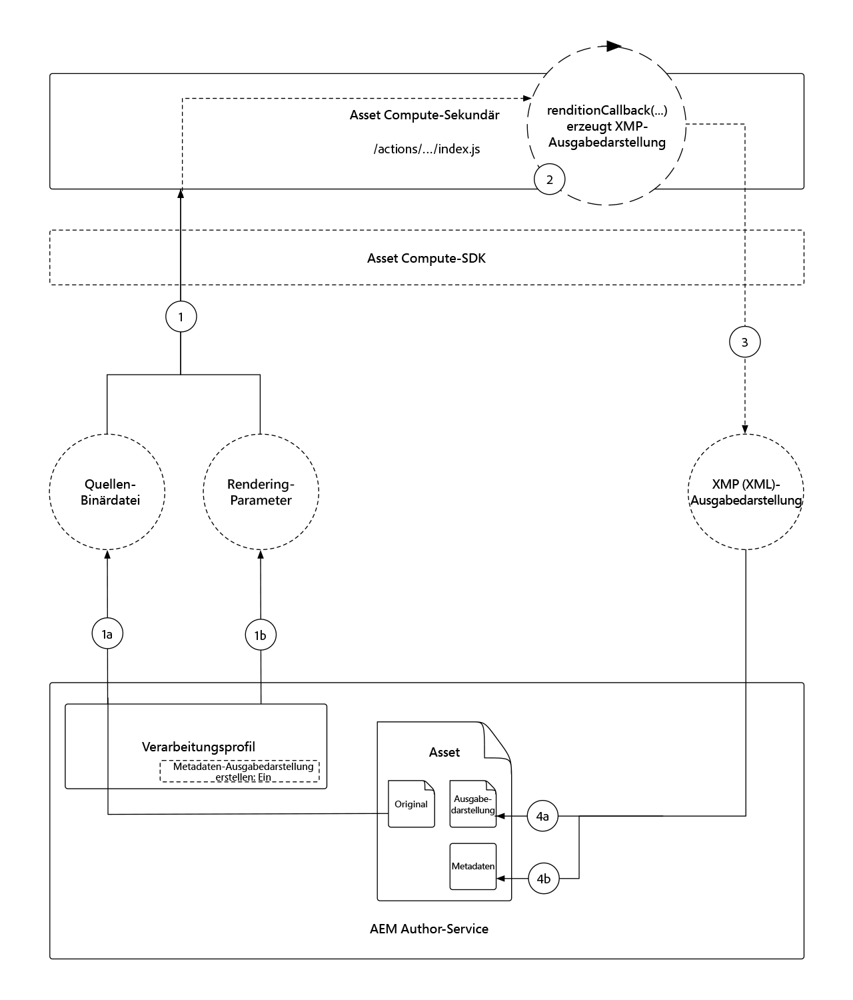

# Entwickeln eines Asset Compute-Metadaten-Sekundärs

Benutzerdefinierte Asset Compute-Sekundäre können XMP(XML)-Daten erstellen, die zurück an AEM gesendet und als Metadaten für ein Asset gespeichert werden.

Häufige Anwendungsfälle umfassen:

+ Integrationen mit Drittanbietersystemen, z. B. einem PIM (Product Information Management System), bei dem zusätzliche Metadaten abgerufen und im Asset gespeichert werden müssen
+ Integrationen mit Adobe-Diensten, z. B. Inhalts- und Commerce-KI, um Asset-Metadaten mit zusätzlichen Attributen für maschinelles Lernen zu ergänzen
+ Ableiten von Metadaten über das Asset aus seiner Binärdatei und Speichern als Asset-Metadaten in AEM as a Cloud Service

## Vorgehensweise

>[!VIDEO](https://video.tv.adobe.com/v/327313?quality=12&learn=on)

In diesem Tutorial erstellen wir einen Asset Compute-Metadaten-Sekundär, der die am häufigsten verwendeten Farben in einem Bild-Asset ableitet und die Farbnamen in die Metadaten des Assets in AEM schreibt. Während der Sekundär selbst recht einfach ist, greift dieses Tutorial darauf zurück, um das Erstellen, Entwickeln und Bereitstellen eines benutzerdefinierten Asset Compute-Sekundärs für die Verwendung mit AEM as a Cloud Service zu untersuchen.

## Logischer Ablauf des Aufrufs eines Asset Compute-Metadaten-Sekundärs

Der Aufruf von Asset Compute-Metadaten-Sekundären ist fast identisch mit dem einer [binären Ausgabedarstellung, die Sekundäre generiert](../develop/worker.md), wobei der Hauptunterschied der Rückgabetyp eine XMP(XML)-Ausgabedarstellung ist, deren Werte auch in die Metadaten des Assets geschrieben werden.

Asset Compute-Sekundäre implementieren den API-Vertrag für den Asset Compute-SDK-Sekundär in der Funktion `renditionCallback(...)`, die konzeptionell lautet:

+ __Eingabe:__ Die originale Binärdatei und die Verarbeitungsprofil-Parameter eines AEM Assets
+ __Ausgabe:__ Eine XMP(XML)-Ausgabedarstellung, die in den AEM-Assets als Ausgabedarstellung und in den Metadaten des Assets beibehalten wird



1. Der AEM-Author-Service ruft den Asset Compute-Metadaten-Sekundär auf und stellt __(1a)__ die ursprüngliche Binärdatei und __(1b)__ alle im Verarbeitungsprofil definierten Parameter bereit.
1. Das Asset Compute-SDK orchestriert die Ausführung der `renditionCallback(...)`-Funktion des benutzerdefinierten Asset Compute-Metadaten-Sekundärs, die eine XMP(XML)-Ausgabedarstellung ableitet, die auf der Binärdatei des Assets __(1a)__ und etwaigen Verarbeitungsprofilparametern __(1b)__ basiert.
1. Der Asset Compute-Sekundär speichert die XMP(XML)-Darstellung in `rendition.path`.
1. Die XMP(XML)-Daten, die an `rendition.path` geschrieben werden, werden über das Asset Compute-SDK an den AEM-Author-Service übertragen, __(4a)__ als Textausgabe angezeigt und __(4b)__ im Metadatenknoten des Assets beibehalten.

## Konfigurieren von manifest.yml{#manifest}

Alle Asset Compute-Sekundäre müssen in [manifest.yml](../develop/manifest.md) registriert werden.

Öffnen Sie die `manifest.yml` des Projekts und fügen Sie einen Sekundäreintrag hinzu, der den neuen Sekundär konfiguriert, in diesem Fall `metadata-colors`.

_Denken Sie daran, dass in `.yml` die Leerzeichen berücksichtigt werden._

```
packages:
  __APP_PACKAGE__:
    license: Apache-2.0
    actions: 
      worker:
        function: actions/worker/index.js 
        web: 'yes' 
        runtime: 'nodejs:12'
        limits:
          timeout: 60000 # in ms
          memorySize: 512 # in MB
          concurrency: 10 
        annotations:
          require-adobe-auth: true
      metadata-colors:
        function: actions/metadata-colors/index.js 
        web: 'yes' 
        runtime: 'nodejs:12'
        limits:
          memorySize: 512 # in MB   
```

`function` verweist auf die im [nächsten Schritt](#metadata-worker) erstellte Sekundärimplementierung. Ordnen Sie Sekundäre semantisch zu (z. B. hätte `actions/worker/index.js` besser `actions/rendition-circle/index.js` benannt werden können), da diese in der [Sekundär-URL](#deploy) erscheinen, und bestimmen Sie auch den [Ordnernamen der Testsuite des Sekundärs](#test).

Die `limits` und `require-adobe-auth` werden diskret pro Sekundär konfiguriert. In diesem Sekundär werden `512 MB` des Speichers zugewiesen, wenn der Code (potenziell) große binäre Bilddaten prüft. Die anderen `limits` werden entfernt, um die Standardwerte zu verwenden.

## Entwickeln eines Metadaten-Sekundärs{#metadata-worker}

Erstellen Sie eine neue JavaScript-Datei für einen Metadaten-Sekundär im Asset Compute-Projekt unter dem Pfad, [wo manifest.yml für den neuen Sekundär definiert wurde](#manifest), unter `/actions/metadata-colors/index.js`

### Installieren von npm-Modulen

Installieren Sie die zusätzlichen npm-Module ([@adobe/asset-compute-xmp](https://www.npmjs.com/package/@adobe/asset-compute-xmp?activeTab=versions), [get-image-color](https://www.npmjs.com/package/get-image-colors) und [color-namer](https://www.npmjs.com/package/color-namer)), die in diesem Asset Compute-Sekundär verwendet werden.

```
$ npm install @adobe/asset-compute-xmp
$ npm install get-image-colors
$ npm install color-namer
```

### Code für den Metadaten-Sekundär

Dieser Sekundär sieht sehr ähnlich wie der [Ausgabedarstellungs-Sekundär](../develop/worker.md) aus. Der Hauptunterschied besteht darin, dass er XMP(XML)-Daten an den `rendition.path` schreibt, damit sie wieder in AEM gespeichert werden.


```javascript
"use strict";

const { worker, SourceCorruptError } = require("@adobe/asset-compute-sdk");
const fs = require("fs").promises;

// Require the @adobe/asset-compute-xmp module to create XMP 
const { serializeXmp } = require("@adobe/asset-compute-xmp");

// Require supporting npm modules to derive image colors from image data
const getColors = require("get-image-colors");
// Require supporting npm modules to convert image colors to color names
const namer = require("color-namer");

exports.main = worker(async (source, rendition, params) => {
  // Perform any necessary source (input) checks
  const stats = await fs.stat(source.path);
  if (stats.size === 0) {
    // Throw appropriate errors whenever an erring condition is met
    throw new SourceCorruptError("source file is empty");
  }
  const MAX_COLORS = 10;
  const DEFAULT_COLORS_FAMILY = 'basic';

  // Read the color family parameter to use to derive the color names
  let colorsFamily = rendition.instructions.colorsFamily || DEFAULT_COLORS_FAMILY;

  if (['basic', 'hex', 'html', 'ntc', 'pantone', 'roygbiv'].indexOf(colorsFamily) === -1) { 
      colorsFamily = DEFAULT_COLORS_FAMILY;
  }
  
  // Use the `get-image-colors` module to derive the most common colors from the image
  let colors = await getColors(source.path, { options: MAX_COLORS });

  // Convert the color Chroma objects to their closest names
  let colorNames = colors.map((color) => getColorName(colorsFamily, color));

  // Serialize the data to XMP metadata
  // These properties are written to the [dam:Asset]/jcr:content/metadata resource
  // This stores
  // - The list of color names is stored in a JCR property named `wknd:colors`
  // - The colors family used to derive the color names is stored in a JCR property named `wknd:colorsFamily`
  const xmp = serializeXmp({
      // Use a Set to de-duplicate color names
      "wknd:colors": [...new Set(colorNames)],
      "wknd:colorsFamily": colorsFamily
    }, {
      // Define any property namespaces used in the above property/value definition
      // These namespaces are automatically registered in AEM if they do not yet exist
      namespaces: {
        wknd: "https://wknd.site/assets/1.0/",
      },
    }
  );

  // Save the XMP metadata to be written back to the asset's metadata node
  await fs.writeFile(rendition.path, xmp, "utf-8");
});

/**
 * Helper function that derives the closest color name for the color, based on the colors family
 * 
 * @param {*} colorsFamily the colors name family to use
 * @param {*} color the color to convert to a name
 */
function getColorName(colorsFamily, color) {
    if ('hex' === colorsFamily) {  return color; }

    let names = namer(color.rgb())[colorsFamily];

    if (names.length >= 1) { return names[0].name; }
}
```

## Lokales Ausführen des Metadaten-Sekundärs{#development-tool}

Wenn der Sekundär-Code vollständig ist, kann er mit dem lokalen Asset Compute-Entwicklungs-Tool ausgeführt werden.

Da unser Asset Compute-Projekt zwei Sekundäre enthält (die vorherige [Kreisausgabe](../develop/worker.md) und diesen `metadata-colors`-Sekundär), listet die Profildefinition des [Asset Compute-Entwicklungs-Tools](../develop/development-tool.md) Ausführungsprofile für beide Sekundäre auf. Die zweite Profildefinition verweist auf den neuen `metadata-colors`-Sekundär.


1. Navigieren Sie zum Stammverzeichnis des Asset Compute-Projekts.
1. Führen Sie `aio app run` zum Starten des Asset Compute-Entwicklungs-Tools aus
1. Wählen Sie in der Dropdown-Liste __Datei auswählen…__ ein [Beispielbild](../assets/samples/sample-file.jpg) zur Verarbeitung aus
1. In der zweiten Profildefinitionskonfiguration, die auf den `metadata-colors`-Sekundär verweist, aktualisieren Sie `"name": "rendition.xml"`, da dieser Sekundär eine XMP(XML)-Ausgabedarstellung generiert. Optional können Sie einen `colorsFamily`-Parameter hinzufügen (unterstützte Werte: `basic`, `hex`, `html`, `ntc`, `pantone`, `roygbiv`).

   ```json
   {
       "renditions": [
           {
               "worker": "...",
               "name": "rendition.xml",
               "colorsFamily": "pantone"
           }
       ]
   }
   ```

1. Klicken Sie auf __Ausführen__ und warten Sie, bis die XML-Ausgabedarstellung generiert wird.
   + Da beide Sekundäre in der Profildefinition aufgeführt sind, werden beide Ausgabedarstellungen generiert. Optional kann die oberste Profildefinition, die auf den [Kreisausgabe-Sekundär](../develop/worker.md) verweist, gelöscht werden, um eine Ausführung über das Entwicklungs-Tool zu vermeiden.
1. Der Abschnitt __Ausgabedarstellungen__ zeigt eine Vorschau der generierten Ausgabedarstellung an. Klicken Sie auf die Datei `rendition.xml`, um sie herunterzuladen, und öffnen Sie sie zum Überprüfen in VS Code (oder Ihrem bevorzugten XML-/Texteditor).

## Testen des Sekundärs{#test}

Metadaten-Sekundäre können mit dem [gleichen Asset Compute-Test-Framework wie binäre Ausgabedarstellungen](../test-debug/test.md) getestet werden. Der einzige Unterschied besteht darin, dass es sich bei der Datei `rendition.xxx` im Testfall um die erwartete XMP(XML)-Ausgabedarstellung handeln muss.

1. Erstellen Sie die folgende Struktur im Asset Compute-Projekt:

   ```
   /test/asset-compute/metadata-colors/success-pantone/
   
       file.jpg
       params.json
       rendition.xml
   ```

2. Verwenden Sie die [Beispieldatei](../assets/samples/sample-file.jpg) als `file.jpg` für den Testfall.
3. Fügen Sie den folgenden Code zu `params.json` hinzu.

   ```
   {
       "fmt": "xml",
       "colorsFamily": "pantone"
   }
   ```

   Beachten Sie, dass `"fmt": "xml"` erforderlich ist, um die Test-Suite anzuweisen, eine `.xml`-textbasierte Ausgabedarstellung zu generieren.

4. Stellen Sie den erwarteten XML-Inhalt in der Datei `rendition.xml` bereit. Sie können ihn wie folgt beziehen:
   + Führen Sie die Testeingabedatei über das Entwicklungs-Tool aus und speichern Sie die (validierte) XML-Ausgabedarstellung.

   ```
   <?xml version="1.0" encoding="UTF-8"?><rdf:RDF xmlns:rdf="http://www.w3.org/1999/02/22-rdf-syntax-ns#" xmlns:wknd="https://wknd.site/assets/1.0/"><rdf:Description><wknd:colors><rdf:Seq><rdf:li>Silver</rdf:li><rdf:li>Black</rdf:li><rdf:li>Outer Space</rdf:li></rdf:Seq></wknd:colors><wknd:colorsFamily>pantone</wknd:colorsFamily></rdf:Description></rdf:RDF>
   ```

5. Führen Sie `aio app test` aus dem Stammverzeichnis des Asset Compute-Projekts aus, um alle Test-Suites auszuführen.

### Bereitstellen des Sekundärs für Adobe I/O Runtime{#deploy}

Um diesen neuen Metadaten-Sekundär aus AEM Assets aufzurufen, muss er mithilfe des folgenden Befehls für Adobe I/O Runtime bereitgestellt werden:

```
$ aio app deploy
```


Beachten Sie, dass dadurch alle im Projekt enthaltenen Sekundäre bereitgestellt werden. Lesen Sie die [vollständigen Bereitstellungsanweisungen](../deploy/runtime.md) zur Bereitstellung in den Staging- und Produktionsarbeitsbereichen.

### Integrieren mit AEM-Verarbeitungsprofilen{#processing-profile}

Rufen Sie den Sekundär von AEM auf, indem Sie einen neuen Verarbeitungsprofil-Service erstellen oder einen vorhandenen benutzerdefinierten Verarbeitungsprofil-Service bearbeiten, der diesen bereitgestellten Sekundär aufruft.


1. Melden Sie sich beim Author-Service von AEM as a Cloud Service als __AEM-Admin__ an.
1. Gehen Sie zu __Tools > Assets > Verarbeitungsprofile__
1. __Erstellen__ Sie ein neues Verarbeitungsprofil oder __bearbeiten__ Sie ein vorhandenes.
1. Klicken Sie auf die Registerkarte __Benutzerdefiniert__ und dann auf __Neu hinzufügen__.
1. Definieren Sie den neuen Service:
   + __Metadaten-Ausgabedarstellung erstellen__: Aktivieren Sie diese Option.
   + __Endpunkt:__ `https://...adobeioruntime.net/api/v1/web/wkndAemAssetCompute-0.0.1/metadata-colors`
      + Dies ist die URL zum Sekundär, der während der [Bereitstellung](#deploy) oder mithilfe des Befehls `aio app get-url` bezogen wurde. Stellen Sie sicher, dass die URL auf den richtigen Arbeitsbereich verweist, basierend auf der AEM as a Cloud Service-Umgebung.
   + __Dienstparameter__
      + Klicken Sie auf __Parameter hinzufügen__.
         + Schlüssel: `colorFamily`
         + Wert: `pantone`
            + Unterstützte Werte: `basic`, `hex`, `html`, `ntc`, `pantone`, `roygbiv`
   + __MIME-Typen__
      + __Eingeschlossen:__ `image/jpeg`, `image/png`, `image/gif`, `image/svg`
         + Dies sind die einzigen MIME-Typen, die von den zum Ableiten der Farben verwendeten npm-Drittanbietermodulen unterstützt werden.
      + __Ausgeschlossen:__ `Leave blank`
1. Klicken Sie oben rechts auf __Speichern__.
1. Wenden Sie das Verarbeitungsprofil auf einen AEM Assets-Ordner an, falls nicht bereits geschehen.

### Aktualisieren des Metadatenschemas{#metadata-schema}

Um die Farbmetadaten zu überprüfen, ordnen Sie zwei neue Felder im Metadatenschema des Bildes den neuen Metadateneigenschaften zu, die der Sekundär auffüllt.


1. Navigieren Sie im AEM-Author-Service zu __Tools > Assets > Metadatenschemata__.
1. Wechseln Sie zum __Standard__, wählen und bearbeiten Sie das __Bild__ und fügen Sie schreibgeschützte Formularfelder hinzu, um die generierten Farbmetadaten bereitzustellen.
1. Fügen Sie einen __einzeiligen Text__ hinzu
   + __Feldbezeichnung__: `Colors Family`
   + __Zu Eigenschaft zuordnen__: `./jcr:content/metadata/wknd:colorsFamily`
   + __Regeln > Feld > Bearbeitung deaktivieren__: Aktiviert
1. Fügen Sie einen __Mehrwerttext__ hinzu
   + __Feldbezeichnung__: `Colors`
   + __Zu Eigenschaft zuordnen__: `./jcr:content/metadata/wknd:colors`
1. Klicken Sie oben rechts auf __Speichern__.

## Verarbeitung von Assets


1. Navigieren Sie im AEM-Author-Service zu __Assets > Dateien__
1. Navigieren Sie zum Ordner oder Unterordner, auf den das Verarbeitungsprofil angewendet wird
1. Laden Sie ein neues Bild (JPEG, PNG, GIF oder SVG) in den Ordner hoch oder verarbeiten Sie vorhandene Bilder mithilfe des aktualisierten [Verarbeitungsprofils](#processing-profile)
1. Wählen Sie nach Abschluss der Verarbeitung das Asset aus und tippen Sie auf __Eigenschaften__ in der oberen Aktionsleiste zum Anzeigen der Metadaten
1. Überprüfen Sie die [Metadatenfelder](#metadata-schema) `Colors Family` und `Colors` für die Metadaten, die vom benutzerdefinierten Asset Compute-Metadaten-Sekundär zurückgeschrieben wurden.

Mit den Farbmetadaten auf der `[dam:Asset]/jcr:content/metadata`-Ressource, die in die Metadaten des Assets geschrieben wurden, werden diese Metadaten mit der Möglichkeit indiziert, Assets mithilfe dieser Begriffe über die Suche zu erkennen, und sie können sogar in die Binärdatei des Assets zurückgeschrieben werden, wenn der Workflow __DAM-Metadaten-Writeback__ aufgerufen wird.

### Metadaten-Ausgabedarstellung in AEM Assets


Die tatsächliche XMP-Datei, die vom Asset Compute-Metadaten-Sekundär generiert wurde, wird ebenfalls als eigenständige Ausgabedarstellung für das Asset gespeichert. Diese Datei wird im Allgemeinen nicht verwendet. Stattdessen werden die auf den Metadatenknoten des Assets angewendeten Werte verwendet, aber die XML-Rohausgabe des Sekundärs ist in AEM verfügbar.

## Code des Sekundärs „metadata-colors“ auf Github

Die endgültige `metadata-colors/index.js` ist auf Github verfügbar unter:

+ [aem-guides-wknd-asset-compute/actions/metadata-colors/index.js](https://github.com/adobe/aem-guides-wknd-asset-compute/blob/master/actions/metadata-colors/index.js)

Die endgültige Testsuite für `test/asset-compute/metadata-colors` ist auf Github verfügbar unter:

+ [aem-guides-wknd-asset-compute/test/asset-compute/metadata-colors](https://github.com/adobe/aem-guides-wknd-asset-compute/blob/master/test/asset-compute/metadata-colors)
