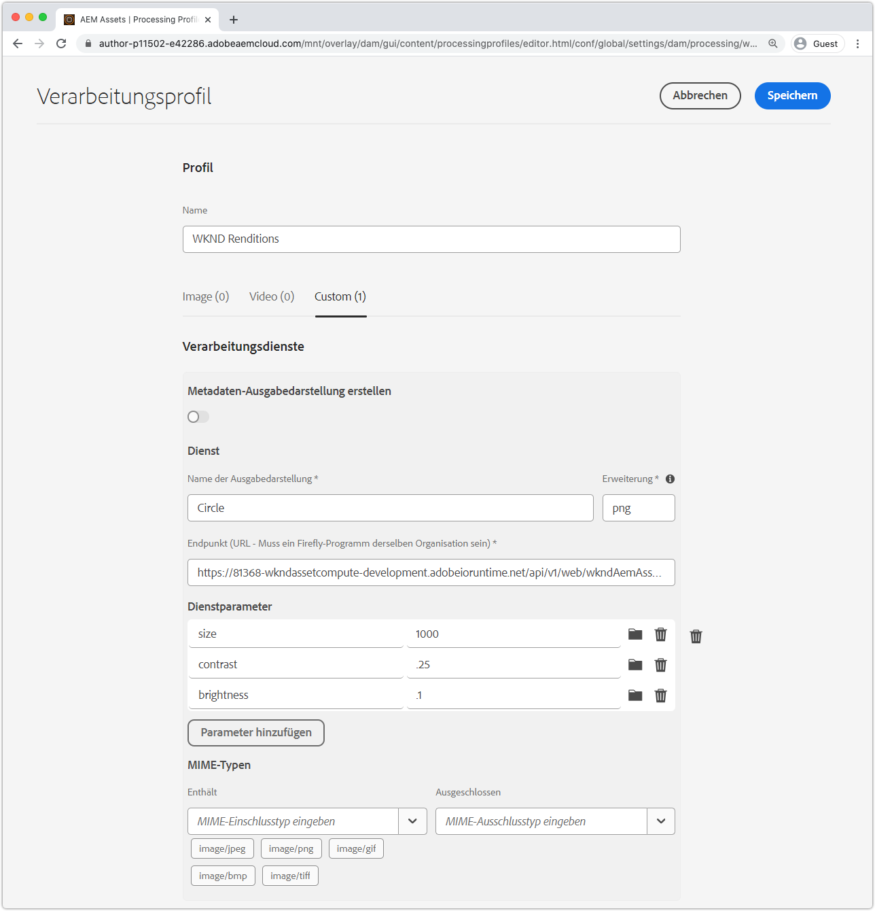
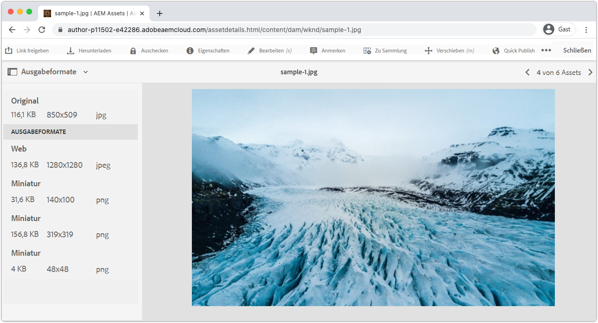

# Integration mit AEM-Profilen

Damit Asset compute-Mitarbeiter benutzerdefinierte Darstellungen in AEM als Cloud Service generieren können, müssen sie über VerarbeitungsProfil in AEM als Cloud Service-Autorendienst registriert sein. Bei allen Assets, für die dieses Profil gilt, wird der Worker beim Hochladen oder erneuten Verarbeiten aufgerufen. Die benutzerdefinierte Darstellung wird generiert und über die Ausgabeformate des Assets zur Verfügung gestellt.

## Definieren eines Profils zur Verarbeitung

Erstellen Sie zunächst ein neues Verarbeitungsparameter, das den Worker mit den konfigurierbaren Profilen aufruft.

1. Melden Sie sich bei AEM als Cloud Service-Autorendienst als __AEM Administrator__ an. Da dies ein Tutorial ist, empfehlen wir die Verwendung einer Dev-Umgebung oder einer Umgebung in einer Sandbox.
1. Navigieren Sie zu __Tools > Assets > Processing Profils__
1. Tippen Sie auf die Schaltfläche __Erstellen__
1. Benennen Sie das Profil für die Verarbeitung, `WKND Asset Renditions`
1. Tippen Sie auf die Registerkarte __Benutzerdefiniert__ und dann auf __Hinzufügen Neu__
1. Definieren des neuen Dienstes
   + __Name des Ausgabeformats:__ `Circle`
      + Die Dateinamendarstellung, die zur Identifizierung dieser Darstellung in AEM Assets verwendet wird
   + __Erweiterung:__ `png`
      + Die Erweiterung der zu generierenden Darstellung. Wird auf `png` gesetzt, da dies das unterstützte Ausgabeformat ist, das der Webdienst des Workers unterstützt, und der Hintergrund hinter dem Kreissegment transparent ist.
   + __Endpunkt:__ `https://...adobeioruntime.net/api/v1/web/wkndAemAssetCompute-0.0.1/worker`
      + Dies ist die URL für den Worker, die über `aio app get-url` abgerufen wird. Stellen Sie sicher, dass die URL auf der Grundlage der AEM als Cloud Service-Umgebung auf den richtigen Arbeitsbereich verweist.
      + Stellen Sie sicher, dass die Worker-URL auf den richtigen Arbeitsbereich verweist. AEM als Cloud Service Stage sollte die Stage Workspace-URL verwenden und AEM als Cloud Service Production sollte die Produktions-Workspace-URL verwenden.
   + __Dienstparameter__
      + Tippen Sie auf __Hinzufügen Parameter__
         + Schlüssel: `size`
         + Wert: `1000`
      + Tippen Sie auf __Hinzufügen Parameter__
         + Schlüssel: `contrast`
         + Wert: `0.25`
      + Tippen Sie auf __Hinzufügen Parameter__
         + Schlüssel: `brightness`
         + Wert: `0.10`
      + Diese Schlüssel/Wert-Paare, die an den Asset compute-Worker übergeben werden und über das JavaScript-Objekt `rendition.instructions` verfügbar sind.
   + __MIME-Typen__
      + __Umfasst:__ `image/jpeg`,  `image/png`,  `image/gif`,  `image/bmp`,  `image/tiff`
         + Diese MIME-Typen sind die einzigen, die die npm-Module des Arbeitnehmers. Diese Liste beschränkt, welche Assets vom benutzerdefinierten Worker verarbeitet werden.
      + __Schließt Folgendes aus:__ `Leave blank`
         + Verarbeiten Sie Assets niemals mit diesen MIME-Typen, indem Sie diese Dienstkonfiguration verwenden. In diesem Fall verwenden wir nur eine Zulassungsliste.
1. Tippen Sie oben rechts auf __Speichern__

## Anwenden und Aufrufen eines Profils zur Verarbeitung

1. Wählen Sie das neu erstellte Profil für die Verarbeitung aus.`WKND Asset Renditions`
1. Tippen Sie in der oberen Aktionsleiste auf __Profil auf Ordner__ anwenden
1. Wählen Sie einen Ordner aus, auf den das Profil &quot;Verarbeitung&quot;angewendet werden soll, z. B. `WKND`, und tippen Sie auf __Anwenden__
1. Navigieren Sie zu dem Ordner, auf den das Profil Verarbeitung nicht angewendet wurde, über __AEM > Assets > Files__ und tippen Sie auf `WKND`.
1. Laden Sie einige neue Bildelemente ([sample-1.jpg](../assets/samples/sample-1.jpg), [sample-2.jpg](../assets/samples/sample-2.jpg) und [sample-3.jpg](../assets/samples/sample-3.jpg)) in einen beliebigen Ordner unter dem Ordner hoch, auf den das Profil &quot;Verarbeitung&quot;angewendet wurde, und warten Sie, bis das hochgeladene Asset verarbeitet wird.
1. Tippen Sie auf das Asset, um seine Details zu öffnen.
   + Standarddarstellungen können in AEM schneller generiert und angezeigt werden als benutzerdefinierte Darstellungen.
1. Öffnen Sie die Ansicht __Ausgabeformate__ in der linken Seitenleiste
1. Tippen Sie auf das Asset mit dem Namen `Circle.png` und überprüfen Sie die generierte Darstellung

   

## Beendet!

Herzlichen Glückwunsch! Sie haben das [Tutorial](../overview.md) zum Erweitern von AEM als Cloud Service Asset compute microservices fertig gestellt! Sie sollten jetzt die Möglichkeit haben, benutzerdefinierte Asset compute-Mitarbeiter einzurichten, zu entwickeln, zu testen, zu debuggen und bereitzustellen, um sie als Cloud Service-Authoring-Dienst für Ihre AEM zu verwenden.

### Überprüfen Sie den vollständigen Projektquellcode auf Github

Das endgültige Asset compute-Projekt ist auf Github unter folgender Adresse abrufbar:

+ [aem-guides-wknd-asset-compute](https://github.com/adobe/aem-guides-wknd-asset-compute)

_Github enthält den finalen Status des Projekts, der vollständig mit den Arbeitern- und Testfällen gefüllt ist, jedoch keine Anmeldeinformationen enthält, d. h. `.env`, `.config.json` oder `.aio`._

## Fehlerbehebung

+ [Benutzerdefinierte Darstellung fehlt im Asset in AEM](../troubleshooting.md#custom-rendition-missing-from-asset)
+ [Die Asset-Verarbeitung schlägt in AEM fehl](../troubleshooting.md#asset-processing-fails)
