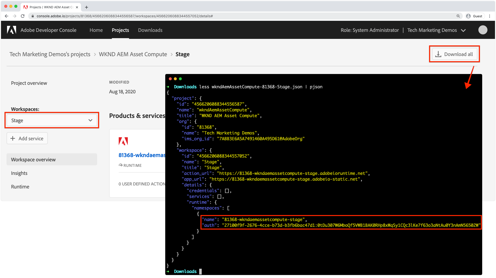

# Bereitstellen in Adobe I/O Runtime

asset compute-Projekte und die darin enthaltenen Arbeiter müssen über die Adobe I/O-CLI in Adobe I/O Runtime bereitgestellt werden, damit sie von AEM als Cloud Service verwendet werden können.

Bei der Bereitstellung in Adobe I/O Runtime zur Verwendung durch AEM als Cloud Service-Autorendienste sind nur zwei Umgebungsvariablen erforderlich:

+ `AIO_runtime_namespace` verweist auf die Adobe Project Firefly Workspace, die bereitgestellt werden muss, um
+ `AIO_runtime_auth` sind die Authentifizierungsberechtigungen des Adobe Project Firefly-Arbeitsbereichs

Die anderen in der Datei `.env` definierten Standardvariablen werden implizit von AEM als Cloud Service bereitgestellt, wenn der Asset compute Worker aufgerufen wird.

## Entwicklungsarbeitsbereich

Da dieses Projekt mit `aio app init` unter Verwendung des Arbeitsbereichs `Development` erstellt wurde, wird `AIO_runtime_namespace` automatisch auf `81368-wkndaemassetcompute-development` gesetzt und die entsprechende `AIO_runtime_auth` in unserer lokalen `.env`-Datei wird angezeigt.  Wenn eine `.env`-Datei im Verzeichnis vorhanden ist, in dem der Bereitstellungsbefehl ausgegeben wird, werden die zugehörigen Werte verwendet, es sei denn, sie werden durch einen Variablenexport auf Betriebssystemebene ersetzt, also durch die Verwendung von [Staging- und Produktionsumgebungen](#stage-and-production)-Arbeitsbereichen.


So stellen Sie für den Arbeitsbereich bereit, der in der Datei `.env` der Projekte definiert ist:

1. Öffnen Sie die Befehlszeile im Stammverzeichnis des Asset compute-Projekts.
1. Führen Sie den Befehl `aio app deploy` aus.
1. Führen Sie den Befehl `aio app get-url` aus, um die Worker-URL zur Verwendung im AEM als Cloud Service-Verarbeitungsprofil abzurufen, um auf diesen benutzerdefinierten Asset compute Worker zu verweisen. Wenn das Projekt mehrere Sekundäre enthält, werden separate URLs für jeden Worker aufgelistet.

Wenn Entwicklungsumgebungen für lokale Entwicklungs- und AEM als Cloud Service-Entwicklungsumgebungen separate Asset compute-Bereitstellungen verwenden, können Bereitstellungen für AEM as a Cloud Service Dev auf dieselbe Weise verwaltet werden wie [Staging- und Produktionsimplementierungen](#stage-and-production).

## Staging- und Produktionsarbeitsbereiche{#stage-and-production}

Die Bereitstellung in Staging- und Produktionsarbeitsbereichen erfolgt normalerweise durch Ihr CI/CD-System Ihrer Wahl. Das Asset compute-Projekt muss diskret in jedem Arbeitsbereich (Staging und dann Produktion) bereitgestellt werden.

Durch das Festlegen von true -Umgebungsvariablen werden Werte für die gleichnamigen Variablen in `.env` überschrieben.


Der allgemeine Ansatz, der normalerweise von einem CI/CD-System für die Bereitstellung in Staging- und Produktionsumgebungen automatisiert wird, lautet:

1. Stellen Sie sicher, dass das [Adobe I/O CLI npm-Modul und das Asset compute-Plug-in](../set-up/development-environment.md#aio) installiert sind.
1. Sehen Sie sich das Asset compute-Projekt an, das von Git bereitgestellt werden soll.
1. Legen Sie die Umgebungsvariablen mit den Werten fest, die dem Zielarbeitsbereich entsprechen (Staging oder Produktion)
   + Die beiden erforderlichen Variablen sind `AIO_runtime_namespace` und `AIO_runtime_auth` und werden pro Arbeitsbereich in der Adobe I/O Developer Console über die Funktion __Alle herunterladen__ von Workspace abgerufen.



Die Werte dieser Schlüssel können durch Ausgabe von Exportbefehlen über die Befehlszeile festgelegt werden:

```
$ export AIO_runtime_namespace=81368-wkndaemassetcompute-stage
$ export AIO_runtime_auth=27100f9f-2676-4cce-b73d-b3fb6bac47d1:0tDu307W6MboQf5VWB1BAK0RHp8xWqSy1CQc3lKe7f63o3aNtAu0Y3nAmN56502W
```

Wenn Ihre Asset compute-Sekundäre andere Variablen benötigen, z. B. im Cloud-Speicher, sollten diese ebenfalls als Umgebungsvariablen exportiert werden.

1. Nachdem alle Umgebungsvariablen für den Zielarbeitsbereich festgelegt wurden, für den sie bereitgestellt werden sollen, führen Sie den Bereitstellungsbefehl aus:
   + `aio app deploy`
1. Die Worker-URL(s), auf die vom AEM als Cloud Service-Verarbeitungsprofil verwiesen wird, sind ebenfalls verfügbar über:
   + `aio app get-url`.

Wenn sich die Asset compute-Projektversion ändert, ändern sich auch die Worker-URLs, um die neue Version widerzuspiegeln. Die URL muss dann in den Verarbeitungsprofilen aktualisiert werden.

## Workspace-API-Bereitstellung{#workspace-api-provisioning}

Beim Einrichten des Adobe Project Firefly-Projekts in Adobe I/O](../set-up/firefly.md) zur Unterstützung der lokalen Entwicklung wurde ein neuer Entwicklungsarbeitsbereich erstellt und __Asset compute, I/O Events__ und __I/O Events Management APIs__ hinzugefügt.[

Die APIs __Asset compute, I/O Events__ und __I/O Events Management APIs__ werden nur explizit zu den für die lokale Entwicklung verwendeten Arbeitsbereichen hinzugefügt. Für Arbeitsbereiche, die (ausschließlich) in AEM as a Cloud Service-Umgebungen integriert werden, müssen diese APIs __nicht__ explizit hinzugefügt werden, da die APIs AEM als Cloud Service auf natürliche Weise zur Verfügung gestellt werden.
