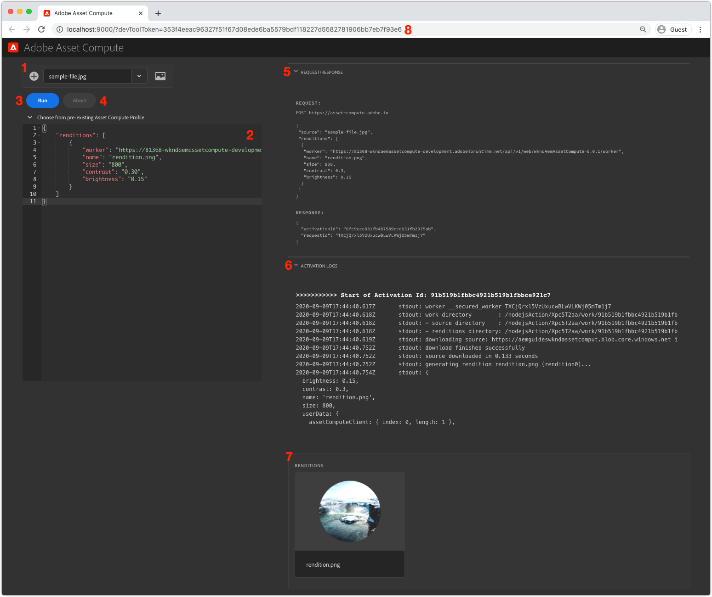

# asset compute-Entwicklungstool

Das Asset compute Development Tool ist eine lokale Webanwendung, mit der Entwickler Asset-Computer-Sekundäre lokal konfigurieren und ausführen können, außerhalb des Kontexts des AEM SDK, um sie gegen die Asset compute-Ressourcen in Adobe I/O Runtime zu schützen.

## Asset compute Development Tool ausführen

Das Asset compute Development Tool kann über den Terminal-Befehl vom Stamm des Asset compute-Projekts aus ausgeführt werden:

```
$ aio app run
```

Dadurch wird das Entwicklungstool unter __http://localhost:9000__ und öffnen Sie sie automatisch in einem Browserfenster. Damit das Entwicklungstool ausgeführt werden kann, [Ein gültiges, automatisch generiertes devToolToken muss über einen Abfrageparameter bereitgestellt werden.](#troubleshooting__devtooltoken).

## Grundlegendes zur Benutzeroberfläche der Asset compute Development Tools{#interface}



1. __Quelldatei:__ Die Auswahl der Quelldatei dient folgenden Zwecken:
   + Die Asset-Binärdatei, die als `source` an den Asset compute Worker übergebene Binärdatei
   + Hochladen von Quelldateien
1. __Definition des asset compute-Profils:__ Definiert den auszuführenden Asset compute Worker einschließlich der folgenden Parameter: einschließlich des URL-Endpunkts des Sekundärs, des Ausgabedarstellungsnamens und aller Parameter
1. __Ausführen:__ Die Schaltfläche Ausführen führt das Asset compute-Profil aus, wie im Asset compute-Konfigurationsprofil-Editor definiert
1. __Abbruch:__ Mit der Schaltfläche Abbrechen wird eine Ausführung abgebrochen, die durch Tippen auf die Schaltfläche Ausführen eingeleitet wurde.
1. __Anfrage/Antwort:__ Stellt die HTTP-Anforderung und -Antwort vom/auf den Asset compute Worker bereit, der in Adobe I/O Runtime ausgeführt wird. Dies kann beim Debugging hilfreich sein
1. __Aktivierungsprotokolle:__ Die Protokolle, in denen die Ausführung des Asset compute Worker beschrieben wird, sowie etwaige Fehler. Diese Informationen sind auch im Abschnitt `aio app run` Standardausgabe
1. __Ausgabeformate:__ Zeigt alle Ausgabedarstellungen an, die durch die Ausführung des Asset compute Sekundärs generiert wurden
1. __devToolToken-Abfrageparameter:__ Das Asset compute Development Tool-Token erfordert eine gültige `devToolToken` Abfrageparameter, der vorhanden sein soll. Dieses Token wird automatisch jedes Mal generiert, wenn ein neues Entwicklungstool erzeugt wird

### Ausführen eines benutzerdefinierten Sekundärs

>[!VIDEO](https://video.tv.adobe.com/v/40241?quality=12&learn=on)

_Clickthrough der Ausführung einer Asset compute-Arbeit im Entwicklungstool (kein Audio)_

1. Stellen Sie sicher, dass das Asset compute Development Tool von Ihrem Projektstamm aus mit dem `aio app run` Befehl.
1. Laden Sie im Asset compute Development Tool eine [Beispielbilddatei](../assets/samples/sample-file.jpg)
   + Stellen Sie sicher, dass die Datei im __Quelldatei__ Dropdown
1. Überprüfen Sie die __asset compute-Profildefinition__ Textbereich
   + Die `worker` -Schlüssel definiert die URL zum bereitgestellten Asset compute Worker
   + Die `name` Der Schlüssel definiert den Namen der zu generierenden Ausgabedarstellung
   + Andere Schlüssel/Werte können in diesem JSON-Objekt bereitgestellt werden und sind im Worker unter der `rendition.instructions` Objekt
      + Fügen Sie optional Werte hinzu für `size`, `contrast` und `brightness`:

         ```json
         {
             "renditions": [
                 {
                     "worker": "...",
                     "name": "rendition.png",
                     "size":"800",
                     "contrast": "0.30",
                     "brightness": "-0.15"
                 }
             ]
         }
         ```

1. Tippen Sie auf die Schaltfläche __ausführen__
1. Die __Abschnitt &quot;Ausgabeformate&quot;__ wird mit einem Platzhalter für die Ausgabedarstellung aufgefüllt
1. Sobald der Worker abgeschlossen ist, zeigt der Platzhalter für die Ausgabedarstellung die generierte Ausgabedarstellung an

Wenn Sie Code-Änderungen am Worker-Code vornehmen, während das Entwicklungstool ausgeführt wird, werden die Änderungen &quot;Hot Deploy&quot;ausgeführt. Die &quot;Hot Deploy&quot;-Bereitstellung dauert mehrere Sekunden, sodass die Bereitstellung abgeschlossen werden kann, bevor der Worker über das Entwicklungstool erneut ausgeführt wird.

## Fehlerbehebung

+ [Falscher YAML-Einzug](../troubleshooting.md#incorrect-yaml-indentation)
+ [Speichergrößenlimit ist zu niedrig eingestellt](../troubleshooting.md#memorysize-limit-is-set-too-low)
+ [Das Entwicklungstool kann nicht gestartet werden, da private.key fehlt.](../troubleshooting.md#missing-private-key)
+ [Dropdown-Liste der Quelldateien falsch](../troubleshooting.md#source-files-dropdown-incorrect)
+ [Fehlender oder ungültiger devToolToken-Abfrageparameter](../troubleshooting.md#missing-or-invalid-devtooltoken-query-parameter)
+ [Quelldateien können nicht entfernt werden](../troubleshooting.md#unable-to-remove-source-files)
+ [Wiedergabe teilweise gezeichnet/beschädigt zurückgegeben](../troubleshooting.md#rendition-returned-partially-drawn-or-corrupt)
