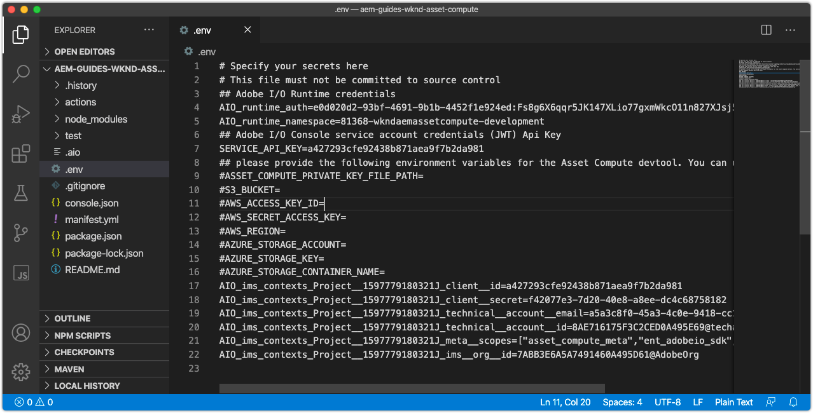

# Umgebungsvariablen konfigurieren



Bevor Sie mit der Entwicklung von Asset compute-Workern beginnen, stellen Sie sicher, dass das Projekt mit Adobe I/O- und Cloud-Speicherinformationen konfiguriert ist. Diese Informationen werden im `.env` des Projekts gespeichert, das nur für die lokale Entwicklung und nicht in Git verwendet wird. Die `.env`-Datei bietet eine praktische Möglichkeit, Schlüssel/Werte-Paare für die lokale lokale Asset compute-Entwicklungsumgebung verfügbar zu machen. Bei [Bereitstellung von](../deploy/runtime.md) Asset compute-Sekundären in Adobe I/O Runtime wird die `.env`-Datei nicht verwendet, sondern eine Untergruppe von Werten wird über Umgebungsvariablen übergeben. Andere benutzerdefinierte Parameter und Geheimnisse können auch in der Datei `.env` gespeichert werden, z. B. Entwicklungsberechtigungen für Drittanbieter-Webdienste.

## Verweisen Sie auf `private.key`


Öffnen Sie die Datei `.env`, heben Sie die Auskommentierung des Schlüssels `ASSET_COMPUTE_PRIVATE_KEY_FILE_PATH` auf und geben Sie den absoluten Pfad in Ihrem Dateisystem zu `private.key` an, der mit dem öffentlichen Zertifikat verknüpft ist, das zu Ihrem Adobe I/O FireFly-Projekt hinzugefügt wurde.

+ Wenn Ihr Schlüsselpaar von Adobe I/O generiert wurde, wurde es automatisch als Teil von `config.zip` heruntergeladen.
+ Wenn Sie den öffentlichen Schlüssel zur Adobe I/O bereitgestellt haben, sollten Sie auch im Besitz des entsprechenden privaten Schlüssels sein.
+ Wenn Sie nicht über diese Schlüsselpaare verfügen, können Sie am unteren Rand neue Schlüsselpaare generieren oder neue öffentliche Schlüssel hochladen:
   [https://console.adobe.com](https://console.adobe.io) > Ihr Asset compute Firefly-Projekt > Arbeitsbereiche @ Development > Service Account (JWT).

Denken Sie daran, dass die `private.key`-Datei nicht in Git eingecheckt werden sollte, da sie Geheimnisse enthält, sondern an einem sicheren Ort außerhalb des Projekts gespeichert werden sollte.

Unter macOS könnte dies beispielsweise wie folgt aussehen:

```
...
ASSET_COMPUTE_PRIVATE_KEY_FILE_PATH=/Users/example-user/credentials/aem-guides-wknd-asset-compute/private.key
...
```

## Cloud-Speicher-Anmeldeinformationen konfigurieren

Die lokale Entwicklung von Asset compute-Workern erfordert Zugriff auf [Cloud-Speicher](../set-up/accounts-and-services.md#cloud-storage). Die für die lokale Entwicklung verwendeten Cloud-Speicher-Anmeldeinformationen werden in der Datei `.env` bereitgestellt.

In diesem Tutorial wird die Verwendung von Azure Blob Storage bevorzugt, jedoch können stattdessen Amazon S3 und die zugehörigen Schlüssel in der Datei `.env` verwendet werden.

### Verwenden von Azure Blob Storage

Entfernen Sie die Auskommentierung und füllen Sie die folgenden Schlüssel in der Datei `.env` aus und fügen Sie sie mit den Werten für den bereitgestellten Cloud-Speicher in Azure Portal ein.


1. Wert für den Schlüssel `AZURE_STORAGE_CONTAINER_NAME`
1. Wert für den Schlüssel `AZURE_STORAGE_ACCOUNT`
1. Wert für den Schlüssel `AZURE_STORAGE_KEY`

Dies könnte beispielsweise wie folgt aussehen (Werte nur zur Veranschaulichung):

```
...
AZURE_STORAGE_ACCOUNT=aemguideswkndassetcomput
AZURE_STORAGE_KEY=Va9CnisgdbdsNJEJBqXDyNbYppbGbZ2V...OUNY/eExll0vwoLsPt/OvbM+B7pkUdpEe7zJhg==
AZURE_STORAGE_CONTAINER_NAME=asset-compute
...
```

Die resultierende Datei `.env` sieht wie folgt aus:


Wenn Sie NICHT Microsoft Azure Blob Storage verwenden, entfernen oder lassen Sie diese auskommentiert (durch Präfix `#`).

### Verwenden von Amazon S3 Cloud Storage{#amazon-s3}

Wenn Sie Amazon S3-Cloud-Speicher verwenden, heben Sie die Auskommentierung auf und füllen Sie die folgenden Schlüssel in der Datei `.env` aus.

Dies könnte beispielsweise wie folgt aussehen (Werte nur zur Veranschaulichung):

```
...
S3_BUCKET=aemguideswkndassetcompute
AWS_ACCESS_KEY_ID=KKIXZLZYNLXJLV24PLO6
AWS_SECRET_ACCESS_KEY=Ba898CnisgabdsNJEJBqCYyVrYttbGbZ2...OiNYExll0vwoLsPtOv
AWS_REGION=us-east-1
...
```

## Überprüfen der Projektkonfiguration

Nachdem das generierte Asset compute-Projekt konfiguriert wurde, validieren Sie die Konfiguration, bevor Sie Codeänderungen vornehmen, um sicherzustellen, dass die unterstützenden Dienste in den `.env`-Dateien bereitgestellt werden.

So starten Sie das Asset compute Development Tool für das Asset compute-Projekt:

1. Öffnen Sie eine Befehlszeile im Asset compute-Projektstamm (in VS Code kann dies direkt in der IDE über Terminal > Neues Terminal geöffnet werden) und führen Sie den Befehl aus:

   ```
   $ aio app run
   ```

1. Das lokale Asset compute Development Tool wird in Ihrem Standard-Webbrowser unter __http://localhost:9000__ geöffnet.

   

1. Sehen Sie sich die Befehlszeilenausgabe und den Webbrowser auf Fehlermeldungen an, wenn das Entwicklungstool initialisiert wird.
1. Um das Asset compute Development Tool zu stoppen, tippen Sie im Fenster, das `aio app run` ausgeführt hat, auf `Ctrl-C` , um den Vorgang zu beenden.

## Fehlerbehebung

+ [Das Entwicklungstool kann nicht gestartet werden, da private.key fehlt.](../troubleshooting.md#missing-private-key)
