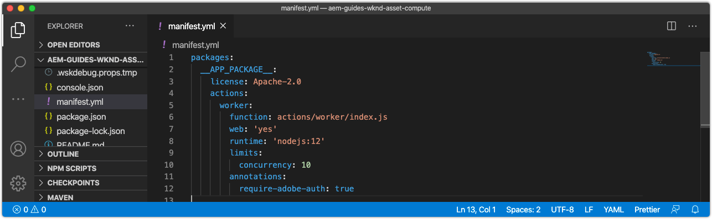
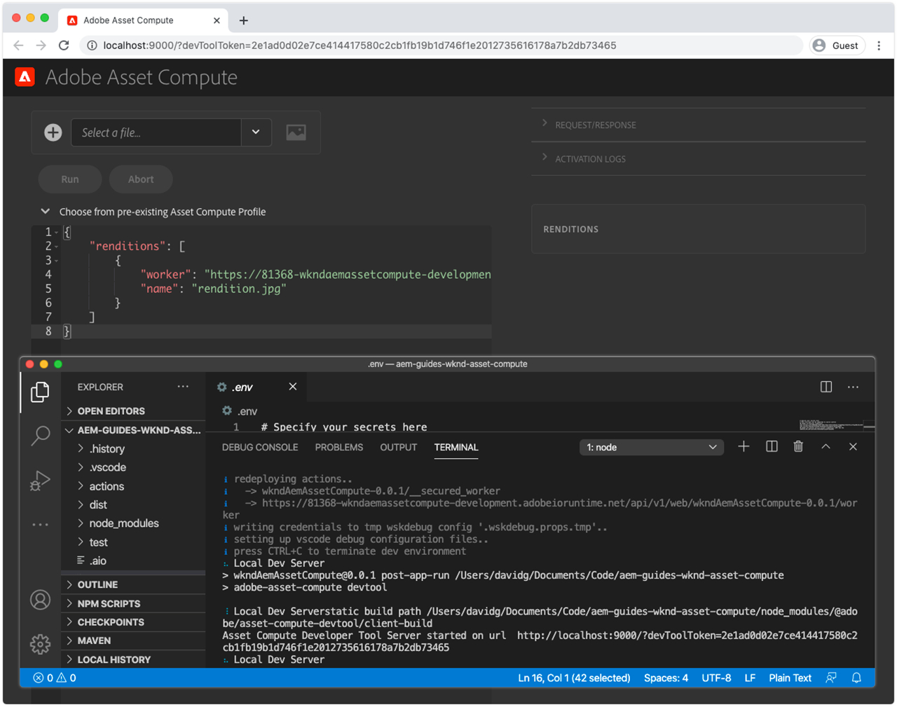

# manifest.yml konfigurieren

Das `manifest.yml`, das sich im Stammverzeichnis des Asset compute-Projekts befindet, beschreibt alle Mitarbeiter in diesem Projekt, die bereitgestellt werden sollen.



## Standardarbeitsdefinition

Arbeiter werden als Adobe I/O Runtime-Aktionseinträge unter `actions` definiert und bestehen aus einer Gruppe von Konfigurationen.

Arbeiter, die auf andere Adobe I/O-Integrationen zugreifen, müssen die `annotations -> require-adobe-auth`-Eigenschaft auf `true` setzen, da [die Anmeldeinformationen der Adobe I/O des Workers](https://docs.adobe.com/content/help/en/asset-compute/using/extend/develop-custom-application.html#access-adobe-apis) über das `params.auth`-Objekt verfügbar macht. Dies ist in der Regel erforderlich, wenn der Mitarbeiter Adobe I/O-APIs wie die Adobe Photoshop-, Lightroom- oder Sensei-APIs abruft und pro Mitarbeiter umgeschaltet werden kann.

1. Öffnen und überprüfen Sie den automatisch generierten Worker `manifest.yml`. Projekte, die mehrere Asset compute-Worker enthalten, müssen einen Eintrag für jeden Arbeitnehmer unter dem `actions`-Array definieren.

```yml
packages:
  __APP_PACKAGE__:
    license: Apache-2.0
    actions: # the array of workers, since we have a single worker there is only one entry beneath actions
      worker: # the auto-generated worker definition
        function: actions/worker/index.js # the entry point to the worker 
        web: 'yes'  # as our worker is invoked over HTTP from AEM Author service
        runtime: 'nodejs:12' # the target nodejs runtime (only 10 and 12 are supported)
        limits:
          concurrency: 10
        annotations:
          require-adobe-auth: true # set to true, to pass through Adobe I/O access token/client id via params.auth in the worker, typically required when the worker calls out to Adobe I/O APIs such as the Adobe Photoshop, Lightroom or Sensei APIs.
```

## Grenzen definieren

Jeder Worker kann die [limits](https://www.adobe.io/apis/experienceplatform/runtime/docs.html#!adobedocs/adobeio-runtime/master/guides/system_settings.md) für seinen Ausführungskontext in Adobe I/O Runtime konfigurieren. Diese Werte sollten so eingestellt werden, dass eine optimale Größenanpassung für den Arbeiter möglich ist, basierend auf der Menge, der Rate und der Art der zu berechnenden Assets sowie der Art der von ihm ausgeführten Arbeit.

Überprüfen Sie die Anleitung zur Größenanpassung der Adobe](https://docs.adobe.com/content/help/en/asset-compute/using/extend/develop-custom-application.html#sizing-workers), bevor Sie Grenzwerte festlegen. [ asset compute-Workern kann bei der Verarbeitung von Assets der Arbeitsspeicher ausgehen, was dazu führt, dass die Adobe I/O Runtime-Ausführung abgebrochen wird, sodass die Größe des Arbeitnehmers für den Umgang mit allen möglichen Assets angemessen ist.

1. hinzufügen Sie einen Abschnitt `inputs` zum neuen Eintrag `wknd-asset-compute` actions. Dies ermöglicht die Abstimmung der Gesamtleistung und Ressourcenzuordnung des Asset compute-Workers.

```yml
packages:
  __APP_PACKAGE__:
    license: Apache-2.0
    actions: 
      worker:
        function: actions/worker/index.js 
        web: 'yes' 
        runtime: 'nodejs:12'
        limits: # Allows for the tuning of the worker's performance
          timeout: 60000 # timeout in milliseconds (1 minute)
          memorySize: 512 # memory allocated in MB; if the worker offloads heavy computational work to other Web services this number can be reduced
          concurrency: 10 # adjust based on expected concurrent processing and timeout 
        annotations:
          require-adobe-auth: true
           
```

## Die fertige manifest.yml

Das endgültige `manifest.yml` sieht wie folgt aus:

```yml
packages:
  __APP_PACKAGE__:
    license: Apache-2.0
    actions: 
      worker:
        function: actions/worker/index.js 
        web: 'yes' 
        runtime: 'nodejs:12'
        limits:
          timeout: 60000 # in ms
          memorySize: 512 # in MB
          concurrency: 10 
        annotations:
          require-adobe-auth: true
```

## manifest.yml auf Github

Das endgültige `.manifest.yml` ist auf Github verfügbar unter:

+ [aem-guides-wknd-asset-compute/manifest.yml](https://github.com/adobe/aem-guides-wknd-asset-compute/blob/master/manifest.yml)


## Validieren der Datei manifest.yml

Nachdem die generierte Asset compute `manifest.yml` aktualisiert wurde, führen Sie das lokale Entwicklungstool aus und stellen Sie sicher, dass die Beginn mit den aktualisierten `manifest.yml`-Einstellungen erfolgreich arbeiten.

So Beginn Asset compute Development Tool für das Asset compute-Projekt:

1. Öffnen Sie eine Befehlszeile im Asset compute-Projektstamm (in VS-Code kann diese über Terminal > New Terminal direkt in der IDE geöffnet werden) und führen Sie den Befehl aus:

   ```
   $ aio app run
   ```

1. Das lokale Asset compute Development Tool wird in Ihrem Standard-Webbrowser unter __http://localhost:9000__ geöffnet.

   

1. Beobachten Sie die Befehlszeilenausgabe und den Webbrowser auf Fehlermeldungen während der Initialisierung des Entwicklungstools.
1. Um das Asset compute-Entwicklungstool zu beenden, tippen Sie im Fenster, das `aio app run` ausgeführt hat, auf `Ctrl-C`, um den Vorgang zu beenden.

## Fehlerbehebung

+ [Falscher YAML-Einzug](../troubleshooting.md#incorrect-yaml-indentation)
+ [memorySize limit ist zu niedrig eingestellt](../troubleshooting.md#memorysize-limit-is-set-too-low)
