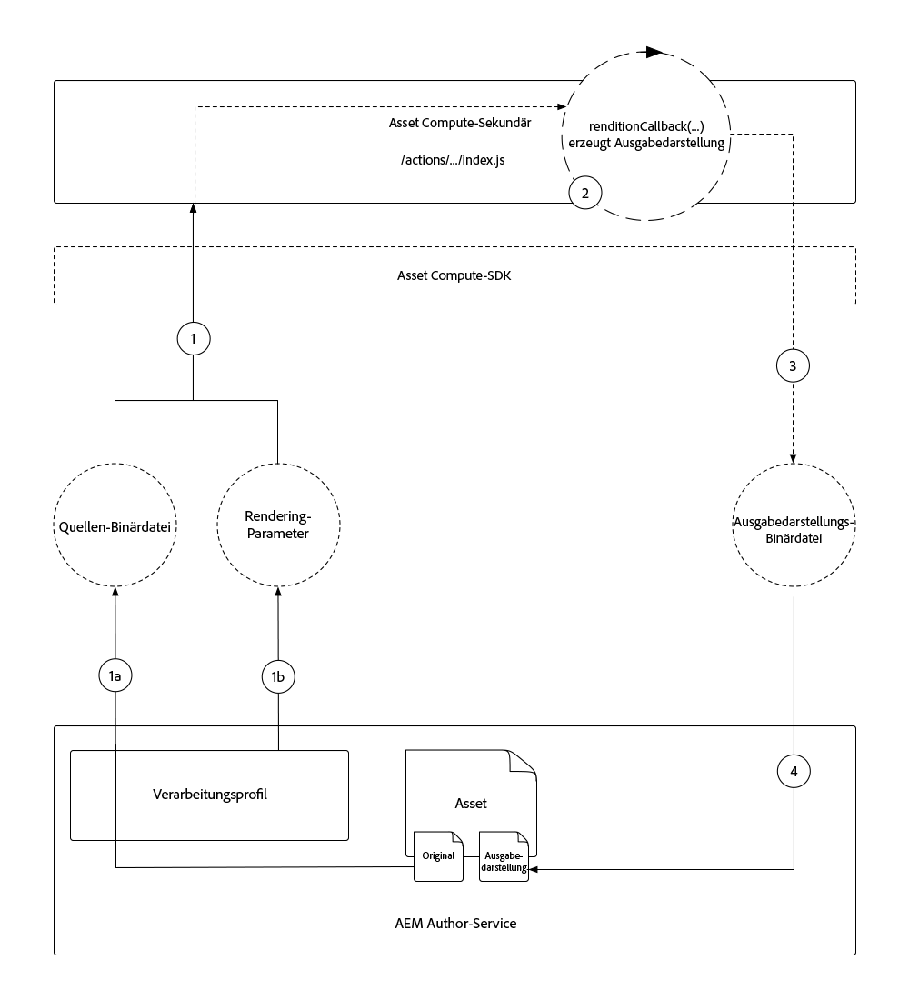

# Entwickeln eines Asset Computing-Mitarbeiters

Asset Compute-Mitarbeiter sind der Kern eines Asset Compute-Projekts, da sie benutzerdefinierte Funktionen bereitstellen, mit denen die an einem Asset durchgeführten Arbeiten zur Erstellung einer neuen Darstellung ausgeführt oder orchestriert werden.

Das Asset Compute-Projekt generiert automatisch einen einfachen Arbeiter, der die ursprüngliche Binärdatei des Assets ohne Konvertierungen in eine benannte Darstellung kopiert. In diesem Tutorial werden wir diesen Arbeiter ändern, um eine interessantere Darstellung zu machen, um die Macht der Mitarbeiter von Asset Compute zu veranschaulichen.

Wir erstellen einen Asset Compute-Mitarbeiter, der eine neue horizontale Bilddarstellung generiert, die leeren Raum links und rechts neben der Asset-Darstellung mit einer verschwommenen Version des Assets abdeckt. Die Breite, Höhe und Weichzeichnung der endgültigen Darstellung werden parametrisiert.

## Logischer Fluss eines Asset Compute-Workers, der aufgerufen wird

Mitarbeiter von Asset Compute implementieren den Asset Compute SDK-Worker-API-Vertrag in der `renditionCallback(...)` Funktion, die Folgendes versteht:

+ __Eingabe:__ Die Binärparameter und Parameter eines AEM Assets im Original
+ __Ausgabe:__ Eine oder mehrere Darstellungen, die dem AEM Asset hinzugefügt werden sollen



1. Wenn ein Asset-Compute-Mitarbeiter vom AEM Author-Dienst aufgerufen wird, wird er über ein Profil zur Verarbeitung gegen ein AEM Asset geführt. Die ursprüngliche Binärdatei des Assets __(1a)__ wird über den `source` Parameter der Rückruffunktion und __(1b)__ alle im Profil &quot;Verarbeitung&quot;definierten Parameter über den `rendition.instructions` Parametersatz an den Worker übergeben.
1. Die Asset Compute SDK-Ebene akzeptiert die Anforderung vom verarbeitenden Profil und orchestriert die Ausführung der benutzerdefinierten Asset Compute- `renditionCallback(...)` Funktion des Workers und transformiert die in __(1a)__ bereitgestellte Quellbinärdatei basierend auf den von __(1b)__ bereitgestellten Parametern, um eine Darstellung der Quellbinärdatei zu generieren.
   + In diesem Tutorial wird die Darstellung &quot;in Bearbeitung&quot;erstellt, d. h. der Worker erstellt die Darstellung, die Quellbinäre kann jedoch auch zur Generierung der Darstellung an andere Webdienst-APIs gesendet werden.
1. Der Asset Compute-Mitarbeiter speichert die binäre Darstellung der Darstellung, in `rendition.path` der sie im AEM Author-Dienst gespeichert werden kann.
1. Nach Abschluss des Vorgangs werden die in das Asset Compute-SDK geschriebenen Binärdaten über den AEM Author-Dienst als Darstellung in der Benutzeroberfläche AEM bereitgestellt. `rendition.path`

Das obige Diagramm zeigt die Bedenken der Asset Compute-Entwickler und den logischen Fluss zum Asset Compute-Arbeitsaufruf an. Die [internen Details zur Ausführung](https://docs.adobe.com/content/help/en/asset-compute/using/extend/custom-application-internals.html) von Asset Compute sind für das Merkwürdige verfügbar, es sollten jedoch nur die öffentlichen Asset Compute SDK API-Verträge angefordert werden.

## Anatomie eines Arbeitnehmers

Alle Mitarbeiter von Asset Compute folgen der gleichen grundlegenden Struktur und demselben Input/Output-Vertrag.

```javascript
'use strict';

// Any npm module imports used by the worker
const { worker, SourceCorruptError } = require('@adobe/asset-compute-sdk');
const fs = require('fs').promises;

/**
Exports the worker implemented by a custom rendition callback function, which parametrizes the input/output contract for the worker.
 + `source` represents the asset's original binary used as the input for the worker.
 + `rendition` represents the worker's output, which is the creation of a new asset rendition.
 + `params` are optional parameters, which map to additional key/value pairs, including a sub `auth` object that contains Adobe I/O access credentials.
**/
exports.main = worker(async (source, rendition, params) => {
    // Perform any necessary source (input) checks
    const stats = await fs.stat(source.path);
    if (stats.size === 0) {
        // Throw appropriate errors whenever an erring condition is met
        throw new SourceCorruptError('source file is empty');
    }

    // Access any custom parameters provided via the Processing Profile configuration
    let param1 = rendition.instructions.exampleParam;

    /** 
    Perform all work needed to transform the source into the rendition.
    
    The source data can be accessed:
        + In the worker via a file available at `source.path`
        + Or via a presigned GET URL at `source.url`
    **/
    if (success) {
        // A successful worker must write some data back to `renditions.path`. 
        // This example performs a trivial 1:1 copy of the source binary to the rendition
        await fs.copyFile(source.path, rendition.path);
    } else {
        // Upon failure an Asset Compute Error (exported by @adobe/asset-compute-commons) should be thrown.
        throw new GenericError("An error occurred!", "example-worker");
    }
});

/**
Optionally create helper classes or functions the worker's rendition callback function invokes to help organize code.

Code shared across workers, or to complex to be managed in a single file, can be broken out across supporting JavaScript files in the project and imported normally into the worker. 
**/
function customHelperFunctions() { ... }
```

## Öffnen der Datei &quot;index.js&quot;


1. Stellen Sie sicher, dass das Asset-Compute-Projekt im VS-Code geöffnet ist.
1. Navigate to the `/actions/worker` folder
1. Open the `index.js` file

Dies ist die JavaScript-Arbeitsdatei, die wir in diesem Lernprogramm ändern werden.

## Installieren und Importieren unterstützender NPM-Module

Aufgrund der Node.js-Basis profitieren Asset Compute-Projekte vom stabilen [npm-Modul-Ökosystem](https://npmjs.com). Um npm-Module nutzen zu können, müssen wir sie zunächst in unserem Asset Compute-Projekt installieren.

In diesem Arbeitsbereich verwenden wir das [Jimp](https://www.npmjs.com/package/jimp) , um das Darstellungsbild direkt im Code von Node.js zu erstellen und zu bearbeiten.

>[!WARNING]
>
>Nicht alle npm-Module zur Asset-Manipulation werden von Asset Compute unterstützt. npm-Module, die auf die vorhandenen Anwendungen wie ImageMagick oder OS-abhängige Bibliotheken angewiesen sind. Es ist am besten, die Verwendung von NPM-Modulen mit JavaScript zu beschränken.

1. Öffnen Sie die Befehlszeile im Stammverzeichnis Ihres Asset Compute-Projekts (dies kann über __Terminal > Neues Terminal__ im VS-Code erfolgen) und führen Sie den Befehl aus:

   ```
   $ npm install jimp
   ```

1. Importieren Sie das `jimp` Modul in den Arbeitscode, damit es über das `Jimp` JavaScript-Objekt verwendet werden kann.
Aktualisieren Sie die `require` Direktiven oben im Arbeitsbereich, `index.js` um das `Jimp` Objekt aus dem `jimp` Modul zu importieren:

   ```javascript
   'use strict';
   
   const { Jimp } = require('jimp');
   const { worker, SourceCorruptError } = require('@adobe/asset-compute-sdk');
   const fs = require('fs').promises;
   
   exports.main = worker(async (source, rendition, params) => {
       // Check handle a corrupt input source
       const stats = await fs.stat(source.path);
       if (stats.size === 0) {
           throw new SourceCorruptError('source file is empty');
       }
   
       // Do work here
   });
   ```

## Parameter lesen

Mitarbeiter von Asset Compute können Parameter lesen, die über Verarbeitungsparameter, die in AEM als Cloud Service-Autorendienst definiert sind, übergeben werden können. Die Parameter werden über das `rendition.instructions` Objekt an den Worker übergeben.

Diese können durch Zugriff `rendition.instructions.<parameterName>` im Arbeitscode gelesen werden.

Hier lesen wir die konfigurierbaren Darstellungen `SIZE`und `BRIGHTNESS` `CONTRAST`geben Standardwerte an, wenn keine über das Profil Verarbeitung bereitgestellt wurden. Beachten Sie, dass `renditions.instructions` beim Aufrufen von AEM als Cloud Service Processing-Profile als Zeichenfolgen übergeben werden. Stellen Sie daher sicher, dass diese in die richtigen Datentypen im Arbeitscode umgewandelt werden.

```javascript
'use strict';

const { Jimp } = require('jimp');
const { worker, SourceCorruptError } = require('@adobe/asset-compute-sdk');
const fs = require('fs').promises;

exports.main = worker(async (source, rendition, params) => {
    const stats = await fs.stat(source.path);
    if (stats.size === 0) {
        throw new SourceCorruptError('source file is empty');
    }

    // Read in parameters and set defaults if parameters are provided
    // Processing Profiles pass in instructions as Strings, so make sure to parse to correct data types
    const SIZE = parseInt(rendition.instructions.size) || 800; 
    const CONTRAST = parseFloat(rendition.instructions.contrast) || 0;
    const BRIGHTNESS = parseFloat(rendition.instructions.brightness) || 0;

    // Do work here
}
```

## Ablauffehler{#errors}

Mitarbeiter von Asset Compute können auf Situationen stoßen, die zu Fehlern führen. Das Adobe Asset Compute-SDK enthält [eine Reihe vordefinierter Fehler](https://github.com/adobe/asset-compute-commons#asset-compute-errors) , die bei Auftreten solcher Situationen ausgegeben werden können. Wenn kein bestimmter Fehlertyp angewendet wird, `GenericError` kann der verwendet oder ein spezifischer benutzerdefinierter Typ definiert `ClientErrors` werden.

Bevor Sie mit der Verarbeitung der Darstellung beginnen, überprüfen Sie, ob alle Parameter gültig und im Kontext dieses Workers unterstützt sind:

+ Stellen Sie sicher, dass die Parameter für die Darstellungsanweisung `SIZE`, `CONTRAST`und `BRIGHTNESS` gültig sind. Andernfalls wird ein benutzerdefinierter Fehler ausgegeben `RenditionInstructionsError`.
   + Eine benutzerdefinierte `RenditionInstructionsError` Klasse, die erweitert wird, `ClientError` wird unten in dieser Datei definiert. Die Verwendung eines bestimmten benutzerspezifischen Fehlers ist beim [Schreiben von Tests](../test-debug/test.md) für den Arbeiter nützlich.

```javascript
'use strict';

const { Jimp } = require('jimp');
// Import the Asset Compute SDK provided `ClientError` 
const { worker, SourceCorruptError, ClientError } = require('@adobe/asset-compute-sdk');
const fs = require('fs').promises;

exports.main = worker(async (source, rendition, params) => {
    const stats = await fs.stat(source.path);
    if (stats.size === 0) {
        throw new SourceCorruptError('source file is empty');
    }

    // Read in parameters and set defaults if parameters are provided
    const SIZE = parseInt(rendition.instructions.size) || 800; 
    const CONTRAST = parseFloat(rendition.instructions.contrast) || 0;
    const BRIGHTNESS = parseFloat(rendition.instructions.brightness) || 0;

    if (SIZE <= 10 || SIZE >= 10000) {
        // Ensure size is within allowable bounds
        throw new RenditionInstructionsError("'size' must be between 10 and 1,0000");
    } else if (CONTRAST <= -1 || CONTRAST >= 1) {
        // Ensure contrast is valid value
        throw new RenditionInstructionsError("'contrast' must between -1 and 1");
    } else if (BRIGHTNESS <= -1 || BRIGHTNESS >= 1) {
        // Ensure contrast is valid value
        throw new RenditionInstructionsError("'brightness' must between -1 and 1");
    }

    // Do work here
}

// Create a new ClientError to handle invalid rendition.instructions values
class RenditionInstructionsError extends ClientError {
    constructor(message) {
        // Provide a:
        // + message: describing the nature of this erring condition
        // + name: the name of the error; usually same as class name
        // + reason: a short, searchable, unique error token that identifies this error
        super(message, "RenditionInstructionsError", "rendition_instructions_error");

        // Capture the strack trace
        Error.captureStackTrace(this, RenditionInstructionsError);
    }
}
```

## Erstellen der Darstellung

Wenn die Parameter gelesen, bereinigt und validiert werden, wird Code geschrieben, um die Darstellung zu generieren. Der Pseudo-Code für die Generierung der Darstellung lautet wie folgt:

1. Erstellen Sie eine neue `renditionImage` Arbeitsfläche in quadratischen Dimensionen, die über den `size` Parameter angegeben wird.
1. Erstellen eines `image` Objekts aus der Binärdatei des Quellassets
1. Verwenden Sie die __Jimp__ -Bibliothek, um das Bild zu transformieren:
   + Zuschneiden des Originalbilds auf ein zentriertes Quadrat
   + Kreis aus der Mitte des &quot;quadrierten&quot; Bilds ausschneiden
   + Passend zu den durch den `SIZE` Parameterwert definierten Dimensionen skalieren
   + Kontrast auf Basis des `CONTRAST` Parameterwerts anpassen
   + Helligkeit basierend auf dem `BRIGHTNESS` Parameterwert anpassen
1. Platzieren Sie das transformierte `image` in die Mitte des Objekts, `renditionImage` das einen transparenten Hintergrund hat
1. Schreiben Sie die Komposition, `renditionImage` `rendition.path` damit sie wieder als Asset-Darstellung in AEM gespeichert werden kann.

Dieser Code verwendet die [Jimp-APIs](https://github.com/oliver-moran/jimp#jimp) , um diese Bildtransformationen durchzuführen.

Die Mitarbeiter von Asset Compute müssen ihre Arbeit synchron beenden, und sie `rendition.path` müssen vollständig zurückgeschrieben werden, bevor der Arbeiter `renditionCallback` fertig ist. Dies erfordert, dass asynchrone Funktionsaufrufe mit dem `await` Operator synchron ausgeführt werden. Wenn Sie mit asynchronen JavaScript-Funktionen nicht vertraut sind und wie diese synchron ausgeführt werden sollen, machen Sie sich mit dem Warten-Operator von [JavaScript vertraut](https://developer.mozilla.org/en-US/docs/Web/JavaScript/Reference/Operators/await).

Der fertige Arbeiter `index.js` sollte wie folgt aussehen:

```javascript
'use strict';

const Jimp = require('jimp');
const { worker, SourceCorruptError, ClientError } = require('@adobe/asset-compute-sdk');
const fs = require('fs').promises;

exports.main = worker(async (source, rendition, params) => {
    const stats = await fs.stat(source.path);
    if (stats.size === 0) {
        throw new SourceCorruptError('source file is empty');
    }

    const SIZE = parseInt(rendition.instructions.size) || 800; 
    const CONTRAST = parseFloat(rendition.instructions.contrast) || 0;
    const BRIGHTNESS = parseFloat(rendition.instructions.brightness) || 0;

    if (SIZE <= 10 || SIZE >= 10000) {
        throw new RenditionInstructionsError("'size' must be between 10 and 10,000");
    } else if (CONTRAST <= -1 || CONTRAST >= 1) {
        throw new RenditionInstructionsError("'contrast' must between -1 and 1");
    } else if (BRIGHTNESS <= -1 || BRIGHTNESS >= 1) {
        throw new RenditionInstructionsError("'brightness' must between -1 and 1");
    }

    // Create target rendition image of the target size with a transparent background (0x0)
    let renditionImage =  new Jimp(SIZE, SIZE, 0x0);

    // Read and perform transformations on the source binary image
    let image = await Jimp.read(source.path);

    // Crop a circle from the source asset, and then apply contrast and brightness using Jimp
    image.crop(
            image.bitmap.width < image.bitmap.height ? 0 : (image.bitmap.width - image.bitmap.height) / 2,
            image.bitmap.width < image.bitmap.height ? (image.bitmap.height - image.bitmap.width) / 2 : 0,
            image.bitmap.width < image.bitmap.height ? image.bitmap.width : image.bitmap.height,
            image.bitmap.width < image.bitmap.height ? image.bitmap.width : image.bitmap.height
        )   
        .circle()
        .scaleToFit(SIZE, SIZE)
        .contrast(CONTRAST)
        .brightness(BRIGHTNESS);

    // Place the transformed image onto the transparent renditionImage to save as PNG
    renditionImage.composite(image, 0, 0)

    // Write the final transformed image to the asset's rendition
    renditionImage.write(rendition.path);
});

// Custom error used for renditions.instructions parameter checking
class RenditionInstructionsError extends ClientError {
    constructor(message) {
        super(message, "RenditionInstructionsError", "rendition_instructions_error");
        Error.captureStackTrace(this, RenditionInstructionsError);
    }
}
```

## Ausführen des Arbeitnehmers

Nachdem der Worker-Code abgeschlossen ist und zuvor in [manifest.yml](./manifest.md)registriert und konfiguriert wurde, kann er mit dem lokalen Asset Compute Development Tool ausgeführt werden, um die Ergebnisse anzuzeigen.

1. Stamm des Projekts &quot;Asset Compute&quot;
1. Starte `app aio run`
1. Warten Sie, bis das Asset Computing Development Tool in einem neuen Fenster geöffnet wird
1. Wählen Sie eine Datei __aus...__ Dropdown-Liste wählen Sie ein zu verarbeitendes Beispielbild aus
   + Wählen Sie eine Beispielbilddatei aus, die als Quellelement-Binärdatei verwendet werden soll
   + Wenn noch keine vorhanden ist, tippen Sie auf das __(+)__ links, laden Sie eine [Beispielbilddatei](../assets/samples/sample-file.jpg) hoch und aktualisieren Sie das Browserfenster der Entwicklungs-Tools
1. Aktualisieren Sie `"name": "rendition.png"` als dieser Worker, um eine transparente PNG-Datei zu erstellen.
   + Beachten Sie, dass dieser Parameter &quot;name&quot;nur für das Entwicklungstool verwendet wird und nicht darauf angewiesen sein sollte.

   ```json
   {
       "renditions": [
           {
               "worker": "...",
               "name": "rendition.png"
           }
       ]
   }
   ```
1. Tippen Sie auf __Ausführen__ und warten Sie, bis die Darstellung generiert wird
1. Im Abschnitt __Darstellungen__ wird die generierte Darstellung Vorschau. Tippen Sie auf die Vorschau Darstellung, um die vollständige Darstellung herunterzuladen

   

### Ausführen des Workers mit Parametern

Parameter, die über Konfigurationen für Verarbeitungsparameter weitergegeben werden, können in Asset Compute Development Tools simuliert werden, indem sie als Schlüssel/Wert-Paare im Darstellungsparameter JSON bereitgestellt werden.

>[!WARNING]
>
>Während der lokalen Entwicklung können Werte mit verschiedenen Datentypen weitergegeben werden, wenn sie von AEM als Cloud Service-Verarbeitungselemente als Zeichenfolgen übergeben werden. Achten Sie daher darauf, dass bei Bedarf die richtigen Datentypen analysiert werden.
> Zum Beispiel erfordert Jimps `crop(width, height)` Funktion, dass seine Parameter `int`s sein müssen. Wenn `parseInt(rendition.instructions.size)` `jimp.crop(SIZE, SIZE)` nicht mit einer int-Datei geparst wird, schlägt der Aufruf von fehl, da die Parameter inkompatiblen &quot;String&quot;-Typ sind.

Unser Code akzeptiert Parameter für:

+ `size` definiert die Größe der Darstellung (Höhe und Breite als Ganzzahlen)
+ `contrast` definiert die Kontrasteinstellung, muss zwischen -1 und 1 liegen, als Floats
+ `brightness`  definiert die helle Einstellung, muss zwischen -1 und 1 liegen, als Floats

Diese werden im Arbeiter gelesen `index.js` über:

+ `const SIZE = parseInt(rendition.instructions.size) || 800`
+ `const CONTRAST = parseFloat(rendition.instructions.contrast) || 0`
+ `const BRIGHTNESS = parseFloat(rendition.instructions.brightness) || 0`

1. Aktualisieren Sie die Darstellungsparameter, um Größe, Kontrast und Helligkeit anzupassen.

   ```json
   {
       "renditions": [
           {
               "worker": "...",
               "name": "rendition.png",
               "size": "450",
               "contrast": "0.30",
               "brightness": "0.15"
           }
       ]
   }
   ```

1. Tippen Sie erneut auf __Ausführen__
1. Tippen Sie auf die Vorschau Darstellung, um die generierte Darstellung herunterzuladen und zu überprüfen. Beachten Sie die Abmessungen und die Art und Weise, wie Kontrast und Helligkeit im Vergleich zur Standarddarstellung verändert wurden.

   

1. Laden Sie andere Bilder in das Dropdown-Feld __Quelldatei__ hoch und versuchen Sie, den Worker mit anderen Parametern auszuführen!

## Worker index.js auf Github

Das Finale `index.js` ist auf Github unter folgender Adresse abrufbar:

+ [aem-guides-wknd-asset-compute/actions/worker/index.js](https://github.com/adobe/aem-guides-wknd-asset-compute/blob/master/actions/worker/index.js)

## Fehlerbehebung

### Darstellung wird teilweise gezeichnet zurückgegeben

+ __Fehler__: Wiedergabe wird nicht vollständig gerendert, wenn die Gesamtgröße der Darstellungsdatei groß ist

   

+ __Ursache__: Die `renditionCallback` Funktion des Arbeitnehmers wird beendet, bevor die Darstellung vollständig in geschrieben werden kann `rendition.path`.
+ __Auflösung__: Überprüfen Sie den benutzerdefinierten Worker-Code und stellen Sie sicher, dass alle asynchronen Aufrufe synchron erfolgen.
