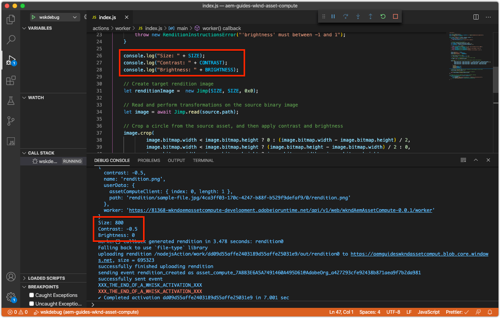

# Debuggen eines Asset Computing-Mitarbeiters

Asset Compute-Mitarbeiter können auf verschiedene Weise debuggt werden, von einfachen Debug-Protokollanweisungen über angehängten VS-Code als Remote-Debugger bis hin zum Abruf von Protokollen für Aktivierungen in Adobe I/O Runtime, die von AEM als Cloud Service initiiert wurden.

## Protokollierung

Die grundlegendste Form des Debuggens von Asset Compute-Mitarbeitern verwendet traditionelle `console.log(..)` Anweisungen im Arbeitscode. Das `console` JavaScript-Objekt ist ein implizites, globales Objekt, sodass es nicht importiert werden muss oder erforderlich ist, da es immer in allen Kontexten vorhanden ist.

Diese Protokollanweisungen stehen je nach Ausführung des Workers &quot;Asset Compute&quot;unterschiedlich zur Überprüfung zur Verfügung:

+ Von `aio app run`den Protokollen print bis standard out und die [Aktivierungen des](../develop/development-tool.md) Entwicklungstools
   
+ Protokolle drucken `aio app test`zu `/build/test-results/test-worker/test.log`
   
+ Protokolle drucken `wskdebug`die Anweisungen in der VS-Code-Debug-Konsole (Ansicht > Debug-Konsole), Standard-Out
   
+ Protokollanweisungen `aio app logs`werden in der Protokollausgabe der Aktivierung gedruckt

## Remote-Debugging über angehängten Debugger

>[!WARNING]
>
>Verwenden Sie Microsoft Visual Studio Code 1.48.0 oder höher zur Kompatibilität mit wskdebug

Das Modul [wskdebug](https://www.npmjs.com/package/@openwhisk/wskdebug) npm unterstützt das Anhängen eines Debuggers an Asset Compute-Mitarbeiter, einschließlich der Möglichkeit, Haltepunkte im VS-Code festzulegen und den Code schrittweise zu durchlaufen.

>[!VIDEO](https://video.tv.adobe.com/v/40383/?quality=12&learn=on)

_Clickthrough zum Debugging eines Asset Compute-Workers mit wskdebug (kein Audio)_

1. Stellen Sie sicher, dass die [Module &quot;wskdebug](../set-up/development-environment.md#wskdebug) &quot;und [ngrok](../set-up/development-environment.md#ngork) npm installiert sind
1. Stellen Sie sicher, dass [Docker Desktop und die zugehörigen Docker-Bilder](../set-up/development-environment.md#docker) installiert und ausgeführt sind
1. Schließen Sie alle aktiven Instanzen von Development Tool.
1. Stellen Sie den neuesten Code mit dem Namen der bereitgestellten Aktion bereit `aio app deploy` und zeichnen Sie ihn auf (Name zwischen dem `[...]`). Dies wird verwendet, um die `launch.json` in Schritt 8.

   ```
   ℹ Info: Deploying package [wkndAemAssetCompute-0.0.1]...
   ```
1. Beginn einer neuen Instanz des Asset Compute Development Tool mit dem Befehl `npx adobe-asset-compute devtool`
1. Tippen Sie im VS-Code auf das Debug-Symbol in der linken Navigation
   + Wenn Sie dazu aufgefordert werden, tippen Sie auf Datei &quot;launch.json&quot;> &quot;Node.js __&quot;, um eine neue__ `launch.json` Datei zu erstellen.
   + Tippen Sie andernfalls auf das Symbol &quot; __Gear__ &quot;rechts neben dem Dropdown-Menü &quot; __Launch-Programm__ &quot;, um die vorhandenen Elemente `launch.json` im Editor zu öffnen.
1. hinzufügen Sie die folgende JSON-Objektkonfiguration für das `configurations` Array:

   ```json
   {
       "type": "pwa-node",
       "request": "launch",
       "name": "wskdebug",
       "attachSimplePort": 0,
       "runtimeExecutable": "wskdebug",
       "args": [
           "wkndAemAssetCompute-0.0.1/__secured_worker",  // Version must match your Asset Compute worker's version
           "${workspaceFolder}/actions/worker/index.js",  // Points to your worker
           "-l",
           "--ngrok"
       ],
       "localRoot": "${workspaceFolder}",
       "remoteRoot": "/code",
       "outputCapture": "std",
       "timeout": 30000
   }
   ```

1. Wählen Sie das neue __wskdebug__ aus der Dropdownliste
1. Tippen Sie auf die grüne __Schaltfläche &quot;Ausführen__ &quot;links neben dem Dropdown-Menü &quot; __wskdebug__ &quot;.
1. Öffnen Sie `/actions/worker/index.js` und tippen Sie auf die linke Seite der Zeilennummern, um Umbruchpunkte 1 hinzuzufügen. Navigieren Sie zum Webbrowser des Asset Compute Development Tool, das in Schritt 6 geöffnet wurde.
1. Tippen Sie auf die Schaltfläche __Ausführen__ , um den Arbeiter auszuführen
1. Navigieren Sie zurück zum VS-Code, zum Code `/actions/worker/index.js` und durchlaufen Sie ihn.
1. Um das debug-fähige Entwicklungstool zu beenden, tippen Sie `Ctrl-C` im Terminal, das den `npx adobe-asset-compute devtool` Befehl in Schritt 6 ausgeführt hat

## Zugriff auf Protokolle von Adobe I/O Runtime{#aio-app-logs}

[AEM als Cloud Service nutzt Asset-Compute-Mitarbeiter über die Verarbeitung von Profilen](../deploy/processing-profiles.md) , indem sie sie direkt in Adobe I/O Runtime aufrufen. Da diese Aufrufe keine lokale Entwicklung beinhalten, können ihre Ausführung nicht mit lokalen Werkzeugen wie Asset Compute Development Tool oder wskdebug debuggt werden. Stattdessen kann die Adobe-I/O-CLI verwendet werden, um Protokolle vom Worker abzurufen, der in einem bestimmten Arbeitsbereich in Adobe I/O Runtime ausgeführt wird.

1. Vergewissern Sie sich, dass die [Workspace-spezifischen Variablen](../deploy/runtime.md) für die Umgebung über `AIO_runtime_namespace` und `AIO_runtime_auth`, basierend auf dem zu debuggenden Arbeitsbereich, festgelegt werden.
1. Führen Sie in der Befehlszeile die `aio app logs`
   + Wenn der Arbeitsbereich stark frequentiert wird, erweitern Sie die Anzahl der Aktivierungen-Protokolle über das `--limit` Flag:
      `$ aio app logs --limit=25`
1. Die letzten (bis zu den angegebenen `--limit`) Aktivierungen-Protokolle werden als Ausgabe des Befehls zur Überprüfung zurückgegeben.

   

## Fehlerbehebung

### Debugger wird nicht angehängt

+ __Fehler__: Fehlerverarbeitungsstart: Fehler: Verbindung zur Debug-Zielgruppe konnte nicht hergestellt werden...
+ __Ursache__: Docker Desktop wird nicht auf dem lokalen System ausgeführt. Überprüfen Sie dies, indem Sie die VS-Code-Debug-Konsole (Ansicht > Debug-Konsole) überprüfen und bestätigen, dass dieser Fehler gemeldet wird.
+ __Auflösung__: Beginn [Docker Desktop und überprüfen Sie, ob die erforderlichen Docker-Bilder installiert](../set-up/development-environment.md#docker)sind.

### Haltepunkte werden nicht angehalten

+ __Fehler__: Beim Ausführen des Assets Compute-Workers über das debug-fähige Entwicklungstool wird der VS-Code an Haltepunkten nicht angehalten.

#### VS-Code-Debugger ist nicht angehängt

+ __Ursache:__ Der VS-Code-Debugger wurde angehalten/getrennt.
+ __Lösung:__ Starten Sie den VS-Code-Debugger neu und überprüfen Sie, ob er angehängt wird, indem Sie die Konsole &quot;VS-Code-Debug-Ausgabe&quot;(&quot;Ansicht&quot;> &quot;Debug-Konsole&quot;) aufrufen.

#### VS-Code-Debugger nach Beginn der Arbeitsausführung angehängt

+ __Ursache:__ Der VS-Code-Debugger wurde nicht angehängt, bevor auf In Entwicklungstool __ausführen__ getippt wurde.
+ __Lösung:__ Vergewissern Sie sich, dass der Debugger angehängt wurde, indem Sie die Debug-Konsole des VS-Codes (Ansicht > Debug-Konsole) überprüfen und dann den Asset-Compute-Mitarbeiter aus dem Entwicklungstool erneut ausführen.

### Zeitüberschreitung beim Debugging

+ __Fehler__: Debug-Konsolenberichte &quot;Action will timeout in -XXX Millisekunden&quot;oder [Asset Compute Development Tool&#39;s](../develop/development-tool.md) Darstellungs-Vorschau dreht sich unendlich oder
+ __Ursache__: Der in der Datei [manifest.yml](../develop/manifest.md) definierte Worker-Timeout wird während des Debuggens überschritten.
+ __Auflösung__: Erhöhen Sie vorübergehend den Timeout des Workers in der [Datei manifest.yml](../develop/manifest.md) oder beschleunigen Sie das Debugging-Aktivitäten.

### Debug-Prozess kann nicht beendet werden

+ __Fehler__: `Ctrl-C` in der Befehlszeile wird der Debugger-Prozess nicht beendet (`npx adobe-asset-compute devtool`).
+ __Ursache__: Ein Fehler in `@adobe/aio-cli-plugin-asset-compute` 1.3.x führt dazu, dass `Ctrl-C` er nicht als beendet erkannt wird.
+ __Auflösung__: Update `@adobe/aio-cli-plugin-asset-compute` auf Version 1.4.1+

   ```
   $ aio update
   ```

   