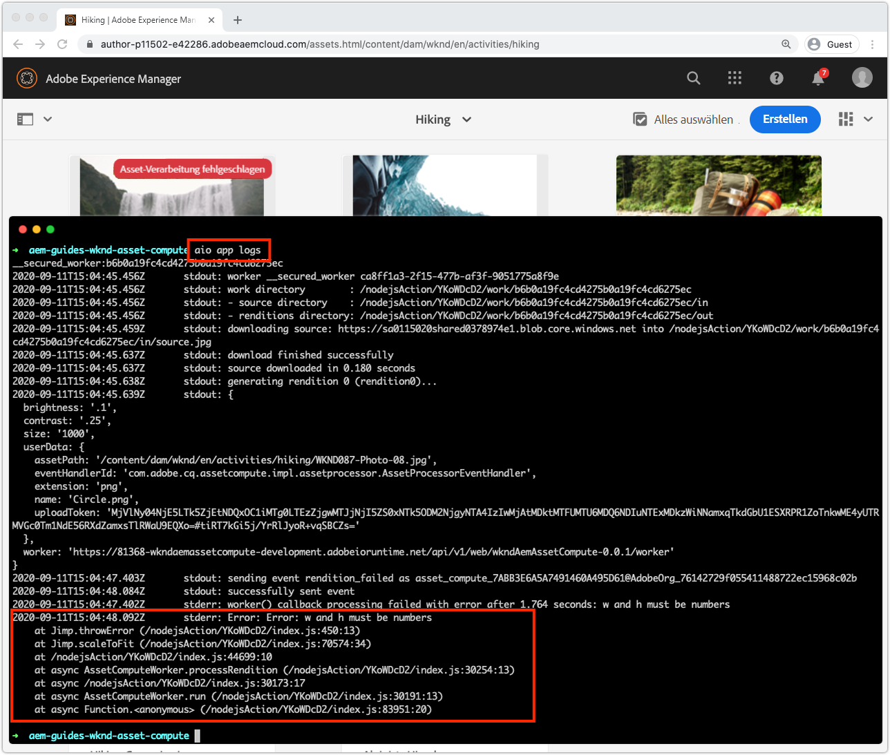

# Debuggen eines Asset compute-Workers

asset compute-Worker können auf verschiedene Weise debuggt werden, von einfachen Debug-Protokollanweisungen über angehängten VS-Code als Remote-Debugger bis hin zum Abruf von Protokollen für Aktivierungen in Adobe I/O Runtime, die von AEM als Cloud Service initiiert wurden.

## Protokollierung

Die grundlegendste Form des Debuggens von Asset compute-Workern verwendet traditionelle `console.log(..)`-Anweisungen im Arbeitscode. Das JavaScript-Objekt `console` ist ein implizites, globales Objekt, sodass es nicht importiert werden muss oder erforderlich ist, da es immer in allen Kontexten vorhanden ist.

Diese Protokollanweisungen stehen je nach Ausführung des Asset compute-Workers unterschiedlich zur Überprüfung zur Verfügung:

+ Protokolliert Drucken von `aio app run` bis standardgemäß und die [Entwicklungstools](../develop/development-tool.md) Aktivierungen-Protokolle
   
+ Protokolliert Drucken von `aio app test` bis `/build/test-results/test-worker/test.log`
   
+ Protokollanweisungen werden mit `wskdebug` in der VS-Code-Debug-Konsole (Ansicht > Debug-Konsole) gedruckt, Standard-Out
   
+ Protokollanweisungen werden mit `aio app logs` in der Protokollausgabe der Aktivierung gedruckt

## Remote-Debugging über angehängten Debugger

>[!WARNING]
>
>Verwenden Sie Microsoft Visual Studio Code 1.48.0 oder höher zur Kompatibilität mit wskdebug

Das Modul [wskdebug](https://www.npmjs.com/package/@openwhisk/wskdebug) npm unterstützt das Anhängen eines Debuggers an Asset compute-Worker, einschließlich der Möglichkeit, Haltepunkte im VS-Code festzulegen und den Code schrittweise zu durchlaufen.

>[!VIDEO](https://video.tv.adobe.com/v/40383/?quality=12&learn=on)

_Clickthrough zum Debuggen eines Asset compute-Workers mit wskdebug (Kein Audio)_

1. Stellen Sie sicher, dass die Module [wskdebug](../set-up/development-environment.md#wskdebug) und [ngrok](../set-up/development-environment.md#ngork) npm installiert sind.
1. Stellen Sie sicher, dass [Docker Desktop und die zugehörigen Docker-Bilder](../set-up/development-environment.md#docker) installiert und ausgeführt werden
1. Schließen Sie alle aktiven Instanzen von Development Tool.
1. Stellen Sie den neuesten Code mit `aio app deploy` bereit und zeichnen Sie den Namen der bereitgestellten Aktion auf (Name zwischen `[...]`). Dies wird verwendet, um die `launch.json` in Schritt 8 zu aktualisieren.

   ```
   ℹ Info: Deploying package [wkndAemAssetCompute-0.0.1]...
   ```
1. Beginn einer neuen Instanz des Asset compute Development Tool mit dem Befehl `npx adobe-asset-compute devtool`
1. Tippen Sie im VS-Code auf das Debug-Symbol in der linken Navigation
   + Wenn Sie dazu aufgefordert werden, tippen Sie auf __Datei &quot;launch.json&quot;> &quot;Node.js__&quot;, um eine neue `launch.json`-Datei zu erstellen.
   + Tippen Sie andernfalls auf das Symbol __Getriebe__ rechts neben dem Dropdown __Programm starten__, um das vorhandene `launch.json` im Editor zu öffnen.
1. hinzufügen Sie die folgende JSON-Objektkonfiguration auf das `configurations`-Array:

   ```json
   {
       "type": "pwa-node",
       "request": "launch",
       "name": "wskdebug",
       "attachSimplePort": 0,
       "runtimeExecutable": "wskdebug",
       "args": [
           "wkndAemAssetCompute-0.0.1/__secured_worker",  // Version must match your Asset Compute worker's version
           "${workspaceFolder}/actions/worker/index.js",  // Points to your worker
           "-l",
           "--ngrok"
       ],
       "localRoot": "${workspaceFolder}",
       "remoteRoot": "/code",
       "outputCapture": "std",
       "timeout": 30000
   }
   ```

1. Wählen Sie das neue __wskdebug__ aus der Dropdownliste
1. Tippen Sie auf die grüne Schaltfläche __Ausführen__ links neben __wskdebug__.
1. Öffnen Sie `/actions/worker/index.js` und tippen Sie auf die linke Seite der Zeilennummern, um Umbruchpunkte 1 hinzuzufügen. Navigieren Sie zum Webbrowser-Fenster Asset compute Development Tool, das in Schritt 6 geöffnet wurde
1. Tippen Sie auf die Schaltfläche __Ausführen__, um den Arbeiter auszuführen
1. Navigieren Sie zurück zum VS-Code, zu `/actions/worker/index.js` und gehen Sie durch den Code
1. Um das debug-fähige Entwicklungstool zu beenden, tippen Sie in dem Terminal, das den Befehl `npx adobe-asset-compute devtool` ausgeführt hat, in Schritt 6 auf `Ctrl-C`

## Zugriff auf Protokolle von Adobe I/O Runtime{#aio-app-logs}

[AEM als Cloud Service nutzt Asset compute-Mitarbeiter über die Verarbeitung von ](../deploy/processing-profiles.md) Profilen, indem sie sie direkt in Adobe I/O Runtime aufrufen. Da diese Aufrufe keine lokale Entwicklung beinhalten, können ihre Ausführung nicht mit lokalen Tools wie Asset compute Development Tool oder wskdebug debuggt werden. Stattdessen kann die Adobe I/O-CLI verwendet werden, um Protokolle vom Worker abzurufen, der in einem bestimmten Arbeitsbereich in Adobe I/O Runtime ausgeführt wird.

1. Vergewissern Sie sich, dass die Variablen [Workspace-spezifische Umgebung](../deploy/runtime.md) über `AIO_runtime_namespace` und `AIO_runtime_auth` festgelegt werden, basierend auf dem zu debuggenden Arbeitsbereich.
1. Führen Sie in der Befehlszeile `aio app logs` aus.
   + Wenn der Arbeitsbereich stark frequentiert wird, erweitern Sie die Anzahl der Aktivierungen-Protokolle über das `--limit`-Flag:
      `$ aio app logs --limit=25`
1. Die letzten (bis zu den bereitgestellten `--limit`) Aktivierungen-Protokolle werden als Ausgabe des Befehls zur Überprüfung zurückgegeben.

   

## Fehlerbehebung

+ [Debugger wird nicht angehängt](../troubleshooting.md#debugger-does-not-attach)
+ [Haltepunkte werden nicht angehalten](../troubleshooting.md#breakpoints-no-pausing)
+ [VS-Code-Debugger nicht angehängt](../troubleshooting.md#vs-code-debugger-not-attached)
+ [VS-Code-Debugger nach Beginn der Arbeitsausführung angehängt](../troubleshooting.md#vs-code-debugger-attached-after-worker-execution-began)
+ [Zeitüberschreitung beim Debugging](../troubleshooting.md#worker-times-out-while-debugging)
+ [Debug-Prozess kann nicht beendet werden](../troubleshooting.md#cannot-terminate-debugger-process)
