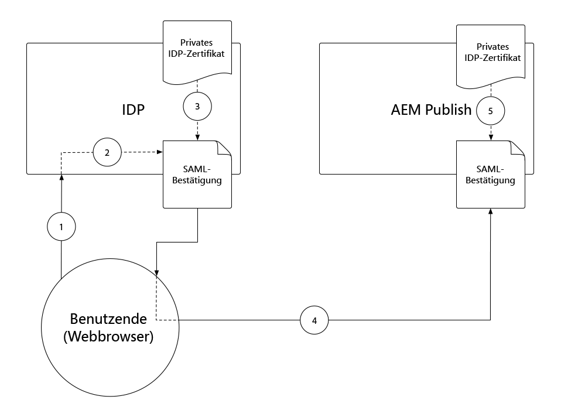
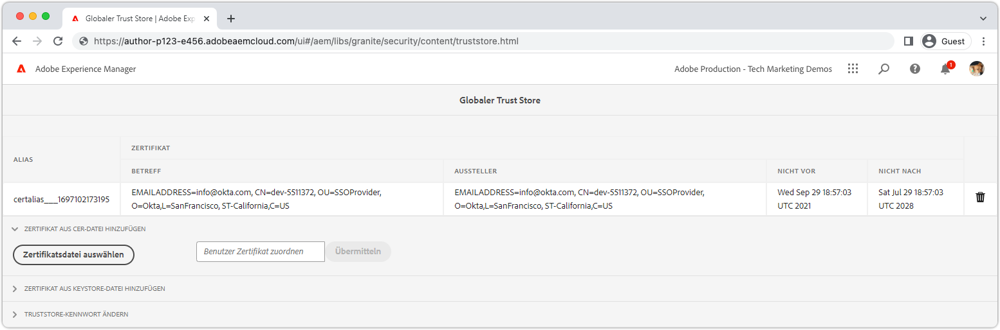
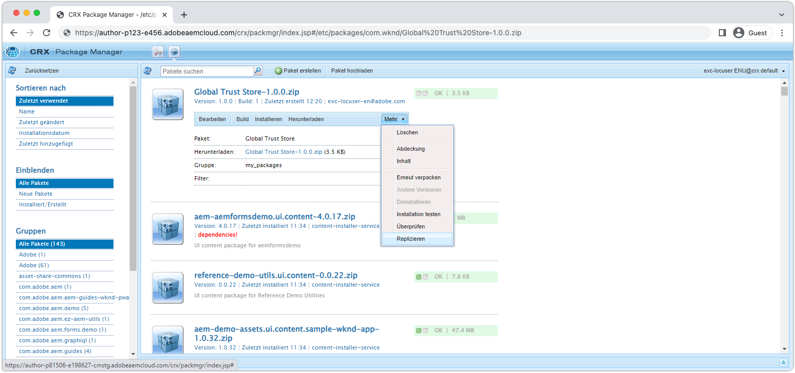
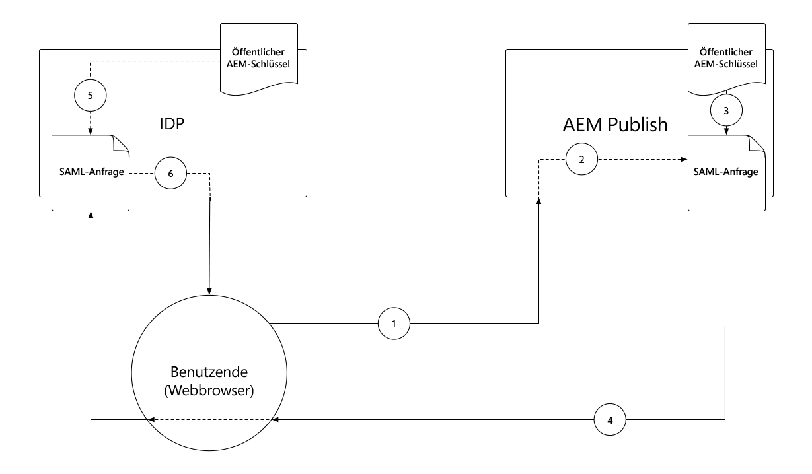
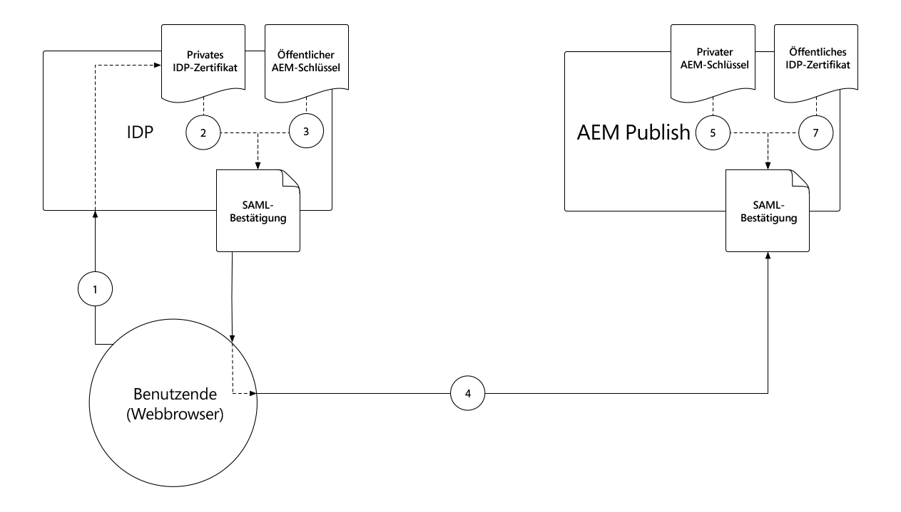
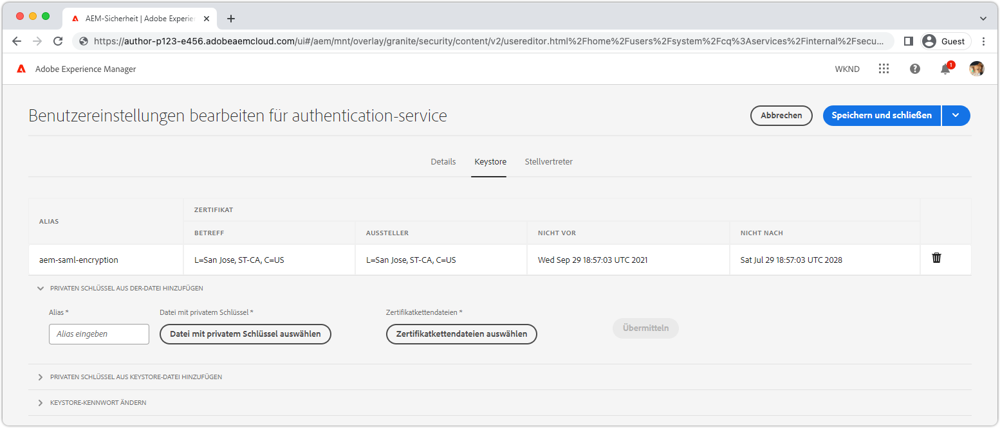

# SAML 2.0-Authentifizierung{#saml-2-0-authentication}

Erfahren Sie, wie Sie Endbenutzer (nicht AEM Autoren) für einen mit SAML 2.0 kompatiblen IDP Ihrer Wahl einrichten und authentifizieren.

## Welche SAML AEM as a Cloud Service?

Die Integration von SAML 2.0 mit AEM Publish (oder der Vorschau) ermöglicht es Endbenutzern eines AEM-basierten Web-Erlebnisses, sich bei einem IDP ohne Adobe (Identity Provider) zu authentifizieren und auf AEM als benannten, autorisierten Benutzer zuzugreifen.

|  | AEM Author | AEM Publish |
|-----------------------|:----------:|:-----------:|
| Unterstützung für SAML 2.0 | ✘ | ms |

+++ Erläuterung des SAML 2.0-Flusses mit AEM

Der typische Fluss einer AEM Publish SAML-Integration lautet wie folgt:

1. Der Benutzer sendet eine Anfrage an AEM Publish , um anzugeben, dass eine Authentifizierung erforderlich ist.
   + Benutzer fordert eine durch CUGs/ACL geschützte Ressource an.
   + Benutzer fordert eine Ressource an, für die eine Authentifizierungspflicht gilt.
   + Der Benutzer folgt einem Link zum Anmelde-Endpunkt AEM (d. h. `/system/sling/login`), die explizit die Anmeldeaktion anfordert.
1. AEM sendet eine AuthnRequest an den IDP und fordert den IDP auf, den Authentifizierungsprozess zu starten.
1. Der Benutzer authentifiziert sich beim IDP.
   + Der Benutzer wird vom IDP nach Anmeldeinformationen gefragt.
   + Der Benutzer ist bereits beim IDP authentifiziert und muss keine weiteren Anmeldeinformationen angeben.
1. IDP generiert eine SAML-Assertion, die die Daten des Benutzers enthält, und signiert sie mit dem privaten Zertifikat des IDP.
1. IDP sendet die SAML-Zusicherung über die HTTP-POST über den Webbrowser des Benutzers an AEM Publish.
1. AEM Publish erhält die SAML-Zusicherung und überprüft die Integrität und Authentizität der SAML-Zusicherung mithilfe des öffentlichen IDP-Zertifikats.
1. AEM Publish verwaltet den AEM Benutzerdatensatz basierend auf der SAML 2.0 OSGi-Konfiguration und den Inhalten der SAML-Zusicherung.
   + Erstellt einen Benutzer
   + Synchronisiert Benutzerattribute
   + Aktualisierungen AEM Benutzergruppenmitgliedschaften
1. AEM Publish stellt die AEM ein `login-token` -Cookie in der HTTP-Antwort, die verwendet wird, um nachfolgende Anfragen an AEM Publish zu authentifizieren.
1. AEM Publish leitet den Benutzer wie in der Variablen `saml_request_path` Cookie.

+++

## Konfigurationsdurchlauf

>[!VIDEO](https://video.tv.adobe.com/v/343040/?quality=12&learn=on)

In diesem Video werden die Einrichtung der SAML 2.0-Integration mit AEM as a Cloud Service Publish-Service und die Verwendung von Okta als IDP erläutert.

## Voraussetzungen

Beim Einrichten der SAML 2.0-Authentifizierung sind folgende Voraussetzungen erforderlich:

+ Zugriff von Deployment Manager auf Cloud Manager
+ AEM Administratorzugriff auf AEM as a Cloud Service Umgebung
+ Administratorzugriff auf den IDP
+ Optional Zugriff auf ein öffentliches/privates Keypair, das zum Verschlüsseln von SAML-Payloads verwendet wird

SAML 2.0 wird nur zur Authentifizierung von Benutzern für die AEM-Veröffentlichung oder -Vorschau unterstützt. So verwalten Sie die Authentifizierung der AEM-Autoreninstanz mit und IDP: [IDP mit Adobe IMS integrieren](https://helpx.adobe.com/de/enterprise/using/set-up-identity.html).


## Öffentliches IDP-Zertifikat auf AEM installieren

Das öffentliche Zertifikat des IDP wird AEM Global Trust Store hinzugefügt und dient zur Überprüfung der vom IDP gesendeten SAML-Bestätigung.

+ + + SAML-Assertionssignaturfluss



1. Der Benutzer authentifiziert sich beim IDP.
1. IDP generiert eine SAML-Assertion, die die Daten des Benutzers enthält.
1. IDP signiert die SAML-Zusicherung mit dem privaten Zertifikat des IDP.
1. IDP initiiert eine clientseitige HTTP-POST zum SAML-Endpunkt der AEM-Veröffentlichung (`.../saml_login`), die die signierte SAML-Assertion enthält.
1. AEM Publish empfängt die HTTP-POST mit der signierten SAML-Bestätigung und kann die Signatur mithilfe des öffentlichen IDP-Zertifikats überprüfen.

+++



1. Erhalten Sie die __öffentliches Zertifikat__ -Datei vom IDP. Mit diesem Zertifikat können AEM die SAML-Zusicherung überprüfen, die AEM vom IDP bereitgestellt wird.

   Das Zertifikat weist das PEM-Format auf und sollte wie folgt aussehen:

   ```
   -----BEGIN CERTIFICATE-----
   MIIC4jCBAcoCCQC33wnybT5QZDANBgkqhkiG9w0BAQsFADAyMQswCQYDVQQGEwJV
   ...
   m0eo2USlSRTVl7QHRTuiuSThHpLKQQ==
   -----END CERTIFICATE-----
   ```

1. Melden Sie sich bei der AEM-Autoreninstanz als AEM Administrator an.
1. Navigieren Sie zu __Tools > Sicherheit > Trust Store__.
1. Erstellen oder öffnen Sie den Global Trust Store. Wenn Sie einen globalen Trust Store erstellen, speichern Sie das Kennwort in einem sicheren Ort.
1. Erweitern __Zertifikat aus CER-Datei hinzufügen__.
1. Auswählen __Zertifikatdatei auswählen__ und laden Sie die vom IDP bereitgestellte Zertifikatdatei hoch.
1. Urlaub __Zertifikat dem Benutzer zuordnen__ leer.
1. Klicken Sie auf __Übermitteln__.
1. Das neu hinzugefügte Zertifikat wird über dem __Zertifikat aus CRT-Datei hinzufügen__ Abschnitt.
1. Beachten Sie die __alias__, da dieser Wert in der Variablen [OSGi-Konfiguration des SAML 2.0 Authentication Handler](#saml-2-0-authentication-handler-osgi-configuration).
1. Wählen Sie __Speichern und schließen__ aus.

Der globale Trust Store ist mit dem öffentlichen Zertifikat des IDP in der AEM-Autoreninstanz konfiguriert. Da SAML jedoch nur in der AEM-Veröffentlichung verwendet wird, muss der globale Trust Store in die AEM-Veröffentlichungsinstanz repliziert werden, damit auf das öffentliche IDP-Zertifikat zugegriffen werden kann.



1. Navigieren Sie zu __Tools > Bereitstellung > Pakete__.
1. Package erstellen
   + Paketname: `Global Trust Store`
   + Version: `1.0.0`
   + Gruppe: `com.your.company`
1. Neu bearbeiten __Globaler Trust Store__ Paket.
1. Wählen Sie die __Filter__ und fügen Sie einen Filter für den Stammpfad hinzu. `/etc/truststore`.
1. Auswählen __Fertig__ und dann __Speichern__.
1. Wählen Sie die __Build__ -Schaltfläche für __Globaler Trust Store__ Paket.
1. Wählen Sie nach der Erstellung __Mehr__ > __Replizieren__ zum Aktivieren des Knotens &quot;Global Trust Store&quot;(`/etc/truststore`) in AEM Publish.

## AEM Paar aus öffentlichem und privatem Schlüssel installieren{#install-aem-public-private-key-pair}

_Die Installation des AEM Schlüsselpaars &quot;Öffentlicher/privater Schlüssel&quot;ist optional_

AEM Publish kann so konfiguriert werden, dass AuthnRequests (an IDP) signiert und SAML-Assertionen (an AEM) verschlüsselt werden. Dies wird durch Bereitstellung eines privaten Schlüssels für die AEM-Veröffentlichung erreicht und entspricht dem öffentlichen Schlüssel für den IDP.

+++ Grundlegendes zum Signaturfluss von AuthnRequest (optional)

Die Autorenanfrage (die Anfrage an den IDP von AEM Publish, die den Anmeldeprozess initiiert) kann von AEM Publish signiert werden. Dazu signiert AEM Publish die Autorenanfrage mithilfe des privaten Schlüssels, dass der IDP dann die Signatur mithilfe des öffentlichen Schlüssels validiert. Dies garantiert dem IDP, dass AuthnRequest von AEM Publish initiiert und angefordert wurde, und nicht von einem böswilligen Drittanbieter.



1. Der Benutzer sendet eine HTTP-Anfrage an AEM Publish , die zu einer SAML-Authentifizierungsanfrage an den IDP führt.
1. AEM Publish generiert die SAML-Anfrage, die an den IDP gesendet wird.
1. AEM Publish signiert die SAML-Anforderung mit AEM privaten Schlüssel.
1. AEM Publish initiiert die AuthnRequest, eine clientseitige HTTP-Umleitung zum IDP, der die signierte SAML-Anforderung enthält.
1. IDP erhält die AuthnRequest und validiert die Signatur mithilfe AEM öffentlichen Schlüssels, wodurch gewährleistet wird, dass AEM Publish die AuthnRequest initiiert hat.
1. AEM Publish validiert dann die Integrität und Authentizität der entschlüsselten SAML-Assertion mithilfe des öffentlichen IDP-Zertifikats.

+++

+++ Grundlegendes zum Verschlüsselungsfluss der SAML-Assertion (optional)

Die gesamte HTTP-Kommunikation zwischen IDP und AEM Publish sollte über HTTPS erfolgen und daher standardmäßig sicher sein. Bei Bedarf können SAML-Assertionen jedoch verschlüsselt werden, wenn zusätzlich zu der von HTTPS bereitgestellten zusätzliche Vertraulichkeit erforderlich ist. Dazu verschlüsselt der IDP die SAML-Zuordnungsdaten mit dem privaten Schlüssel und AEM Publish entschlüsselt die SAML-Zusicherung mit dem privaten Schlüssel.



1. Der Benutzer authentifiziert sich beim IDP.
1. IDP generiert eine SAML-Assertion, die die Daten des Benutzers enthält, und signiert sie mit dem privaten Zertifikat des IDP.
1. IDP verschlüsselt dann die SAML-Assertion mit AEM öffentlichen Schlüssel, für den der AEM private Schlüssel entschlüsselt werden muss.
1. Die verschlüsselte SAML-Zusicherung wird über den Webbrowser des Benutzers an AEM Publish gesendet.
1. AEM Publish empfängt die SAML-Assertion und entschlüsselt sie mithilfe AEM privaten Schlüssels.
1. IDP fordert den Benutzer zur Authentifizierung auf.

+++

Die Signierung von AuthnRequest und die Verschlüsselung der SAML-Assertion sind optional, beide sind jedoch mit der Variablen [OSGi-Konfigurationseigenschaft des SAML 2.0-Authentifizierungs-Handlers `useEncryption`](#saml-20-authenticationsaml-2-0-authentication), was bedeutet, dass beide oder keine verwendet werden können.



1. Rufen Sie den öffentlichen Schlüssel, den privaten Schlüssel (PKCS#8 im DER-Format) und die Zertifikatkettendatei (dies kann der öffentliche Schlüssel sein) ab, die zum Signieren der AuthnRequest verwendet werden, und verschlüsseln Sie die SAML-Assertion. Die Schlüssel werden normalerweise vom Sicherheitsteam der IT-Organisation bereitgestellt.

   + Ein selbstsigniertes Schlüsselpaar kann mit __openssl__:

   ```
   $ openssl req -x509 -sha256 -days 365 -newkey rsa:4096 -keyout aem-private.key -out aem-public.crt
   
   # Provide a password (keep in safe place), and other requested certificate information
   
   # Convert the keys to AEM's required format 
   $ openssl rsa -in aem-private.key -outform der -out aem-private.der
   $ openssl pkcs8 -topk8 -inform der -nocrypt -in aem-private.der -outform der -out aem-private-pkcs8.der
   ```

1. Laden Sie den öffentlichen Schlüssel in den IDP hoch.
   + Verwenden der `openssl` -Methode oben ist, ist der öffentliche Schlüssel der `aem-public.crt` -Datei.
1. Melden Sie sich bei der AEM-Autoreninstanz als AEM Administrator an, um den privaten Schlüssel hochzuladen.
1. Navigieren Sie zu __Tools > Sicherheit > Trust Store__ und wählen Sie __authentication-service__ und wählen Sie __Eigenschaften__ in der oberen Aktionsleiste aus.
1. Navigieren Sie zu __Tools > Sicherheit > Benutzer__ und wählen Sie __authentication-service__ und wählen Sie __Eigenschaften__ in der oberen Aktionsleiste aus.
1. Wählen Sie die __Keystore__ Registerkarte.
1. Erstellen oder öffnen Sie den Keystore. Halten Sie beim Erstellen eines Keystore das Kennwort sicher.
1. Auswählen __Privaten Schlüssel aus DER-Datei hinzufügen__ und fügen Sie den privaten Schlüssel und die Kettendatei zu AEM hinzu:
   + __Alias__: Geben Sie einen aussagekräftigen Namen ein, oft den Namen des IDP.
   + __Datei mit privatem Schlüssel__: Laden Sie die Datei mit dem privaten Schlüssel hoch (PKCS#8 im DER-Format).
      + Verwenden der `openssl` -Methode weiter oben, ist dies die `aem-private-pkcs8.der` file
   + __Zertifikatskettendatei auswählen__: Laden Sie die zugehörige Kettendatei hoch (dies kann der öffentliche Schlüssel sein).
      + Verwenden der `openssl` -Methode weiter oben, ist dies die `aem-public.crt` file
   + Klicken Sie auf __Übermitteln__
1. Das neu hinzugefügte Zertifikat wird über dem __Zertifikat aus CRT-Datei hinzufügen__ Abschnitt.
   + Beachten Sie die __alias__ da dies in der Variablen [OSGi-Konfiguration des SAML 2.0-Authentifizierungs-Handlers](#saml-20-authentication-handler-osgi-configuration)
1. Wählen Sie __Speichern und schließen__ aus.
1. Auswählen __authentication-service__ und wählen Sie __Aktivieren__ in der oberen Aktionsleiste aus.

## SAML 2.0-Authentifizierungs-Handler konfigurieren{#configure-saml-2-0-authentication-handler}

AEM SAML-Konfiguration über die __Adobe Granite SAML 2.0 Authentication Handler__ OSGi-Konfiguration.
Die Konfiguration ist eine OSGi-Werkskonfiguration, d. h. ein AEM as a Cloud Service Veröffentlichungsdienst kann über mehrere SAML-Konfigurationen verfügen, die diskrete Ressourcenbäume des Repositorys abdecken. Dies ist für Multi-Site-AEM-Bereitstellungen nützlich.

+++ OSGi-Konfigurationsglossar für SAML 2.0 Authentication Handler

### Adobe Granite SAML 2.0 Authentication Handler OSGi-Konfiguration{#configure-saml-2-0-authentication-handler-osgi-configuration}

|  | OSGi-Eigenschaft | Erforderlich | Wertformat | Standardwert | Beschreibung |
|-----------------------------------|-------------------------------|:--------:|:---------------------:|---------------------------|-------------|
| Pfade | `path` | ms | Zeichenfolgen-Array | `/` | AEM Pfade, für die dieser Authentifizierungs-Handler verwendet wird. |
| IDP-URL | `idpUrl` | ms | Zeichenfolge |  | IDP-URL, an die die SAML-Authentifizierungsanforderung gesendet wird. |
| IDP-Zertifikatalias | `idpCertAlias` | ms | Zeichenfolge |  | Der Alias des IDP-Zertifikats im AEM Global Trust Store |
| IDP HTTP-Umleitung | `idpHttpRedirect` | ✘ | Boolesch | `false` | Gibt an, ob eine HTTP-Weiterleitung zur IDP-URL erfolgt, anstatt eine AuthnRequest zu senden. Legen Sie fest auf `true` für IDP-initiierte Authentifizierung. |
| IDP-Kennung | `idpIdentifier` | ✘ | Zeichenfolge |  | Eindeutige IDP-ID, um AEM Eindeutigkeit von Benutzern und Gruppen sicherzustellen. Wenn leer, wird die `serviceProviderEntityId` stattdessen verwendet. |
| Assertion Consumer Service URL | `assertionConsumerServiceURL` | ✘ | Zeichenfolge |  | Die `AssertionConsumerServiceURL` URL-Attribut in der AuthnRequest , das angibt, wo das `<Response>` muss an AEM gesendet werden. |
| SP entity Id | `serviceProviderEntityId` | ms | Zeichenfolge |  | eindeutige Identifizierung der AEM zum IDP; normalerweise den AEM Hostnamen. |
| SP-Verschlüsselung | `useEncryption` | ✘ | Boolesch | `true` | Gibt an, ob der IDP SAML-Assertionen verschlüsselt. Erfordert `spPrivateKeyAlias` und `keyStorePassword` festgelegt werden. |
| Private Key Alias für SP | `spPrivateKeyAlias` | ✘ | Zeichenfolge |  | Der Alias des privaten Schlüssels im `authentication-service` Schlüsselspeicher des Benutzers. Erforderlich, wenn `useEncryption` auf `true`. |
| SP key store password | `keyStorePassword` | ✘ | Zeichenfolge |  | Das Kennwort des Schlüsselspeichers des Benutzers &#39;authentication-service&#39;. Erforderlich, wenn `useEncryption` auf `true`. |
| Standard-Umleitung | `defaultRedirectUrl` | ✘ | Zeichenfolge | `/` | Die standardmäßige Umleitungs-URL nach erfolgreicher Authentifizierung. Kann relativ zum AEM Host sein (z. B. `/content/wknd/us/en/html`). |
| Benutzer-ID-Attribut | `userIDAttribute` | ✘ | Zeichenfolge | `uid` | Der Name des SAML-Assertionsattributs, das die Benutzer-ID des AEM enthält. Leer lassen, um `Subject:NameId`. |
| AEM automatisch erstellen | `createUser` | ✘ | Boolesch | `true` | Gibt an, ob AEM Benutzer bei erfolgreicher Authentifizierung erstellt wurden. |
| Zwischenpfad des Benutzers | `userIntermediatePath` | ✘ | Zeichenfolge |  | Bei der Erstellung von AEM wird dieser Wert als Zwischenpfad verwendet (z. B. `/home/users/<userIntermediatePath>/jane@wknd.com`). Erfordert `createUser` auf `true`. |
| AEM Benutzerattribute | `synchronizeAttributes` | ✘ | Zeichenfolgen-Array |  | Liste der SAML-Attributzuordnungen, die im AEM Benutzer im Format gespeichert werden sollen `[ "saml-attribute-name=path/relative/to/user/node" ]` (z. B. `[ "firstName=profile/givenName" ]`). Siehe [vollständige Liste der nativen AEM Attribute](#aem-user-attributes). |
| Benutzer zu AEM Gruppen hinzufügen | `addGroupMemberships` | ✘ | Boolesch | `true` | Gibt an, ob ein AEM nach erfolgreicher Authentifizierung automatisch zu AEM Benutzergruppen hinzugefügt wird. |
| AEM Gruppenmitgliedschaft | `groupMembershipAttribute` | ✘ | Zeichenfolge | `groupMembership` | Der Name des SAML-Assertionsattributs mit einer Liste AEM Benutzergruppen, zu denen der Benutzer hinzugefügt werden soll. Erfordert `addGroupMemberships` auf `true`. |
| AEM | `defaultGroups` | ✘ | Zeichenfolgen-Array |  | Eine Liste AEM Benutzergruppen für authentifizierte Benutzer wird immer hinzugefügt (z. B. `[ "wknd-user" ]`). Erfordert `addGroupMemberships` auf `true`. |
| NameIDPolicy Format | `nameIdFormat` | ✘ | Zeichenfolge | `urn:oasis:names:tc:SAML:2.0:nameid-format:transient` | Der Wert des Parameters NameIDPolicy , der in der AuthnRequest-Nachricht gesendet werden soll. |
| SAML-Antwort speichern | `storeSAMLResponse` | ✘ | Boolesch | `false` | Gibt an, ob die `samlResponse` -Wert auf dem AEM gespeichert wird. `cq:User` Knoten. |
| Handle-Logout | `handleLogout` | ✘ | Boolesch | `false` | Gibt an, ob die Abmeldeanfrage von diesem SAML-Authentifizierungs-Handler verarbeitet wird. Erfordert `logoutUrl` festgelegt werden. |
| Abmelde-URL | `logoutUrl` | ✘ | Zeichenfolge |  | IDP-URL, an die die SAML-Abmeldeanfrage gesendet wird. Erforderlich, wenn `handleLogout` auf `true`. |
| Uhrentoleranz | `clockTolerance` | ✘ | Ganzzahl | `60` | IDP- und AEM (SP)-Uhrentoleranz bei der Validierung von SAML-Assertionen. |
| Digest-Methode | `digestMethod` | ✘ | Zeichenfolge | `http://www.w3.org/2001/04/xmlenc#sha256` | Der Digest-Algorithmus, den der IDP beim Signieren einer SAML-Nachricht verwendet. |
| Signaturmethode | `signatureMethod` | ✘ | Zeichenfolge | `http://www.w3.org/2001/04/xmldsig-more#rsa-sha256` | Der Signaturalgorithmus, den der IDP beim Signieren einer SAML-Nachricht verwendet. |
| Identitäts-Synchronisierungstyp | `identitySyncType` | ✘ | `default` oder `idp` | `default` | Nicht ändern `from` Standard für AEM as a Cloud Service. |
| Service-Ranking | `service.ranking` | ✘ | Ganzzahl | `5002` | Konfigurationen mit höherem Rang werden für dasselbe `path`. |

### AEM Benutzerattribute{#aem-user-attributes}

AEM verwendet die folgenden Benutzerattribute, die über die `synchronizeAttributes` -Eigenschaft in der Adobe Granite SAML 2.0 Authentication Handler OSGi-Konfiguration.  Alle IDP-Attribute können mit jeder AEM Benutzereigenschaft synchronisiert werden. Die Zuordnung zu AEM Verwendung von Attributeigenschaften (siehe unten) ermöglicht es AEM jedoch, diese automatisch zu verwenden.

| Benutzerattribut | Relativer Eigenschaftspfad von `rep:User` Knoten |
|--------------------------------|--------------------------|
| Titel (z. B. `Mrs`) | `profile/title` |
| Vorname (d. h. Vorname) | `profile/givenName` |
| Nachname (d. h. Nachname) | `profile/familyName` |
| Auftragstitel | `profile/jobTitle` |
| E-Mail-Adresse | `profile/email` |
| Straße &amp; Hausnr. | `profile/street` |
| Stadt | `profile/city` |
| Postleitzahl | `profile/postalCode` |
| Land | `profile/country` |
| Telefonnummer | `profile/phoneNumber` |
| Info zu eigener Person | `profile/aboutMe` |

+++

1. Erstellen Sie eine OSGi-Konfigurationsdatei in Ihrem Projekt unter `/ui.config/src/main/content/jcr_root/wknd-examples/osgiconfig/config.publish/com.adobe.granite.auth.saml.SamlAuthenticationHandler~saml.cfg.json` und öffnen Sie in Ihrer IDE.
   + Änderung `/wknd-examples/` auf `/<project name>/`
   + Die Kennung nach der `~` im Dateinamen sollte diese Konfiguration eindeutig identifizieren, sodass es sich um den Namen des IDP handeln kann, z. B. `...~okta.cfg.json`. Der Wert sollte alphanumerisch mit Bindestrichen sein.
1. Fügen Sie die folgende JSON-Datei in die `com.adobe.granite.auth.saml.SamlAuthenticationHandler~...cfg.json` und aktualisieren Sie die `wknd` referenziert nach Bedarf.

   ```json
   {
       "path": [ "/content/wknd", "/content/dam/wknd" ], 
       "idpCertAlias": "$[env:SAML_IDP_CERT_ALIAS;default=certalias___1652125559800]",
       "idpIdentifier": "$[env:SAML_IDP_ID;default=http://www.okta.com/exk4z55r44Jz9C6am5d7]",
       "idpUrl": "$[env:SAML_IDP_URL;default=https://dev-5511372.okta.com/app/dev-5511372_aemasacloudservice_1/exk4z55r44Jz9C6am5d7/sso/saml]",
       "serviceProviderEntityId": "$[env:SAML_AEM_ID;default=https://publish-p123-e456.adobeaemcloud.com]",
       "useEncryption": false,
       "createUser": true,
       "userIntermediatePath": "wknd/idp",
       "synchronizeAttributes":[
           "firstName=profile/givenName"
       ],
       "addGroupMemberships": true,
       "defaultGroups": [ 
           "wknd-users"
       ]
   }
   ```

1. Aktualisieren Sie die Werte entsprechend den Anforderungen Ihres Projekts. Siehe __OSGi-Konfigurationsglossar für SAML 2.0 Authentication Handler__ obigen Beschreibungen der Konfigurationseigenschaften
1. Es wird empfohlen, jedoch nicht erforderlich, die OSGi-Umgebungsvariablen und -Geheimnisse zu verwenden, wenn Werte nicht mehr mit dem Versionszyklus synchron sind oder sich die Werte zwischen ähnlichen Umgebungstypen/Service-Ebenen unterscheiden. Standardwerte können mithilfe der Variablen `$[env:..;default=the-default-value]"` wie oben gezeigt.

OSGi-Konfigurationen pro Umgebung (`config.publish.dev`, `config.publish.stage`und `config.publish.prod`) kann mit bestimmten Attributen definiert werden, wenn die SAML-Konfiguration zwischen Umgebungen variiert.

### Verschlüsselung verwenden

Wann [Verschlüsseln der AuthnRequest- und SAML-Assertion](#encrypting-the-authnrequest-and-saml-assertion), sind die folgenden Eigenschaften erforderlich: `useEncryption`, `spPrivateKeyAlias`und `keyStorePassword`. Die `keyStorePassword` enthält ein Kennwort. Daher darf der Wert nicht in der OSGi-Konfigurationsdatei gespeichert, sondern mithilfe von [geheime Konfigurationswerte](https://experienceleague.adobe.com/docs/experience-manager-cloud-service/content/implementing/deploying/configuring-osgi.html#secret-configuration-values)

+++ Optional, die OSGi-Konfiguration für die Verwendung der Verschlüsselung aktualisieren

1. Öffnen `/ui.config/src/main/content/jcr_root/wknd-examples/osgiconfig/config.publish/com.adobe.granite.auth.saml.SamlAuthenticationHandler~saml.cfg.json` in Ihrer IDE.
1. Fügen Sie die drei Eigenschaften hinzu `useEncryption`, `spPrivateKeyAlias`und `keyStorePassword` wie unten dargestellt.

   ```json
   {
   "path": [ "/content/wknd", "/content/dam/wknd" ], 
   "idpCertAlias": "$[env:SAML_IDP_CERT_ALIAS;default=certalias___1234567890]",
   "idpIdentifier": "$[env:SAML_IDP_ID;default=http://www.okta.com/abcdef1235678]",
   "idpUrl": "$[env:SAML_IDP_URL;default=https://dev-5511372.okta.com/app/dev-123567890_aemasacloudservice_1/abcdef1235678/sso/saml]",
   "serviceProviderEntityId": "$[env:SAML_AEM_ID;default=https://publish-p123-e456.adobeaemcloud.com]",
   "useEncryption": true,
   "spPrivateKeyAlias": "$[env:SAML_AEM_KEYSTORE_ALIAS;default=aem-saml-encryption]",
   "keyStorePassword": "$[secret:SAML_AEM_KEYSTORE_PASSWORD]",
   "createUser": true,
   "userIntermediatePath": "wknd/idp"
   "synchronizeAttributes":[
       "firstName=profile/givenName"
   ],
   "addGroupMemberships": true,
   "defaultGroups": [ 
       "wknd-users"
   ]
   }
   ```

1. Die drei für die Verschlüsselung erforderlichen OSGi-Konfigurationseigenschaften sind:

+ `useEncryption` auf `true` festlegen
+ `spPrivateKeyAlias` enthält den Keystore-Eintragsalias für den privaten Schlüssel, der von der SAML-Integration verwendet wird.
+ `keyStorePassword` enthält eine [OSGi-Konfigurationsvariable für geheime Konfigurationen](https://experienceleague.adobe.com/docs/experience-manager-cloud-service/content/implementing/deploying/configuring-osgi.html#secret-configuration-values) enthält `authentication-service` Kennwort des Benutzerkennzeichens.

+++

## Referrer-Filter konfigurieren

Während des SAML-Authentifizierungsprozesses initiiert der IDP eine clientseitige HTTP-POST für die `.../saml_login` Endpunkt. Wenn IDP und AEM Publish auf einer anderen Quelle vorhanden sind, wird die __Referrer Filter__ wird über die OSGi-Konfiguration konfiguriert, um HTTP-POSTs vom IDP-Ursprung zuzulassen.

1. Erstellen (oder bearbeiten) Sie eine OSGi-Konfigurationsdatei in Ihrem Projekt unter `/ui.config/src/main/content/jcr_root/wknd-examples/osgiconfig/config.publish/org.apache.sling.security.impl.ReferrerFilter.cfg.json`.
   + Änderung `/wknd-examples/` auf `/<project name>/`
1. Stellen Sie sicher, dass `allow.empty` Wert auf `true`, die `allow.hosts` (oder wenn Sie es vorziehen, `allow.hosts.regexp`) den Ursprung des IDP enthält und `filter.methods` include `POST`. Die OSGi-Konfiguration sollte in etwa wie folgt aussehen:

   ```json
   {
       "allow.empty": true,
       "allow.hosts.regexp": [ ],
       "allow.hosts": [ 
           "$[env:SAML_IDP_REFERRER;default=dev-123567890.okta.com]"
       ],
       "filter.methods": [
           "POST",
       ],
       "exclude.agents.regexp": [ ]
   }
   ```

AEM Publish unterstützt eine Konfiguration mit einem einzelnen Referrer-Filter. Führen Sie daher die SAML-Konfigurationsanforderungen mit vorhandenen Konfigurationen zusammen.

OSGi-Konfigurationen pro Umgebung (`config.publish.dev`, `config.publish.stage`und `config.publish.prod`) kann mit bestimmten Attributen definiert werden, wenn die Variable `allow.hosts` (oder `allow.hosts.regex`) variieren.

## Cross-Origin Resource Sharing (CORS) konfigurieren

Während des SAML-Authentifizierungsprozesses initiiert der IDP eine clientseitige HTTP-POST für die `.../saml_login` Endpunkt. Wenn der IDP und die AEM-Veröffentlichung auf verschiedenen Hosts/Domänen vorhanden sind, wird die AEM-Veröffentlichungsinstanz __CRoss-Origin Resource Sharing (CORS)__ muss so konfiguriert sein, dass HTTP-POSTs vom Host/von der Domäne des IDP zugelassen werden.

Diese HTTP-POST-Anforderung `Origin` -Kopfzeile weist in der Regel einen anderen Wert auf als der AEM-Veröffentlichungs-Host und erfordert daher eine CORS-Konfiguration.

Beim Testen der SAML-Authentifizierung für das lokale AEM SDK (`localhost:4503`), kann der IDP die `Origin` -Kopfzeile zu `null`. Wenn ja, fügen Sie `"null"` der `alloworigin` Liste.

1. Erstellen Sie eine OSGi-Konfigurationsdatei in Ihrem Projekt unter `/ui.config/src/main/content/jcr_root/wknd-examples/osgiconfig/config.publish/com.adobe.granite.cors.impl.CORSPolicyImpl~saml.cfg.json`
   + Änderung `/wknd-examples/` zu Ihrem Projektnamen
   + Die Kennung nach der `~` im Dateinamen sollte diese Konfiguration eindeutig identifizieren, sodass es sich um den Namen des IDP handeln kann, z. B. `...CORSPolicyImpl~okta.cfg.json`. Der Wert sollte alphanumerisch mit Bindestrichen sein.
1. Fügen Sie die folgende JSON-Datei in die `com.adobe.granite.cors.impl.CORSPolicyImpl~...cfg.json` -Datei.

```json
{
    "alloworigin": [ 
        "$[env:SAML_IDP_ORIGIN;default=https://dev-1234567890.okta.com]", 
        "null"
    ],
    "allowedpaths": [ 
        ".*/saml_login"
    ],
    "supportedmethods": [ 
        "POST"
    ]
}
```

OSGi-Konfigurationen pro Umgebung (`config.publish.dev`, `config.publish.stage`und `config.publish.prod`) kann mit bestimmten Attributen definiert werden, wenn die Variable `alloworigin` und `allowedpaths` variiert zwischen Umgebungen.

## Konfigurieren AEM Dispatchers, um SAML-HTTP-POSTs zuzulassen

Nach erfolgreicher Authentifizierung beim IDP orchestriert der IDP eine HTTP-POST zurück zu AEM registrierten `/saml_login` Endpunkt (im IDP konfiguriert). Diese HTTP-POST zu `/saml_login` ist standardmäßig beim Dispatcher blockiert, daher muss dies explizit mithilfe der folgenden Dispatcher-Regel zugelassen werden:

1. Öffnen `dispatcher/src/conf.dispatcher.d/filters/filters.any` in Ihrer IDE.
1. Fügen Sie am Ende der Datei eine Zulassungsregel für HTTP-POSTs zu URLs hinzu, die mit `/saml_login`.

```
...

# Allow SAML HTTP POST to ../saml_login end points
/0190 { /type "allow" /method "POST" /url "*/saml_login" }
```

Wenn das Umschreiben der URL auf dem Apache-Webserver konfiguriert ist (`dispatcher/src/conf.d/rewrites/rewrite.rules`) stellen Sie sicher, dass Anfragen an die `.../saml_login` Endpunkte werden nicht versehentlich verwirrt.

## Datensynchronisation aktivieren

Die Benutzerdatensätze müssen in der AEM-Veröffentlichungsstufe synchronisiert werden, sobald durch den SAML-Authentifizierungsfluss ein Benutzer in AEM Publish erstellt wird. nach [Datensynchronisation aktivieren](https://experienceleague.adobe.com/docs/experience-manager-cloud-service/content/sites/authoring/personalization/user-and-group-sync-for-publish-tier.html#data-synchronization)senden Sie eine Anfrage an den Adobe-Support (über [AdminConsole](https://adminconsole.adobe.com) > Support), um die Aktivierung anzufordern.

## Bereitstellen der SAML-Konfiguration

Die OSGi-Konfigurationen müssen an Git übertragen und mithilfe von Cloud Manager für AEM as a Cloud Service bereitgestellt werden.

```
$ git remote -v            
adobe   https://git.cloudmanager.adobe.com/myOrg/myCloudManagerGit/ (fetch)
adobe   https://git.cloudmanager.adobe.com/myOrg/myCloudManagerGit/ (push)
$ git add .
$ git commit -m "SAML 2.0 configurations"
$ git push adobe saml-auth:develop
```

Stellen Sie die Git-Verzweigung von Cloud Manager bereit (in diesem Beispiel: `develop`) mithilfe einer Implementierungs-Pipeline für einen vollständigen Stack.
